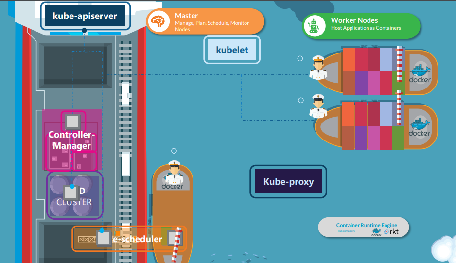
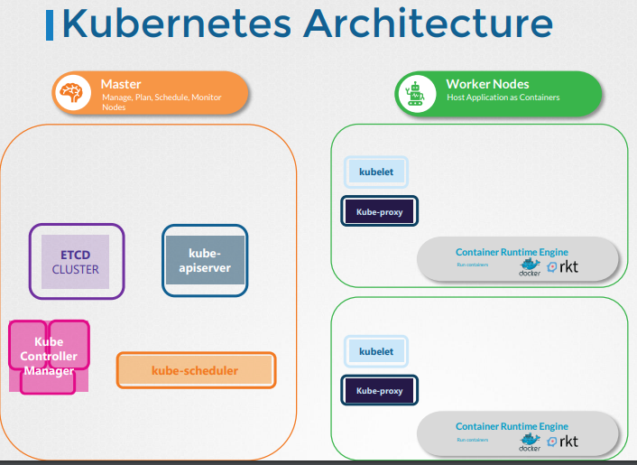

# Architecture de Kubernetes

Dans cette section, nous allons examiner l'architecture Kubernetes au niveau global.
- Vue d'ensemble à 10 000 pieds de l'architecture Kubernetes

  
  
  

Documents de référence Kubernetes :
- https://kubernetes.io/docs/concepts/architecture/

---

**Kubernetes est devenu la solution de facto pour résoudre les problématiques de déploiements d'images Docker à l'échelle.**  

---


---

  

---


---

### Principes de fonctionnement

---

### Composants de Kubernetes

#### Les noeuds Kubernetes

Les nœuds d’un cluster sont les machines (serveurs physiques, machines virtuelles, etc.  

généralement Linux mais plus nécessairement aujourd'hui) qui exécutent vos applications et vos workflows.  

Tous les noeuds d'un cluster qui ont besoin de faire tourner des taches (workloads) kubernetes utilisent trois services de base:

- Comme les workloads sont généralement conteneurisés chaque noeud doit avoir une _runtime de conteneur_ compatible avec la norme `Container Runtime Interface (CRI)` : `containerd`,`cri-o` ou `Docker` n'est pas la plus recommandée bien que la plus connue.  

Il peut également s'agir d'une runtime utilisant de la virtualisation.
- Le `kubelet` composant (binaire en go, le seul composant jamais conteneurisé) qui controle la création et l'état des pods/conteneur sur son noeud.
- D'autres composants et drivers pour fournir fonctionnalités réseau (`Container Network Interface - CNI` et `kube-proxy`) ainsi que fonctionnalités de stockage (`Drivers Container Storage Interface (CSI)`)

Pour utiliser Kubernetes, on définit un état souhaité en créant des ressources (pods/conteneurs, volumes, permissions etc).  

Cet état souhaité et son application est géré par le `control plane` composé des noeuds master.

---

#### Les noeuds master kubernetes forment le `Control Plane` du Cluster<br/>

  <br/>

**Le control plane est responsable du maintien de l’état souhaité des différents éléments de votre cluster.  

Lorsque vous interagissez avec Kubernetes, par exemple en utilisant l’interface en ligne de commande `kubectl`, vous communiquez avec les noeuds master de votre cluster (plus précisément l'`API Server`).**

Le control plane conserve un enregistrement de tous les objets Kubernetes du système.  

À tout moment, des `boucles de contrôle` s'efforcent de faire converger l’état réel de tous les objets du système pour correspondre à l’état souhaité que vous avez fourni.  

Pour gérer l’état réel de ces objets sous forme de conteneurs (toujours) avec leur configuration le control plane envoie des instructions aux différents kubelets des noeuds.

--- 

**Donc concrêtement les noeuds du control plane Kubernetes font tourner, en plus de `kubelet` et `kube-proxy`, un ensemble de services de contrôle:**

  - `kube-apiserver`: expose l'API (rest) kubernetes, point d'entrée central pour la communication interne (intercomposants) et externe (kubectl ou autre) au cluster.
  - `kube-controller-manager`: controlle en permanence l'état des resources et essaie de le corriger s'il n'est plus conforme.
  - `kube-scheduler`: Surveille et cartographie les resources matérielles et les contraintes de placement des pods sur les différents noeuds pour décider ou doivent être créés ou supprimés les conteneurs/pods.
  - `cloud-controller-manager`: Composant *facultatif* qui gère l'intégration avec le fournisseur de cloud comme par exemple la création automatique de loadbalancers pour exposer les applications kubernetes à l'extérieur du cluster.

---

**L'ensemble de la configuration kubernetes est stockée de façon résiliante (consistance + haute disponilibilité) dans un gestionnaire configuration distributé qui est généralement `etcd`.**

`etcd` peut être installé de façon redondante sur les noeuds du control plane ou configuré comme un système externe sur un autre ensemble de serveurs.

Lien vers la documentation pour plus de détails sur les composants : https://kubernetes.io/docs/concepts/overview/components/

---

## Normes et gouvernance open source 

**Les normes Kubernetes, telles que OCI (Open Container Initiative), CSI (Container Storage Interface) et CNI (Container Network Interface), sont encadrées par un travail et une gouvernance communautaire qui offrent des garanties de réversibilité et d'indépendance des vendeurs sur le long terme.**  

- OCI définit des spécifications standardisées pour la création d'images de conteneurs et leur exécution, permettant à des runtimes comme Docker ou containerd de fonctionner de manière cohérente avec Kubernetes.  

- CNI gère les réseaux, en définissant des plugins (comme Calico ou Cilium) qui assurent la communication entre les conteneurs et l'extérieur du cluster.  

- Enfin, CSI permet l'intégration de systèmes de stockage persistant (comme AWS EBS ou GCP Persistent Disks) via des drivers, facilitant la mise en place de solutions de stockage dynamique et sécurisé.  

**Ensemble, ces normes permettent à Kubernetes de s'adapter à divers outils et fournisseurs, tout en maintenant une architecture modulaire et scalable.**

---


### Container Engine


#### Qu’est-ce qu’un container engine ?

**Un container engine (ou runtime de conteneur) est un outil qui gère la création, la gestion et l’exécution des conteneurs.**  

Il assure l’interaction avec le système d’exploitation pour lancer des processus isolés (conteneurs) et gère des tâches comme le stockage d’images, la sécurité et la gestion des ressources.

Les container engines du marché respectent désormais la norme OCI qui définit le format des images, le cadre de leur exécution et les protocoles pour les faire transiter.  

--- 

#### Docker vs Containerd

**Docker**

- Le premier outil populaire pour la création et la gestion de conteneurs.

- Il inclut un runtime de conteneur (runc), un démon (containerd), et des outils comme le CLI Docker.

- Il n’était pas conforme aux normes OCI (Open Container Initiative) avant la version 1.13.

- Kubernetes utilisait initialement Docker via une solution hacky appelée dockershim pour s’intégrer aux normes OCI.

--- 

**Containerd**

- Un runtime de conteneur OCI-compliant, conçu pour être utilisé avec Kubernetes via l’interface CRI (Container Runtime Interface).

- Il remplace Docker dans Kubernetes depuis la version v1.24, où le dockershim a été supprimé.

- Il gère les images et conteneurs de manière indépendante de Docker, offrant une meilleure compatibilité avec les normes OCI.

---

#### Les outils de commande

`ctr`

Outil en ligne de commande natif de containerd.

Utilisé principalement pour le débogage, mais dispose de très peu de fonctionnalités.

À ne pas utiliser pour la gestion quotidienne des conteneurs.

---

`crictl` :

Outil développé par la communauté Kubernetes pour interagir avec les runtimes CRI-compliant (comme containerd, CRI-O, etc.).

Permet de gérer les conteneurs et images via l’API CRI.

Utilisé principalement pour le débogage ou la validation des runtimes.

---


`nerdctl` :

CLI similaire à Docker développé par la communauté containerd.

Offre des fonctionnalités proches ou supérieures à Docker, idéal pour la génération et exécution de conteneurs.

Outil de prédilection pour les utilisateurs habitués à Docker et souhaitant une alternative moderne.

---


Les différences entre les outils

|Outil	|À utiliser pour	|Relation avec Docker/Containerd|
|---|---|---|
|**Containerd**	|Runtime principal pour Kubernetes (depuis v1.24)	|Conforme à OCI, remplace Docker
|**Docker**	|Historique, rétrocompatible	|Non conforme à CRI (sans dockershim)
|**ctr**	|Débogage (containerd)	|Exclusivement pour containerd
|**crictl**	|Débogage (CRI-compliant)	|Fonctionne avec tous les runtimes CRI
|**nerdctl**	|Création/exécution de conteneurs	|Interface utilisateur similaire à Docker

---

### Container Network Interface

## Container Network Interface : c'est quoi ? 


**La spécification CNI (Container Network Interface) vise à standardiser la configuration des réseaux de conteneurs.**

En définissant ces composants principaux, la spécification CNI garantit que différents environnements d'exécution de conteneurs et plugins réseau peuvent interagir de manière cohérente, permettant l'automatisation et la standardisation de la configuration réseau.

Pour la convention complète c'est ici : https://www.cni.dev/docs/spec/

Il y a [plusieurs solutions d'orchestration qui s'appuient sur CNI]( https://www.cni.dev/docs/#container-runtimes), pas seulement Kubernetes.


---

**La CNI propose une interface commune entre les runtimes de conteneurs et les plugins réseau.**

- **Format de configuration du réseau**

> Définit comment les administrateurs définissent les configurations réseau.

- **Protocole de requête**

> Décrit comment les environnements d'exécution de conteneurs envoient des demandes de configuration ou de nettoyage de réseau aux plugins réseau.

- **Processus d'exécution des plugins**

> Détaille comment les plugins exécutent la configuration ou le nettoyage du réseau en fonction de la configuration fournie.

- **Délégation de plugins**

> Permet aux plugins de déléguer des fonctionnalités spécifiques à d'autres plugins.

- **Retour des résultats**

> Définit le format des données pour retourner les résultats à l'environnement d'exécution après l'exécution du plugin.


---

**Les points majeurs de CNI**

1. CNI est une solution de mise en réseau conteneurisée basée sur des plugins.
2. Les plugins CNI sont des fichiers exécutables.
3. La responsabilité d'un plugin CNI est unique.
4. Les plugins CNI sont invoqués de manière enchaînée.
5. La spécification CNI définit un espace de noms réseau Linux pour un conteneur.
6. Les définitions de réseau dans CNI sont stockées au format JSON.
7. Les définitions de réseau sont transmises aux plugins via des flux d'entrée STDIN, ce qui signifie que les fichiers de configuration réseau ne sont pas stockés sur l'hôte, et d'autres paramètres de configuration sont transmis aux plugins via des variables d'environnement.

---

**Les plugins CNI sont chaînés.**

Pour une liste complète des core plugins c'est ici : https://www.cni.dev/plugins/current/

Pour une liste complète des plugins Third-Party c'est là : https://www.cni.dev/docs/#3rd-party-plugins

---

**Que font les plugins third party**

**Les plugins réseau tiers, tels que Calico, Flannel, Weave, et Cilium, permettent de gérer la connectivité réseau entre les pods et les services.** 

Ils peuvent offrir des fonctionnalités avancées comme :
- la sécurité du réseau, 
- le routage, 
- la gestion des politiques réseau.

---

## CNI et Network Policies

**Parmi les plugins CNI tiers couramment utilisés dans Kubernetes, **Flannel** et **Weave** sont des exemples qui ne fournissent pas nativement de fonctionnalités de Network Policies.**

Flannel se concentre principalement sur la connectivité de base entre les pods, tandis que Weave fournit des fonctionnalités de réseau overlay et une certaine sécurité de base, mais sans implémenter des Network Policies avancées comme celles supportées par des solutions telles que Calico ou Cilium.

Pour combler cette lacune, les utilisateurs doivent souvent combiner ces plugins avec des outils supplémentaires ou choisir des solutions CNI plus complètes qui intègrent des Network Policies.

---

### Flannel

**Rôle :**

- Fournit une solution simple de mise en réseau pour les conteneurs, principalement axée sur la connectivité de couche 3 (IP).

**Fonctionnalités :**

- Backend de réseau : Flannel supporte plusieurs backends pour la distribution du trafic réseau, y compris vxlan, host-gw, udp, et autres.
- Simplicité : Conçu pour être facile à déployer et à configurer, idéal pour les clusters Kubernetes de petite à moyenne taille.
- Routage : Utilise des sous-réseaux pour chaque nœud et encapsule le trafic entre les nœuds, selon le backend choisi.

---
   
### Calico

**Rôle** 

- Fournit des fonctionnalités avancées de mise en réseau et de sécurité pour les conteneurs.
- Offre une politique réseau riche qui permet de contrôler le trafic entre les pods en fonction de divers critères.
- Supporte le routage BGP (Border Gateway Protocol) pour une mise en réseau de grande échelle.

**Fonctionnalités** 

- Politiques de réseau : Calico permet de définir des politiques de réseau basées sur des étiquettes de pods, des espaces de noms et d'autres critères.
- Sécurité : Offre des fonctionnalités de pare-feu et de sécurité réseau, y compris l'application des politiques de sécurité au niveau des hôtes.
- Routage : Utilise BGP pour distribuer les routes réseau, facilitant ainsi la mise en réseau entre plusieurs clusters.

---


### Cilium

**Rôle :**

- Fournit une mise en réseau avancée pour les conteneurs, en mettant l'accent sur la sécurité et l'observabilité.

**Fonctionnalités :**

- eBPF (Extended Berkeley Packet Filter) : Utilise eBPF pour une performance élevée et une visibilité fine du trafic réseau.
- Politiques de sécurité : Permet de définir des politiques de sécurité réseau granulaires, y compris des règles basées sur les services, les applications et les utilisateurs.
- Observabilité : Offre des outils avancés pour la surveillance et le traçage du trafic réseau, aidant à diagnostiquer et à résoudre les problèmes de réseau.
- Intégration avec Service Mesh : Peut s'intégrer avec des solutions de service mesh comme Istio pour offrir des fonctionnalités réseau supplémentaires.

--- 

### Différences Clés

**Complexité et Facilité d'Utilisation :**

- **Flannel** : Plus simple et plus facile à configurer, idéal pour les déploiements moins complexes.
- **Calico** : Plus complexe à configurer en raison de ses fonctionnalités avancées, mais offre une grande flexibilité et des capacités de mise en réseau puissantes.
- **Cilium** : Complexe à cause de l'utilisation d'eBPF et des fonctionnalités de sécurité avancées, mais offre une grande visibilité et sécurité.

**Fonctionnalités de Sécurité :**

- **Flannel** : Moins axé sur la sécurité, principalement conçu pour la connectivité réseau de base.
- **Calico** : Politiques de sécurité détaillées et support de BGP pour une sécurité et une mise en réseau robustes.
- **Cilium** : Sécurité granulaire avec eBPF, permet une application fine des politiques de sécurité.

**Performance et Scalabilité :**

- **Flannel** : Peut rencontrer des limitations de performance avec des backends comme udp, mais reste performant avec vxlan.
- **Calico** : Très performant et scalable grâce au routage BGP.
- **Cilium** : Très performant grâce à l'utilisation d'eBPF, offrant également une meilleure observabilité et sécurité.

---

## Les technologies propres derrière les plugins tiers CNI 


| Technologie       | Spécificités                                                                 | Généralisation de son usage dans les plugins CNI                            |
|-------------------|------------------------------------------------------------------------------|---------------------------------------------------------------------------|
| Routage UDP       | Envoie des paquets de données sans connexion préalable via le protocole UDP | Utilisé dans certains plugins comme Flannel pour les réseaux overlay simples.  |
| Routage host-gw   | Utilise les tables de routage des hôtes pour diriger le trafic entre les pods sur différents nœuds | Implémenté dans des solutions comme Flannel en mode host-gw pour la simplicité et performance.  |
| Routage BGP       | Utilise le protocole Border Gateway Protocol pour échanger les routes IP entre les routeurs | Couramment utilisé par Calico pour le routage réseau hautement scalable et performant.  |
| VXLAN             | Crée des réseaux overlay à l'aide de tunnels encapsulés dans des paquets UDP | Utilisé par Flannel, Weave et d'autres pour créer des réseaux overlay extensibles.  |
| Réseau avec eBPF  | Utilise eBPF pour traiter le trafic réseau dans le kernel Linux de manière très efficace | Utilisé par Cilium pour la performance avancée et la sécurité des réseaux.  |
| IPIP              | Encapsulation de paquets IP dans d'autres paquets IP pour le transport sur le réseau | Utilisé par Calico en mode IPIP pour les réseaux overlay.  |
| GRE               | Generic Routing Encapsulation pour encapsuler une grande variété de protocoles de couche réseau | Moins courant, mais utilisé par certains pour des réseaux overlay spécifiques.  |
| SR-IOV            | Single Root I/O Virtualization pour fournir des réseaux à haute performance directement au niveau du matériel | Utilisé par des plugins comme SR-IOV CNI pour des besoins de performance maximale.  |
| MACVLAN           | Associe plusieurs adresses MAC à une interface réseau pour créer des interfaces virtuelles | Utilisé pour donner des adresses MAC distinctes aux pods, trouvé dans des plugins comme Multus.  |
| IPVS              | IP Virtual Server pour la répartition de charge et le routage basé sur la couche 4 | Utilisé par kube-proxy en mode IPVS pour une meilleure performance de la répartition de charge.  |
---

## Les outils utilisateurs des CNI

- **Kubeskoop** Une [solution](https://github.com/alibaba/kubeskoop) dédiée au réseau et orientée CNI
- **Hubble** https://github.com/cilium/hubble dépendant du CNI Cilium
- **Calico Cloud** Solution en SAAS qui fournit une [interface intéressante](https://docs.tigera.io/calico-cloud/tutorials/calico-cloud-features/tour).
- **Prometheus AWS CNI Metrics** Réservé au [CNI AWS](https://github.com/aws/amazon-vpc-cni-k8s) 
- **Hubble** https://github.com/cilium/hubble dépendant de Cilium

--- 


**En l'absence de bonnes solutions généralistes, on en revient aux outils classiques du stack Linux** 

``` 
$ kubectl debug mypod -it --image=nicolaka/netshoot

# Avec le plugin kubectl
kubectl netshoot debug my-existing-pod
kubectl netshoot run tmp-shell --host-network

```
---

**Il existe aussi des solutions pour utilisateurs avancés** 

- Kokotap : copier le trafic réseau d'un pod vers un autre pour analyse https://github.com/redhat-nfvpe/kokotap
 
---

### Container Storage Interface

## La persistance de données : un sujet complexe

### Historique des technologies de mise à disposition de volumes sur le réseau

**Les technologies de mise à disposition de volumes sur le réseau ont évolué considérablement au fil des décennies.**

Au début, les systèmes Unix utilisaient NFS (Network File System) pour permettre le partage de fichiers entre machines sur un réseau local.

Ensuite, les systèmes d'exploitation comme Windows ont adopté SMB/CIFS (Server Message Block/Common Internet File System) pour des fonctionnalités similaires.

Avec le temps, des solutions plus robustes et distribuées comme iSCSI (Internet Small Computer Systems Interface) ont émergé, permettant de connecter des disques distants via TCP/IP.

L'avènement des technologies de virtualisation et des conteneurs a conduit à des solutions de stockage distribuées telles que Ceph et GlusterFS, qui offrent une haute disponibilité et une évolutivité accrue.

**Kubernetes a standardisé l'intégration de ces solutions via les CSI (Container Storage Interface) et les plugins de stockage, facilitant ainsi la gestion des volumes persistants dans des environnements cloud-native.**

---

### Difficultés de la persistance dans les systèmes distribués

**Dans les systèmes distribués, la mise à disposition de block devices over network pose plusieurs défis.** 

L'architecture d'une solution de stockage de disque sur le réseau répond à des contraintes logiques, pratiques et matérielles.

1. **Acquittements d'écriture** : Choisir entre les acquittements synchrones (garantissent la persistance avant de répondre) et asynchrones (répondent avant que les données ne soient persistées) pour un équilibre entre performance et sécurité.
2. **Redondance de données** : Utiliser des techniques de redondance comme le mirroring ou l'EC (Erasure Coding) pour garantir la résilience et la disponibilité des données, comme dans Ceph.
3. **Gestion de quorum** : Implémenter un système de quorum pour garantir la cohérence des données en cas de pannes de nœuds ou de réseaux.
4. **Scalabilité** : Assurer la capacité d'ajouter ou de retirer des nœuds sans interrompre le service pour répondre aux besoins de stockage croissants.
5. **Monitoring et gestion proactive** : Intégrer des outils de surveillance et d'alerting pour détecter et résoudre rapidement les problèmes de performance ou de défaillance matérielle.
6. **Sécurité des données** : Mettre en place des mécanismes de chiffrement pour les données en transit et au repos pour protéger contre les accès non autorisés.
7. **Automatisation des backups** : Intégrer des solutions automatisées pour la sauvegarde régulière des données afin d'assurer la récupération en cas de perte de données.
8. **Gestion des snapshots** : Utiliser des snapshots pour permettre des restaurations rapides et minimiser les temps d'arrêt en cas de corruption ou de perte de données.

--- 

**La maintenance pratique inclut les aspects suivants :**

- **Backups** : Sauvegarder les données de manière régulière et fiable pour prévenir les pertes en cas de panne.
- **Monitoring des disques** : Surveiller l'état et les performances des disques pour détecter et anticiper les problèmes.
- **Changement matériel défaillant** : Remplacer rapidement et efficacement les composants matériels défaillants sans interruption majeure du service.
- **Accroissement de la capacité** : Augmenter la capacité de stockage de manière transparente et sans affecter les applications en cours d'exécution.

--- 

### Comparaison de solutions de stockage réseau

| Critère                  | NFS                             | GlusterFS                       | Ceph                                 | Longhorn                            |
|--------------------------|---------------------------------|---------------------------------|--------------------------------------|-------------------------------------|
| Acquittements d'écriture | Asynchrones                     | Asynchrones                     | Synchrones/Asynchrones (configurable)| Synchrones/Asynchrones (configurable)|
| Redondance de données    | Non                             | Réplication                     | Réplication, Fragmentation           | Réplication                          |
| Gestion de quorum        | Non                             | Oui                             | Oui                                  | Non                                 |
| Scalabilité              | Limitée                         | Haute                           | Très haute                           | Haute                               |
| Chiffrement              | Non (doit être ajouté séparément)| Oui (TLS pour transport)        | Oui (chiffrement au repos et en transit)| Oui (TLS pour transport)            |
| Backups et snapshots     | Non natif (doit être ajouté)    | Oui                             | Oui                                  | Oui                                 |

### Conclusion

Ce tableau compare les solutions de stockage réseau en termes d'acquittements d'écriture, de redondance de données, de gestion de quorum, de scalabilité, de chiffrement, et de capacités de backups et de snapshots, permettant de choisir la solution la mieux adaptée en fonction des besoins spécifiques.

--- 


## Solutions Kubernetes

**Kubernetes propose plusieurs mécanismes pour résoudre ces problèmes de persistance :**

### Plugins de stockage

**Kubernetes utilise des plugins de stockage pour intégrer différentes solutions de stockage.**

La norme des plugins de stockage pour Kubernetes est appelée **Container Storage Interface (CSI)**.

La documentation est disponible sur le [site officiel de Kubernetes](https://kubernetes-csi.github.io/docs/).

CSI permet l'intégration de solutions de stockage externes avec Kubernetes via des drivers.

Cela fonctionne en déployant des plugins CSI dans le cluster Kubernetes, qui communiquent avec les systèmes de stockage sous-jacents.

Pour ajouter un plugin CSI, vous devez déployer les composants nécessaires (driver CSI) en utilisant des fichiers de configuration YAML spécifiques au plugin choisi.

### Storage Class

**Les Storage Classes définissent les types de stockage disponibles et leurs caractéristiques (performances, résilience, etc.).**
   
Pour associer une StorageClass avec un plugin Container Storage Interface (CSI), on spécifie le provisioner CSI dans la définition de la StorageClass.

Pour offrir plusieurs qualités de disques, on crée plusieurs StorageClasses avec des paramètres variés tels que la taille minimale, la vitesse (IOPS), et le type de disque (SSD, HDD).

```yaml
apiVersion: storage.k8s.io/v1
kind: StorageClass
metadata:
  name: fast-ceph
provisioner: rook-ceph.rbd.csi.ceph.com
parameters:
  clusterID: rook-ceph
  pool: replicapool
  imageFormat: "2"
  imageFeatures: layering
  csi.storage.k8s.io/fstype: ext4
  csi.storage.k8s.io/provisioner-secret-name: rook-csi-rbd-provisioner
  csi.storage.k8s.io/provisioner-secret-namespace: rook-ceph
  csi.storage.k8s.io/controller-expand-secret-name: rook-csi-rbd-provisioner
  csi.storage.k8s.io/controller-expand-secret-namespace: rook-ceph
  csi.storage.k8s.io/node-stage-secret-name: rook-csi-rbd-node
  csi.storage.k8s.io/node-stage-secret-namespace: rook-ceph
  size: 10Gi
reclaimPolicy: Delete
allowVolumeExpansion: true
volumeBindingMode: Immediate

```

Cette configuration utilise un plugin CSI pour provisionner des disques SSD rapides avec une taille minimale de 10Gi dans la zone spécifiée.

--- 


### Persistent Volumes (PV)

Les administrateurs créent et gèrent les Persistent Volumes, qui représentent des unités de stockage abstraites.

Les PVs sont découplés du cycle de vie des pods, garantissant la persistance des données.

```yaml
apiVersion: v1
kind: PersistentVolume
metadata:
  name: pv-fast-ceph
spec:
  capacity:
    storage: 100Gi
  accessModes:
    - ReadWriteOnce
  storageClassName: fast-ceph
  csi:
    driver: rook-ceph.rbd.csi.ceph.com
    fsType: ext4
    volumeAttributes:
      clusterID: rook-ceph
      pool: replicapool
      imageFormat: "2"
      imageFeatures: layering
    volumeHandle: "unique-volume-id"
    nodeStageSecretRef:
      name: rook-csi-rbd-node
      namespace: rook-ceph
    controllerExpandSecretRef:
      name: rook-csi-rbd-provisioner
      namespace: rook-ceph
    controllerPublishSecretRef:
      name: rook-csi-rbd-provisioner
      namespace: rook-ceph
```
---

### Persistent Volume Claims (PVC)

Les utilisateurs créent des Persistent Volume Claims pour demander des ressources de stockage sans avoir à connaître les détails de l'infrastructure sous-jacente.

Les PVCs sont automatiquement associés aux PVs disponibles, en fonction des critères définis dans les Storage Classes.~~

```yaml 
apiVersion: v1
kind: PersistentVolumeClaim
metadata:
  name: my-pvc
  namespace: default
spec:
  accessModes:
    - ReadWriteOnce
  resources:
    requests:
      storage: 20Gi
  storageClassName: fast-ceph
```

---

### Quelques produits Kubernetes pour les stockages distribués

- **OpenEBS** : Solution de stockage en mode bloc.
- **Longhorn** : Solution de stockage en mode bloc.
- **Rook** : Orchestrateur pour diverses solutions de stockage (Ceph, Cassandra, NFS, etc.).
- **MinIO** : Système de stockage d'objets compatible S3.

--- 

### Et les bases de données ?

**Il existe plusieurs patterns d'architecture pour les bases de données dans Kubernetes**

Voici quelques critères de choix:

- **Performance et latence** : Bases de données proches des applications pour réduire la latence.
- **Isolation** : Sécuriser les bases de données en les séparant des charges applicatives 
- **Scalabilité** : Utiliser une plateforme capable d'accueillir rapidement de nouveaux noeuds
- **Gestion et maintenance** : Adapter les efforts de maintenance au budget et aux compétences internes.

--- 

### Base de données managée 

**Utiliser des services managés comme AWS RDS, GCP Cloud SQL ou Azure Database.**

Les bases de données sont gérées par le fournisseur de cloud, offrant haute disponibilité, sauvegarde automatique et scalabilité.

--- 

### Base de données dans le namespace de l'application

**Déployer dans le même namespace que l'application pour simplifier la gestion et le réseau.**

Idéal pour des environnements de développement ou des applications de petite échelle, ex: Redis de cache local.

--- 

### Base de données dans le cluster Kubernetes

**Déployer des bases de données dans le même cluster Kubernetes mais dans des namespaces dédiés présente plusieurs avantages.**

Cette approche offre une gestion centralisée des ressources tout en assurant l'isolation des applications et des bases de données.

Utiliser des taints et des tolerations permet de spécifier que les pods de la base de données doivent être déployés sur des nœuds physiques équipés de disques NVMe, offrant des performances de stockage élevées.

Cela optimise l'accès aux données pour des applications nécessitant des I/O intensifs, tout en maintenant une structure de gestion simplifiée et sécurisée au sein du cluster.

--- 

### Base de données dans un cluster dédié

**Avoir un cluster Kubernetes séparé exclusivement pour les bases de données.**

Cela permet d'isoler les ressources et de réduire le risque de contention des ressources avec les applications.

Cette approche permet de standardiser les outils propres à la gestion des bases de données (operators, monitoring), d'avoir des noeuds physiques avec du matériel dédié dans une architecture scalable et de limiter les accès aux DBA.

Cette solution est en cloud privé celle qui permet de s'approcher des performances des services managés.

--- 

### Base de données sur des VMs

**Héberger les bases de données sur des machines virtuelles en dehors du cluster Kubernetes, tout en faisant tourner les applications dans Kubernetes.**

Cette approche combine la flexibilité des VMs pour les bases de données avec les avantages de l'orchestration des conteneurs pour les applications.

C'est la solution classique et conservatrice (Pet vs. Cattle), qui permet d'obtenir de très bons niveaux de compartimentations, de performance, de maintenance, et de sécurité.

--- 

### Certificats


## Historique de l'Intégration des Certificats TLS dans Kubernetes

1. **Débuts de Kubernetes (2014-2016) :** La gestion des certificats TLS était principalement manuelle. Les utilisateurs devaient configurer leurs certificats et secrets TLS directement.
2. **Introduction des Ingress Controllers :** Avec l'apparition des Ingress controllers comme NGINX, HAProxy, et Traefik, la gestion des certificats TLS est devenue plus automatisée et intégrée. Let's Encrypt et des projets comme Cert-Manager ont facilité l'obtention et le renouvellement des certificats.
3. **Émergence des Services Mesh (2016-2018) :** Les services mesh ont introduit la gestion automatique des certificats TLS pour sécuriser les communications entre microservices au sein du cluster.
4. **Gateway API (2020-présent) :** Le modèle Gateway API offre des capacités avancées de gestion des certificats TLS, intégrant des fonctionnalités issues des services mesh et des Ingress controllers.


---


## Interaction des Services Mesh, des Ingress et des Gateway avec les Certificats TLS dans Kubernetes

**La gestion des certificats TLS dans Kubernetes a évolué pour offrir des solutions automatisées et intégrées, simplifiant la sécurité des communications entre services.** 

Les évolutions récentes comme la Gateway API et les avancées dans les services mesh continuent de pousser cette intégration vers des modèles plus flexibles, sécurisés et automatisés.

---

## Services Mesh

Les services mesh comme Istio, Linkerd et Consul Connect offrent des fonctionnalités avancées de gestion du trafic et de sécurité, y compris la gestion des certificats TLS. Voici comment ils interagissent avec les certificats TLS :

1. **MTLS (Mutual TLS) :** Les services mesh implémentent généralement MTLS pour sécuriser les communications entre les microservices. Chaque service reçoit un certificat TLS et l'infrastructure du mesh gère la rotation et le renouvellement de ces certificats.
2. **Certificats Automatisés :** Des solutions comme Istio utilisent des composants comme `Citadel` (maintenant intégré dans `istiod`) pour générer et distribuer des certificats automatiquement.
3. **Configuration Simplifiée :** Les services mesh simplifient la configuration TLS pour les développeurs en centralisant la gestion des certificats et en appliquant des politiques de sécurité uniformes à travers le mesh.

---

## Ingress

Le modèle Ingress dans Kubernetes permet de gérer les connexions HTTPS entrantes vers les services dans un cluster. 

1. **Annotations TLS :** Les ressources Ingress permettent d'utiliser des annotations pour spécifier des certificats TLS, souvent stockés dans des Secrets Kubernetes.
2. **Contrôleurs Ingress :** Les contrôleurs Ingress (comme NGINX, Traefik) gèrent l'application des certificats TLS. Ils peuvent intégrer des solutions comme Let's Encrypt pour automatiser l'obtention et le renouvellement des certificats.

---

## Gateway API

Le modèle Gateway API offre une approche plus flexible et puissante pour gérer le trafic entrant, incluant la gestion des certificats TLS :

1. **Configuration TLS Avancée :** Gateway API permet une configuration plus granulaire des certificats TLS, incluant la gestion de plusieurs certificats et la sélection basée sur les hôtes ou les routes.
2. **Intégration avec les Services Mesh :** Les services mesh peuvent s'intégrer avec Gateway API pour déléguer certaines tâches de gestion TLS, en utilisant des certificats fournis par le mesh ou des certificats configurés directement dans la Gateway API.

---
## Principales solutions de gestion des certificats dans Kubernetes

**Voyons leurs capacités respectives, et comment elles peuvent gérer des infrastructures PKI privées ou ACME.**

--- 

## Cert-Manager

**Cert-Manager** est un outil populaire pour la gestion des certificats dans Kubernetes. Il facilite l'automatisation de l'obtention, du renouvellement et de la distribution des certificats TLS.

- **Capacités :**
  - **ACME :** Cert-Manager prend en charge ACME, permettant l'intégration avec Let's Encrypt et d'autres CA compatibles ACME pour l'obtention et le renouvellement automatiques des certificats.
  - **CA Interne :** Il peut s'intégrer avec des CA internes via des mécanismes comme le CA Issuer, permettant de signer des certificats avec une autorité de certification interne.
  - **Intégration avec Vault :** Cert-Manager peut utiliser HashiCorp Vault comme backend pour la gestion des certificats, en utilisant l'issuer de Vault pour émettre des certificats pour les pods et les services.
  - **Autres Issuers :** Supporte Venafi, Google CAS et d'autres systèmes de gestion de certificats d'entreprise.

- **Avantages :**
  - Automatisation complète de la gestion des certificats.
  - Support étendu pour divers issuers et backends.
  - Intégration transparente avec Kubernetes via Custom Resource Definitions (CRDs).

**Application** 
- **PKI Privée :** Intégration avec des CA internes via le CA Issuer et HashiCorp Vault.
- **ACME :** Supporte Let's Encrypt et d'autres CA compatibles ACME pour l'automatisation complète.

--- 

## Vault by HashiCorp

**Vault** est une solution de gestion des secrets et des identités qui inclut des capacités de gestion des certificats.

- **Capacités :**
  - **PKI Secrets Engine :** Vault dispose d'un moteur de secrets PKI qui permet de générer, signer et révoquer des certificats TLS.
  - **Rotation Automatique :** Vault peut automatiser la rotation des certificats, en s'intégrant avec Kubernetes pour distribuer les certificats aux pods et services.
  - **ACME :** Bien que Vault ne supporte pas directement ACME, il peut être configuré pour émettre des certificats compatibles avec les exigences de sécurité d'ACME.

- **Avantages :**
  - Gestion centralisée et sécurisée des certificats et autres secrets.
  - Capacité de gérer des infrastructures PKI complexes et multi-cloud.
  - API puissante et flexible pour l'automatisation et l'intégration.

**Application**

- **PKI Privée :** PKI Secrets Engine pour gérer une infrastructure PKI complète, y compris la génération, la signature et la révocation des certificats.


--- 

## API certificates.k8s.io

**API certificates.k8s.io** est une [API Kubernetes](https://kubernetes.io/docs/reference/access-authn-authz/certificate-signing-requests/) native pour la gestion des certificats.

- **Capacités :**
  - **Signing Requests :** Permet aux pods et autres composants de demander des certificats via des ressources `CertificateSigningRequest` (CSR).
  - **CA Interne :** Kubernetes peut signer les demandes de certificats en utilisant une CA interne configurée au niveau du cluster.
  - **Automatisation :** Intègre des contrôleurs qui peuvent approuver et signer automatiquement les demandes de certificats basées sur des politiques définies.

- **Avantages :**
  - Solution native à Kubernetes, sans besoin d'outils externes.
  - Intégration transparente avec l'écosystème Kubernetes.
  - Gestion simplifiée des certificats pour les composants internes du cluster.

**Application**

- **PKI Privée :** Utilise une CA interne configurée au niveau du cluster pour signer les demandes de certificats.
--- 

## Cert-Controller

**Cert-Controller** est un contrôleur Kubernetes pour la gestion des certificats. Il peut être utilisé en complément de cert-manager ou de manière autonome.

- **Capacités :**
  - **Gestion des Certificats :** Peut surveiller les ressources de type `Certificate` et automatiser la création, le renouvellement et la distribution des certificats.
  - **CA et ACME :** Supporte à la fois les CA internes et les CA compatibles ACME pour l'émission des certificats.
  - **Integration avec les Secrets Kubernetes :** Gère les certificats en tant que secrets Kubernetes, facilitant leur utilisation par les applications.

- **Avantages :**
  - Flexible et facile à configurer.
  - Peut être utilisé pour des cas d'utilisation spécifiques ou en complément de cert-manager.
  - Supporte divers backends pour l'émission des certificats.

**Application**
- 
- **PKI Privée :** Supporte les CA internes pour l'émission des certificats.
- **ACME :** Peut être configuré pour utiliser des CA compatibles ACME.

--- 