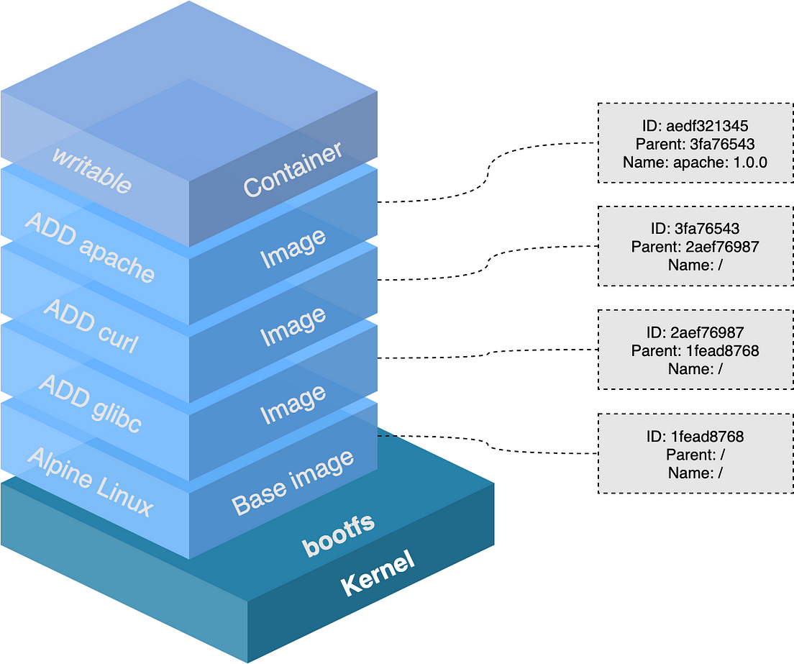

## Les images Docker



---  

**Chaque layer correspond à une information qui peut être mise en cache**

Quel est l'intérêt ? 

Quelles sont les impacts en terme de construction de Dockerfiles ?

Savez-vous ce que fait la commande `docker commit` ? En quoi est-elle utile ? 

## Best practices Dockerfile 

Voici un Dockerfile. Qu'en pensez-vous ? 

```Dockerfile
ARG FROM=alpine:3.17.7
FROM ${FROM} 

ENV APP="/app"
ENV USER="nonroot"
ENV AWS_KEY="fd60687f-40d0-1b5be705b21e-4ba1-9fee"

LABEL org.opencontainers.image.authors='author@company.org' \
      org.opencontainers.image.url='https://tool.company.org' \
      org.opencontainers.image.documentation='https://app.readthedocs.org' \
      org.opencontainers.image.source='https://github.com/compagny/tool' \
      org.opencontainers.image.vendor='The Company' \
      org.opencontainers.image.licenses='Apache-2.0'
      
RUN apk --update --no-cache add nginx=1.22.1-r1
RUN adduser -h ${APP} -D ${USER}
WORKDIR ${APP}
COPY . .

EXPOSE 80
VOLUME /data

HEALTHCHECK --interval=5m --timeout=3s \
  CMD curl -f http://localhost/ || exit 1

ENTRYPOINT ["./entrypoint.sh"]
CMD ["nginx"]

```

- Utilisation de variables
- Versioning des images et des dépendances
- Utilisation du .dockerignore
- Optimisation des instructions
  - Ordre des instructions
  - Enchaînement d'instructions
  - Nettoyage des caches de packages
  - Build multi-stage  
- Labels suivant la [norme](https://github.com/opencontainers/image-spec/blob/main/annotations.md)
- Healthcheck
- VOLUME et PORT
- Image de base :
  - Sécurisées
  - Mises à jour
  - Qualifiée (lite ou distroless)
- Utilisation de entry-point si utile
- Sécurité : 
  - Protection des secrets
  - exécution sans user root
  - sécurité maximale : docker [trust](https://docs.docker.com/engine/security/trust/) et signature


## Build = Dockerfile -> Image

La commande pour est :

```shell
docker build [-t <tag:version>] [-f <chemin_du_dockerfile>] <contexte_de_construction>
```

Observez l'historique de construction de l'image avec `docker image history <image>`

---

**Installer l'outil Dive pour analyser en détail la construction d'une image**

cf. [https://github.com/wagoodman/dive](https://github.com/wagoodman/dive)

---

## TP Construire une image Docker avec les bonnes pratiques

**Objectif : En utilisant un Dockerfile existant, intégrer au maximum les bonnes pratiques** 

Exemples de Dockerfile : 
- Python : https://github.com/miguelgrinberg/microblog/blob/main/Dockerfile
- Go : https://github.com/alexellis/href-counter/

Exemples de transformations : 
- Utilisation d'un builder go puis d'une image distroless
- Utilisation de labels qui indiquent l'entreprise 
- Utilisateur "nonroot" 
- Utilisation d'un script de démarrage entrypoint qui détecte si la variable d'environnement "DEV" est définie
- Utilisation de variables d'environnement à la place de secrets

--- 

## TP Utiliser buildah 

**Buildah est une autre implémentation de OCI.**

Objectif : construire la même image avec buildah.

Indice : `sudo apt install buildah && man buildah`

Discussion : Quel est l'intérêt de Buildah ? Qu'est-ce que buildx dans Docker ?

--- 


## TP Utiliser un repository local 

**Il existe de nombreuses solutions pour héberger et servir des images Docker.**

Objectif : Faire tourner un registry Docker local et y pousser des images.

Indices : 
- `docker search registry`
- `docker tag 1m4g3 host:port/imagename:tag`

Discussion : Quel est l'intérêt d'avoir son registry ? Quelles sont les fonctionnalités qu'on pourrait attendre ? 