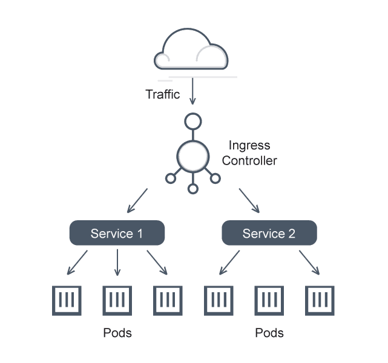

## Les instances


---

## Le cycle de vie des instances Docker


--- 

## Debugger Docker

Les instances Docker sont des processus standards lancés dans un host. 

**On dispose des moyens classiques pour suivre son activité :** 

- Logs
- Strace

**On peut également bénéficier des outils spécifiques aux conteneurs** 

- Modifier la manière de lancer le container (ex: donner les droits root)
- Exec dans le même espace de conteneurisation

**Comment faire quand on utilise des images Serverless i.e. sans Shell ?** 

- Disposer d'une image non-serverless
- Utiliser l'API debug de l'orchestrateur k8s

--- 

## Les volumes Docker


**Rappel : à quoi servent les volumes dans les environnements de conteneurs ?**

Les instances Docker sont... des processus standards lancés dans un host. 

On peut monter des volumes selon les méthodes usuelles de Linux : 

- mount bind
- mount tmpfs
- mount spécifiques Docker (ex: /var/lib/docker/xxx)


### Plugins de volumes

On peut utiliser d'autres systèmes de stockage en installant de nouveau plugins de driver de volume. Par exemple, le plugin `vieux/sshfs` permet de piloter un volume distant via SSH.

Exemples:

- SSHFS (utilisation d'un dossier distant via SSH)
- NFS (protocole NFS)
- BeeGFS (système de fichier distribué générique)
- Amazon EBS (vendor specific)
- etc.

```shell
$ docker volume create -d vieux/sshfs -o sshcmd=<sshcmd> -o allow_other sshvolume
$ docker run -p 8080:8080 -v sshvolume:/path/to/folder --name test someimage
```

---

## Les réseaux Docker

**Les réseaux Docker sont automatisés : DNS, IP Address Management, et plus.**

La solution basique est de faire un bridge local.


**La solution Docker Swarm utilise un réseau spécial nommé overlay.**


**La solution Kubernetes apporte des composants qui permettent de résoudre plus habilement les problèmes réseaux.**



