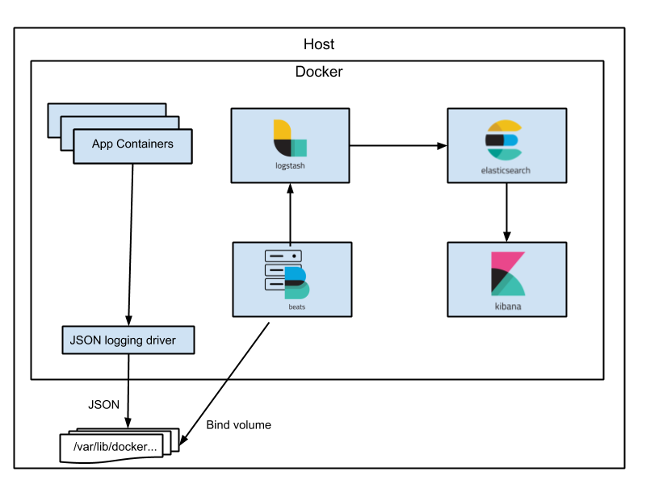

## Utiliser le reverse proxy Traefik avec Docker et Swarm et les certificats TLS

**On peut facilement utiliser Traefik pour obtenir des certificats SSL/TLS grâce aux labels sur les conteneurs Docker**


---

**Traefik est un reverse proxy très bien intégré à Docker.** 

Il permet de configurer un routage entre un point d'entrée (ports `80` et `443` de l'hôte) et des containers Docker, grâce aux informations du daemon Docker et aux `labels` sur chaque containers.


---

```yaml
services:
  reverse-proxy:
    # The official v2 Traefik docker image
    image: traefik:v2.3
    # Enables the web UI and tells Traefik to listen to docker
    command: --api.insecure=true --providers.docker
    ports:
      # The HTTP port
      - "80:80"
      # The Web UI (enabled by --api.insecure=true)
      - "8080:8080"
    volumes:
      # So that Traefik can listen to the Docker events
      - /var/run/docker.sock:/var/run/docker.sock
```

--- 

**Explorez le dashboard Traefik accessible sur le port indiqué dans le fichier Docker Compose.**

Pour que Traefik fonctionne, 2 étapes :
- faire en sorte que Traefik reçoive la requête quand on s'adresse à l'URL voulue (DNS + routage)
- faire en sorte que Traefik sache vers quel conteneur rediriger le trafic reçu (et qu'il puisse le faire) 

Ajouter des labels à l'app web que vous souhaitez desservir grâce à Traefik à partir de l'exemple de la doc Traefik, grâce aux labels ajoutés dans le `docker-compose.yml` (attention à l'indentation).

---

```yaml
# ...
whoami:
  # A container that exposes an API to show its IP address
  image: traefik/whoami
  labels:
    - "traefik.http.routers.whoami.rule=Host(`whoami.docker.localhost`)"
```

---

Avec l'aide de la [documentation Traefik sur Let's Encrypt et Docker Compose](https://doc.traefik.io/traefik/user-guides/docker-compose/acme-http/), configurez Traefik pour qu'il crée un certificat Let's Encrypt pour votre container.

---

Remplacer le service `reverse-proxy` précédent par :

```yaml
services:
    reverse-proxy:
        image: "traefik:v2.3"
        container_name: "traefik"
        command:
          - "--log.level=DEBUG"
          - "--api.insecure=true"
          - "--providers.docker=true"
          - "--providers.docker.exposedbydefault=false"
          - "--entrypoints.websecure.address=:443"
          - "--certificatesresolvers.myresolver.acme.tlschallenge=true"
          - "--certificatesresolvers.myresolver.acme.caserver=https://acme-staging-v02.api.letsencrypt.org/directory"
          - "--certificatesresolvers.myresolver.acme.email=postmaster@${DOMAIN}"
          - "--certificatesresolvers.myresolver.acme.storage=/letsencrypt/acme.json"
        ports:
          - "443:443"
          - "8080:8080"
        volumes:
          - "./letsencrypt:/letsencrypt"
          - "/var/run/docker.sock:/var/run/docker.sock:ro"
    
    whoami:
        image: "traefik/whoami"
        container_name: "simple-service"
        labels:
          - "traefik.enable=true"
          - "traefik.http.routers.whoami.rule=Host(`${DOMAIN}`)"
          - "traefik.http.routers.whoami.entrypoints=websecure"
          - "traefik.http.routers.whoami.tls.certresolver=myresolver"
    

```
```shell

export DOMAIN=your.formation.domain.tld

docker compose -f docker-compose.yml up -d
 
```

---

La solution fonctionne également pour Swarm: 

- Avec l'aide de la [documentation Traefik sur Docker Swarm](https://doc.traefik.io/traefik/routing/providers/docker/#configuration-examples), configurez Traefik avec Swarm.


---

## TP Traefik

Déployer votre propre application web avec un certificat TLS en utilisant docker compose.

Ex: 

- PHP sur wordpress.votredomaine par exemple avec https://github.com/nezhar/wordpress-docker-compose
- Python sur identidock.votredomain par exemple avec https://github.com/dhoer/identidock

Challenge : l'application doit être accessible sur le port 443 de votre serveur en HTTPS


---

## Le logging d’un cluster de conteneurs avec Elasticsearch



Dans Docker, le driver de logs par défaut est `json-file`.
Son inconvénient majeur est que les logs avec ce driver sont supprimés dès que le conteneur est supprimé.

### Utiliser le driver `journald`

**On peut utiliser le driver spécifique pour un conteneur en particulier **

```shell

docker run --log-driver=journald -p8081:80 --rm --name nginx2 -d nginx

```

---

- [A l'aide de la documentation](https://docs.docker.com/config/containers/logging/journald/), changeons le driver dans `/etc/docker/daemon.json` pour utiliser le driver `journald`. 
- Relancez le service `docker.service`
- Consultez les logs d'un conteneur grâce à `journalctl -f` et le bon label.

Ce driver est utile car les logs sont désormais archivés dès leur création, tout en permettant d'utiliser les features de filtrage et de rotation de `journald`.

- Remettez le driver par défaut (`json-file` ou supprimez le fichier `/etc/docker/daemon.json`), et restartez le service `docker.service` pour ne pas interférer avec la seconde moitié de l'exercice : la config Elastic de l'exercice suivant fonctionne avec le driver `json-file`.

---

## Une stack Elastic

### Centraliser les logs

L'utilité d'Elasticsearch est que, grâce à une configuration très simple de son module Filebeat, nous allons pouvoir centraliser les logs de tous nos conteneurs Docker.
Pour ce faire, il suffit d'abord de télécharger une configuration de Filebeat prévue à cet effet :

```bash
curl -L -O https://raw.githubusercontent.com/elastic/beats/7.10/deploy/docker/filebeat.docker.yml
```

Renommons cette configuration et rectifions qui possède ce fichier pour satisfaire une contrainte de sécurité de Filebeat :

```bash
mv filebeat.docker.yml filebeat.yml
sudo chown root filebeat.yml
sudo chmod go-w filebeat.yml
```

Enfin, créons un fichier `docker-compose.yml` pour lancer une stack Elasticsearch :

```yaml
services:
  elasticsearch:
    image: docker.elastic.co/elasticsearch/elasticsearch:7.5.0
    environment:
      - discovery.type=single-node
      - xpack.security.enabled=false
    networks:
      - logging-network

  filebeat:
    image: docker.elastic.co/beats/filebeat:7.5.0
    user: root
    depends_on:
      - elasticsearch
    volumes:
      - ./filebeat.yml:/usr/share/filebeat/filebeat.yml:ro
      - /var/lib/docker:/var/lib/docker:ro
      - /var/run/docker.sock:/var/run/docker.sock
    networks:
      - logging-network
    environment:
      - -strict.perms=false

  kibana:
    image: docker.elastic.co/kibana/kibana:7.5.0
    depends_on:
      - elasticsearch
    ports:
      - 5601:5601
    networks:
      - logging-network

networks:
  logging-network:
    driver: bridge
```

---

**Il suffit ensuite de :**

- se rendre sur Kibana (port `5601`)
- de configurer l'index en tapant `*` dans le champ indiqué, de valider
- et de sélectionner le champ `@timestamp`, puis de valider.

L'index nécessaire à Kibana est créé, vous pouvez vous rendre dans la partie Discover à gauche (l'icône boussole 🧭) pour lire vos logs.

Il est temps de faire un petit `docker stats` pour découvrir l'utilisation du CPU et de la RAM de vos conteneurs !

#### Parenthèse : Avec WSL
Avec WSL, l'emplacement des logs est assez difficile à trouver ! Vous pouvez vous aider de cette page pour ce TP : <https://gist.github.com/Bert-R/e5bb77b9ce9c94fdb1a90e4e615ee518>

### _Facultatif :_ Ajouter un nœud Elasticsearch

Puis, à l'aide de la documentation Elasticsearch et/ou en adaptant de bouts de code Docker Compose trouvés sur internet, ajoutez et configurez un nœud Elastic. Toujours à l'aide de la documentation Elasticsearch, vérifiez que ce nouveau nœud communique bien avec le premier.

### TP : déployer du monitoring avec *cAdvisor* et *Prometheus*

La solution Prometheus 

Suivre ce tutoriel pour du monitoring des conteneurs Docker : <https://prometheus.io/docs/guides/cadvisor/>

On pourra se servir de cette stack Compose : <https://github.com/vegasbrianc/prometheus/>

#### Ressources supplémentaires

Une alternative est Netdata, joli et configuré pour monitorer des conteneurs _out-of-the-box_ : <https://learn.netdata.cloud/docs/netdata-agent/installation/docker>

On peut aussi regarder du côté de Signoz (logging, monitoring et alerting) : https://github.com/SigNoz/signoz

Ou bien Loki : https://grafana.com/docs/loki/latest/setup/install/docker/


Ressources utiles :
- https://github.com/stefanprodan/dockprom
- https://github.com/vegasbrianc/docker-monitoring
- https://grafana.com/grafana/dashboards/179-docker-prometheus-monitoring/