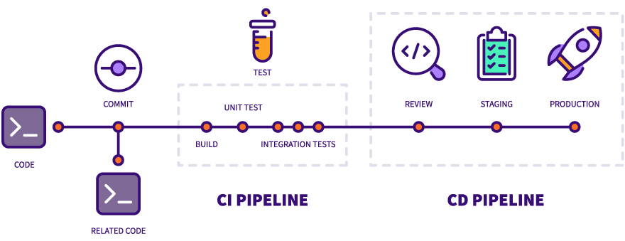
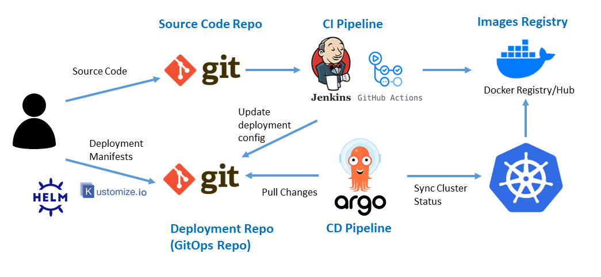
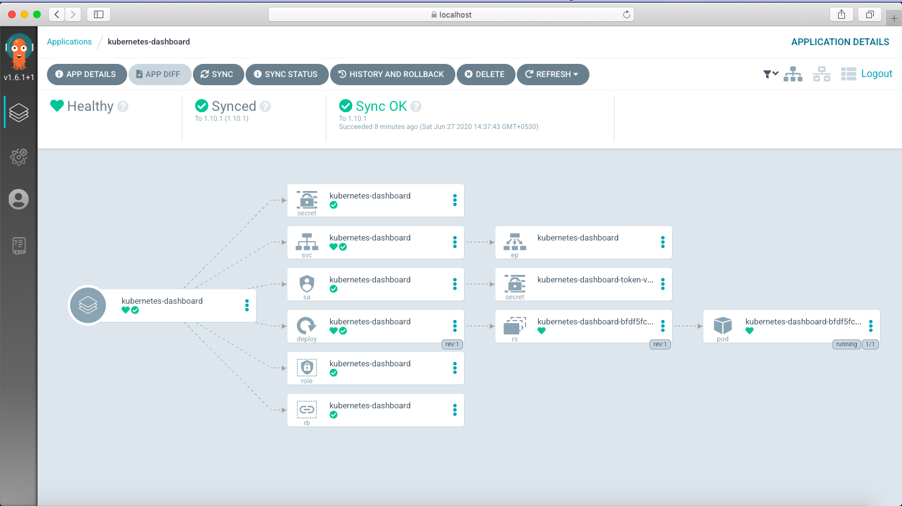
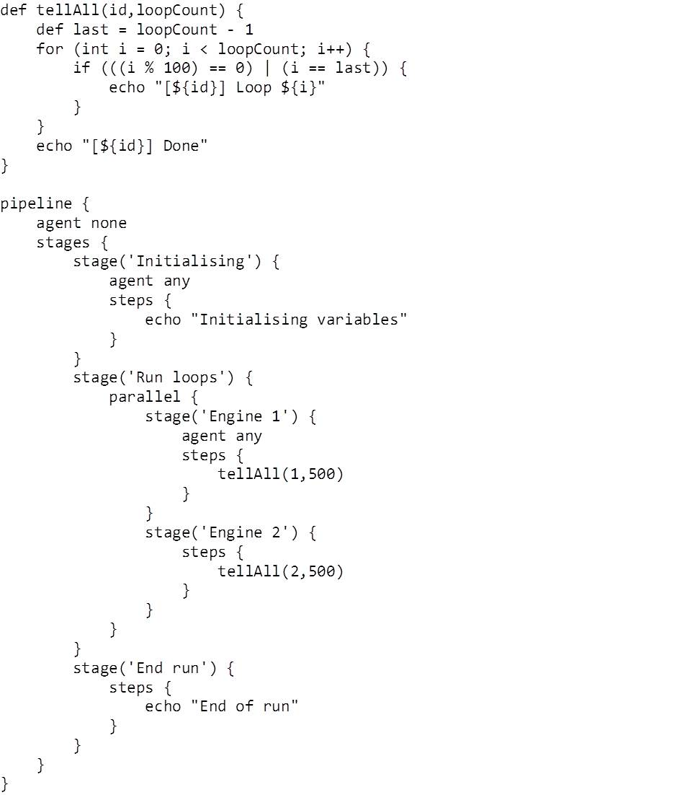

## Gitlab CI, son registre et l’intégration d’un cycle complet de CI/CD



---

**Un pipeline de CI/CD est composé de plusieurs phases.** 

En réalité il est préférable de bien distinguer la CI et la CD :

---

** Les étapes de l'Intégration Continue **

1. Le build. Cette étape est nécessaire pour les langages compilés ou nécessitant une forme du code exécutable. Ex: make
2. Les tests du code. Il peut s'agir de tests d'intégration, de tests unitaires ou autres comme des tests d'accessibilité. Ex: pytest
3. L'analyse du code. Il s'agit de faire passer le code à la loupe d'une analyse statique qui permet d'en améliorer la qualité ou de trouver des failles. Ex: SonarQube, Spectral
4. Le packaging. On peut alors construire les livrables du code, comme une image Docker. Ex: Packer, Docker
5. La livraison. On envoie les packages vers le registry correspondant à l'environnement spécifique (si disponible). Ex: Jfrog, Docker Registry 

** Le Déploiement Continu **

6. Le provisioning. On réserve les ressources nécessaires au déploiement. Ex: Terraform
7. Le déploiement. Les charges utiles sont mises à jour dans l'environnement voulu. Ex: K8S, cloud
8. Les tests d'acceptance. Ces derniers tests sont exécutés sur un environnement réel. Ex: Bruno, Postman

---

## L'émergence du modèle GitOps



**L'approche GitOps vise à simplifier la chaîne des actions requises pour le Déploiement Continu.**

L'approche GitOps repose sur l'utilisation de référentiels Git comme unique source de vérité pour distribuer l'infrastructure en tant que code. 

Chaque état de l'infrastructure correspond à un état précis du code du projet de déploiement.

Un opérateur Kubernetes spécifique comme ArgoCD se charge de détecter les changements dans le code et aligner automatiquement l'infrastructure avec le code.



--- 

**Avantages :**

* Déclaration d'application côté Kubernetes, ce qui offre une cohérence visuelle supérieure au namespace
* Standardisation du déploiement des applications
* Visibilité des changements via IAC et contrôle de versions Git
* Simplification des échanges : le cluster Kubernetes est autonome pour lancer les rotations de version

---

## Les forges GIT et les pipelines CI/CD

**Historiquement l'apport de solutions en provenance du monde Java comme Jenkins ou Maven a été un progrès pour l'automatisation.**

Dans Maven, il existe plusieurs idées comme  :

- Les buts
    - compile
    - test
    - package
    - install
    - deploy
- Les repositories pour les artefacts

---

**Les outils comme Jenkins supportent plusieurs types de Systèmes de Contrôle de Version.**  

Ils sont capables de détecter les changements pour lancer des pipelines de CI.

Mais avec l'émergence de Git, et surtout des forges Git comme Github ou Gitlab, la CI/CD va être intégrée à la forge. 

Ainsi le code passe en première position et on supprime un outil. 

Pour contrôler les pipelines, ces forges utilisent des fichiers statiques, à l'inverse de solutions comme Jenkins qui utilisent par exemple des scripts Groovy.



--- 
## La CI Gitlab

**Le cas de Gitlab est intéressant : c'est une plateforme de CI/CD qui fournit de nombreux outils.** 

- Un DSL complet pour contrôler les pipelines : le fichier [`.gitlab-ci.yml`](https://docs.gitlab.com/ee/ci/yaml/index.html)
- La capacité à utiliser ses propres "runners", qui sont les serveurs utilisés lors des pipelines.
- Un catalogue complet de solutions "sur étagère" / marketplace pour le CI/CD.
- Une intégration des secrets via des variables disponibles au moment de l'exécution, offrant une granularité assez fine - y compris par branche.
- Une intégration avec Kubernetes.


--- 

**Nous allons analyser des templates de Gitlab CI :**

- Le template par défaut : https://gitlab.com/gitlab-org/gitlab/-/blob/master/lib/gitlab/ci/templates/Getting-Started.gitlab-ci.yml

- Le template pour Docker : https://gitlab.com/gitlab-org/gitlab/-/blob/master/lib/gitlab/ci/templates/Docker.gitlab-ci.yml

--- 

## Lancer un scan de vulnérabilité avec Trivy 

Objectif : tester et identifier des vulnérabilités CVE

Installer Trivy avec 

```shell

curl -sfL https://raw.githubusercontent.com/aquasecurity/trivy/master/contrib/install.sh | sudo sh -s -- -b /usr/local/bin 

```

- Lancer un scan comme `trivy image python:3.4-alpine` et chercher à quoi correspondent les CVE
- Lancer un scan sur d'autres images pour identifier d'autres vulnérabilités


## TP: Créer une pipeline de build d'image Docker avec les outils CI/CD Gitlab
1. Si vous n'en avez pas déjà un, créez un compte sur Gitlab.com : <https://gitlab.com/users/sign_in#register-pane>
2. Créez un nouveau projet et avec Git, le Web IDE Gitlab, ou bien en forkant une app existante depuis l'interface Gitlab, poussez-y l'app de votre choix (par exemple [`microblog`](https://github.com/Uptime-Formation/microblog/), [`dnmonster`](https://github.com/amouat/dnmonster/)).
3. Ajoutez un Dockerfile à votre repository ou vérifiez qu'il en existe bien un.
4. Créez un fichier `.gitlab-ci.yml` depuis l'interface web de Gitlab et utilisez le template Docker. 
5. Faites un commit de ce fichier.
6. Vérifiez votre CI : il faut vérifier sur le portail de Gitlab comment s'est exécutée la pipeline.
7. Vérifiez dans la section Container Registry que votre image a bien été push.

## TP : Fabriquer votre propre chaîne d'intégration continue

Objectif : Intégrer des étapes supplémentaires dans votre pipeline de CI Gitlab.
- Utiliser un secret stocké dans les variables CICD
- Ajouter un lancement de tests unitaires depuis votre instance docker 
- Ajouter un test de vulnérabilité avec Trivy


