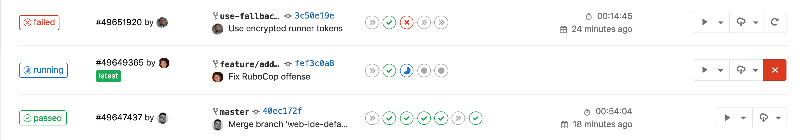

<!-- # Docker en production -->

---

# Conclusions sur l'écosystème Docker

## Configurer de la CI/CD

- La nature facile à déployer des conteneurs et l'intégration du principe d'Infrastructure-as-Code les rend indispensable dans de la CI/CD (intégration continue et déploiement continu).
- Les principaux outils de CI sont Gitlab, Jenkins, Github Actions, Travis CI…
  - Gitlab propose par défaut des runners préconfigurés qui utilisent des conteneurs Docker et tournent en général dans un cluster Kubernetes.
  - Gitlab propose aussi un registry d'images Docker, privé ou public, par projet.
- Les tests à l'intérieur des conteneurs peuvent aussi être faits de façon plus poussée, avec par exemple Ansible comme source de healthcheck ou comme suite pour les tests.
- Dans une autre catégorie, Gitpod base son workflow sur des images Docker permettant de configurer un environnement de développement

## Gérer les logs et monitorer des conteneurs

### Logging
Avec Elasticsearch, Filebeat et Kibana… grâce aux labels sur les conteneurs Docker

Ou en utilisant des drivers de logs adéquats : <https://docs.docker.com/config/containers/logging/configure/#supported-logging-drivers>

### Monitoring

- Avec Prometheus et cAdvisor pour Docker et Docker Swarm, voir ce tutoriel : <https://prometheus.io/docs/guides/cadvisor/>

- Ou bien Netdata, joli et configuré pour monitorer des conteneurs _out-of-the-box_

- Ou bien Loki, qui s'installe facilement avec Docker Compose et est très complet : https://grafana.com/docs/loki/latest/setup/install/docker/

- On peut aussi regarder du côté de Signoz (logging, monitoring et alerting) : https://github.com/SigNoz/signoz

## Gérer le reverse proxy

Avec Traefik, aussi grâce aux labels sur les conteneurs Docker

Ou avec Nginx, avec deux projets :

- https://github.com/nginx-proxy/nginx-proxy
- https://github.com/nginx-proxy/acme-companion

---

<!-- # Exemples de cas pratiques :

Présentation d'un workflow Docker, du développement à la production -->

## Limites de Docker

## Stateful

- les conteneurs stateless c'est bien beau mais avec une base de données, ça ne se gère pas magiquement du tout
  - quelques ressources sur le stateful avec Docker : <https://container.training/swarm-selfpaced.yml.html#450>

### Configurer le réseau de façon plus complexe avec des plugins réseau

- Réseaux "overlay": IP in IP, VXLAN…
- …mais on a rapidement besoin de plugins exclusifs à Kubernetes : [Calico](https://github.com/projectcalico/calico), [Flannel](https://github.com/coreos/flannel/), Canal (Calico + Flannel), [Cilium](https://github.com/cilium/cilium) (qui utilise eBPF)

<!-- (parenthèse systemd : docker daemon et systemd en cocurrence pour être tous les deux des process d'init : pas possible de lancer un conteneur depuis systemd) (2e parenthèse : pid 1) -->

## Volumes distribués

- problème des volumes partagés / répliqués
  - domaine à part entière
  - **Solution 1** : solutions applicatives robustes
    - pour MySQL/MariaDB : [Galera](https://mariadb.com/kb/en/what-is-mariadb-galera-cluster/)
    - pour Postgres : on peut citer [Citus](https://hub.docker.com/r/citusdata/citus/) ou [pgpool](https://hub.docker.com/r/bitnami/pgpool/), voir la [comparaison de différentes solutions](https://wiki.postgresql.org/wiki/Replication,_Clustering,_and_Connection_Pooling)
    - Elasticsearch est distribué _out-of-the-box_
  - **Solution 2** : volume drivers avec Docker
    - [Flocker](https://flocker.readthedocs.io/en/latest/docker-integration/tutorial-swarm-compose.html), [Convoy](https://github.com/rancher/convoy), visent à intégrer une technologie de réplication
    - c'est un moyen, pas une solution : reste un outil pour configurer ce que l'on souhaite

## DataOps
- Doit se baser sur une solution applicative complète comme Kafka
- avec Compose pour les différents services et Swarm pour le scaling
- Solutions actuelles peut-être plus orientées Kubernetes
- Ressources :
    - Pas-à-pas très détaillé d'une pipeline "ETL" https://medium.com/sfu-cspmp/building-data-pipeline-kafka-docker-4d2a6cfc92ca
      - dépôt lié : https://github.com/salcaino/sfucmpt733
    - Exemple avec Kafka : https://github.com/rogaha/data-processing-pipeline/blob/master/docker-compose.yml

## Retours

- Comment ça s'est passé ?
  - Difficulté : trop facile ? trop dur ? quoi en particulier ?
  - Vitesse : trop rapide ? trop lent ? lors de quoi en particulier ?
  - Attentes sur le contenu ? Les manipulations ?
  - Questions restées ouvertes ? Nouvelles questions ?
