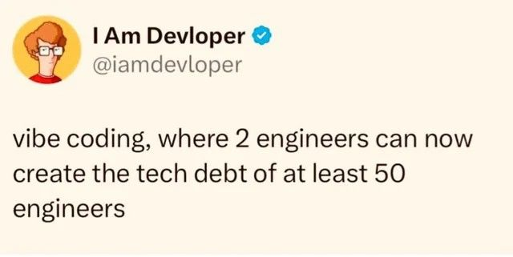
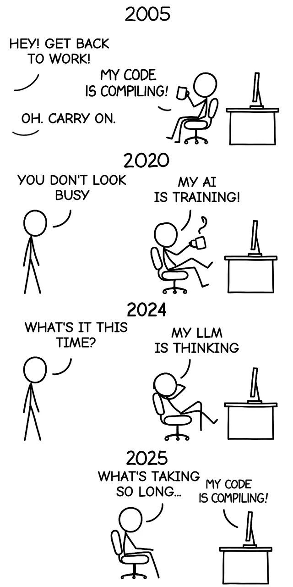
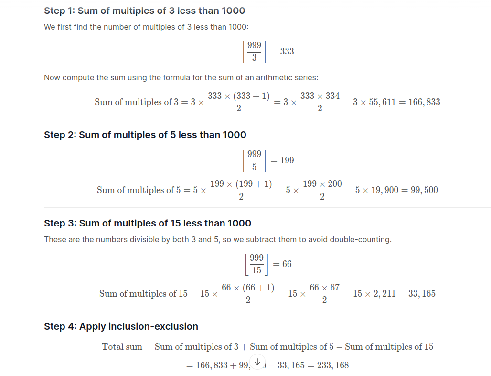

## A propos de moi

---

## Objectifs de la formation
 
Les outils qu'on va utiliser ne sont pas intelligents, l'objectif c'est que ce soit vous qui le soyez. 

**Stratégie** : Avoir une vision globale des évolutions causées par l'IA dans le monde du Développment

**Théorique** : Avoir une bonne compréhension des concepts, des outils et des bonnes pratiques

**Pratique** :  Savoir comment mettre en oeuvre efficacement une production basée sur l'IA

---

### Mises en oeuvre

**Durant cette formation nous allons développer vos compétences suivantes :**

- Designer : concevoir des architectures et des projets
- Documenter : décrire comment fonctionne votre projet
- Tester : maîtriser le code produit et le rendre robuste
- Développer : écrire du code de qualité

---

## A propos de vous

- Parcours ?
- Attentes ?

---

## L'IA pour les développeurs : quelle est votre vision ?  





---

## Avant de commencer, une expérience

**Si vous n'avez jamais utilisé un LLM pour faire du code, c'est le moment.**

- Allez sur le premier problème du site de Project Euler : https://projecteuler.net/problem=1

- Copiez le texte de la question dans l'interface de votre choix.

- Lancer l'inférence.

---

Que se passe-t-il ?

- Est-ce que le modèle trouve le bon résultat en faisant des maths ?   
  Le résultat peut-être calculé mathématiquement de manière élégantes, et les modèles récents y parviennent.

<details><summary>Montrer</summary>



</details>

- Est-ce qu'il essaie de répondre ou de créer un programme pour y répondre ?
  Le code pour résoudre le problème est particulièrement trivial.

<details><summary>Montrer</summary>

```
#!/usr/bin/env python3

# Initialize the total sum
total = 0

# Loop through all numbers from 1 to 999
for i in range(1, 1000):
    if i % 3 == 0 or i % 5 == 0:
        total += i

# Print the final result
print(total)


```
</details>

---

## Qu'est-ce qu'un (bon) développeur ? 

**La question n'est pas simple :)**

- Une personne qui sait bien coder ?
- Une personne qui sait bien résoudre des problèmes ?
- Une personne qui travaille bien en équipe ? 
- Une personne qui maîtrise un langage de programmation ?
- Une personne qui maîtrise un domaine technique ?
- Une personne qui a beaucoup d'expérience ?
- Une personne qui sait bien utiliser des outils de développement ? 
- Une personne qui fournit rapidement des fonctionnalités ? 
- Une personne qui fournit du code élégant ?
- Une personne qui sait respecter les contraintes et les besoins ?
- Une personne qui sait innover et anticiper les besoins futurs ?
- Une personne qui documente bien ?
- Une personne qui respecte les normes ?
- Une personne qui fait des programmes performants ? 
- Une personne qui fait des programmes qui ont du succès ? 


--- 

## La seule chose qui ne change jamais, c'est le changement

- Les gens évoluent
- Les techniques évoluent
- Les langages évoluent
- Les socles d'exécution évoluent
- Les applications évoluent
- Les normes d'échanges entre applications évoluent

**Une référence à conntaître : The Pragmatic Programmer**

- Vous êtes en charge, individuellement et au sein des organisations. 

- Vous avez la responsabilité de faire un bon travail qui vous enrichit. 

- Vous devez acquérir l'expérience nécessaire pour atteindre un niveau d'expertise suffisant (3/4) 

---

## Qu'est-ce que l'IA peut apporter aux développeurs ? 

**Nous allons commencer immédiatement avec quelques expériences d'interaction avec des interfaces connectés à des modèles de lanagage.**

Connectez-vous à l'interface LLM de votre choix : celle de votre poste de travail ou sur le virtual lab.

---

**Expérience 1 : traduisez via un LLM le texte court suivant en swahili...** 

```
Mignonne, allons voir si la rose
Qui ce matin avait éclose
Sa robe de pourpre au Soleil,
A point perdu cette vesprée
Les plis de sa robe pourprée,
Et son teint au vôtre pareil.
```

---

**... ce qui donne par exemple**

```
Mpenzi wangu, twende tuone kama waridi
Uliyofunika asubuhi hii
Mavazi yake ya zambarau kwa Jua,
Hawajapoteza jioni hii
Mikunjo ya vazi lake la zambarau,
Wala rangi yake inayofanana na yako.
```

**Conclusion : vous ne savez pas si l'IA Gen fait un bon travail si vous n'avez pas l'expertise.**

---

## Experience 2 : traduire via un LLM un texte long...**

**Maintenant, faites traduire un texte de plusieurs milliers de mots à un LLM dans une langue de votre choix.**

https://www.gutenberg.org/cache/epub/59073/pg59073.txt
https://www.gutenberg.org/ebooks/4772

**Conclusion : malgré des erreurs, c'est un problème qu'on résoud assez bien désormais, à une vitesse de conversion très élevée.**

---

## Experience 3 : imaginons la translitération d'une librarie codée dans un langage vers un autre langage.

**Enfin si on considère le code informatique, et qu'on veut obtenir via un LLM une traduction d'un langage vers un autre ?**

- Prenez par exemple le code de la page suivante : https://salsa.debian.org/helmutg/debvm/-/blob/main/bin/debefivm-create?ref_type=heads
- Copiez le texte
- Collez-le dans l'interface avec l'instruction suivante : 
```text
(... le code collé...)

As a code assistant, you mush convert this program to python.
```

---

**Qu'est-ce risque de se passer ?** 

- Premier avantage du code : c'est instrumentable et exécutable, on va pouvoir tester le résultat.

  La machine peut indiquer si le résultat est correct ou non d'un point de vue syntaxique. 

- En revanche il n'y a pas de garantie que le résultat soit conforme aux attentes fonctionnelles.

- De même il n'y a pas de garantie qu'il soit performant ou sécure : il peut avoir dégradé le script d'origine.

**Il va falloir qu'on encadre cette production pour s'assurer qu'elle répond aux attentes.**

--- 

## Les idées clés de la formation 


- Ce sont des outils dans la boîte à outils, il faut savoir quand utiliser quoi.
- Sans une bonne maîtrise des fondamentaux vous risquez de stagner et mal utiliser les outils.
- L'IA Gen commence par être un stagiaire/assistant qu'il faut surveiller. 
- Le rôle de développeur va se complexifier et cumuler de plus en plus de responsabilités grâce à l'assistance de l'IA. 
- Il va falloir intégrer de nombreuses bonnes pratiques pour réaliser des applications performantes et sécurisées.


--- 

## Définition du Lexique

**Parmi ces termes, combien connaissez-vous déjà ?**

1. **Chatbot** : Désigne un programme chargé de répondre à des questions ou de fournir des informations à un utilisateur via une interface de dialogue.
1. **IDE** : Désigne un environnement de développement intégré.
1. **IA Gen** : Désigne l'ensemble des techniques et outils permettant de générer des contenus via des modèles de langages génératifs, dont le code.  
1. **LLM** : Désigne les Modèles de Language de grande taille qui se sont généralisés suite au succès de ChatGPT.
1. **Prompt** : Désigne le texte qui sert d'entrée à un modèle de langage génératif.
1. **Token** : Désigne une unité de texte qui peut être traitée par un modèle de langage génératif ex: https://gpt-tokenizer.dev/ 
1. **Embedding** : Désigne une représentation de mots (ou tokens) par des vecteurs numériques multidimensionnels.
1. **Agent** : Un programme chargé dans une architecture IA Agentique d'augmenter un LLM.
1. **Code Gen** : La production de code par IA Générative
1. **MCP** : Le Model Context Protocol est un standard destiné à augmenter les requêtes vers les LLM et les IDE via des agents.
