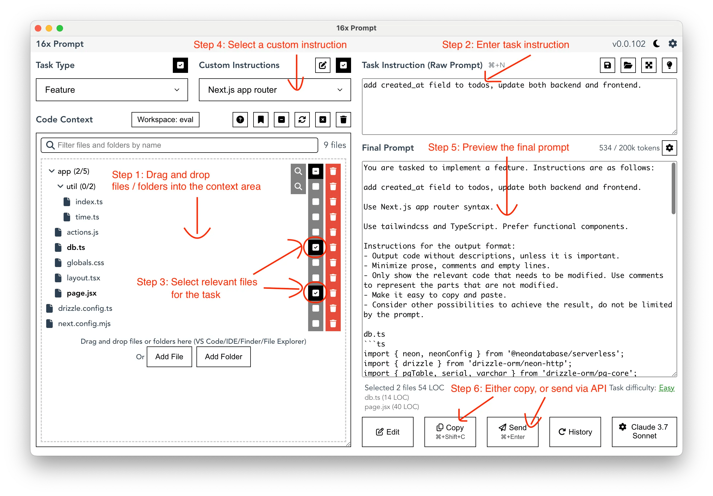

## Quickstart 

Utilisez l'interface LLM de votre choix pour générer un résultat à partir du prompt suivant.

```text

Décris le prompt engineering en utilisant la structure du poème avec un ton comique.  
  
<text> 

Mignonne, allons voir si la rose
Qui ce matin avait éclose
Sa robe de pourpre au Soleil,
A point perdu cette vesprée
Les plis de sa robe pourprée,
Et son teint au vôtre pareil.
  
</text>

```

---

## Prompt Augmenté 

**Pour dépasser les limites rencontrées, il est possible d'utiliser des techniques avancées pour canaliser la production du modèle.**

---

### L'Augmentation du Contexte du Prompt

**Le Retrieval Augmented Generation (RAG) est une technique qui permet d'augmenter la qualité des réponses en intégrant des informations externes dans le prompt.**

Il consiste à récupérer des informations externes et à les intégrer dans le prompt pour aider le modèle à générer une réponse plus précise et pertinente.

---

**Voici comment on pourrait représenter le contexte en prenant en compte les différents composants.**

```
[CONTEXTE TOTAL = Limite technique (ex: 128K tokens)]
│
├── 📜 **SYSTEM PROMPT**  
│   (Instructions permanentes : rôle, style, règles)  
│
├── 🔍 **RETRIEVAL DATA**  
│   (Données externes injectées : docs, base de connaissances)  
│
├── ↔️ **HISTORIQUE**  
│   (Messages précédents : [User➙Assistant]₁...ₙ)  
│
├── ❓ **USER PROMPT**  
│   (Requête actuelle)  
│
└── 💬 **OUTPUT**  
    (Réponse générée en cours, token par token)
```

---

**Mécanisme d'accumulation** :  

1. Les composants s'**empilent séquentiellement** dans le buffer de contexte  
2. L'**output** s'ajoute dynamiquement pendant la génération  
3. Quand la limite technique est atteinte :  
   - Les tokens les **plus anciens** (début de l'historique) sont éjectés  
   - Priorité typique : `SYSTEM PROMPT` > `RETRIEVAL` > `PROMPT ACTUEL` > `OUTPUT` > `HISTORIQUE ANCIEN`

**Exemple avec comptage** :  
`[SYSTEM: 50 tokens] + [RETRIEVAL: 200 tokens] + [HISTO: 1500 tokens] + [PROMPT: 100 tokens] + [OUTPUT: 300 tokens] = 2150/128000 tokens`


---


## Piloter le raisonnement

**On peut activer différents niveaux de raisonnement selon les modèles via le prompt.**

- Zero Shot
- One Shot
- Few Shot
- Chain of Thoughts


| **Technique**       | **Mécanisme**                                                                 | **Exemple de Prompt**                                                            |
|---------------------|-------------------------------------------------------------------------------|----------------------------------------------------------------------------------|
| **Zero-Shot**       | Aucun exemple fourni → le modèle **généralise** depuis ses connaissances pré-entraînées. | "Explique la photosynthèse en une phrase."                                       |
| **One-Shot**        | **Un exemple** fourni → le modèle **infère le pattern** à reproduire.         | "Q: 2x+3=7. Solution ? A: x=2. Q: 5y-1=9. Solution ?"                            |
| **Few-Shot**        | **Plusieurs exemples** → le modèle **détecte des règles implicites**.          | "Chat → animal. Voiture → machine. Piano → ?"                                    |
| **Chain of Thought (CoT)** | **Décomposition pas à pas** (explicite ou via exemples) → force un **raisonnement séquentiel**. | "Paul a 10€. Un livre coûte 7€. Combien lui reste-t-il ? **Raisonnes pas à pas :**" |

---

**L'efficacité varie radicalement selon les modèles : certains comme DeepSeek ou GPT-4 excellent en CoT alors que des modèles plus petits nécessitent du Few-Shot.**

Par exemple DeepSeek propose la balise `/nothink` qui désactive la `pensée` du modèle.

Dans tous les cas, il est important de noter qu'il ne s'agit pas d'une pensée comme on l'entend pour l'humain, mais d'un moyen de parvenir à un raisonnement par des boucles de réflexions et des patterns. 

L'idée est de déclencher ces compétences logiques **pré-entraînées mais non utilisées par défaut**. 

---

### Le templating

**Associée au Few-Shot prompting, consiste à fournir la structure de la réponse attendue afin de canaliser la sortie du LLM.**

En donnant une structure définie à la sortie on peut obtenir une sortie plus cohérente et plus conforme aux attentes.

La méthode du templating est reproductible et permet de générer des données structurées.

Ex : un prompt qui définit la manière souhaitée d'écrire une fonction ou une classe en Python.

---

### Le roleplay prompting

**Consiste à demander au LLM de jouer un rôle spécifique dans la conversation.**

Ex : demander au modèle de jouer le rôle d'un architecte logiciel 

Cette technique de **pilotage du modèle** oriente vers une dimension spécifique et va être utile dans une approche agentique.

---

### Le metaprompting

**Consiste à demander au modèle de générer un ou plusieurs prompt adaptés à une autre tâche.**

Un exemple classique est de demander à un LLM un prompt pour un modèle 100% image.

Arrivé à ce point, on voit qu'on peut cumuler les méthodes : `metaprompting` + `roleplay` + `templating`

Ex: pour construire une solution en Python qui utilise Python, une message queue et une API fournisseur
- un prompt qui génère plusieurs prompts individuels : un architecte, un développeur, un testeur
- avec la documentation de l'API fournisseur 
- avec un template qui définit les contraintes pour chaque prompt
 

---

### Les librairies de prompts

**Il existe de nombreuses librairies qui fournissent des maquets de prompts pour différentes tâches et domaines.**

- Anthopic https://docs.anthropic.com/en/resources/prompt-library/library
- GCP Vertex https://console.cloud.google.com/vertex-ai/studio/prompt-gallery?
- Google AIStudio https://aistudio.google.com/app/gallery
- OpenAI https://platform.openai.com/docs/examples
- Github Abilzerian https://github.com/abilzerian/LLM-Prompt-Library/tree/main/prompts/programming
- hero.page https://hero.page/samir/ai-prompts-for-software-development-jobs-prompt-library
- MarketPlace https://snackprompt.com/

---

### Les outils interactifs dédiés

**Une nouvelle catégorie de logiciels permet de gérer et générer des prompts à la demande.**



Une des approches consiste à disposer de fragments de prompts pré-établis et de les assembler pour créer des prompts personnalisés.

- https://github.com/thibaultyou/prompt-library
- https://github.com/0xeb/TheBigPromptLibrary/tree/main/SystemPrompts
- https://prompt.16x.engineer/


---

### Les outils intégrés

**Certains IDE et outils de développement intégrés proposent des outils pour disposer de prompts optimisés pour les développeurs.**

---

#### Les prompts dans le MCP

**Le Model Context Protocol est une solution émergente en 2025 pour interconnecter un agent (IDE) et un serveur MCP afin d'augmenter la productivité des développeurs.**

- Ressources : accès à des données en lecture (ex: API, RAG, DB, etc.)
- Outils : accès à des opérations en écriture et exécution (ex: lancement de tests, liste de fichiers locaux)
- Prompts : accès à des prompts dynamiques qui peuvent aller chercher des ressources, s'enchaîner, être appelés avec des raccourcis, etc.

A terme avec ce genre d'outils, le prompt dynamique et augmenté fait directement partie du workflow du développeur.

---

#### Les rules dans l'IDE

**Les nouvelles générations d'IDE comme Claude Desktop, Cursor ou Zed intègrent des composants de prompts comme des assets liés à un utilisateur ou un projet.**

Dans Cursor, les rules sont stockées dans un dossier du projet `.cursor/rules` et sont historisées avec le projet. 

Dans Claude, c'est un fichier `CLAUDE.md` qui a le même objectif. 

---

**Au final le fonctionnement est similaire à un prompt dynamique et augmenté : les rules sont concaténées et envoyées au LLM pour obtenir la complétion.**

Le mode de fonctionnement est appelé à se généraliser et un éditeur comme Zed est capable d'identifier plusieurs fichiers de rules provenant de Cursor, Claude, etc.

Dans les différents éditeurs, les rules peuvent également être définies au niveau utilisateur pour respecter ses préférences personnelles. 


Références : 

- Documentation Zed https://zed.dev/docs/ai/rules
- Documentation Cursor https://docs.cursor.com/context/rules
- Awesome cursor rules https://github.com/PatrickJS/awesome-cursorrules