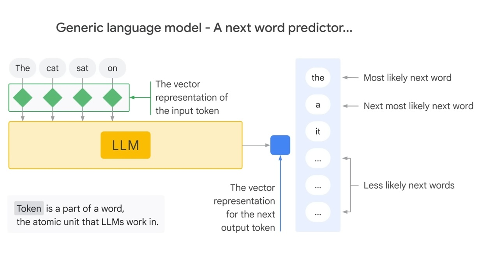
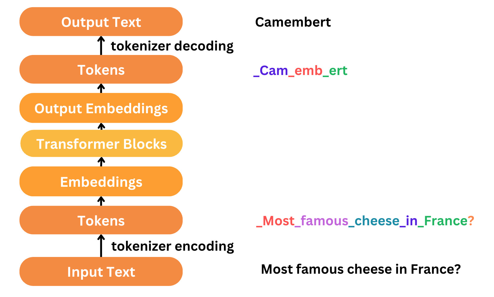
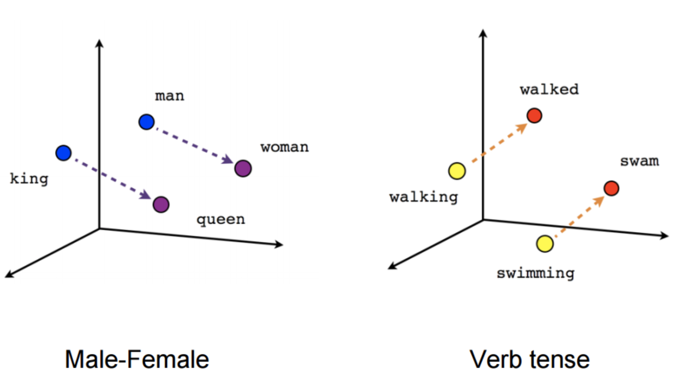
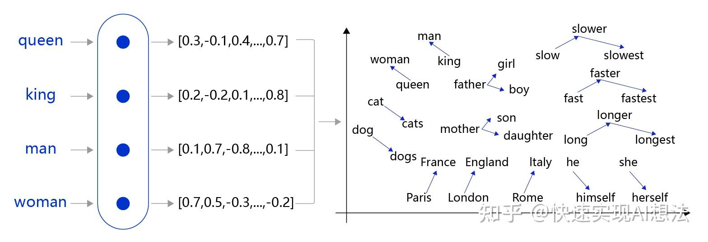
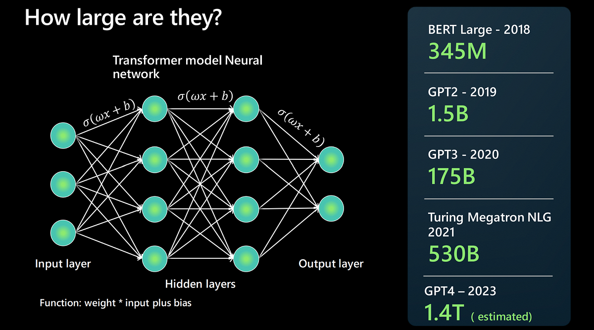
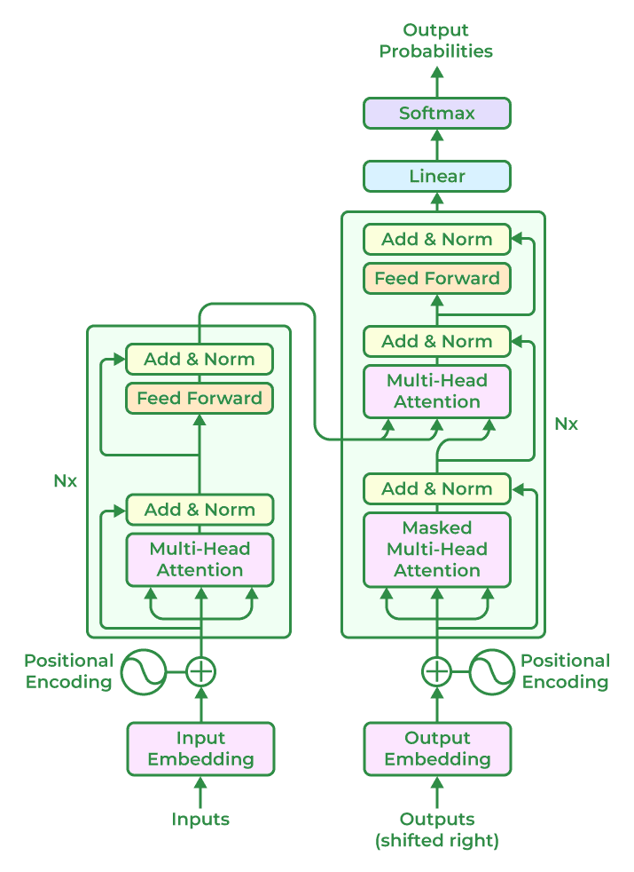
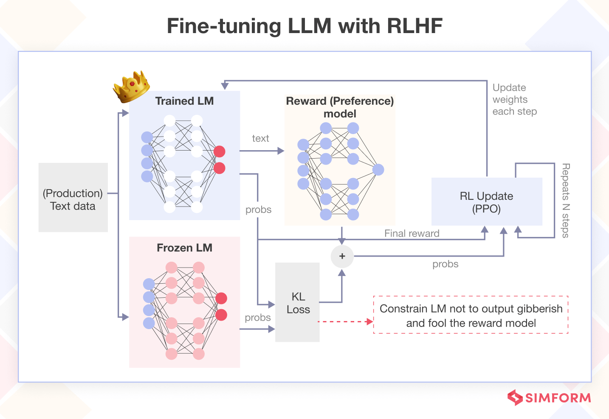
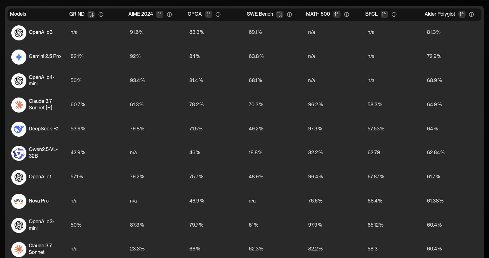
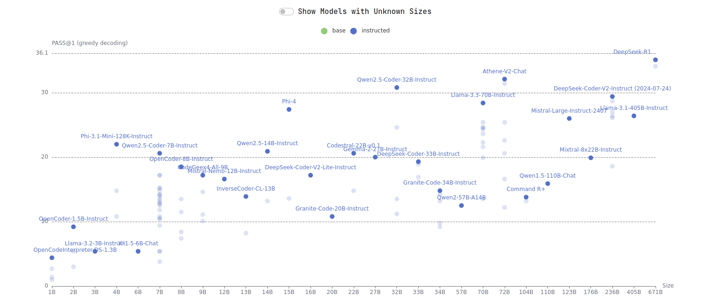

## Quickstart

- Entrez le prompt suivant : 
```
Agis comme un formateur en IA expliquant les LLM à un apprenant curieux. Structure ta réponse en 4 couches :  
1. **Auto-description littérale** : "Je suis un Grand Modèle de Langage (LLM), ce qui signifie..."  
2. **Analogie** : Compare un LLM à une « **poupée russe de savoir humain compressé** » (explique les symboles : couches de la poupée = couches du modèle, compression = entraînement).  
3. **Auto-dissection** : Décris le *processus de génération* de *cette phrase même* :  
   - Tokenisation → Embeddings → Attention → Prédiction → Décodage  
4. **Métacognition** : "Pourquoi cette explication en couches fonctionne-t-elle ? Parce que les LLM apprennent le savoir *hiérarchiquement* – reflétant la manière dont je viens de vous l'enseigner."  
```

---

## Qu'est ce qu'un LLM ?

**Un LLM est un modèle de langage qui peut générer du texte à partir d'un prompt donné.**




Le mode du fonctionnement consiste à prendre un prompt et de le transformer en une séquence de tokens.

Le modèle est alors utilisé pour générer une séquence de tokens qui correspond à une phrase cohérente avec le prompt.

Au fur et à mesure de la production du texte, le modèle réutilise le prompt et le texte déjà produit pour prédire le token suivant.

---

## Quels progrès techniques ont permis les outils IA GEN et de la génération de Code pour Développeurs ? 

**Les LLM sont de plus en plus performants, et c'est dû en partie à des facteurs techniques.**

Cf. https://hai.stanford.edu/ai-index/2025-ai-index-report/technical-performance

---

### La vectorisation du langages (Word2Vec et al.)

**La vectorisation du langage permet de représenter les mots par des vecteurs numériques.**




Cette capacité permet de calculer des distances entre mots et d'organiser leurs relations sémantiques en un espace vectoriel.

Au fur et à mesure de son entraînement, le modèle apprend les relations entre des concepts.

**Les mots ne sont plus que du texte, ils ont une "signification" mathématique.**

---

### Les réseaux neuronaux profonds 

**La taille des IA dites "Connexionistes" a grandement évoluée depuis quelques années.**



Chaque neurone applique une transformation affine (combinaison linéaire pondérée des entrées suivie d'un biais) puis une fonction d'activation non linéaire (ReLU, sigmoïde, etc.). 

L'empilement de ces couches permet d'approximer des fonctions complexes par composition hiérarchique de représentations.

Associés à des datasets de plus en plus importants, la profondeur sémantique des relations entre mots et phrases s'est considérablement améliorée. 

---

### L'attention et les transformers 

**Le concept d'attention a permis des progrès considérables dans le traitement du langage naturel via la prise en compte des séquences de mots et phrases.**




L'attention est un mécanisme différentiable permettant à un modèle de pondérer dynamiquement l'importance des éléments d'une séquence lors du traitement d'une cible. 

C'est un mécanisme qui permet de calculer des poids d'importance pour chaque élément d'une séquence lors du traitement d'une cible.

C'est ainsi que les LLM peuvent produire des phrases cohérentes avec le contexte.

---

#### Le renforcement par l'humain / Reinforcement Learning from Human Feedback (RLHF)

**La dernière étape consiste à rendre le modèle plus performant en lui fournissant des récompenses pour les actions appropriées et des punitions pour les actions inappropriées.**



Le RLHF réaligne le comportement du modèle avec les attentes d'un utilisateur et d'une organisation en limitant les interactions jugées nocives (alignement) et en favorisant celles qui sont jugées utiles.

Cette dernière étape optimise le réseau neuronal brut via une approche de fine-tuning.

---

## Quel est le panorama actuel des modèles 




Il existe des benchmarks automatisés : 

- https://www.vellum.ai/llm-leaderboard
- https://artificialanalysis.ai/leaderboards/models
- https://bigcode-bench.github.io/
- https://llm-stats.com/
- https://aider.chat/docs/leaderboards/


---


### Quelques modèles et entreprises du LLM




En janvier 2025 :

- DeepSeek / DeepSeek
- ChatGPT / OpenAI 
- Llama / Meta 
- Claude / Anthropic
- Qwen / Alibaba
- Codestral / Mistral 
- Gemini / Google 
- Yi-lightning / Yi-01.ai

---

**Les coûts d'entraînements prohibitifs rendent la création de nouveaux modèles difficile pour des opérateurs indépendants.**

Il existe une tension entre les acteurs qui développent des modèles commerciaux et la production de modèles open source.

Pour produire un modèle open source il ne suffit pas de distribuer les "poids" : ça s'appelle le "Open Weights".

Le véritable Open Source implique de fournir un dataset, la structure du modèle, les scripts d'entraînements, tout ce qui permet de reproduire le résultat.


---

### Les contraintes de choix 

**Comment choisir un modèle adapté à ses besoins ?**

Il y a différents paramètres à considérer dans l'absolu :
 
- Efficacité pour les tâches demandées
- Coûts
- Open Source 
- Exécution locale 
- Taille
- Privacy
- Sécurité
- Performance

Souvent, les développeurs sont dépendants des modèles disponibles dans leur organisation. 

**Il est néanmoins utile d'avoir une idée des modèles disponibles et de leur efficacité, si l'on considère qu'il s'agit d'outils de développement essentiels.**

---

### Les interfaces

**Les modèles LLM sont disponibles sous forme de services API ou d'interfaces qui exploitent ces API.**

Si on prend l'exemple de Claude par Anthropic.

- Chat Web : https://claude.ai/ est un chatbot qui permet de tester Claude en ligne. 
- API : https://docs.anthropic.com/en/api/overview est la documentation de l'API Claude.
- SDK : https://github.com/anthropics/claude-code-sdk-python est un client Python pour l'API Claude.

Aujourd'hui, les modèles LLM sont intégrables directement dans les applications, comme le font les IDE.

--- 

**Aujourd'hui on voit émerger une variété de solutions et d'interfaces.**

**A terme on aura de plus en plus d'architectures qui intègreront l'AI en tant que service.**

- Endpoint d'inférence : Code (autocomplétion) et Chat (questions / réponses)
- Interface web 
- Intégration IDE
- Intégration CLI
- Interfaces agentique
- Application IA

**En l'état, toutes ces solutions utiliseront au final un prompt pour obtenir une réponse d'un modèle de langage.**

