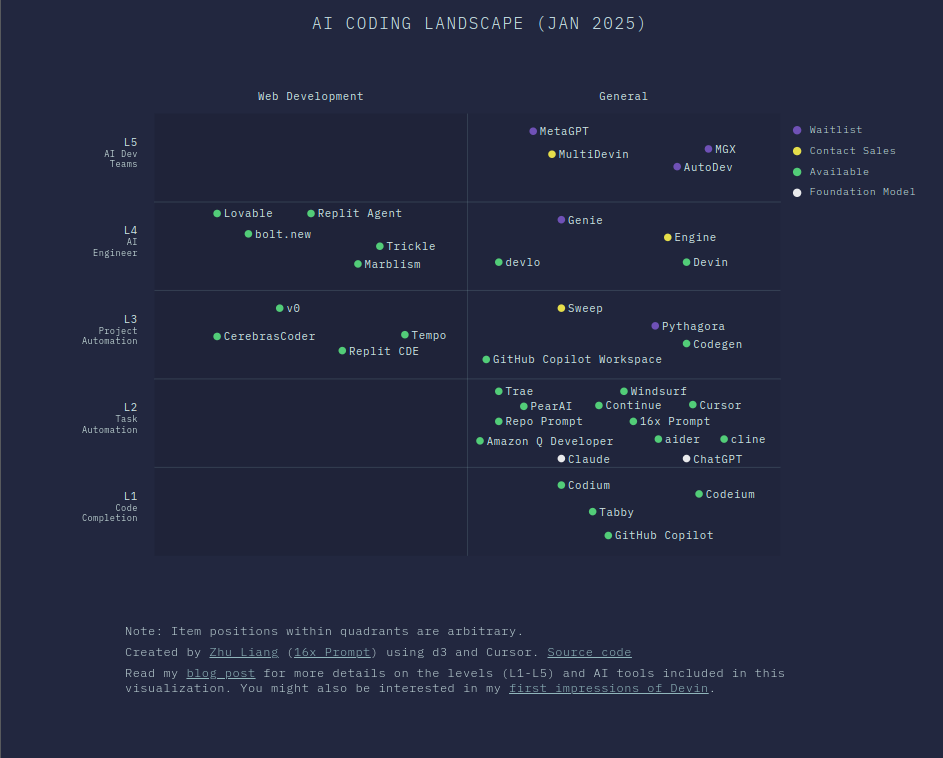

## Etat des lieux de la relation IA / Dev

**Il est difficile d'avoir des sondages représentatifs dans le domaine du développement informatique.**

Un sondage a été mis en place pour "State of AI" qui est dérivé de "State of Web Dev". Il n'est pas forcément représentatif.

https://2025.stateofai.dev

---

**Le résultat du sondage démontre que la majorité des utilisateurs qui se mettent à utiliser des outils IA GEN dans leur workflow trouvent un équilibre de fonctionnement au quotidien.**

https://2025.stateofai.dev/en-US/usage/

On observe une situation inégale selon les profils et les appétences.

- Rejet 
- Simple assistance  
- Outillages plus conséquents  
- Outillage lourd 

---

**On constate que la grande majorité des utilsateurs vont venir corriger le code fourni par l'IA.**

Ce pattern est pour le moment cohérent par rapport aux limites qu'on a vu précédemment.

Il implique d'avoir des outils qui permettent de refactorer du code de manière sécurisée.

---

## L'évolution des IDE 

- 1980 Précurseurs : editeur de texte + compilateur
- 1990 Intégration graphique pour efficacité : debugging, refactoring, syntax hightlighting, autocomplétion
- 2000 Gestion CICD : contrôle de version, tests locaux (linters)
- 2010 Allègement : Eclipse et Netbeans vs. SublimeText, Atom  
- 2020 Versions cloud : collaboration, association avec les autres outils de développement aux environnements de déploiement

**Les outils informatiques du développeur ont constamment évolué dans le sens de l'automation et de l'augmentation de sa capacité.**

Ils intègrent tous des plugins pour s'adapter à différents usages / langages.

Pour une vision globale du nombre potentiel d'IDE sans compter les IDE avec IA sortis récemment.
 
> https://en.wikipedia.org/wiki/Comparison_of_integrated_development_environments

--- 

## Quel est le panorama actuel des IDE en général ? 

**La situation dépend des langages utilisés, mais des tendances se dégagent.**

Références :
- https://pypl.github.io/IDE.html
- https://survey.stackoverflow.co/2023/#section-most-popular-technologies-integrated-development-environment

Par ordre approximatif

- Visual Studio 
- IntelliJ
- Vi/Vim
- Android Studio
- SublimeText
- Notepad++
- Eclipse
- Netbeans
- Emacs
- XCode

**Aujourd'hui, tous ces IDE exposent une capacité à utiliser des outils d'IA via des plugins.**

---

### Panorama des outils (Jan 2025)

---

####  L1 Code-level Completion

**Niveau le plus simple : étant donné un contexte, produit le code d'une fonction** 

Afficher

##### Commercial 
- [GitHub Copilot](https://github.com/features/copilot/)
- [Codium](https://www.codium.ai/)
- [Codeium](https://www.codeium.com/)

#####  OpenSource
- [Tabby](https://tabby.tabbyml.com/)

---

#### L2 Task-level Code Generation

Fournit un encadrement des prompts et une automatisation de la production du code via des outils intégrés.

Ticket to Code 
IDE with Chat	

Afficher

##### Outils d'automatisation 
- [aider](https://aider.chat/)
- [16x Prompt](https://prompt.16x.engineer/)

#####  Extensions IDE 

- [cline](https://github.com/cline/cline)
- [Continue](https://www.continue.dev/)
- [Amazon Q Developer](https://aws.amazon.com/q/developer/)

##### IDE

- [Replit CDE](https://replit.com/cloud-development-environment)
- [Repo Prompt (Mac)](https://repoprompt.com/)
- [PearAI](https://trypear.ai/)
- [Cursor](https://cursor.sh/)
- [Windsurf](https://codeium.com/windsurf)
- [Trae](https://www.trae.ai/)

---

#### L3 Project-level Generation

Automatise la chaîne de production du code, depuis la création des tickets jusqu'à la production du code en passant par la gestion de la codebase.

Ticket to PR  
Prompt to UI	

Afficher

- [Codegen](https://www.codegen.com/)
- [Sweep](https://sweep.dev/)
- [v0](https://v0.dev/)
- [Tempo](https://www.tempolabs.ai/)
- [Replit](https://replit.com/)
- [Pythagora](https://pythagora.ai/)
- [Plandex](https://plandex.ai/)
- [CerebrasCoder](https://cerebrascoder.com/)

##### OpenSource 

- [LlamaCoder](https://llamacoder.together.ai/)

---

#### L4 AI Software Engineer
PRD to Production

Ces outils visent la mise en production complète d'un produit depuis les spécifications jusqu'au déploiement et à la maintenance.

Afficher

##### Commercial 
- [Devin](https://devin.ai/)
- [Devlo](https://devlo.ai/)
- [gru](https://gru.ai/)
- [EngineLabs](https://www.enginelabs.ai/)
- [Factory.ai](https://www.factory.ai/use-cases)
- [Lovable](https://lovable.dev/)
- [Replit Agent](https://replit.com/ai)
- [bolt.new](https://bolt.new/)
- [Trickle](https://www.trickle.so/)
- [Marblism](https://www.marblism.com/)

##### Beta 
- [Tessi](https://www.tessl.io/)
- [Genie](https://cosine.sh/genie)
- [Solver](https://solverai.com/)

---

#### L5 AI Development Teams

On passe à une architecture multi agents qui collaborent entre eux pour créer et gérer des applications avec des rôles différents.

Afficher

##### Open Source 
- [MetaGPT](https://github.com/geekan/MetaGPT)

##### Commercial 
- [MultiDevin](https://docs.devin.ai/working-with-teams/multidevin)
- [MGX ](https://www.deepwisdom.ai/)

##### Recherche 
 
- [AutoGen](https://microsoft.github.io/autogen/stable/)
- [AutoDev](https://arxiv.org/abs/2403.08299v1)

---

## Qu'est-ce qu'on peut projeter ? 

Des outils d'assistance à tous les niveaux

Le développeur dans un rôle augmenté : 
- un manager de robots 
- responsable de produit
- responsable d'exploitation
- responsable des coûts (Finops, usine logicielle)

