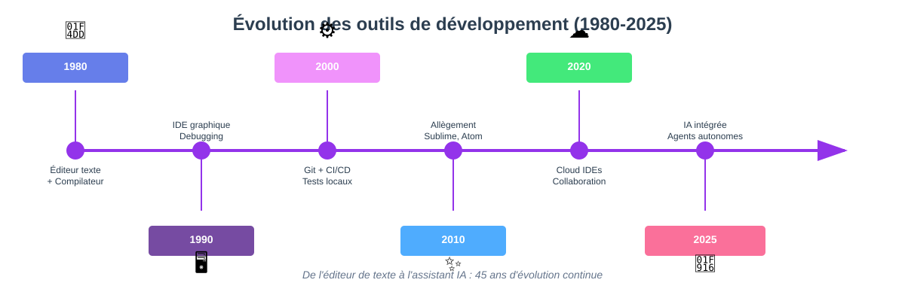
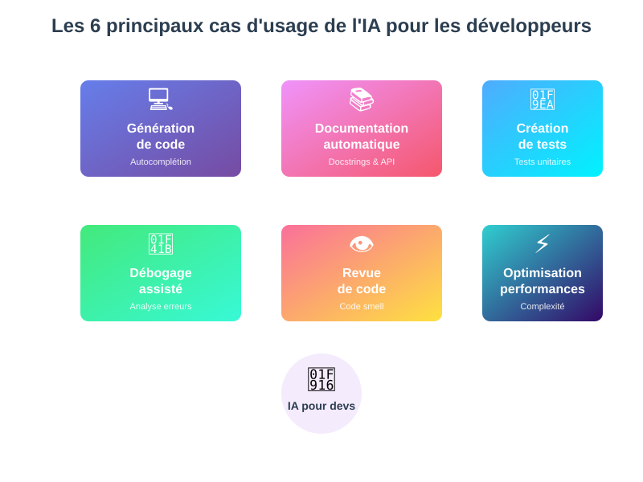

## Quickstart 

Demandez à votre LLM :

```

Interroge moi pour identifier :
- mon rôle dans la chaîne de production informatique ; 
- ma vision personnelle de ce rôle ;
- quelles sont les bonnes pratiques que j'observe.

```

---


## Tendances actuelles de l'IA pour les développeurs

### État des lieux de la relation IA / Dev

**Il est difficile d'avoir des sondages représentatifs dans le domaine du développement informatique.**

Un sondage a été mis en place pour "State of AI" qui est dérivé de "State of Web Dev". Il n'est pas forcément représentatif.

🔗 [State of AI 2025](https://2025.stateofai.dev)

---

**Le résultat du sondage démontre que la majorité des utilisateurs qui se mettent à utiliser des outils IA GEN dans leur workflow trouvent un équilibre de fonctionnement au quotidien.**

🔗 [Statistiques d'usage](https://2025.stateofai.dev/en-US/usage/)

On observe une situation inégale selon les profils et les appétences.

:::info À retenir
La plupart des développeurs qui adoptent l'IA trouvent un équilibre après une période d'adaptation. L'usage varie fortement selon les profils et l'expérience.
:::

---

**On constate que la grande majorité des utilisateurs vont venir corriger le code fourni par l'IA.**

Ce pattern est pour le moment cohérent par rapport aux limites qu'on a vu précédemment.

Il implique d'avoir des outils qui permettent de refactorer du code de manière sécurisée.

---

### L'évolution des outils de développement

**Les outils informatiques du développeur ont constamment évolué dans le sens de l'automation et de l'augmentation de sa capacité.**



- **1980 Précurseurs** : éditeur de texte + compilateur
- **1990 Intégration graphique** : debugging, refactoring, syntax highlighting, autocomplétion
- **2000 Gestion CICD** : contrôle de version, tests locaux (linters)
- **2010 Allègement** : Eclipse et Netbeans vs. SublimeText, Atom
- **2020 Versions cloud** : collaboration, association avec les autres outils de développement et environnements de déploiement
- **2025 IA intégrée** : génération de code, agents autonomes, workflows agentiques

:::tip Perspective historique
Chaque décennie apporte une nouvelle couche d'abstraction et d'automatisation. L'IA en 2025 n'est pas une rupture, mais la continuation naturelle de cette évolution.
:::

---

## Comment les développeurs peuvent-ils utiliser l'IA ?

### Avant de commencer, une expérience

**Si vous n'avez jamais utilisé un LLM pour générer du code, c'est le moment.**

🔗 [Project Euler - Problem 1](https://projecteuler.net/problem=1)

**Consignes :**
1. Allez sur le premier problème du site de Project Euler
2. Copiez le texte de la question dans l'interface de votre choix
3. Lancez l'inférence

---

Que se passe-t-il ?

- Est-ce que le modèle trouve le bon résultat en faisant des maths ?
  Le résultat peut être calculé mathématiquement de manière élégante, et les modèles récents y parviennent.

<details><summary>Montrer</summary>


</details>

- Est-ce qu'il essaie de répondre ou de créer un programme pour y répondre ?
  Le code pour résoudre le problème est particulièrement trivial.

<details><summary>Montrer</summary>

```python
#!/usr/bin/env python3

# Initialize the total sum
total = 0

# Loop through all numbers from 1 to 999
for i in range(1, 1000):
    if i % 3 == 0 or i % 5 == 0:
        total += i

# Print the final result
print(total)
```
</details>

---

### Expérience 1 : traduire via un LLM un texte court

**Nous allons commencer immédiatement avec quelques expériences d'interaction avec des interfaces connectées à des modèles de langage.**

Connectez-vous à l'interface LLM de votre choix : celle de votre poste de travail ou sur le virtual lab.

---

**Traduisez via un LLM le texte court suivant en swahili...**

```
Mignonne, allons voir si la rose
Qui ce matin avait éclose
Sa robe de pourpre au Soleil,
A point perdu cette vesprée
Les plis de sa robe pourprée,
Et son teint au vôtre pareil.
```

---

**... ce qui donne par exemple**

```
Mpenzi wangu, twende tuone kama waridi
Uliyofunika asubuhi hii
Mavazi yake ya zambarau kwa Jua,
Hawajapoteza jioni hii
Mikunjo ya vazi lake la zambarau,
Wala rangi yake inayofanana na yako.
```

**Conclusion : vous ne savez pas si l'IA Gen fait un bon travail si vous n'avez pas l'expertise.**

---

### Expérience 2 : traduire via un LLM un texte long

**Maintenant, faites traduire un texte de plusieurs milliers de mots à un LLM dans une langue de votre choix.**

🔗 Exemples de textes longs :
- [Les Misérables (texte)](https://www.gutenberg.org/cache/epub/59073/pg59073.txt)
- [Voyage au centre de la Terre](https://www.gutenberg.org/ebooks/4772)

**Conclusion : malgré des erreurs, c'est un problème qu'on résoud assez bien désormais, à une vitesse de conversion très élevée.**

---

### Expérience 3 : translitération d'une librairie d'un langage vers un autre

**Considérons le code informatique, et qu'on veuille obtenir via un LLM une traduction d'un langage vers un autre ?**

🔗 [Exemple de script Bash à convertir](https://salsa.debian.org/helmutg/debvm/-/blob/main/bin/debefivm-create?ref_type=heads)

**Procédure :**
1. Prenez le code de la page ci-dessus
2. Copiez le texte
3. Collez-le dans l'interface avec l'instruction suivante :
```text
(... le code collé...)

As a code assistant, you must convert this program to python.
```

---

**Qu'est-ce qui risque de se passer ?**

- Premier avantage du code : c'est instrumentable et exécutable, on va pouvoir tester le résultat.

  La machine peut indiquer si le résultat est correct ou non d'un point de vue syntaxique.

- En revanche il n'y a pas de garantie que le résultat soit conforme aux attentes fonctionnelles.

- De même il n'y a pas de garantie qu'il soit performant ou sécurisé : il peut avoir dégradé le script d'origine.

**Il va falloir qu'on encadre cette production pour s'assurer qu'elle répond aux attentes.**

---

### Leçons des trois expériences

**Ces 3 expériences nous révèlent des insights importants :**

| Expérience | Domaine | Validation possible | Conclusion |
|------------|---------|---------------------|------------|
| **Traduction courte** | Poésie en swahili | ❌ Difficile sans expertise | Confiance aveugle impossible |
| **Traduction longue** | Texte de milliers de mots | ⚠️ Partielle | Rapide mais imparfait |
| **Translitération code** | Bash → Python | ✅ Tests syntaxiques + fonctionnels | Instrumentable et testable |

:::success Principe clé
Le code a un avantage majeur : il est **instrumentable et testable**. La machine peut valider la syntaxe, et nous pouvons créer des tests pour valider le comportement fonctionnel.
:::

---

## Les principaux cas d'usage de l'IA pour les développeurs



### 1. Génération et complétion de code

**L'IA peut générer du code à partir de descriptions en langage naturel.**

Cas d'usage :
- Autocomplétion intelligente
- Génération de fonctions complètes
- Conversion entre langages
- Génération de boilerplate

---

### 2. Documentation automatique

**L'IA peut générer de la documentation à partir du code existant.**

Cas d'usage :
- Commentaires de fonctions (docstrings)
- Documentation d'API
- README et guides d'utilisation
- Diagrammes d'architecture

---

### 3. Création de tests

**L'IA peut générer des tests unitaires, d'intégration et end-to-end.**

Cas d'usage :
- Tests unitaires 
- Tests HTTP
- Test d'acceptance

---

### 4. Débogage et résolution de problèmes

**L'IA peut aider à identifier et corriger les bugs.**

Cas d'usage :
- Analyse de stack traces
- Suggestions de corrections
- Identification de patterns problématiques

---

### 5. Revue de code

**L'IA peut analyser le code pour identifier des problèmes.**

Cas d'usage :
- Détection de code smell
- Vérification de conventions
- Détection de vulnérabilités
- Suggestions d'optimisation

---

### 6. Optimisation des performances

**L'IA peut proposer des améliorations de performances.**

Cas d'usage :
- Analyse de complexité algorithmique
- Optimisation de requêtes SQL
- Identification de goulots d'étranglement
- Suggestions de mise en cache

---

## Qu'est-ce qu'un (bon) développeur ?

**La question n'est pas simple :)**

- Une personne qui sait bien coder ?
- Une personne qui sait bien résoudre des problèmes ?
- Une personne qui travaille bien en équipe ?
- Une personne qui maîtrise un langage de programmation ?
- Une personne qui maîtrise un domaine technique ?
- Une personne qui a beaucoup d'expérience ?
- Une personne qui sait bien utiliser des outils de développement ?
- Une personne qui fournit rapidement des fonctionnalités ?
- Une personne qui fournit du code élégant ?
- Une personne qui sait respecter les contraintes et les besoins ?
- Une personne qui sait innover et anticiper les besoins futurs ?
- Une personne qui documente bien ?
- Une personne qui respecte les normes ?
- Une personne qui fait des programmes performants ?
- Une personne qui fait des programmes qui ont du succès ?

---

**On voit que la définition est très complexe.**

Il faut 

- de l'expérience
- de l'expertise
- de la rigueur
- de l'attention au détail


---

Mais il faut aussi la prise en compte de tout le contexte

- la demande
- l'application
- l'entreprisse
- le temps disponible
- les moyens disponible
- les exigences de performance, de sécurité
- etc.

--- 

**Au final, est-ce que vous avez déjà formalisé votre approche personnelle par rapport au code ?**

C'est ce qu'il va falloir faire avec les outils de l'intelligence artificielle pour parvenir à des résultats professionnels.


