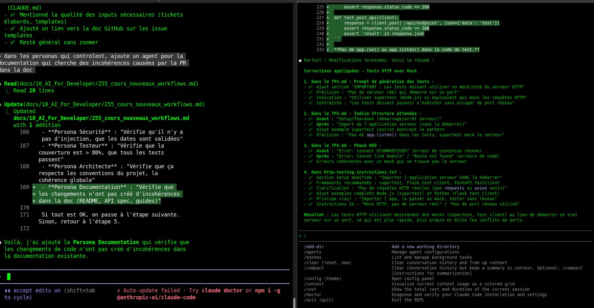

## Quickstart

Suite à la discussion concernant votre rôle dans la chaîne de production informatique, demandez au LLM:

```

Résume la discussion sous forme d'un fichier d'instructions destiné à un assistant chargé d'effectuer mes tâches répétitives.

```

---

## Collaboration IA / Développeur

### Le développeur comme chef d'orchestre

**L'IA Gen commence par être un stagiaire/assistant qu'il faut surveiller.**


Le développeur ne code plus seulement : il devient :
- **Manager de robots** : supervise et corrige les productions de l'IA
- **Architecte** : définit le cadre et les contraintes
- **Validateur** : vérifie la qualité et la conformité
- **Formateur** : améliore les prompts et les règles

:::tip Nouveau paradigme
Le développeur évolue d'un rôle d'exécutant vers un rôle de chef d'orchestre qui coordonne et valide le travail des assistants IA.
:::

---

### Les différents niveaux d'autonomie

**On peut classer l'assistance IA selon le niveau d'autonomie accordé à la machine.**


**Niveau 1 - Assistance ponctuelle** :
- Autocomplétion de code
- Suggestions contextuelles
- Correction syntaxique

**Niveau 2 - Génération guidée** :
- Production de fonctions complètes
- Génération de tests à partir de spécifications
- Documentation automatique

**Niveau 3 - Autonomie surveillée** :
- Implémentation de features complètes
- Refactoring de modules
- Résolution de bugs

**Niveau 4 - Autonomie contrôlée** :
- Développement de bout en bout
- Gestion des Pull Requests en autonomie
- Maintenance du code

:::warning Attention
Plus le niveau d'autonomie est élevé, plus la surveillance et la validation humaine sont critiques. Ne jamais faire confiance aveuglément au niveau 4.
:::

---

### Le pattern correction systématique

**On constate que la grande majorité des utilisateurs vont venir corriger le code fourni par l'IA.**

Ce pattern est cohérent avec l'état actuel des modèles et implique :
- Des outils de refactoring puissants
- Une bonne couverture de tests
- Des compétences solides en lecture de code
- Une capacité d'analyse critique

---

## Intégration dans les environnements de travail existants

### Panorama des IDE

**La situation dépend des langages utilisés, mais des tendances se dégagent.**

🔗 Références :
- [PYPL IDE Index](https://pypl.github.io/IDE.html)
- [Stack Overflow Survey 2023](https://survey.stackoverflow.co/2023/#section-most-popular-technologies-integrated-development-environment)

Par ordre approximatif :

- Visual Studio
- IntelliJ
- Vi/Vim
- Android Studio
- SublimeText
- Notepad++
- Eclipse
- Netbeans
- Emacs
- XCode

--- 

**Aujourd'hui, tous ces IDE exposent une capacité à utiliser des outils d'IA via des plugins.**

- Copilot
- Claude
- ProxyAI (Intellij)
- etc.


---

**Tous ces plugins commencent à offrir les mêmes fonctionnalités**

- Accès à des LLM via un compte dédié ou les API des fournisseurs*
- Autocomplétion : la base depuis Copilot
- Fenêtre de chat : intégration du chatbot dans l'IDE
- Mode Agentique : intégration dans le système et l'outillage

---

**Aujourd'hui, les agents les plus évolués sont ceux qui intègrent "le mode agentique"**

Cela signifie qu'ils vont passer :

- d'une suite d'interactions humain-machine à une boucle de la machine qui va s'auto alimenter
- d'une mise à disposition d'outils destinés à "augmenter" la machine


---

## Les nouvelless IHM CodeGen

### Les IDE spécialisés

**De nouvelles solutions d'IDE avec des fonctionnalités d'IA Générative ont émergé depuis quelques années**


---

**La différence avec un IDE équipé d'un bon plugin n'est pas toujours apparente.**

En effet les plugins de VSCode ou PyCharm ont accès à des capacités étendues.

Et le coût de développement d'un nouvel IDE extensible et efficient explique que tout le monde utilise la base opensource de VSCode.

Par exemple, la solution Codium a évolué dnas un sens IA alors qu'à l'origine c'était un simple forl de VSCode.

--- 

**Parmi les exceptions, l'IDE Zed est un nouveau développement basé sur le langage Rust qui intègre le mode agentique.**

Mais si vous voulez faire du python... vous risquez de ne pas trouver ça compétitif avec PyCharm.

---

### Le retour du terminal 

**Claude Code est une solution très populaire pour le développement IA Gen fin 2025.**

Elle permet d'interagir avec les agents en mode "texte" / REPL, et supporte un fonctionnement via des commandes.


```shell

  /add-dir                           Add a new working directory
  /agents                            Manage agent configurations
  /bashes                            List and manage background tasks
  /clear (reset, new)                Clear conversation history and free up context
  /compact                           Clear conversation history but keep a summary in context. Optional: /compact
                                     [instructions for summarization]
  /config (theme)                    Open config panel
  /context                           Visualize current context usage as a colored grid
  /cost                              Show the total cost and duration of the current session
  /doctor                            Diagnose and verify your Claude Code installation and settings
  /exit (quit)                       Exit the REPL
```

---

**Les terminaux encouragent une expérience "en profondeur" et permettent de gérer plusieurs tâches en parralèle.**



---

**Par exemple dans un terminal, je travaille sur un nouveau projet pendant que dans l'autre je corrige un bug applicatif.**

Je peux associer mon IDE à Claude Code, et ouvrir un terminal à côté pour surveiller les actions. 

Mais le design rend la solution plus addictive et fait entrer dans une boucle intensive d'échanges.

--- 

**Attention à la consommation de tokens.**

Claude Code --tout comme copilot-cli qui suit dans ses pas-- vous affiche la quantité de tokens consommées sur votre quota.

En effet il n'est pas rare que les utilisateurs saturent rapidement leur quota...


---

## Impact sur le rôle du développeur


### Compétences émergentes

**Les compétences nécessaires évoluent :**


- **Prompt engineering** : savoir communiquer avec l'IA
- **Architecture** : vision d'ensemble et conception de systèmes
- **Validation** : capacité à évaluer rapidement du code
- **Sécurité** : détection des vulnérabilités dans le code généré
- **Éthique** : comprendre les implications de l'usage de l'IA

:::success Compétences clés
Ces 5 compétences forment le socle du développeur augmenté par l'IA. Elles complètent les compétences traditionnelles sans les remplacer.
:::

---

### Le développeur de demain

**Le développeur ne disparaît pas : il évolue.**

Les tâches répétitives et de bas niveau sont automatisées.

Les compétences de haut niveau deviennent encore plus cruciales :
- Compréhension du domaine métier
- Capacité de conception architecturale
- Jugement critique
- Communication et collaboration
- Apprentissage continu

---

## Qu'est-ce qu'on peut projeter ?

**Des outils d'assistance à tous les niveaux**

Le développeur dans un rôle augmenté :
- Un manager de robots
- Responsable de produit
- Responsable d'exploitation
- Responsable des coûts (Finops, usine logicielle)

---

## L'IA pour les développeurs : quelle est votre vision ?  


---


:::tip Prochaine étape
Dans le module suivant, nous verrons concrètement **l'assistance à la génération de code** avec les outils et techniques pratiques.
:::
