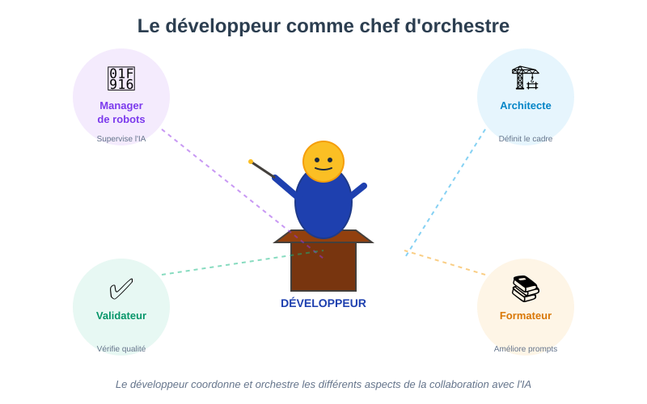
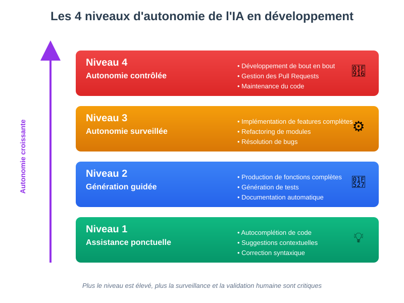
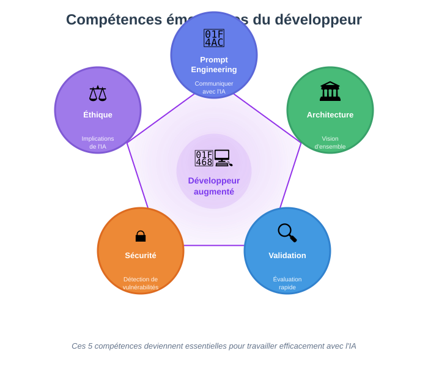

## Collaboration IA / Développeur

### Le développeur comme chef d'orchestre

**L'IA Gen commence par être un stagiaire/assistant qu'il faut surveiller.**

Le développeur ne code plus seulement : il devient :
- **Manager de robots** : supervise et corrige les productions de l'IA
- **Architecte** : définit le cadre et les contraintes
- **Validateur** : vérifie la qualité et la conformité
- **Formateur** : améliore les prompts et les règles

:::tip Nouveau paradigme
Le développeur évolue d'un rôle d'exécutant vers un rôle de chef d'orchestre qui coordonne et valide le travail des assistants IA.
:::

---

### Les différents niveaux d'autonomie

**On peut classer l'assistance IA selon le niveau d'autonomie accordé à la machine.**

**Niveau 1 - Assistance ponctuelle** :
- Autocomplétion de code
- Suggestions contextuelles
- Correction syntaxique

**Niveau 2 - Génération guidée** :
- Production de fonctions complètes
- Génération de tests à partir de spécifications
- Documentation automatique

**Niveau 3 - Autonomie surveillée** :
- Implémentation de features complètes
- Refactoring de modules
- Résolution de bugs

**Niveau 4 - Autonomie contrôlée** :
- Développement de bout en bout
- Gestion des Pull Requests en autonomie
- Maintenance du code

:::warning Attention
Plus le niveau d'autonomie est élevé, plus la surveillance et la validation humaine sont critiques. Ne jamais faire confiance aveuglément au niveau 4.
:::

---

### Le pattern correction systématique

**On constate que la grande majorité des utilisateurs vont venir corriger le code fourni par l'IA.**

Ce pattern est cohérent avec l'état actuel des modèles et implique :
- Des outils de refactoring puissants
- Une bonne couverture de tests
- Des compétences solides en lecture de code
- Une capacité d'analyse critique

---

## Intégration dans les environnements de travail existants

### Panorama des IDE

**La situation dépend des langages utilisés, mais des tendances se dégagent.**

🔗 Références :
- [PYPL IDE Index](https://pypl.github.io/IDE.html)
- [Stack Overflow Survey 2023](https://survey.stackoverflow.co/2023/#section-most-popular-technologies-integrated-development-environment)

Par ordre approximatif :

- Visual Studio
- IntelliJ
- Vi/Vim
- Android Studio
- SublimeText
- Notepad++
- Eclipse
- Netbeans
- Emacs
- XCode

**Aujourd'hui, tous ces IDE exposent une capacité à utiliser des outils d'IA via des plugins.**

---

## Impact sur le rôle du développeur

### Nouvelles responsabilités

**Le développeur dans un rôle augmenté devient :**
- Un manager de robots
- Un responsable de produit
- Un responsable d'exploitation
- Un responsable des coûts (Finops, usine logicielle)

---

### Compétences émergentes

**Les compétences nécessaires évoluent :**

- **Prompt engineering** : savoir communiquer avec l'IA
- **Architecture** : vision d'ensemble et conception de systèmes
- **Validation** : capacité à évaluer rapidement du code
- **Sécurité** : détection des vulnérabilités dans le code généré
- **Éthique** : comprendre les implications de l'usage de l'IA

:::success Compétences clés
Ces 5 compétences forment le socle du développeur augmenté par l'IA. Elles complètent les compétences traditionnelles sans les remplacer.
:::

---

### Le développeur de demain

**Le développeur ne disparaît pas : il évolue.**

Les tâches répétitives et de bas niveau sont automatisées.

Les compétences de haut niveau deviennent encore plus cruciales :
- Compréhension du domaine métier
- Capacité de conception architecturale
- Jugement critique
- Communication et collaboration
- Apprentissage continu

---

## Qu'est-ce qu'on peut projeter ?

**Des outils d'assistance à tous les niveaux**

Le développeur dans un rôle augmenté :
- Un manager de robots
- Responsable de produit
- Responsable d'exploitation
- Responsable des coûts (Finops, usine logicielle)

---

## L'IA pour les développeurs : quelle est votre vision ?  

---

## Qu'est-ce qu'un (bon) développeur ? 

**La question n'est pas simple :)**

- Une personne qui sait bien coder ?
- Une personne qui sait bien résoudre des problèmes ?
- Une personne qui travaille bien en équipe ? 
- Une personne qui maîtrise un langage de programmation ?
- Une personne qui maîtrise un domaine technique ?
- Une personne qui a beaucoup d'expérience ?
- Une personne qui sait bien utiliser des outils de développement ? 
- Une personne qui fournit rapidement des fonctionnalités ? 
- Une personne qui fournit du code élégant ?
- Une personne qui sait respecter les contraintes et les besoins ?
- Une personne qui sait innover et anticiper les besoins futurs ?
- Une personne qui documente bien ?
- Une personne qui respecte les normes ?
- Une personne qui fait des programmes performants ? 
- Une personne qui fait des programmes qui ont du succès ? 

--- 

:::tip Prochaine étape
Dans le module suivant, nous verrons concrètement **l'assistance à la génération de code** avec les outils et techniques pratiques.
:::
