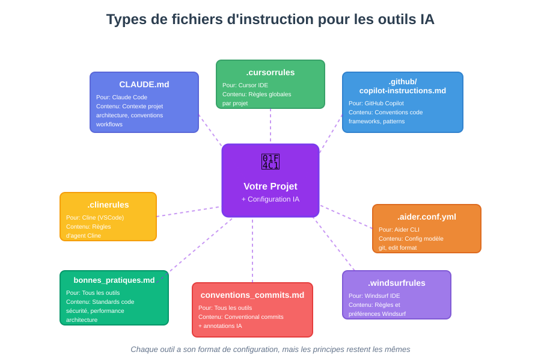
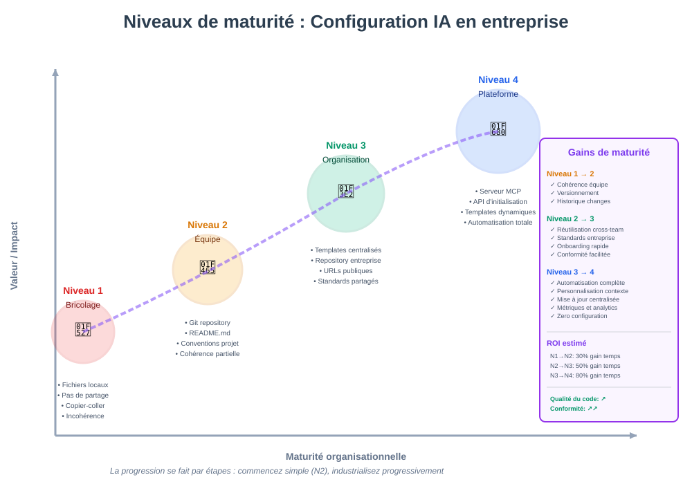
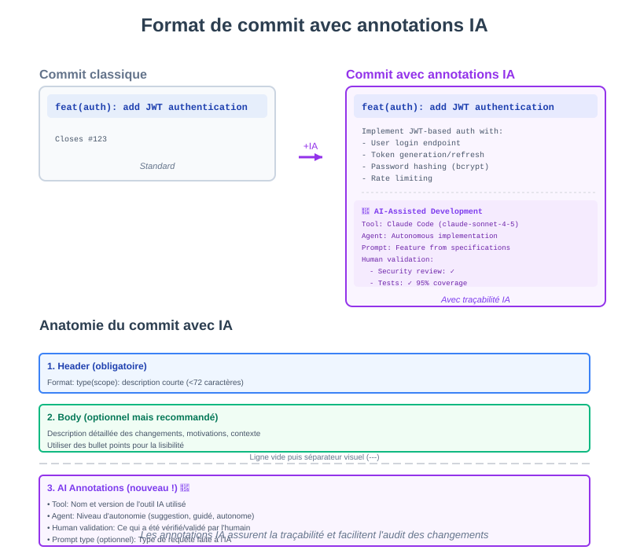

## De l'usage par défaut à la configuration professionnelle

### Pourquoi configurer les outils IA ?

**Utiliser l'IA sans configuration, c'est comme conduire une voiture sans régler le siège et les rétroviseurs : ça fonctionne, mais ce n'est ni confortable ni optimal.**

Sans configuration :
- ❌ Réponses génériques et contexte manquant
- ❌ Styles de code incohérents
- ❌ Pas de respect des conventions du projet
- ❌ Pas de traçabilité des contributions IA
- ❌ Répétition des mêmes instructions

Avec une bonne configuration :
- ✅ Réponses adaptées au contexte du projet
- ✅ Respect automatique des conventions
- ✅ Traçabilité complète des interventions IA
- ✅ Gain de temps et cohérence
- ✅ Collaboration d'équipe facilitée

:::tip Passage à l'échelle
La configuration est ce qui permet de passer d'une utilisation individuelle et ponctuelle à une utilisation professionnelle et d'équipe.
:::

---

## Les différents fichiers d'instruction



**Chaque outil IA a son propre format de configuration, mais les principes restent les mêmes.**

---

## Ressources officielles et communautaires

### Documentation officielle des outils

| Outil | Documentation |
|-------|---------------|-----------|
| **Claude Code** | [docs.claude.com/claude-code](https://docs.claude.com/en/docs/claude-code/overview)|
| **Cursor** | [docs.cursor.com/context/rules-for-ai](https://docs.cursor.com/context/rules-for-ai) |
| **GitHub Copilot** | [docs.github.com/en/copilot/tutorials/use-custom-instructions](https://docs.github.com/en/copilot/tutorials/use-custom-instructions) |

### Listes communautaires "Awesome"

**Collections d'outils et de ressources :**

- **[sourcegraph/awesome-code-ai](https://github.com/sourcegraph/awesome-code-ai)** - Liste complète d'outils IA pour le code (assistants, complétion, refactoring)
- **[ai-for-developers/awesome-ai-coding-tools](https://github.com/ai-for-developers/awesome-ai-coding-tools)** - Liste curatée d'outils de développement assistés par IA
- **[dremeika/awesome-coding-assistants](https://github.com/dremeika/awesome-coding-assistants)** - Liste des assistants de codage et ressources associées
- **[jamesmurdza/awesome-ai-devtools](https://github.com/jamesmurdza/awesome-ai-devtools)** - Outils de développement alimentés par l'IA

**Collections de configurations :**

- **[cursor.directory](https://cursor.directory)** - Répertoire communautaire de règles Cursor
- **[PatrickJS/awesome-cursorrules](https://github.com/PatrickJS/awesome-cursorrules)** - Fichiers de configuration pour Cursor IDE
- **[github/awesome-copilot](https://github.com/github/awesome-copilot)** - Instructions et configurations communautaires pour GitHub Copilot

:::tip Communauté active
Ces listes sont maintenues activement par la communauté et contiennent des exemples concrets de configurations et d'usages pour tous les outils populaires.
:::

---

### 1. CLAUDE.md (Claude Code / Claude)

**Objectif :** Fournir le contexte complet du projet à Claude

**Emplacement :** Racine du projet : `/CLAUDE.md`

**Structure de base :**

```markdown
# Nom du Projet

## Vue d'ensemble
[Description en 2-3 phrases du projet, son objectif, son état]

## Architecture
### Stack technique
- Backend: [Framework et version]
- Base de données: [Type et version]
- Frontend: [Framework et bibliothèques]
- Tests: [Outils de tests]

### Structure du projet
[Arborescence avec description de chaque dossier]

## Conventions de code
### Style [Langage]
- Règles de formatage et style
- Conventions de nommage
- Organisation des imports

### Conventions de commits
[Format et règles des messages de commit]

### Standards de sécurité
- Validation des entrées
- Protection contre injections
- Gestion des secrets

## Workflows
### Développement d'une nouvelle feature
[Étapes du processus de développement]

### Débogage
[Comment fournir le contexte pour le débogage]

## Dépendances
[Règles d'ajout et maintenance des dépendances]

## Personas
[Rôles à adopter selon le contexte : Architecte, Sécurité, Performance, Testeur]

## Ressources
[Liens vers documentation interne]
```

**📥 Exemple complet :** [Télécharger CLAUDE.MD](./examples/CLAUDE.txt)

**Documentation :** [docs.claude.com/claude-code](https://docs.claude.com/en/docs/claude-code/overview)

:::info Évolution du CLAUDE.md
Ce fichier doit évoluer avec le projet. Le mettre à jour régulièrement est aussi important que de le créer.
:::

---

### 2. .cursorrules (Cursor IDE)

**Objectif :** Définir les règles de comportement de Cursor

**Emplacement :** Racine du projet : `/.cursorrules`

**Structure de base :**

```
# Cursor Rules for [Nom du Projet]

## General Guidelines
- Définir le persona (expert en quel langage/framework)
- Règles "Always" et "Never"

## Code Style
- Standards de formatage
- Conventions de nommage
- Organisation des imports

## Testing
- Framework de tests
- Couverture minimale
- Approche (TDD, AAA pattern)

## Security
- Validation des entrées
- Protection contre injections
- Gestion des secrets

## Commit Messages
- Format Conventional Commits
- Template avec annotations IA

## Documentation
- Standards de documentation

## File Organization
- Structure des dossiers

## Dependencies
- Critères d'ajout

## Error Handling
- Patterns de gestion d'erreurs
```

**📥 Exemple complet :** [Télécharger cursorrules.txt](./examples/cursorrules.txt)

**Documentation :** [docs.cursor.com/context/rules-for-ai](https://docs.cursor.com/context/rules-for-ai)

---

### 3. .github/copilot-instructions.md (GitHub Copilot)

**Objectif :** Instructions spécifiques pour GitHub Copilot au niveau du repository

**Emplacement :** `/.github/copilot-instructions.md`

**Structure de base :**

```markdown
# GitHub Copilot Instructions

## Project Context
- Description du projet et technologies principales

## Code Conventions
### TypeScript / Langage principal
- Règles de TypeScript strict
- Types et interfaces

### Naming
- Conventions de nommage par type d'élément

### Import Paths
- Utilisation d'alias d'imports

## Framework-Specific
- Patterns spécifiques au framework utilisé
- Exemples de code

## Testing
- Framework de tests
- Patterns de tests (AAA, mocking)
- Exemples concrets

## Security
- Règles de sécurité pour auth, passwords, SQL, API keys

## Error Handling
- Patterns de gestion d'erreurs

## Commit Messages
- Format avec annotations IA
```

**📥 Exemple complet :** [Télécharger copilot-instructions.md](./examples/copilot-instructions.md)

**Documentation :** [docs.github.com/copilot](https://docs.github.com/en/copilot)

---

## Architecture recommandée : fichiers partagés

:::tip Principe DRY pour les configurations IA
**Ne dupliquez pas vos règles !** Avoir des conventions dans CLAUDE.md, .cursorrules ET .github/copilot-instructions.md serait idiot et contre-productif.
:::

### L'approche intelligente : centraliser dans `/docs`

**Problème :** Dupliquer les mêmes règles dans 3+ fichiers = maintenance cauchemardesque

**Solution :** Créer des fichiers thématiques dans `/docs` et y faire référence

```
/docs
  /conventions_commits.md      # Format des commits avec annotations IA
  /bonnes_pratiques.md         # Standards de code, sécurité, performance
  /personas.md                 # Rôles à adopter selon le contexte
  /architecture_decisions.md   # ADR (Architecture Decision Records)
  /security_checklist.md       # Checklist sécurité obligatoire
  /testing_guide.md            # Standards de tests
```

### Comment ça fonctionne : économie de tokens

**Le principe :** Les agents IA autonomes lisent uniquement les fichiers pertinents au contexte.

**Exemple avec Claude Code :**

```markdown
# CLAUDE.md

## Vue d'ensemble
[Description du projet...]

## Conventions et règles

**Avant de commencer, lis les fichiers suivants selon le contexte :**

- **Commits et Git :** `/docs/conventions_commits.md`
- **Standards de code :** `/docs/bonnes_pratiques.md`
- **Sécurité :** `/docs/security_checklist.md`
- **Architecture :** `/docs/architecture_decisions.md`
- **Tests :** `/docs/testing_guide.md`
- **Personas :** `/docs/personas.md`

**Stratégie de lecture :**
- Pour un commit → Lis `conventions_commits.md`
- Pour du code sensible → Lis `security_checklist.md` et `bonnes_pratiques.md`
- Pour une nouvelle feature → Lis `architecture_decisions.md` et `personas.md`
- Pour des tests → Lis `testing_guide.md`

Ne charge PAS tous les fichiers systématiquement. Utilise ton jugement pour lire uniquement ce qui est pertinent.
```


---

## Bonnes pratiques au niveau entreprise

### Le défi : du chaos individuel à la cohérence organisationnelle

**Problématique :** Imaginez 50 développeurs dans 10 équipes utilisant des outils IA sans coordination.

❌ **Résultat sans stratégie :**
- Chaque développeur crée ses propres configurations locales
- Duplication 
- Incohérence 
- Perte de temps 
- Risque : pratiques non conformes, vulnérabilités non détectées

✅ **Résultat avec stratégie entreprise :**
- Standards partagés et maintenus centralement
- Onboarding : 1 jour pour être productif avec l'IA
- Conformité : règles de sécurité appliquées automatiquement
- Cohérence : même qualité de code IA dans toute l'entreprise
- Gains mesurables : 60-80% de temps économisé sur la configuration

### Niveaux de maturité : progression vers l'industrialisation



---

## Premier cas d'usage : Configuration des commits



---

### Conventional Commits : un standard universel

**Les [Conventional Commits](https://www.conventionalcommits.org/en/v1.0.0/#summary) sont un effort de standardisation des bonnes pratiques de construction de messages pour git.**

Premier intérêt : la lisibilité. 

Deuxième intérêt : automatisation. Associés au Semantic Versioning, les Conventional commits sont très naturellement intégrables.

| Message   | Nature | Versioning |
|-----------|--------|------------|
| Fix:      | Patch  | 0.0.x      | 
| Feat:     | Minor  | 0.x.0      | 
| Breaking! | Major  | x.0.0      | 

---


**Format de base :**

```text
<type>(<scope>): <description courte> (<72 caractères)

[Corps optionnel avec explication détaillée]

[Footer optionnel : Closes #123, Breaking change, etc.]
```

**Types standards :**

| Type | Description | Exemple |
|------|-------------|---------|
| `feat` | Nouvelle fonctionnalité | `feat(auth): add OAuth2 support` |
| `fix` | Correction de bug | `fix(api): handle null user in GET /profile` |
| `docs` | Documentation uniquement | `docs(readme): update installation steps` |
| `style` | Formatage (pas de changement logique) | `style(api): format with prettier` |
| `refactor` | Refactoring sans changement fonctionnel | `refactor(db): extract query builder` |
| `perf` | Amélioration de performance | `perf(api): add caching layer` |
| `test` | Ajout ou modification de tests | `test(user): add edge cases for validation` |
| `build` | Système de build | `build(deps): upgrade to node 20` |
| `ci` | Intégration continue | `ci(github): add security scanning` |
| `chore` | Maintenance | `chore(deps): update dependencies` |

---

### For AI-assisted commits

**Une bonne pratique pour la gestion à long terme consiste à annoter les commits avec l'outil et les modèles utilisés.**

Ceci permettra a posteriori d'avoir une visibilité sur leur part du travail et de réagir en cas de vulnérabilités. 

```text
type(scope): (emoji) short description

[Detailed body explaining what and why]

---
🤖 AI-Assisted Development
Tool: [Tool name + version]
Agent: [Suggestion | Guided | Autonomous]
Prompt type: [What kind of request]
Context files: [Files provided to AI]
Human validation:
  - Security review: [✓/✗ Status]
  - Tests: [✓/✗ Coverage %]
  - Code review: [✓/✗ Status]
````

---

### Configuration dans les outils

**Intégration dans CLAUDE.md :**

````markdown
# File: commit.instructions.md

1. All commits must follow Conventional Commits format.
   - Description: "type(scope): (emoji) short description"
   - Body: Use no emoji, use bullet points, be as terse as possible
   - Footer: Include closed JIRA ticket in agent-managed workflows.
2. Only commit using a real username and email.
   - Check: `[[ -n "$( git config user.name )" ]] && [[ -n "$( git config user.email )" ]] && echo "OK, Continue" || echo "Ask the user to fix name and email"`
3. For AI-assisted work, add the following footer:

```text
---
🤖 AI-Assisted Development
Tool: [tool name and version]
Agent: [level of autonomy]
Human validation: [what was verified]
```

This ensures transparency and traceability of AI contributions.

Look for examples in /docs/commit-examples.md
````

---

## Des instructions de toutes sortes

### Les bonnes pratiques du projet

**Fichier `/docs/bonnes_pratiques.md` :**

````markdown
# Bonnes Pratiques du Projet

## Sécurité

### Priorité absolue
Tout code manipulant des données sensibles doit être :
1. Validé en entrée
2. Sécurisé contre les injections
3. Loggé (sans les données sensibles)
4. Testé avec des cas malveillants

### Checklist sécurité
- [ ] Validation des entrées utilisateur
- [ ] Protection SQL injection (requêtes paramétrées)
- [ ] Protection XSS (échappement HTML)
- [ ] Authentification sur endpoints privés
- [ ] Rate limiting sur endpoints publics
- [ ] HTTPS uniquement en production
- [ ] Pas de secrets en dur dans le code

## Performance

### Requêtes base de données
- Toujours paginer les listes (max 100 items)
- Utiliser les index pour les champs fréquemment filtrés
- Éviter les N+1 queries (utiliser JOIN ou dataloader)
- Mettre en cache les données peu changeantes

### API
- Timeout de 30s maximum
- Compression gzip activée
- Cache HTTP pour ressources statiques
- CDN pour assets

## Tests

### Couverture minimale
- Code critique : 95%
- Code standard : 80%
- Code utilitaire : 90%

### Types de tests
- Unit tests : Toute fonction > 5 lignes
- Integration tests : Tous les endpoints API
- E2E tests : Parcours utilisateur principaux

## Code Quality

### Métriques
- Complexité cyclomatique < 10
- Pas de fonctions > 50 lignes
- Pas de fichiers > 300 lignes
- Pas de duplication > 3 occurrences

### Review
- Obligatoire avant merge
- Au moins 1 approbation
- Tous les commentaires résolus
````

**Fichier `/docs/architecture_decisions.md` (ADR) :**

````markdown
# Architecture Decision Records

## ADR-001: Utiliser PostgreSQL plutôt que MongoDB

**Date**: 2025-01-15
**Statut**: Accepté
**Décideurs**: Équipe technique

### Contexte
Besoin d'une base de données pour stocker utilisateurs, transactions, et relations.

### Décision
Utiliser PostgreSQL comme base de données principale.

### Conséquences
**Positives:**
- Relations structurées
- Transactions ACID
- Requêtes complexes efficaces
- Maturité et stabilité

**Négatives:**
- Moins flexible pour données non structurées
- Scaling horizontal plus complexe

### Alternatives considérées
- MongoDB : écarté car besoin de relations fortes
- MySQL : écarté car fonctionnalités JSON PostgreSQL supérieures

---

## ADR-002: Architecture hexagonale (Ports & Adapters)

**Date**: 2025-01-20
**Statut**: Accepté

### Décision
Structurer le code selon l'architecture hexagonale.

**Structure:**
```
/domain      - Logique métier pure
/application - Use cases
/infrastructure - Implémentations (DB, API, etc.)
```

**Bénéfices:**
- Testabilité accrue
- Découplage fort
- Facilite changement d'infra
````

---

## Templates et exemples

### Template CLAUDE.md minimal

````markdown
# [Nom du Projet]

## Vue d'ensemble
[Description en 2-3 phrases]

## Stack technique
- [Technologies principales]

## Structure du projet
[Arborescence ou description]

## Conventions de code
[Règles de style et nommage]

## Personas
[Rôles à adopter selon contexte]

## Liens utiles
- Documentation: [lien]
- Issues: [lien]
````

### Template .cursorrules minimal

```
# Cursor Rules

You are a [langage] developer working on [type de projet].

## Code Style
- [règle 1]
- [règle 2]

## Testing
- [approche de test]

## Commit Messages
Use Conventional Commits with AI annotations.
```

### Template conventions_commits.md

````markdown
# Conventions de Commits

## Format

```text
type(scope): description

[body]

---
🤖 AI-Assisted Development
Tool: [outil]
Agent: [niveau autonomie]
Human validation: [ce qui a été vérifié]
```

## Types
- feat: Nouvelle fonctionnalité
- fix: Correction de bug
- docs: Documentation
- refactor: Refactoring
- test: Tests

## Exemples
[Exemples concrets]
````
