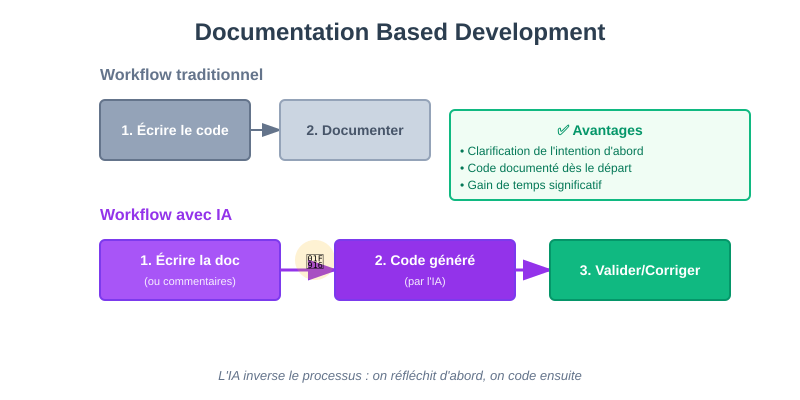

## Quickstart

Demandez à votre outil de code IDE :

```text

<contexte>
L'application doit afficher une page HTML statique.
La page statis fait un appel AJAX à une méthode GET /time de l'application doit retourner l'heure du serveur.
Le résultat de la requête est affiché dans la page statique.
Utilise la librairie jQuery pour l'appel AJAX.
Gère les erreurs potentielles de l'appel AJAX. 
</contexte>
<task>
1. Ecris le code d'une application Python Flask dont les fonctionnalités sont définies dans le contexte
2. Ecris le Dockerfile qui permet de charger les dépendances et lancer l'application  
3. Ecris la documentation README.md du projet incluant la commande pour build et lancer l'application via Docker.
</task>
```

---

## Piloter l'IA pour le code

### Documentation Based Development

**Le premier pattern de Copilot était d'écrire la documentation de la fonction pour obtenir le code résultant du prompt.**




---

**On voit là une inversion de situation où la documentation est écrite avant le code.**

:::tip Nouveau paradigme
Avec l'IA, on réfléchit et documente d'abord, puis le code est généré. C'est l'inverse du workflow traditionnel.
:::

---

**Écrire les commentaires sous forme de pseudo-code permet de définir le squelette d'un script.**

```text
# Read pattern from input variable #1
# Read file name from input variable #2
# Panic exit if missing parameters
# Convert to absolute file name
# Check the file exists, panic exit if not
# Search for the pattern in the file
  # For each search hit, accumulate the line in a variable and increment a counter
# Print the total number of hits and the matching lines
```
--- 

**Ce mode de fonctionnement est compatible avec l'IA Gen.** 

Il définira un plan fonctionnelle que votre modèle LLM pourra suivre. 

Pour autant il ne suffira pas : quel langage ? quels standards de code ? Etc.

---

### Autocomplétion intelligente

**L'autocomplétion évolue de la simple suggestion de noms vers la génération de blocs complets.**

Les modèles analysent :
- Le contexte du fichier
- Les imports et dépendances
- Les patterns du projet
- Le style de code existant

Et proposent des complétions cohérentes avec l'ensemble.

---

### Le prompt engineering pour le code

**Savoir communiquer avec l'IA est essentiel pour obtenir du bon code.**

Quelques bases du prompt engineering :

**Être précis et explicite** :
```text
Mauvais : "Crée une fonction pour trier"
Bon : "Crée une fonction Python qui trie une liste d'entiers en ordre croissant,
gère les listes vides et lève TypeError si l'entrée n'est pas une liste"
```

**Fournir du contexte** :
```text
<contexte>
Framework : Flask
Base de données : PostgreSQL avec SQLAlchemy
Authentication : JWT
</contexte>

<task>
Crée une route API pour récupérer la liste des utilisateurs avec pagination
</task>
```

**Utiliser des templates** :
```text
<template>
def function_name(param: type) -> return_type:
    """Brief description.

    Args:
        param: Description

    Returns:
        Description with example
    """
    # Implementation
</template>
```
## Du générique au spécifique

### Le problème : les instructions générales ne suffisent pas

L'IA doit comprendre :
- Votre **langage et version spécifique** (Python 3.11? Node.js 20?)
- Votre **framework et ses patterns** (Django ORM? FastAPI async?)
- Votre **architecture** (hexagonale? layered? MVC?)
- Vos **patterns locaux** (comment vous gérez les erreurs, les logs, les configs)
- Votre **structure de dossiers** et conventions de nommage
- Vos **services tiers** et comment les intégrer
- Votre **approche des tests** (TDD? BDD? Fixtures?)

:::tip Spécificité = Qualité
Plus vos instructions sont spécifiques à VOTRE stack, mieux l'IA génère du code conforme.
:::

---

## Exemple 1 : Instruire l'IA sur votre langage et framework

### Stack : Python + FastAPI + SQLAlchemy

**Voir l'exemple détaillé :** [220_fastapi_sqlalchemy.md](./examples/220_fastapi_sqlalchemy.md)

**Résultat :** L'IA génère du code FastAPI/SQLAlchemy conforme à VOS patterns, pas du code générique.

---

### Stack : Node.js + Express + TypeScript

**Voir l'exemple détaillé :** [220_express_typescript.md](./examples/220_express_typescript.md)

---

## Exemple 2 : Architecture et patterns locaux

### Hexagonal Architecture (Ports & Adapters)

**Voir l'exemple détaillé :** [220_hexagonal_architecture.md](./examples/220_hexagonal_architecture.md)

---

### Clean Architecture

**Variante avec couches strictes :**

```markdown
# Architecture : Clean Architecture

## Couches (du cœur vers l'extérieur)

1. **Entities** (cœur) : Rules métier universelles
2. **Use Cases** : Rules métier applicatives, orchestration
3. **Interface Adapters** : Controllers, Presenters, Gateways
4. **Frameworks & Drivers** : DB, Web, UI

## Mapping pour FastAPI

```
src/
  /entities              # User, Order
  /use_cases             # CreateUserUseCase
  /interface_adapters
    /presenters          # UserPresenter (format réponse)
    /controllers         # UserController
    /gateways            # UserGateway (interface vers persistence)
  /frameworks
    /fastapi             # main.py, routes
    /database            # SQLAlchemy models, migrations
```

## Dépendances = Une seule direction

```
Frameworks & Drivers → Interface Adapters → Use Cases → Entities
         (dépend de)   (dépend de)    (dépend de)
```

**Jamais de boucle, jamais de dépendance vers le haut.**
```

---

## Exemple 3 : Services et intégrations externes

### Intégrations standard : pattern Adapter

**Voir l'exemple détaillé :** [220_services_adapter_pattern.md](./examples/220_services_adapter_pattern.md)
```

---

## Exemple 4 : Gestion des erreurs, logging et configuration

**Voir l'exemple détaillé :** [220_errors_logging_config.md](./examples/220_errors_logging_config.md)

---
