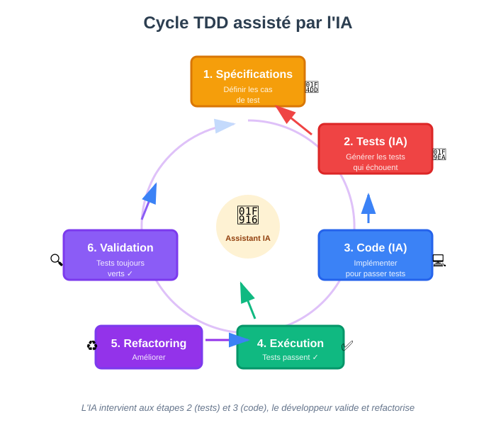

## Automatiser la création de ses tests unitaires

### Quickstart

Utilisez l'outil de votre choix pour exécuter le prompt suivant.

Choisissez un fichier de code à tester.

Exemple PHP : [AlternC](https://github.com/AlternC/AlternC/blob/main/bureau/class/m_quota.php)

**Prompt à utiliser :**

```text
<recommandations>
Les tests unitaires sont essentiels pour garantir la qualité, la maintenabilité et la stabilité d'un code.
Chaque test unitaire doit valider une seule fonctionnalité ou un seul cas de figure.
Les tests unitaires doivent être indépendants les uns des autres.
Utiliser des mocks ou des stubs pour isoler les dépendances (ex. API externe, bases de données).
Ne pas partager des états entre les tests (ex. variables globales, données de test).
Suivre le principe AAA (Arrange, Act, Assert) pour structurer les tests.
Tester les cas limites de la plage de valeurs (ex. 0, -1, 1000, etc.).
Vérifier que les erreurs sont levées correctement (ex. division par zéro, paramètres invalides).
</recommandation>

<fichier>
... inclure le code à tester ...
</fichier>

<task>
Produis un fichier de test unitaire pour le code fourni en prenant en compte les recommandations.
</task>
```

---

### Comment les LLM apprennent à associer code et tests

**Les LLM orientés code apprennent à associer code et tests grâce à leur entraînement sur des datasets massifs de paires code-test.**

**Ces datasets leur permettent d'apprendre l'association entre des motifs/structures/patterns :**

```
def test_...() → appelle fonction_x() avec entrées Y → vérifie sortie Z
```

**Le modèle utilise l'attention pour relier fonctions et tests :**

```python
# Code
def add(a, b):
    return a + b

# Test associé (dans un autre fichier)
def test_add():
    assert add(2, 3) == 5  # Lien via le nom 'add'
```

**Puis le modèle généralise pour appliquer ces motifs à de nouveaux contextes.**

Une fois qu'il a assimilé le pattern, il le généralise à travers les langages (pytest → JUnit → Jest)

---

## Que vaut l'IA pour réaliser ses tests ?

### Forces de l'IA pour les tests

**L'IA excelle dans :**

- **Génération de tests simples** : cas nominaux et évidents
- **Couverture de base** : tests de régression basiques
- **Tests répétitifs** : structures similaires à répéter
- **Boilerplate** : setup et teardown standards

---

### Limites de l'IA pour les tests

**En pratique, il est difficile d'obtenir de bons tests sans une réelle participation humaine.**

- **Couverture des tests** : Les LLM tendent à générer des tests "évidents" mais manquent les cas limites complexes.

- **Hallucinations** : Peuvent inventer des assertions non valides (ex: `assert is_prime(4) == True`)

- **Biais des données** : Surreprésentation du Python (45% des datasets) vs langages comme Rust (2%).

- **Compréhension métier** : L'IA ne comprend pas les règles métier spécifiques

---

### Améliorer la qualité avec des contraintes

**La fourniture de documents pour guider la production des tests permet de corriger partiellement ces problèmes.**

On revient sur la logique qu'on a définie : écrire un persona qui inclut toutes les règles de production propres à l'équipe/entreprise.

Exemple de fichier de contraintes :

```text
## test_guidelines.md

### Principes généraux
- Un test = une fonctionnalité
- Tests indépendants et reproductibles
- Pas de dépendances externes non mockées

### Couverture requise
- Cas nominal (happy path)
- Cas limites (boundary conditions)
- Gestion d'erreurs
- Edge cases métier spécifiques

### Frameworks
- Python : pytest
- JavaScript : Jest
- Java : JUnit 5

### Structure AAA obligatoire
- Arrange: Setup
- Act: Exécution
- Assert: Vérification
```

---

## Outils et workflow pour les tests unitaires avec de l'IA

### Code to Test : générer des tests depuis le code

**Approche classique : on a le code, on veut les tests.**

Prompt pour Code to Test :

```text
<contraintes>
Chaque test unitaire doit valider une seule fonctionnalité.
Les tests unitaires doivent être indépendants les uns des autres.
Utiliser des mocks pour les dépendances externes.
</contraintes>

<code>
def add(a: int, b: int) -> int:
   """Additionne deux nombres."""
   return a + b
</code>

<example>
def multiply(x, y):
   return x * y

# Tests générés :
def test_multiply():
   assert multiply(2, 3) == 6  # Cas nominal
   assert multiply(0, 5) == 0  # Valeur limite
</example>

<task>
En tant que spécialiste des tests, génère un fichier de tests unitaires
pour le code fourni en utilisant le framework pytest.
Couvre ces cas :
- Cas nominal
- Erreurs de type
- Valeurs limites
</task>
```

---

### Test to Code : Test Driven Development (TDD)

**Approche TDD : on écrit les tests d'abord, puis le code.**



Cette approche garantit un code *testé* et *spécification-driven*.

:::tip TDD avec IA
L'IA peut générer les tests à partir des spécifications (étape 2) et le code qui les fait passer (étape 3), accélérant considérablement le cycle TDD.
:::

**Étape 1 - Définir les spécifications :**

```text
Fonction : somme_listes(listes: List[List[int]]) -> Dict[str, Union[int, str]]

Cas de test :
1. [Succès] Cas nominal avec plusieurs listes
   Input: [[1, 2], [3, 4, 5], []]
   Output: {"total": 15, "detail": "3 listes traitées"}

2. [Échec] Type incorrect
   Input: [[1, "a"], [3, 4]]
   Output: TypeError

3. [Échec] Paramètre non liste
   Input: "hello"
   Output: ValueError
```

**Étape 2 - Générer les tests :**

```text
<persona>Expert en tests Python, spécialisé TDD</persona>
<contraintes>... fichier test_guidelines.md ...</contraintes>

En tant que testeur Python, génère une classe de test unittest.TestCase
basée sur les spécifications fournies.

Spécifications : {spécifications ci-dessus}

Exigences :
- Utilise unittest
- Respecte scrupuleusement les cas de test
- Ne génère que le code de test
```

**Étape 3 - Générer le code qui passe les tests :**

```text
<persona>Développeur Python expert</persona>
<contraintes>... fichier best_practices.md ...</contraintes>

En tant que développeur Python, écris une implémentation qui passe tous les tests.

Tests : {tests générés à l'étape 2}
Spécifications : {spécifications de l'étape 1}

Exigences :
- Gère tous les cas d'erreur
- Code propre et documenté
- Pas de modifications des tests
```

---

