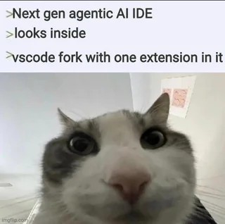

## IDE - Void

**Void est un autre fork de VSCode.**

Il entre dans la même catégorie que Cursor, Tabnine, ou Windsurf mais avec une offre plus libre, i.e. gratuit et open source.

Liens : 
- Github : https://github.com/voideditor/
- Site : https://voideditor.com/

---

## Caractéristiques 

**Il peut se brancher sur tous les modèles du marché et ollama sans coût supplémentaires.**

Étant un fork de VSCode, il est compatible pour tous les systèmes d'exploitation, il est rapide, modulaire (accès au marketplace), facile à utiliser.

Il fournit 3 modes :

- chat avec le modèle
- chat avec envoi de fichiers
- chat avec capacité d'édition

---

Il est facile d'ajouter des fichiers au chat : 
- CTRL+L pour sélectionner du texte 
- @{filename} pour ajouter un fichier complet

---

**Le mode avec capacité d'édition est le plus intéressant à terme car il permet de faire des modifications dans le code source et de les tester directement dans le chat.**

Il met nativement à disposition des capacités d'interfaçage avec l'environnement local via des **outils**. 

Ces outils sont des extensions qui permettent de faire des actions :

- read_file
- edit_file
- rewrite_file

---

**Grâce à ces outils il est possible d'interagir directement avec le code sans passer par des copier coller.**

Par défaut, chaque opération demande néanmoins une validation de l'utilisateur.