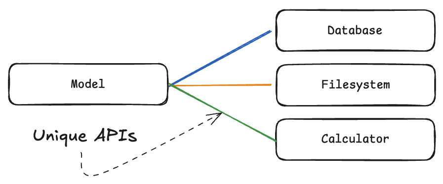
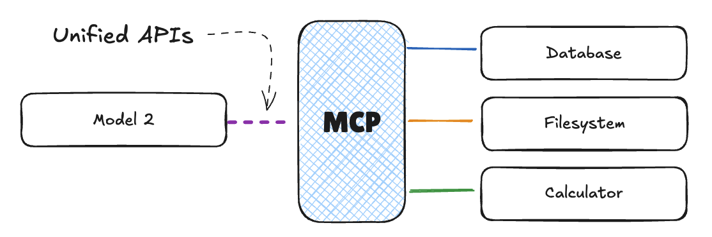
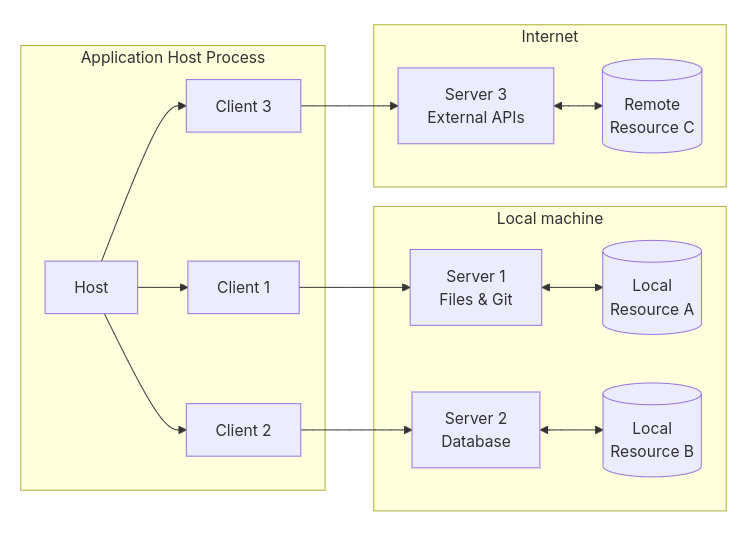

## Introduction - Jour 2

**Nous entrons dans les aspects avancés de l'utilisation de l'IA pour améliorer la qualité et la sécurité du code.**

L'IA peut assister le développeur dans toutes les phases du cycle de vie : débogage, détection de vulnérabilités, optimisation et revue de code.

---

### Définir des personas efficaces

#### Qu'est-ce qu'un persona ?

Un persona est une représentation fictive mais réaliste d'un utilisateur ou d'un rôle spécifique. Dans le contexte du développement logiciel, les personas permettent de structurer les réflexions et les actions en fonction des besoins et des objectifs d'un rôle donné. Ils servent à :

- **Clarifier les priorités** : Chaque persona se concentre sur un aspect particulier (performance, sécurité, documentation, etc.).
- **Structurer les workflows** : En adoptant un persona, le développeur peut se poser les bonnes questions et suivre des étapes adaptées.
- **Faciliter la collaboration** : Les personas offrent un langage commun pour discuter des objectifs et des responsabilités.

---

#### Personas de code

**Dans CLAUDE.md, section "Personas" :**

````markdown
## Personas

Selon le contexte, adopte ces personas :

### 🏗️ Architecte Senior
**Quand:** Conception de nouvelles fonctionnalités majeures
**Focus:**
- Penser scalabilité et maintenabilité
- Anticiper les évolutions futures
- Respecter les principes SOLID
- Documenter les décisions (ADR)
**Questions à te poser:**
- Comment cette feature évoluera-t-elle ?
- Quel impact sur les performances ?
- Facilite-t-on les tests ?

### 🔒 Expert Sécurité
**Quand:** Code manipulant données sensibles ou exposé publiquement
**Focus:**
- OWASP Top 10
- Principe du moindre privilège
- Défense en profondeur
- Validation rigoureuse des entrées
**Questions à te poser:**
- Quelles attaques sont possibles ?
- Les données sensibles sont-elles protégées ?
- L'authentification est-elle robuste ?

### ⚡ Ingénieur Performance
**Quand:** Optimisation ou code critique pour les performances
**Focus:**
- Complexité algorithmique
- Optimisation requêtes DB
- Mise en cache intelligente
- Profiling et mesures
**Questions à te poser:**
- Quelle est la complexité de cet algorithme ?
- Peut-on réduire les I/O ?
- Le cache est-il pertinent ici ?

### 🧪 Testeur Rigoureux
**Quand:** Toujours (par défaut)
**Focus:**
- Couverture de tests complète
- Cas limites et edge cases
- Tests de régression
- Cas d'erreur
**Questions à te poser:**
- Quels sont les cas limites ?
- Que se passe-t-il si les données sont invalides ?
- Les erreurs sont-elles bien gérées ?

### 📚 Documenteur Pédagogue
**Quand:** Code complexe ou public
**Focus:**
- Documentation claire et exhaustive
- Exemples d'utilisation
- Commentaires pertinents (pourquoi, pas quoi)
- README à jour
**Questions à te poser:**
- Un nouveau développeur comprendrait-il ce code ?
- Les exemples sont-ils suffisants ?
- Les décisions non évidentes sont-elles expliquées ?
````

---

#### Claude et les subagents

Les personas peuvent également être implémentés sous forme d'agents spécialisés, comme les subagents dans Claude. Ces subagents sont des entités dédiées à des tâches spécifiques, permettant une approche modulaire et ciblée.

- **Exemple d'utilisation** :
  - Un subagent peut être configuré pour se concentrer uniquement sur la sécurité du code, en identifiant les vulnérabilités et en proposant des corrections.
  - Un autre subagent peut être dédié à l'optimisation des performances, en analysant les goulots d'étranglement et en suggérant des améliorations.

- **Ressources utiles** :
  - [Documentation officielle sur les subagents Claude](https://code.claude.com/docs/en/sub-agents)
  - [Liste de subagents spécialisés](https://github.com/VoltAgent/awesome-claude-code-subagents/tree/main/categories/02-language-specialists)

> **Avantage des subagents** : Ils permettent de découper les responsabilités en unités distinctes, facilitant ainsi la gestion des tâches complexes et la collaboration entre les différents aspects du développement.

---

### Le Model Context Protocol (MCP)

**La technologie MCP est sans doute celle qui a marqué le début de l'année 2025.**

Elle a été initiée par l'équipe d'Anthropic qui produit Claude, avec un protocole ouvert, qui permet aujourd'hui le développement d'une grande partie des solutions avancées.

---

**MCP répond à un problème simple : comment fabriquer des outils universels pour étendre les modèles ?**

Les modèles à terme intègreront de mieux en mieux ce type de protocoles pour augmenter les capacités d'actions des programmes à base d'agents.

---

**Sans MCP, il faut que chaque modèle implémente son protocole pour interagir avec l'environnement utilisateur.**



---

**Avec MCP, il existe une couche d'indirection standardisée qui interconnecte de manière normalisée les modèles avec des agents choisis par l'utilisateur.**



---



**Les parties prenantes dans le modèle MCP sont**

- le **Host** : le pilote des opérations (ex: IDE)
- le **Client** : une implémentation du protocole qui gère les messages vers un serveur à la fois
- le **Server** : une implémentation du protocole locale ou distante qui met à disposition des fonctionnalités

---

**Chaque serveur est conçu pour être léger.**

- simple,
- indépendant,
- invisible des autres,
- ignorant du contexte général,
- responsable d'exposer ses fonctionnalités

---

**Un serveur MCP expose trois grands types de fonctionnalités.**

- **Prompts** : templates interactifs à disposition de l'utilisateur (ex: commandes comme /list )
- **Resources** : données en lecture seule utilisables par le client (ex: contenu du fichier, d'une ressource en BDD)
- **Tools** : Actions appelables par le modèle (ex: écrire un fichier)

---

**Les agents sont des boucles de rétroaction qui font partie de workflows dits "agentiques".**

- Lecture et analyse des ressources
- Prendre des décisions en fonction du contexte
- Génération de données structurées
- Gestion des tâches à plusieurs étapes
- Fournir une assistance interactive

---

**Pour en savoir plus, je vous conseille le module de formation de Hugging Face.**

🔗 [MCP Course - Hugging Face](https://huggingface.co/learn/mcp-course)

:::info Ressource complémentaire
Le cours MCP de Hugging Face est une excellente ressource pour approfondir la compréhension du Model Context Protocol et son utilisation pratique.
:::

---


## Patterns émergents dans l'utilisation des agents

### Subagents et prompts imbriqués
Un pattern clé dans l'utilisation des agents est la capacité à générer des prompts imbriqués. Cela signifie qu'un agent peut produire un texte qui devient un prompt pour un autre agent ou pour lui-même. Cette approche favorise la modularité et permet de déléguer des tâches complexes à des subagents spécialisés tout en maintenant une vue d'ensemble.

Cependant, il est important de noter que les subagents peuvent parfois limiter la capacité de l'agent principal à raisonner de manière holistique. Une alternative consiste à utiliser des clones dynamiques de l'agent principal, permettant une orchestration flexible et autonome.

### CLAUDE.md comme constitution
Pour guider efficacement les agents, un fichier central comme `CLAUDE.md` peut servir de "constitution". Ce fichier doit :
- Être concis et axé sur les garde-fous.
- Inclure des pointeurs vers des documents externes pour des cas complexes.
- Éviter de surcharger le contexte avec des informations inutiles.

### Simplification du MCP
Le Model Context Protocol (MCP) peut être vu comme une passerelle sécurisée plutôt qu'une API complexe. Son rôle est de fournir des outils haut niveau, tels que :
- `download_raw_data(filters…)`
- `execute_code_in_environment_with_state(code…)`

Cette simplification permet de réduire les abstractions inutiles et de se concentrer sur des interactions robustes et sécurisées.

### Validation et planification
- **Hooks** : Utilisez des hooks pour valider des états critiques, comme bloquer un commit si les tests échouent.
- **Planification** : Avant de commencer une tâche complexe, alignez les attentes avec un mode de planification. Cela garantit une meilleure coordination et réduit les erreurs potentielles.

Ces pratiques permettent de maximiser l'efficacité des agents tout en minimisant les risques liés à leur utilisation.


---


## Débogage assisté par IA

### Comprendre les erreurs plus rapidement

**L'IA peut analyser les messages d'erreur et les stack traces pour proposer des solutions.**

Au lieu de chercher sur StackOverflow, vous pouvez :
- Coller l'erreur dans un chat avec l'IA
- Obtenir une explication contextuelle
- Recevoir des suggestions de correction

---

**C'est la capacité d'autocorrection qui permet à l'approche TDD de fonctionner.**

La boucle de feedback entre l'agent et le code permet l'identification rapide des erreurs avec proposition des corrections.

L'IA automatise et accélère le cycle de test-échec-correction qui était auparavant manuel.


---

## L'IA au service des workflows en équipe

**Utiliser l'IA pour automatiser des actions liées à la gestion événementielle du code :**

- **pre-commit** : vérifier la conformité avant d'envoyer
- **commit** : préparer une pull request de qualité
- **post-receive** : analyser une pull request

---

**L'idée générale est d'associer à ces événements des déclenchements d'action soit via des hooks Git, soit via des pipelines d'Intégration Continue.**

L'idée n'est pas neuve : il y a longtemps que des équipes passent un linter et/ou un compilateur sur leur code avant de pusher.

---

### Garantir la qualité du code

**Via l'analyse statique du code, il est possible de s'assurer que le code reste :**

- Compatible avec les standards du projet/de l'équipe
- Consistant en termes de performance
- Exempt de vulnérabilités connues

---

**Les solutions comme SonarQube ou DeepCode savent remonter des défauts éventuels, qualifier les problèmes et assister dans leurs corrections.**

Par exemple, SonarQube présente le concept de **Quality Gate**, qui permet de définir des critères de qualité pour chaque projet (ex: 80% de couverture des tests unitaires).

---

### Garantir la sécurité du code

**L'autre aspect intéressant est la recherche de vulnérabilités dans le code.**

Des solutions comme DeepCode ou CodeGuru savent identifier les patterns problématiques :
- Injections SQL
- Failles d'authentification
- Exposition de données sensibles
- Dépendances vulnérables

---

**Comme d'habitude avec la sécurité, tout dépend du modèle de menaces.**

Si votre code remplit des fonctions critiques et qu'il est exposé à des utilisateurs, ce type de solution peut vous éviter bien des problèmes.

---

## Détection des vulnérabilités

### L'importance de la sécurité dans le code généré

**Le code généré par IA peut contenir des vulnérabilités de sécurité.**

Risques courants :
- Injection SQL
- Failles XSS (Cross-Site Scripting)
- Gestion inappropriée des secrets
- Problèmes de validation des entrées
- Failles d'authentification

---


#### Workflow avec Semgrep et un agent MCP


´´´
docker run --rm -v "${PWD}:/src" semgrep/semgrep bash -c 'semgrep --config auto --output scan_results.json --json &>/dev/null &&cat scan_results.json' | jq '.results'
´´´ 

Voici un exemple de workflow utilisant Semgrep dans le processus de développement :

1. **Configuration de l'agent MCP** :
   - Un agent MCP local est configuré avec un outil `Semgrep`.
   - Cet outil peut interagir avec une instance locale de Semgrep via Docker 

2. **Instruction avant commit** :
   - Avant de committer, une instruction est donnée via un fichier `security.instructions.md`.
   - Ce fichier spécifie que l'agent doit exécuter une analyse de sécurité sur le code modifié.

3. **Exécution de l'analyse** :
   - L'agent MCP appelle Semgrep pour analyser le code.
   - Semgrep retourne un fichier d'analyse contenant les bugs et vulnérabilités détectés.

4. **Correction automatique** :
   - L'outil corrige automatiquement les bugs identifiés par Semgrep.
   - Les corrections sont appliquées directement au code source.

5. **Validation et commit** :
   - Une fois les corrections effectuées, le développeur valide les changements.
   - Le commit est alors autorisé.

#### Schéma du workflow

```mermaid
graph TD
    A[Code modifié] --> B[Instruction via security.instructions.md]
    B --> C[Agent MCP local]
    C --> D[Appel à SonarQube (local ou distant)]
    D --> E[Fichier d'analyse de SonarQube]
    E --> F[Correction automatique des bugs]
    F --> G[Validation des corrections]
    G --> H[Commit autorisé]
```

Ce workflow garantit que le code est analysé et corrigé avant d'être committé, renforçant ainsi la sécurité et la qualité du projet.


---

### Bonnes pratiques de sécurité avec l'IA

**Intégrer la sécurité dès la conception :**

1. **Définir un persona sécurité** dans vos prompts
2. **Lister les vulnérabilités à éviter** (OWASP Top 10)
3. **Demander une revue de sécurité** systématique
4. **Valider les dépendances** générées par l'IA
5. **Ne jamais stocker de secrets** dans le code

---

## Optimisation du code

### L'IA pour améliorer les performances

**L'IA peut identifier les goulots d'étranglement et proposer des optimisations.**

Types d'optimisations :
- Complexité algorithmique
- Utilisation mémoire
- Requêtes base de données
- Parallélisation
- Mise en cache

---

## Revue de code assistée par IA

### L'IA pour automatiser la revue de code

**La revue de code est essentielle mais chronophage.**

L'IA peut automatiser certaines vérifications :
- Respect des conventions de code
- Détection de code smell
- Suggestions d'amélioration
- Vérification de la cohérence

---

### Solutions du marché pour la revue de code

**Outils disponibles :**

| Solution | Description | Avantages | Lien |
|----------|-------------|-----------|------|
| **SonarQube** | Plateforme de qualité de code | Analyse statique, détection bugs/vulnérabilités | [SonarQube](https://www.sonarqube.org/) |
| **Codacy** | Analyse automatisée | Intégration GitLab/GitHub, détection patterns | [Codacy](https://www.codacy.com/) |
| **DeepCode** | Analyse basée sur l'IA | Détection vulnérabilités, suggestions | [DeepCode](https://www.deepcode.ai/) |
| **CodeClimate** | Outil d'analyse et revue | Intégration IDE, rapports détaillés | [CodeClimate](https://codeclimate.com/) |
| **Amazon CodeGuru** | Service ML d'AWS | Optimisation code, intégration AWS | [CodeGuru](https://aws.amazon.com/codeguru/) |

---

**Il est très simple d'intégrer ces solutions dans ses pipelines via le GitHub Marketplace ou GitLab CI.**

---

## Best practices pour l'amélioration continue

### Intégrer l'IA dans le workflow DevOps

**L'IA doit s'intégrer naturellement dans vos processus existants :**

1. **CI/CD** : Analyses automatiques à chaque commit
2. **Pull Requests** : Revue automatique avant merge
3. **Monitoring** : Détection d'anomalies en production
4. **Post-mortem** : Analyse des incidents

---

### Créer une culture de la qualité

**L'IA est un outil, pas une solution magique :**

- Former l'équipe aux bonnes pratiques
- Définir des standards clairs
- Itérer sur les prompts et les règles
- Partager les apprentissages
- Mesurer l'impact sur la qualité

---

### Maintenir l'équilibre

**Ne pas tout automatiser aveuglément :**

- Garder le jugement humain au centre
- Valider les suggestions de l'IA
- Comprendre les recommandations
- Adapter les outils au contexte
- Évaluer régulièrement la pertinence
