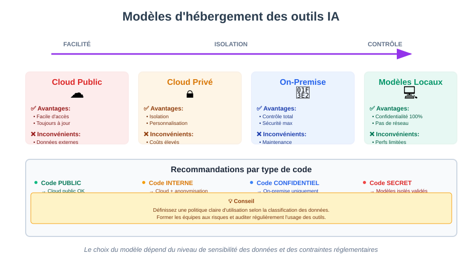

**L'utilisation de l'IA dans le développement soulève des questions éthiques et réglementaires importantes.**

Ces enjeux doivent être pris en compte dès la conception des projets, particulièrement dans les environnements professionnels et réglementés.

---

## Responsabilité collective

**L'éthique de l'IA est une responsabilité partagée :**

- **Développeurs** : Usage responsable
- **Managers** : Politiques claires
- **Organisations** : Infrastructure adéquate
- **Fournisseurs** : Transparence
- **Régulateurs** : Cadre légal


---

## Écologie et gâchis énergétique

**La consommation en énergie des datacenters est très importante, ce n'est pas un secret.**

Les acteurs du marché sont engagés dans une course qui vise à faire consommer au maximum des ressources par les utilisateurs.

Leurs investissements dans de nouveaux datacenters dédiés à l'IA nécessitent que les consommateurs deviennent dépendants de ce genre d'outils.

---

**En tant que développeurs, il faut être conscient de ces enjeux.**

Choisir le meilleur modèle pour son besoin : pas toujours besoin des plus gourmands.

Les modèles locaus sont ainsi réputés moins gourmands en énergie et viennent responsabiliser l'utilisateur.

Et si la tâche est vraiment simple, une action manuelle est plus rapide et moins coûteuse.

--- 

**La quantié de tokens envoyée est un autre sujet.**

Il peut être utile de commencer une nouvelle discussion si le contexte de la précédente n'a pas de sens.

En économisant des tokens, on économise de l'énergie et de l'argent.

---

### Impact environnemental

**L'IA a un coût environnemental :**

- Entraînement des modèles : consommation énergétique massive
- Inférence : requêtes continuelles vers des datacenters
- Stockage : duplication des modèles

**Bonnes pratiques :**
- Utiliser l'IA de manière ciblée et pertinente
- Préférer les modèles locaux quand possible
- Optimiser les prompts pour réduire les itérations
- Choisir des fournisseurs avec des engagements environnementaux

---

## Confidentialité du code et hébergement des outils IA

### Les risques de fuite de données

**Lorsque vous utilisez des outils IA basés sur le cloud, vous envoyez potentiellement du code sensible vers des serveurs externes.**

Risques identifiés :
- **Fuite de propriété intellectuelle** : votre code peut être vu par le fournisseur
- **Exposition de secrets** : clés API, mots de passe, tokens
- **Violation de confidentialité client** : données métier sensibles
- **Non-conformité réglementaire** : RGPD, HIPAA, etc.

---

### Comprendre les modèles d'hébergement

**Il existe différents modèles d'hébergement pour les outils IA :**



| Modèle | Description | Avantages | Inconvénients |
|--------|-------------|-----------|---------------|
| **Cloud public** | Service hébergé par le fournisseur (ex: ChatGPT, Copilot) | Facile d'accès, toujours à jour | Données envoyées à l'extérieur |
| **Cloud privé** | Instance dédiée dans le cloud | Isolation, personnalisation | Coûts plus élevés |
| **On-premise** | Modèle hébergé sur vos serveurs | Contrôle total des données | Maintenance complexe, coûts |
| **Modèles locaux** | Exécution sur poste de travail | Confidentialité maximale | Performances limitées |

:::warning Choix critique
Le choix du modèle d'hébergement dépend directement du niveau de sensibilité des données et des contraintes réglementaires de votre organisation.
:::

---

### Politique d'utilisation des outils IA

**Chaque organisation doit définir sa politique :**

```text
## Exemple de politique d'utilisation de l'IA

### Code autorisé avec l'IA cloud
- Code open source public
- Prototypes et POC non critiques
- Exemples de documentation générique

### Code INTERDIT avec l'IA cloud
- Code propriétaire client
- Algorithmes métier sensibles
- Données personnelles
- Secrets et credentials
- Code soumis à NDA

### Solutions recommandées
- Utiliser des modèles locaux pour le code sensible
- Anonymiser les données avant envoi
- Utiliser des instances privées pour les projets critiques
- Former les développeurs aux risques
```

---

### Bonnes pratiques de confidentialité

**Comment utiliser l'IA tout en protégeant vos données :**

**1. Anonymisation** :
- Remplacer les noms de variables sensibles
- Supprimer les commentaires métier
- Utiliser des données factices pour les exemples

**2. Sélection des données** :
- Ne partager que le strict nécessaire
- Exclure le contexte business
- Éviter les fichiers de configuration

**3. Validation avant envoi** :
- Revue systématique du code partagé
- Utilisation d'outils de détection de secrets
- Formation des équipes

**4. Traçabilité** :
- Logger les interactions avec l'IA
- Auditer l'usage des outils
- Documenter les décisions

---

## Risques liés à la qualité du code

**L'utilisation massive de l'IA pour générer du code peut avoir des effets néfastes sur la qualité globale des projets.**

Ces risques doivent être anticipés et gérés par des pratiques adaptées.

---

### 1. Réduction de la qualité : non-conformité aux exigences

**Le code généré par l'IA peut ne pas respecter les standards et exigences du projet.**

- Non-respect des conventions de code de l'équipe
- Architecture incohérente avec le reste du projet
- Code fonctionnel mais mal structuré
- Absence de gestion des cas limites

**C'est tout l'enjeu de cette formation** : apprendre à guider l'IA avec des spécifications claires et à valider systématiquement le code produit.

---

### 2. Extension de la surface d'attaque

**Du code mal sécurisé peut être introduit et exposer l'entreprise.**

Risques identifiés :
- Injection SQL, XSS, CSRF non gérés
- Gestion incorrecte des authentifications
- Exposition de données sensibles
- Dépendances vulnérables suggérées par l'IA

**La formation a montré comment scanner le code produit** avec des outils d'analyse statique (linters de sécurité, SAST) pour détecter ces vulnérabilités avant qu'elles n'atteignent la production.

---

### 3. Augmentation de la dette technique

**Du code difficile à maintenir peut rapidement s'accumuler.**

Symptômes courants :
- Code dupliqué au lieu de refactorisé
- Abstractions absentes ou mal conçues
- Documentation insuffisante
- Tests manquants ou superficiels

**La formation a répondu à ce risque** via le TDD (Test-Driven Development) et le Spec-Driven Development, qui garantissent un code testable et conforme aux spécifications dès sa création.

---

### 4. Érosion des compétences des développeurs

**Le rôle d'orchestrateur de robots risque de faire baisser les compétences en analyse de code.**

Conséquences potentielles :
- Difficulté à debugger sans assistance IA
- Perte de compréhension des fondamentaux
- Incapacité à évaluer la qualité du code généré
- Dépendance excessive aux outils

**Solution** : maintenir une pratique régulière sans IA, effectuer des revues de code approfondies et comprendre chaque ligne acceptée.

---

### 5. Surcharge de la QA

**La forte augmentation de code mal produit peut augmenter la charge de travail des équipes qualité.**

Impact sur les équipes QA :
- Volume de code à revoir en hausse
- Qualité moyenne des apports en baisse
- Bugs plus nombreux et plus variés
- Tests de non-régression plus complexes

**Mitigation** : mettre en place des gates de qualité automatisés (CI/CD, tests automatiques, analyse statique) pour filtrer le code avant revue humaine.

---

## IA dans les environnements réglementés : précautions et bonnes pratiques

### Les secteurs à haute conformité

**Certains secteurs ont des exigences réglementaires strictes :**

- **Santé** : HIPAA (USA), HDS (France)
- **Finance** : PCI-DSS, réglementations bancaires
- **Défense** : Classement secret défense
- **Données personnelles** : RGPD (Europe)
- **Pharmaceutique** : FDA, bonnes pratiques de fabrication

---

### Précautions pour les environnements réglementés

**Adapter l'usage de l'IA aux contraintes réglementaires :**

#### 1. Classification des données

```text
## Exemple de classification

### Niveau PUBLIC
- Documentation générale
- Code open source
- Exemples génériques
→ Utilisation libre de l'IA cloud

### Niveau INTERNE
- Code métier non sensible
- Architecture technique
→ IA cloud avec anonymisation

### Niveau CONFIDENTIEL
- Algorithmes propriétaires
- Données clients
→ IA on-premise uniquement

### Niveau SECRET
- Code critique sécurité
- Données réglementées
→ Pas d'IA, ou modèles isolés validés
```

---

#### 2. Validation et certification

**Dans les environnements critiques :**

- **Traçabilité complète** : Qui a généré quoi, quand, comment
- **Validation humaine** : Code review obligatoire
- **Tests renforcés** : Couverture de tests accrue
- **Documentation** : Justification des choix techniques
- **Audit trail** : Historique complet des modifications

---

#### 3. Gestion des risques

**Évaluation des risques liés à l'IA :**

| Risque | Impact | Probabilité | Mitigation |
|--------|--------|-------------|------------|
| Fuite de données | Critique | Moyenne | Modèles on-premise |
| Code non conforme | Élevé | Élevée | Validation systématique |
| Dépendance IA | Moyen | Élevée | Formation continue |
| Biais algorithmique | Variable | Moyenne | Tests approfondis |
| Non-reproductibilité | Moyen | Faible | Documentation stricte |

---

### Bonnes pratiques pour les environnements réglementés

**Recommandations :**

1. **Obtenir une validation légale** avant déploiement
2. **Définir des politiques claires** d'usage de l'IA
3. **Former les équipes** aux enjeux de conformité
4. **Mettre en place des contrôles** automatisés
5. **Documenter toutes les décisions** liées à l'IA
6. **Auditer régulièrement** l'usage des outils
7. **Prévoir un plan de continuité** sans IA

---

## Autres enjeux éthiques

### Propriété intellectuelle et droits d'auteur

**Questions juridiques encore floues :**

- **Code généré par IA** : Qui en est l'auteur ?
- **Code entraîné sur du code tiers** : Risque de violation de licence ?
- **Responsabilité** : Qui est responsable d'un bug dans du code généré ?

**Position prudente recommandée :**
- Considérer le code IA comme une suggestion, pas une solution finale
- Vérifier la compatibilité des licences
- Documenter l'usage de l'IA dans le code
- Assumer la responsabilité du code final

---

### Biais et équité

**Les modèles IA peuvent reproduire des biais :**

- Biais culturels dans les suggestions de code
- Surreprésentation de certains langages/frameworks
- Reproduction de mauvaises pratiques courantes
- Biais dans les noms de variables/fonctions

**Rester vigilant et critique** face aux suggestions de l'IA.

---

### Transparence et explicabilité

**Importance de la transparence :**

- **Documenter** l'usage de l'IA dans les projets
- **Expliquer** les choix techniques aux parties prenantes
- **Tracer** les décisions prises avec l'assistance de l'IA
- **Former** les équipes aux limites de l'IA

---

## Vers une utilisation responsable de l'IA

### Principes directeurs

**10 principes pour une utilisation éthique de l'IA dans le développement :**

1. **Transparence** : Documenter l'usage de l'IA
2. **Responsabilité** : Assumer les décisions finales
3. **Confidentialité** : Protéger les données sensibles
4. **Sécurité** : Valider le code généré
5. **Équité** : Questionner les biais
6. **Qualité** : Maintenir les standards
7. **Conformité** : Respecter les régulations
8. **Durabilité** : Minimiser l'impact environnemental
9. **Formation** : Développer les compétences
10. **Éthique** : Réfléchir à l'impact sociétal

---

### Créer une charte d'utilisation

**Exemple de charte d'équipe :**


#### Charte IA-friendly
Dernière mise à jour : 20 octobre 2025

Comme beaucoup de développeur·se·s, notre façon de coder a radicalement évolué avec l’arrivée de l’IA. Aujourd’hui, la plupart d’entre nous utilisent des agents IA pour développer. Et, au passage, cela a rendu notre métier plus agréable.
Vous êtes nombreux·ses à vous en servir pendant nos formations ; il était donc naturel d’adapter notre pédagogie.

Nous échangeons régulièrement avec vous et nos formateur·rice·s. Nous avons également étudié les approches pédagogiques et la manière de les adapter à l’IA. Ces échanges et ces travaux, nous ont permis de repenser la façon de se former au temps de l'IA.

Au‑delà d’une simple adaptation aux usages, l’IA amène d'autres effets positifs : du temps libéré pour approfondir l’essentiel, échanger avec le/la formateur·rice, s’approprier les concepts et pratiquer lors des ateliers ; et, si besoin, un accompagnement sur les bonnes pratiques du développement assisté par IA.

Matthieu et Camille

Certaines de nos formations, étiquetées « IA‑friendly », proposent des sessions adaptées aux développeur·se·s qui utilisent des agents IA pour coder. Lors de l’inscription, nous vous demanderons vos préférences en termes d’IA et nous adapterons la session en conséquence. 

La charte ci‑dessous décrit les bonnes pratiques appliquées par les formateur·rice·s durant ces sessions aux participant·e·s désirant utiliser des agents IA pour développer.
La charte
Les participants seront guidés sur les bonnes pratiques du développement avec l’IA
Les formateurs utilisent régulièrement des outils de développement avec des IA agentiques (type Cursor, Copilot, Claude Code, ...)
“Les exercices sont ponctués d’ateliers ‘sans IA’ pour s’approprier les concepts et apprendre à relire du code produit par autrui (humain ou IA).”
“Les participant·e·s doivent dialoguer avec l’agent IA jusqu’à obtenir un code qu’ils/elles comprennent et savent expliquer.”
Nous demandons à tous les participants de nous décrire leurs usages et compétences sur le développement assisté par IA, afin de s’assurer d’avoir des groupes homogènes et s’adapter à leur niveau.
Les aménagements spécifiques des formateurs sur leurs formations seront décrits sur le programme
Nous nous engageons à continuellement faire évoluer nos formations et notre pédagogie vis à vis du développement avec l'IA en fonction de l’évolution des outils, des bonnes pratiques et usages, ainsi que des retours participants et formateurs.
Si besoin, les formateur·rice·s fourniront un AGENTS.md ou équivalent pour le cadre de la formation

Idées pour la mise en application
Les participant·e·s feront des régulièrement des revues de code en pair programming pour critiquer et améliorer le code généré par l’IA
... (TODO)

---

## Perspectives futures

### Évolution de la réglementation

**La réglementation évolue rapidement :**

- **AI Act (UE)** : Régulation de l'IA en Europe
- **Executive Orders (USA)** : Directives fédérales
- **Normes ISO** : Standardisation en cours
- **Jurisprudence** : Cas légaux émergents

**Rester informé** des évolutions légales est crucial.

---

### AI Act : Une régulation européenne pour l'IA

**Adopté en 2024, l'AI Act est le premier cadre légal global pour l'intelligence artificielle.**

L'objectif principal est de garantir une IA sûre, transparente et respectueuse des droits fondamentaux tout en favorisant l'innovation. Voici les points clés :

#### Une approche basée sur les risques

L'AI Act classe les systèmes d'IA en quatre niveaux de risque :

- **Risque inacceptable** : Pratiques interdites, comme le scoring social ou la surveillance biométrique en temps réel.
- **Risque élevé** : Systèmes ayant un impact significatif (ex. : recrutement, santé, justice). Ces systèmes doivent respecter des obligations strictes :
  - Évaluation des risques.
  - Documentation technique détaillée.
  - Supervision humaine.
  - Qualité des données.
- **Risque limité** : Transparence requise (ex. : chatbots, contenu généré par IA). Les utilisateurs doivent être informés qu'ils interagissent avec une IA.
- **Risque minimal ou nul** : Pas de régulation spécifique (ex. : filtres anti-spam).

#### Obligations pour les développeurs

- **Transparence** :
  - Étiqueter clairement les contenus générés par IA.
  - Informer les utilisateurs lors d'interactions avec une IA.
- **Documentation** :
  - Maintenir des "fiches modèles" détaillant les données d'entraînement, les objectifs et les limites.
- **Gestion des risques** :
  - Identifier et atténuer les biais ou les risques de contenus illégaux.
- **Gouvernance des données** :
  - Respecter les droits d'auteur et publier des résumés des données d'entraînement.

#### Pourquoi c'est important pour les développeurs

- **Portée extraterritoriale** : Même hors UE, si votre IA est utilisée dans l'UE, vous devez vous conformer.
- **Influence mondiale** : L'AI Act pourrait devenir une référence internationale, comme le RGPD.
- **Avantage compétitif** : Être conforme renforce la confiance des utilisateurs et prépare aux futures régulations.

#### Recommandations pratiques

1. **Documentez tout** : Gardez une trace des versions, des données et des décisions.
2. **Soyez transparent** : Ajoutez des étiquettes ou des métadonnées aux contenus générés.
3. **Évaluez les risques** : Identifiez les biais et les impacts potentiels.
4. **Restez informé** : Suivez les mises à jour de l'AI Act et les bonnes pratiques.

L'AI Act marque une étape importante dans la régulation de l'IA, encourageant des pratiques responsables et éthiques.

---

## Le remplacement des devs dans le monde du travail

### La course à l'armement

**Les investissements de la Silicon Valley dans l'IA sont colossaux : il faudra un jour rentabiliser ça.**

Le remplacement des salariés du code par des IAs est une manière de voir les choses.

De ce point de vue il y a effectivement un risque sur l'emploi.

--- 

**D'un autre côté, on observe que parmi les sociétés qui investissent énormément, il y a des hyper scalers du cloud public.**

Leur objectif pourrait aussi être de voir la consommation de projets cloud augmenter exponentiellement avec une informatisation galopante et généralisée.

--- 

### Une menace pour les juniors 

**Il apparaît certain que les plus fragiles sont aujourd'hui les personnes en début de carrière.**

L'automatisation va remplacer les tâches répétitives allouées aux entrants dans l'industrie.  

--- 

**Comme on l'a vu au départ, l'expertise est une nécessité pour contrôler les hallucinations actuelles des modèles.**

Cette expertise s'acquiert avec l'expérience : que se passe-t-il quand il n'y a plus de nouveaux entrants dans la profession.

Mais on l'a aussi vu, cette expertise risque de s'éroder avec le temps en déléguant la création du code.

--- 

**Il n'y a pas aujourd'hui de réponse connue et maîtrisée à ces projets.** 

La seule certitude c'est que le secteur va continuer à évoluer au gré des évolutions techniques qui sont beaucoup plus rapides que les évolutions sociales.

