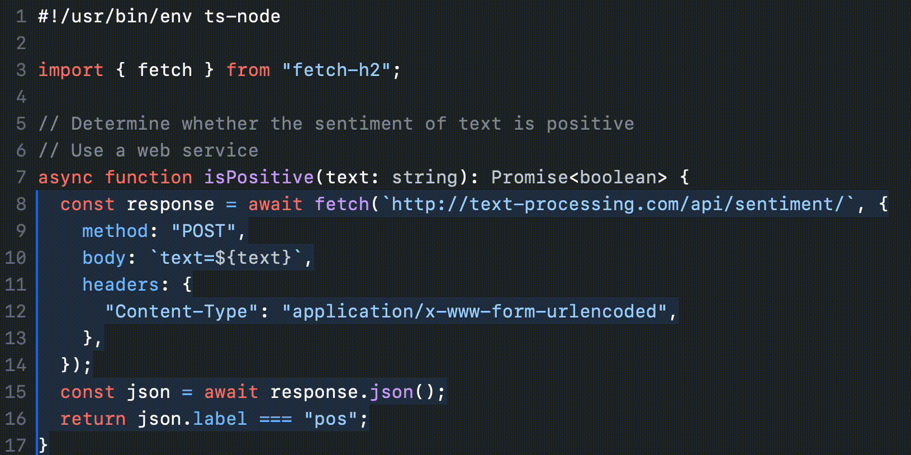

---

title: 4 - Bien documenter 

---

## Quickstart : Documenter un fichier legacy en complet 
Vous pouvez utiliser n'importe quelle classe d'un projet existant pour réaliser cette tâche.

ex: 

- https://github.com/AlternC/AlternC/blob/main/bureau/class/m_quota.php
- https://github.com/Rolisteam/rolisteam/blob/master/src/libraries/core/src/media/mediafactory.cpp

**Utiliser le prompt suivant dans l'outil de votre choix.**

```text
<template>
class:
  filename: <project path and filename>
  name: <class name>
  description: <Short description in 3 sentences max>
  properties: <List of class properties>
  methods: 
    - name: <method name>
      description : <short description>
      inputs : <list of input names and types>
      outputs : <list of output names and types>
</template>

<code>

... Coller le code à analyser ici ...

</code>

<task>
The user wants you to provide Documentation for the code using the provided template.
Provide the documentation in french following the YAML format.
</task> 
```
---

### Analyse 

**On a utilisé la technique de templating pour s'assurer que plusieurs fichiers seront documentés de la même manière.**

- L'usage des balises type XML `<template>` et `<code>` sert à délimiter le rôle des différentes parties du prompt.
- Le code à analyser est donné dans le corps du prompt.
- La définition du travail attendu est situé à la fin du prompt.

---

## Documenter le code 


**La documentation est une pratique importante dans la fabrication, l'usage et la communication de logiciels.**

On parle souvent de la documentation du code, mais pas assez DES documentations qui correspondent à plusieurs usages et plusieurs publics.

Autrement dit : quels sont les différents types de documentation, et pour qui sont-ils rédigés ?

- Documentation interne du code  
- Guide de développement (structure, workflow) 
- Dossier de conception (requirements, process, parties prenantes, flux) 
- Changelog : documentation de l'historique du projet 
- Page README.md du projet
- Règles internes de code (coding standards, CONTRIBUTING.md, etc.)
- Manuel utilisateur final
- Manuel d'installation
- Manuel d'exploitation
- Manuel de mise à jour 
- Schéma d'architecture
- Contrat d'API (OpenAPI) 
- Processus de build / CI 
- Déploiement / CD
- Dossier de sécurité
- Documentation des tests (unitaires, charge, e2e, etc.)

Qui se destinent 

- aux managers 
- aux développeurs
- aux testeurs
- aux opérateurs sécurité
- aux opérateurs système
- aux intégrateurs
- aux utilisateurs internes (backoffice)
- aux utilisateurs externes (frontoffice)

---

**Fournir toutes ces documentations pour tous ces publics est un travail important, souvent négligé, coûteux en maintenance.** 

Pourtant c'est un aspect essentiel pour le succès du projet et la réduction de la dette technique inhérente à tout projet informatique.

---

## Les avantages de la documentation générée par IA

La documentation générée par IA peut apporter plusieurs avantages par rapport à la documentation manuelle :

- Gain d'échelle : il est possible d'automatiser la documentation d'une codebase conséquente 
- Gain de temps : la documentation est écrite avec le code
- Gain de consistance : la documentation est standardisée et normalisée 
- Gain de maintenabilité : la documentation est mise à jour automatiquement lorsque le code est modifié
- Gain d'accessibilité : plusieurs documentations sont produites à destination de plusieurs objectifs 

---

## Documenter le code via IA

**On a vu qu'il existait plusieurs types de documentations pour le code.**

Voici en particulier celles qui sont les plus ciblées par la production IA Gen.

| Type de Documentation                | Moyen                    | Remarque                |
|--------------------------------------|--------------------------|-------------------------|
| Outils (dont IA)                     | Manuel                   | Essentiel               |
| Inline                               | Prompt ou autocomplétion | Intérêt limité          |
| Fonctions / méthodes                 | Prompt                   | Important               |
| Module et classe                     | Prompt                   | Essentiel               |
| Tests                                | Prompt                   | Important               |
| API (OpenAPI)                        | Prompt + outillage       | Essentiel mais complexe |
| Architecture logicielle et technique | Prompt + documents       | Essentiel               |

---

## Les débuts de Copilot : Documentation Based Development

**Le premier pattern de Copilot était d'écrire la documentation de la fonction pour obtenir le code résultant du prompt.**



---

**On voit là une inversion de situation où la documentation est écrite avant le code.** 

C'est un mode de raisonnement : écrire les commentaires pour produire un pseudo code.

```text

# Read pattern from input variable #1
# Read file name from input variable #2
# Panic exit if missing parameters
# Convert to absolute file name
# Check the file exists, panic exit if not
# Search for the pattern in the file
  # For each search hit, accumulate the line in a variable and increment a counter
# Print the total number of hits and the matching lines 

```
---

## La documentation au coeur de l'IA GEN


**En cible, on va essayer de faire générer de mettre le code au coeur du processus de génération de code.**

- La documentation est fournie à l'IA GEN pour guider la production du code 
- L'IA GEN produit la documentation du code qu'elle produit 

---

### La documentation comme guide

#### Les fichiers d'orientation 

**Comme on l'a vu, on constitue un dossier qui contient les contraintes du projet.**

- fonctionnelles : besoins, fonctions, utilisateurs, relations avec d'autres applications, ...
- architecturales : type d'architecture logicielle, performances, plateforme techniques, ...
- logicielles : découpe en services, runtimes, frameworks, structures, ...
- sécuritaires : logs, RBAC, règles d'exécution, ...
- agentiques : agents, prompts, personas, ...

---

**La dimension documentation est essentielle**

Selon les besoins, on va fournir des documents correspondant aux types de documentation et formats.

--- 

**Cette documentation persistante va servir sur le long terme pour l'humain et la machine.** 

- L'humain pourra comprendre ce qui est fait et pourquoi
- La machine pourra s'appuyer sur l'existant pour produire du nouveau code

Ainsi on pourra produire une documentation cohérente au long de la vie du projet.

--- 

**On pourra aussi réutiliser ces guides pour d'autres projets.**
 
C'est un moyen de gagner en productivité à terme via une librairie de prompts.

---

### Un exemple de fichier de contraintes

```text
# file: bonnes_pratiques_documentation.md

```markdown

## Documentation des classes
class MaClasse:
    """Description concise de la classe.

    Attributes:
        attr1 (type): Description de l'attribut.
        attr2 (type): Description de l'attribut.
    """

    def methode(self, param1, param2):
        """Description concise de la méthode.

        Args:
            param1 (type): Description.
            param2 (type): Description.

        Returns:
            type: Description.

        Raises:
            ErrorType: Si condition d'erreur.
        """

## Bonnes pratiques
1. **Docstrings**:
   - Utiliser le format Google Style (comme ci-dessus) ou NumPy
   - Toujours inclure : description, params, returns et raises si applicable

2. **Modules**:
   - Documenter en tête de fichier avec :
     - Brève description
     - Exemple minimal si pertinent
     - Liste des classes/fonctions principales

3. **Fonctions**:
   - Décrire l'objectif
   - Spécifier types params/return
   - Mentionner effets de bord

4. **Types complexes**:
   - Utiliser `typing` pour clarifier
   - Ex: `Dict[str, List[int]]`

5. **Exemples**:
   - Inclure des exemples courts dans les docstrings
   - Format exécutable (doctest)

```

---


#### Les fichiers headers

**Afin d'alléger le contexte envoyé à un modèle, on peut utiliser un fichier de résumé (header) pour documenter un fichier complet.**

Lors d'un envoi de contexte, cette version allégée remplacera le code complet.

Le fichier de headers constitue une bonne documentation de l'API.

Le quickstart de cette leçon est une bon exemple de comment constituer ses fichiers headers.  

--- 

#### Les commentaires type javadoc

**Les commentaires de classe sont devenus un classique de la documentation de code.**

Certains frameworks les instrumentent pour produire du code automatiquement à la compilation.
```java

/**
 * Validates a chess move
 *
 * <p>Use {@link #doMove(int fromFile, int fromRank, int toFile, int toRank)} to move a piece.
 *
 * @param fromFile file from which a piece is being moved
 * @param fromRank rank from which a piece is being moved
 * @param toFile file to which a piece is being moved
 * @param toRank rank to which a piece is being moved
 * @return true if the move is valid, otherwise false
 * @since 1.0
 */
boolean isValidMove(int fromFile, int fromRank, int toFile, int toRank) { ... }

```
---

**Selon qu'on écrit du Java, du Python, du TypeScript, les formats sont différents mais la logique est la même.**

- Fournir une description
- Définir les inputs, les outputs, les exceptions 
- Définir des données métiers éventuelles (@url) 
- Définir des métadonnées (@author, @date)

---

**Il est recommandé de faire remplir ces documentations par l'IA Gen.**

Le fait de savoir qu'une classe / méthode a été produite par tel LLM à telle date est un indice intéressant. 

Il vous permettra de refactorer le code le jour venu.

--- 

#### Exercice 

Produire du code Python en suivant un format standard.

cf. https://github.com/google/styleguide/blob/gh-pages/pyguide.md#s3.8.3-functions-and-methods

Utiliser le prompt suivant dans l'outil de votre choix.

```text

<sql table>

books:
- id: int
- dewey: int
- title: varchar(256)
- isbn: varchar(32)
- description: text
</sql table>

<template>
def <Function name>(
    <Param name>: <type>,
    ...
) -> <return_type>:
    """<Multi line descriptions of the method>

    Args:
        <Param name>: <Param description>
        ...

    Returns:
        <A description of the expected result including an example>

    Raises:
        <A description of the potential exception raised>
    """
    <code>
      <Insert code here/>
    </code>
</template>

<task>
Using the provided template, produce a python function that fetches rows from a postgresql server. 

The function is provided an integer and/or an array of strings and returns a list of records. 

The function looks up in the table described by the sql table. 

If the integer param is provided, it is used to search in the dewey field.

If the text array is provided, it is used to perform full text search on the description.

The inter and text search are cumulative.

</task>

```


---


## Documenter avec des outils dédiés pour les besoins complexes

**Il existe pour les cas complexes des solutions adaptées au besoin.**

Par exemple [Docuwriter](https://www.docuwriter.ai/).

Il promet de générer des documentations de code à partir de code existant en respectant la syntaxe et les normes spécifiques comme le Swagger OpenAPI ou du UML.

Il faut être sûr que le JSON généré est conforme aux spécifications et que les données sont correctement formatées.
