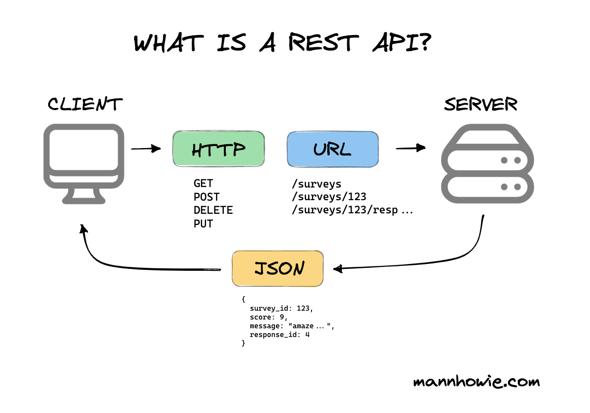

**Transformer le script CLI en site web avec formulaire et API REST en appliquant le TDD et l'architecture hexagonale.**

**Durée : 50 minutes**

### Contexte

Votre responsable commercial veut partager l'outil d'analyse avec toute l'équipe. Au lieu d'envoyer le script CLI à tout le monde, vous allez créer un site web simple : une page avec un formulaire pour uploader le CSV et afficher les résultats.

L'objectif : créer un frontend (HTML + JavaScript) qui communique avec une API REST backend, tout en réutilisant les fonctions métier déjà testées des TP précédents.

**Qu'est-ce qu'une API REST ?**

REST (Representational State Transfer) est une architecture pour créer des services web. Une API REST expose des **endpoints** (URLs) qui répondent aux requêtes HTTP :
- **GET** : Récupérer des données
- **POST** : Envoyer des données
- **PUT/DELETE** : Modifier/Supprimer (non utilisés ici)

Dans ce TP, votre API REST aura un endpoint `POST /api/v1/analysis` qui :
1. Reçoit un fichier CSV (requête HTTP)
2. Traite les données (appelle vos fonctions métier)
3. Retourne les résultats en JSON (réponse HTTP)

Le frontend (page web) fera un appel AJAX à cette API pour afficher les résultats sans recharger la page.

**Architecture hexagonale**

Vous allez découvrir l'architecture hexagonale : le cœur métier reste identique, seuls les adaptateurs d'entrée/sortie changent (CLI → HTTP + Templates).


### Contraintes pédagogiques

Continuez avec le langage utilisé aux TP précédents (Python ou Node.js).

---

## Focus IA

**Ce que vous allez apprendre dans ce TP :**

- ✅ **Comprendre REST** : Qu'est-ce qu'une API REST et comment elle fonctionne
- ✅ **TDD pour API HTTP** : Écrire les tests HTTP AVANT le serveur
- ✅ **Architecture hexagonale** : Séparer cœur métier et adaptateurs (ports/adaptateurs)
- ✅ **Frontend + Backend** : Créer templates HTML et appels AJAX vers l'API
- ✅ **Tests fonctionnels** : Vérifier routes, formats JSON, résultats
- ✅ **Refactoring sans régression** : Transformer CLI en site web sans casser les tests métier

---

## Objectif

À la fin de ce TP, vous devez avoir :

- ✅ Fichiers `docs/architecture.instructions.md` et `docs/http-testing.instructions.md`
- ✅ Tests HTTP écrits AVANT le serveur (`tests/test_api.test.js` ou équivalent)
- ✅ Phase RED visible (tests échouent : connexion refusée)
- ✅ Serveur HTTP avec API REST : `POST /api/v1/analysis` + route principale `/`
- ✅ Templates HTML : page d'accueil avec formulaire upload
- ✅ JavaScript AJAX : appel à l'API et affichage des résultats
- ✅ Phase GREEN (tous tests HTTP au vert)
- ✅ Tests métier inchangés et toujours verts
- ✅ Site web fonctionnel accessible sur http://localhost:3000
- ✅ Commit avec type `feat`

---

## Fichiers fournis

- **[`../sources/sales.csv`](../sources/sales.csv)** : Même fichier que TP1-3
- **[`../TP4/docs/architecture.instructions.txt`](docs/architecture.instructions.txt)** : Guide sur l'architecture hexagonale
- **[`../TP4/docs/http-testing.instructions.txt`](docs/http-testing.instructions.txt)** : Guide sur les tests HTTP/API

---

## Contraintes techniques

- **TDD strict** : Tests HTTP écrits AVANT le serveur
- **Architecture hexagonale** : Fonctions métier inchangées, nouveaux adaptateurs HTTP
- **Serveur HTTP** : Port 3000
- **Route principale** : `POST /api/v1/analysis` (upload CSV → JSON)
- **Format JSON** : Structure claire avec total_sales, average_basket, top_products, revenue_by_city
- **Tests métier** : Doivent rester verts sans modification

---

## Étape 1 - Comprendre l'architecture hexagonale et REST

**Objectif** : Saisir la séparation entre cœur métier et adaptateurs, et comprendre REST.

### Partie A - Architecture hexagonale

- **Action** : Réfléchissez à la structure actuelle de votre code
  **Observation** : Vous avez des fonctions métier (calculs) séparées des I/O (TP2)

- **Action** : Visualisez l'architecture hexagonale avec ce schéma


  **Observation** : Le cœur métier (hexagone central) est entouré d'adaptateurs (CLI, HTTP, etc.)

**Concept clé** : Les fonctions métier ne bougent PAS. Seuls les adaptateurs changent (entrée/sortie).

**Avantage** : Les tests métier restent valides. Vous avez déjà fait le plus dur au TP2 !

### Partie B - API REST

- **Action** : Visualisez comment fonctionne une API REST avec ce schéma



  **Observation** :
  - Le navigateur (frontend) envoie une requête HTTP au serveur
  - Le serveur (backend) traite la requête et retourne du JSON
  - Le JavaScript affiche les résultats sans recharger la page

**Architecture du TP4** :
```
Navigateur (Frontend)
    ├─ index.html : Formulaire upload + affichage résultats
    └─ JavaScript : Appel AJAX à l'API
              ↓
Serveur (Backend)
    ├─ GET / : Servir la page HTML
    ├─ POST /api/v1/analysis : API REST
    │    ↓
    └─ Fonctions métier (TP2-3) : IDENTIQUES
```

---

## Étape 2 - Créer les fichiers d'instructions

**Objectif** : Guider l'IA sur l'architecture et les tests HTTP.

### Partie A - Instructions architecture

- **Action** : Utilisez ce meta-prompt pour générer le fichier d'instructions architecture :

```
Je veux créer un fichier d'instructions générique sur l'architecture hexagonale (ports & adaptateurs).

Le fichier doit expliquer à une IA :
1. Principe : séparer le cœur métier de l'infrastructure
2. Concepts : ports (interfaces) et adaptateurs (implémentations)
3. Règle d'or : le cœur métier ne doit jamais dépendre des adaptateurs
4. Exemples d'adaptateurs : CLI, HTTP, BDD, fichiers, API externes
5. Avantages : testabilité, évolutivité, changement d'infrastructure sans casser le métier

Instructions pour l'IA :
- Toujours identifier le cœur métier existant
- Ne JAMAIS modifier les fonctions métier lors d'ajout d'adaptateur
- Créer de nouveaux adaptateurs qui APPELLENT le métier existant
- Garder les tests métier inchangés (preuve de non-régression)

Format : Markdown concis (80 lignes max).

Génère le contenu du fichier docs/architecture.instructions.md.
```
  
  **Observation** : L'IA génère un fichier adapté à votre contexte

- **Action** : Sauvegardez dans `docs/architecture.instructions.md`  
  **Observation** : Fichier créé

### Partie B - Instructions tests HTTP

- **Action** : Utilisez ce meta-prompt pour générer le fichier d'instructions tests HTTP :

```
Je veux créer un fichier d'instructions générique sur les tests HTTP/API REST.

Le fichier doit expliquer à une IA :
1. Types de tests HTTP : disponibilité, contrat API, intégration, erreurs
2. Structure générale : setup/teardown serveur, requêtes HTTP, assertions
3. Ce qu'on teste : status codes, headers, structure JSON, valeurs métier
4. Différence tests unitaires vs tests HTTP (isolation vs intégration)
5. Bonnes pratiques : tests indépendants, données de test en mémoire, pas d'appels externes
6. TDD pour API : écrire tests AVANT le serveur, cycle RED-GREEN-REFACTOR

Instructions pour l'IA :
- Toujours tester les 4 aspects : disponibilité, contrat, résultats, erreurs
- Setup : démarrer serveur en mode test avant les tests
- Teardown : arrêter serveur proprement après les tests
- Assertions complètes : status + headers + body
- Tests HTTP ne doivent PAS re-tester la logique métier (déjà testée)

Format : Markdown concis (100 lignes max).
Pas de code spécifique, juste les concepts et directives générales.

Génère le contenu du fichier docs/http-testing.instructions.md.
```
  
  **Observation** : L'IA génère le guide des tests HTTP

- **Action** : Sauvegardez dans `docs/http-testing.instructions.md`  
  **Observation** : Fichier créé

<details><summary>Indice - Fichiers de référence</summary>

Si vous préférez copier les fichiers fournis :

```bash
cp ../TP4/docs/architecture.instructions.txt docs/architecture.instructions.md
cp ../TP4/docs/http-testing.instructions.txt docs/http-testing.instructions.md
```

Adaptez-les ensuite si besoin selon votre langage/framework.

</details>

---

## Étape 3 - Baseline : vérifier que tests métier passent

**Objectif** : S'assurer que le code actuel fonctionne avant de le modifier.

- **Action** : Lancez les tests métier existants

```bash
# Node.js
npm test

# Python
pytest tests/test_sales.py
```
  
  **Observation attendue** : Tous les tests passent (12/12 ou selon vos TP2-3)
```
===== 12 passed in 0.15s =====
```

**C'est votre baseline. Ces tests doivent rester verts tout au long du TP4.**

<details><summary>Indice - Si des tests échouent</summary>

**Problème** : Des tests métier échouent avant même de commencer.

**Action** : Corrigez d'abord ces tests (retour TP2-3) avant de continuer.

Le TP4 part du principe que vous avez un code fonctionnel et testé.

</details>

---

## Étape 4 - Générer les tests HTTP AVANT le serveur (Phase RED)

**Objectif** : Appliquer le TDD pour l'API HTTP.

- **Action** : Demandez à l'IA de générer les tests HTTP avec ce prompt :

```
Lis les fichiers docs/architecture.instructions.md et docs/http-testing.instructions.md.

Je veux créer une API REST avec :
- Route GET / (health check)
- Route POST /api/v1/analysis (upload CSV, retourne JSON avec résultats d'analyse)

Génère UNIQUEMENT les tests HTTP (pas le serveur).

Les tests doivent couvrir :
- Disponibilité du serveur
- Contrat de l'API (requêtes valides/invalides)
- Résultats corrects (intégration bout en bout)
- Gestion d'erreurs (fichiers vides, invalides, manquants)

Framework de test : [Jest + supertest / autres] selon langage.
Fichier : tests/test_api.test.js (ou équivalent).

IMPORTANT : Les tests doivent utiliser un mock/stub du serveur HTTP.
- Pas de serveur réel qui démarre sur un port
- Utiliser supertest (Node.js) ou équivalent qui mock les requêtes HTTP
- Les tests doivent pouvoir s'exécuter sans occuper de port réseau

NE génère PAS encore le code du serveur, seulement les tests.
```
  
  **Observation** : L'IA génère uniquement le fichier de tests

- **Action** : Sauvegardez dans `tests/test_api.test.js` (ou équivalent selon langage)  
  **Observation** : Fichier de tests créé

<details><summary>Indice - Structure attendue</summary>

Le fichier de tests doit contenir :
- Imports (framework de test + mock HTTP comme supertest)
- Import de l'application serveur (sans la démarrer)
- Plusieurs tests couvrant les 4 types (disponibilité, contrat, intégration, erreurs)
- Assertions sur status codes, headers, structure JSON, valeurs

**Exemple avec supertest (Node.js)** :
```javascript
const request = require('supertest');
const app = require('../server'); // Import sans démarrer

test('GET / retourne 200', async () => {
  const response = await request(app).get('/');
  expect(response.status).toBe(200);
});
```

Pas de `app.listen()` dans les tests, supertest mock le serveur.

Le nombre exact de tests et leurs détails sont laissés à l'IA selon les instructions.

</details>

---

## Étape 5 - Lancer les tests HTTP (ils DOIVENT échouer - Phase RED)

**Objectif** : Vérifier que les tests échouent car le serveur n'existe pas.

- **Action** : Lancez les tests HTTP

```bash
# Node.js
npm test tests/test_api.test.js

# Python
pytest tests/test_api.py
```
  
  **Observation attendue** : Les tests ÉCHOUENT car le serveur/routes n'existent pas :
```
Error: Cannot find module '../server'
```
ou
```
TypeError: app.get is not a function
```
ou
```
Error: Route not found
```

**C'est NORMAL et ATTENDU. Vous êtes en phase RED.**

<details><summary>Indice - Si les tests passent</summary>

**Problème** : Les tests ne devraient PAS passer puisque le serveur n'existe pas.

**Causes possibles** :
- L'IA a généré le serveur en même temps que les tests
- Les tests ne testent rien (assertions manquantes)
- Les tests utilisent des mocks qui retournent toujours succès

**Solution** : Vérifiez que les tests importent bien le serveur et tentent d'appeler les routes.

</details>

---

## Étape 6 - Générer le serveur HTTP minimal (Phase GREEN)

**Objectif** : Implémenter le serveur pour faire passer les tests.

- **Action** : Demandez à l'IA de générer le serveur avec ce prompt :

```
Lis les fichiers docs/architecture.instructions.md et docs/http-testing.instructions.md.

J'ai écrit les tests HTTP pour mon API (fichier tests/test_api.test.js).
Les tests échouent car le serveur n'existe pas encore (phase RED).

Génère maintenant le serveur HTTP qui :
1. Démarre sur port 3000
2. Route GET / : retourne 200 (health check)
3. Route POST /api/v1/analysis :
   - Accepte upload CSV (multipart/form-data)
   - Parse CSV → appelle fonctions métier existantes (calculate_total_sales, etc.)
   - Retourne JSON avec structure :
     {
       "total_sales": number,
       "average_basket": number,
       "top_products": [{name, quantity}],
       "revenue_by_city": {city: amount}
     }
4. Gestion erreurs : fichier manquant/vide → 400

Framework : [Express / Flask] selon langage.
Fichier : server.js (ou api.py).

IMPORTANT : Réutilise les fonctions métier existantes depuis app.js/app.py.
Ne duplique PAS le code métier.
```
  
  **Observation** : L'IA génère le serveur HTTP

- **Action** : Sauvegardez dans `server.js` (ou `api.py`)  
  **Observation** : Fichier serveur créé

- **Action** : Installez les dépendances si nécessaire

```bash
# Node.js (Express)
npm install express multer cors

# Python (Flask)
pip install flask flask-cors
```
  
  **Observation** : Dépendances installées

<details><summary>Indice - Structure minimale</summary>

**Structure minimale attendue** :
- Serveur HTTP démarré sur port 3000
- Route GET / qui retourne 200
- Route POST /api/v1/analysis qui accepte upload et retourne JSON
- Appel aux fonctions métier existantes (pas de duplication)
- Gestion basique des erreurs (400 si fichier manquant/invalide)

</details>

---

## Étape 7 - Lancer les tests HTTP (Phase GREEN attendue)

**Objectif** : Vérifier que tous les tests passent maintenant.

- **Action** : Lancez les tests HTTP

```bash
# Node.js
npm test tests/test_api.test.js

# Python
pytest tests/test_api.py
```
  
  **Observation attendue** : Tous les tests passent
```
===== X passed in Y.Zs =====
```

**Vous êtes en phase GREEN.**

<details><summary>Indice - Si des tests échouent</summary>

**Identifiez quel test échoue** :

**Test 1 (server running)** : Le serveur démarre-t-il ?
- Vérifiez que le port n'est pas déjà utilisé
- Vérifiez les logs du serveur

**Tests 3-4 (résultats)** : Les calculs sont-ils corrects ?
- Vérifiez le parsing du CSV (encoding, délimiteur)
- Vérifiez que les fonctions métier sont bien appelées
- Vérifiez le format JSON de sortie

**Tests 5-6 (erreurs)** : Les cas d'erreur sont-ils gérés ?
- Ajoutez des try/catch ou validations
- Retournez status 400 avec message d'erreur

**Prompt de correction** :
```
Le test [nom du test] échoue avec cette erreur :
[COPIER-COLLER L'ERREUR]

Voici le code du serveur :
[COPIER-COLLER LA ROUTE CONCERNÉE]

Corrige le problème.
```

</details>

---

## Étape 8 - Vérifier que tests métier restent verts

**Objectif** : S'assurer que le refactoring n'a pas cassé le code métier.

- **Action** : Relancez les tests métier

```bash
# Node.js
npm test tests/test_sales.test.js

# Python
pytest tests/test_sales.py
```
  
  **Observation attendue** : Tous les tests passent toujours
```
===== X passed in Y.Zs =====
```

**VICTOIRE : Architecture hexagonale réussie !**

Les fonctions métier n'ont pas bougé, les tests sont inchangés, tout fonctionne.

<details><summary>Indice - Si tests métier échouent</summary>

**Problème** : Vous avez modifié les fonctions métier par erreur.

**Causes possibles** :
- Déplacement de code métier dans le serveur
- Modification de signatures de fonctions
- Suppression de code par inadvertance

**Solution** :
1. Vérifiez que les fonctions métier existent toujours dans app.js/app.py
2. Vérifiez qu'elles sont bien exportées
3. Comparez avec la version TP3 (git diff)

</details>

---

## Étape 9 - Créer le frontend (templates HTML + AJAX)

**Objectif** : Créer l'interface utilisateur qui utilise l'API REST.

- **Action** : Demandez à l'IA de générer le template HTML avec AJAX

```
Génère un fichier HTML complet (views/index.html ou public/index.html) avec :

1. Structure HTML :
   - Titre "Analyse de ventes e-commerce"
   - Formulaire d'upload de fichier CSV (input type="file" accept=".csv")
   - Bouton "Analyser"
   - Zone d'affichage des résultats (div#results)

2. CSS inline simple :
   - Centrer le contenu
   - Styliser le formulaire et les résultats
   - Mise en page claire

3. JavaScript avec appel AJAX :
   - Écouter la soumission du formulaire
   - Envoyer le fichier via fetch() ou XMLHttpRequest
   - POST vers http://localhost:3000/api/v1/analysis
   - Afficher les résultats JSON de manière formatée (pas de JSON brut)
   - Afficher erreurs si upload échoue

Format attendu des résultats :
- Total des ventes : X €
- Moyenne du panier : X €
- Top 3 produits (tableau)
- CA par ville (tableau)

Utilise fetch() avec FormData pour l'upload.
```

  **Observation** : Fichier HTML créé avec formulaire ET JavaScript AJAX

- **Action** : Modifiez le serveur pour servir ce fichier HTML sur la route GET /

```
Modifie le serveur pour :
- Servir le fichier views/index.html (ou public/index.html) sur GET /
- Activer CORS si nécessaire
- Servir les fichiers statiques
```

  **Observation** : Le serveur sert maintenant le frontend

<details><summary>Indice - Structure template HTML avec AJAX</summary>

Le fichier doit contenir :

**HTML** : Formulaire + zone résultats
**CSS** : Style simple pour présentation
**JavaScript** :
```javascript
document.getElementById('uploadForm').addEventListener('submit', async (e) => {
  e.preventDefault();

  const formData = new FormData();
  formData.append('file', document.getElementById('csvFile').files[0]);

  try {
    const response = await fetch('/api/v1/analysis', {
      method: 'POST',
      body: formData
    });

    if (!response.ok) throw new Error('Erreur upload');

    const data = await response.json();

    // Afficher résultats formatés (pas JSON brut)
    displayResults(data);
  } catch (error) {
    document.getElementById('results').innerHTML =
      `<p class="error">Erreur : ${error.message}</p>`;
  }
});

function displayResults(data) {
  // Formater et afficher total, moyenne, top produits, CA par ville
  ...
}
```

</details>

---

## Étape 10 - Tester le site web complet

**Objectif** : Vérifier que le site fonctionne en conditions réelles.

### Partie A - Démarrer le serveur

- **Action** : Démarrez le serveur

```bash
# Node.js
node server.js

# Python
python api.py
```

  **Observation** : Serveur démarré sur port 3000

### Partie B - Tester le site web

- **Action** : Ouvrez votre navigateur sur http://localhost:3000/
  **Observation** : La page HTML s'affiche avec le formulaire

- **Action** : Cliquez sur "Choisir un fichier" et sélectionnez `sales.csv`
  **Observation** : Le nom du fichier apparaît

- **Action** : Cliquez sur "Analyser"
  **Observation** : Les résultats s'affichent de manière formatée :
  ```
  === Résultats de l'analyse ===
  Total des ventes : [montant] €
  Moyenne du panier : [moyenne] €

  Top 3 Produits :
  1. [Produit A] - [X] unités
  2. [Produit B] - [Y] unités
  3. [Produit C] - [Z] unité

  Chiffre d'affaires par ville :
  - [Ville 1] : [montant] €
  - [Ville 2] : [montant] €
  - [Ville 3] : [montant] €
  ```

**VICTOIRE : Site web complet fonctionnel !**

### Partie C - Tester l'API avec curl (optionnel)

Si vous voulez tester l'API directement sans le frontend :

```bash
# Test health check
curl http://localhost:3000/

# Test upload CSV
curl -X POST http://localhost:3000/api/v1/analysis \
  -F "file=@sales.csv"
```

  **Observation** : Réponse JSON brute de l'API

---

## Étape 10 - Commiter avec les conventions professionnelles

**Objectif** : Créer un commit propre pour cette transformation.

- **Action** : Ajoutez les fichiers au staging

```bash
git add server.js tests/test_api.test.js docs/architecture.instructions.md docs/http-testing.instructions.md
# Ajoutez aussi index.html si créé
```
  
  **Observation** : `git status` montre les fichiers en staging

- **Action** : Demandez à l'IA de générer le message de commit

```
Lis le fichier docs/git-conventions.md.

Génère un message de commit pour cette transformation :
- Ajout d'un site web avec API REST (serveur Express/Flask)
- Frontend : Template HTML avec formulaire upload + AJAX
- Backend : Route POST /api/v1/analysis (upload CSV → JSON)
- Architecture hexagonale : fonctions métier inchangées
- Tests HTTP : tests fonctionnels générés par l'IA
- Tests métier : toujours verts
- Développé en TDD (tests avant serveur)

Outil IA utilisé : [nom de l'outil].

Respecte le format Conventional Commits avec annotations IA.
Type de commit : feat
```
  
  **Observation** : L'IA génère le message complet

- **Action** : Créez le commit

```bash
git commit -m "[COLLER LE MESSAGE GÉNÉRÉ]"
```
  
  **Observation** : `git log` montre le commit avec message formaté

<details><summary>Indice - Exemple de message</summary>

```
feat(web): add web frontend with REST API and hexagonal architecture

Transform CLI tool into web application while preserving business logic:
- Frontend: HTML template with upload form and AJAX calls
- Backend: HTTP server on port 3000
- Route GET / serving HTML page
- Route POST /api/v1/analysis for CSV upload and analysis
- JSON API response with formatted display in browser

Frontend features:
- Upload form with file input (CSV only)
- AJAX call with fetch() and FormData
- Formatted results display (not raw JSON)
- Error handling for failed uploads

Architecture:
- Business functions unchanged (calculate_total_sales, get_top_products, etc.)
- New HTTP adapters for input (multipart upload) and output (JSON + HTML)
- Hexagonal architecture: core isolated from infrastructure

Testing:
- New HTTP/API tests (availability, contract, integration, errors)
- All business tests still passing - zero regression
- Developed with TDD: tests written before server implementation

Error handling:
- Missing file: 400 Bad Request
- Empty CSV: 400 Bad Request
- Invalid format: 400 Bad Request

---
🤖 AI-Assisted Development
Tool: Claude Code v1.2 (claude-sonnet-4-5-20250929)
Agent: Guided TDD implementation for HTTP API
Prompt type: Test-first development + hexagonal architecture
Context files: docs/architecture.instructions.md, docs/http-testing.instructions.md
Human validation:
  - Functionality: ✓ API responds correctly on POST /api/v1/analysis
  - Tests: ✓ 6/6 HTTP tests passing, 12/12 business tests still green
  - Code review: ✓ Business logic untouched, clean separation verified
  - Manual testing: ✓ Tested with curl and HTML form
```

</details>

---

### Avancé

#### Option 1 : Documentation OpenAPI/Swagger

**Défi** : Générer automatiquement une documentation interactive pour votre API.

**Prompt pour l'IA** :
```
Ajoute la documentation OpenAPI/Swagger à mon API :
- Décris l'endpoint POST /api/v1/analysis
- Schéma de la requête (multipart/form-data avec fichier CSV)
- Schéma de la réponse JSON
- Codes d'erreur possibles (400, 500)
- Interface Swagger UI accessible sur /api-docs

Framework : [swagger-jsdoc + swagger-ui-express / flask-swagger-ui]
```

**Résultat attendu** : Documentation interactive accessible sur http://localhost:3000/api-docs

#### Option 2 : Monorepo Frontend/Backend découplés

**Défi** : Restructurer le projet en monorepo avec frontend et backend séparés.

**Architecture cible** :
```
monorepo/
├── packages/
│   ├── frontend/          # Application web cliente
│   │   ├── package.json
│   │   ├── index.html
│   │   └── src/
│   │       ├── app.js     # Code JavaScript AJAX
│   │       └── styles.css
│   │
│   ├── backend/           # API REST serveur
│   │   ├── package.json
│   │   ├── server.js      # Serveur HTTP (routes)
│   │   └── src/
│   │       └── app.js     # Logique métier (réutilisée)
│   │
│   └── shared/            # Code partagé (types, constantes)
│       └── types.js
│
├── package.json           # Scripts workspace
└── README.md
```

**Prompt pour l'IA** :
```
Restructure mon projet en monorepo avec frontend et backend découplés :

1. Créer structure monorepo :
   - packages/frontend/ : HTML/CSS/JS statiques
   - packages/backend/ : Serveur API REST
   - packages/shared/ : Types et constantes communs

2. Frontend :
   - Serveur de développement séparé (Vite ou serve)
   - Appels API vers http://localhost:3001 (backend)
   - Build génère des fichiers statiques

3. Backend :
   - Port 3001
   - CORS activé pour frontend (port 3000)
   - Sert uniquement l'API (pas de templates)

4. Configuration :
   - package.json racine avec workspaces
   - Scripts pour démarrer frontend ET backend ensemble
   - Variables d'environnement (ports, URLs)

Langage : [Node.js / Python]
Gestionnaire de packages : [npm workspaces / pnpm workspaces / yarn workspaces]

Conserve les fonctions métier dans backend/src/app.js SANS modification.
Conserve tous les tests existants.
```

**Résultat attendu** :
- `npm run dev` démarre frontend (port 3000) et backend (port 3001)
- Frontend fait des appels AJAX cross-origin vers backend
- Code métier inchangé
- Tests toujours verts

**Avantages du monorepo** :
- Frontend et backend peuvent évoluer indépendamment
- Déploiement séparé possible (frontend → CDN, backend → serveur)
- Équipes distinctes peuvent travailler sur chaque partie
- Réutilisation du code via packages partagés

#### Option 3 : Tests de performance

**Défi** : Vérifier que l'API traite rapidement les gros fichiers.

**Prompt pour l'IA** :
```
Ajoute des tests de performance pour l'API :
- Générer un fichier CSV de 10000 lignes (ventes aléatoires)
- Mesurer le temps de réponse de POST /api/v1/analysis
- Assertion : temps < 500ms
- Framework : [Jest avec timeout / pytest-benchmark]

Fichier : tests/test_performance.test.js
```

**Résultat attendu** : Tests passent, API reste rapide même avec beaucoup de données.

#### Option 4 : Authentification API

**Défi** : Sécuriser l'API avec une clé d'authentification.

**Prompt pour l'IA** :
```
Ajoute une authentification simple par API key :
- Header requis : X-API-Key
- Vérifier la clé avant traitement
- Retourner 401 Unauthorized si clé manquante/invalide
- Environnement : Clé stockée dans variable d'env

Développe en TDD :
1. Tests d'abord (401 si pas de clé, 200 si clé valide)
2. Implémentation middleware
3. Tests passent

Conserve les tests existants (ajoute juste la clé dans les requêtes).
```

**Résultat attendu** : API sécurisée, tests HTTP adaptés avec header X-API-Key.

---

### Synthèse

**Qu'est-ce qui a bien fonctionné ?**

- L'architecture hexagonale était-elle claire ? Avez-vous vu que les fonctions métier n'ont pas bougé ?
- Le TDD pour HTTP a-t-il bien fonctionné (tests avant serveur) ?
- Les tests métier sont-ils restés verts sans modification ?

**Quels sont les problèmes rencontrés ?**

- Les tests HTTP ont-ils bien échoué en phase RED ?
- Avez-vous été tenté de modifier les fonctions métier ?
- Le parsing du CSV en HTTP a-t-il posé problème (encoding, format) ?

**Quelles compétences avez-vous développées avec l'IA ?**

- ✅ Comprendre REST et les API HTTP
- ✅ Comprendre et appliquer l'architecture hexagonale
- ✅ Faire du TDD pour une API HTTP (pas juste pour des fonctions)
- ✅ Créer un frontend avec formulaire et appels AJAX
- ✅ Écrire des tests fonctionnels (bout en bout)
- ✅ Refactorer sans régression (tests métier inchangés)
- ✅ Transformer une application CLI en site web complet
- ✅ Créer des instructions pour guider l'IA sur l'architecture

**Ce que vous avez appris sur REST** :

- Une API REST expose des endpoints HTTP (GET, POST, etc.)
- Le frontend (navigateur) et le backend (serveur) communiquent en JSON
- AJAX permet de charger des données sans recharger la page
- Séparation frontend/backend facilite l'évolution indépendante

**Ce que vous avez appris sur l'architecture** :

- Le cœur métier doit être indépendant de l'infrastructure (CLI, HTTP, BDD...)
- Les tests métier ne doivent pas dépendre des adaptateurs
- On peut changer complètement l'interface (CLI → Web) sans toucher à la logique
- Cette approche facilite l'évolution du code (ajout de nouveaux adaptateurs facile)

**Prochaines étapes possibles** :

- Découpler frontend et backend en monorepo (voir section Avancé)
- Ajouter une base de données (nouvel adaptateur de persistance)
- Créer un frontend moderne (React, Vue, Svelte)
- Déployer en production (frontend → CDN, backend → serveur)
- Ajouter monitoring et logs
