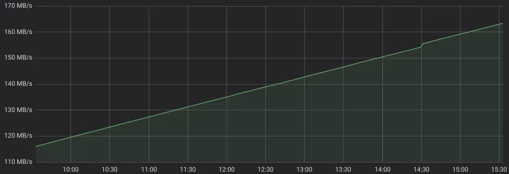
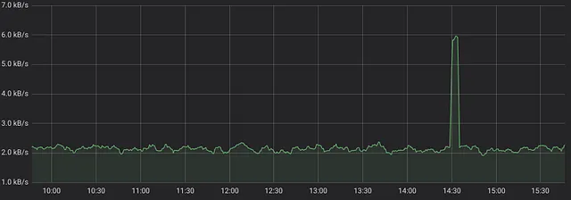

[PromQL](https://prometheus.io/docs/prometheus/latest/querying/basics/) est un langage de requête pour le [système de monitoring Prometheus](https://prometheus.io/). Il est conçu pour créer des requêtes puissantes mais simples pour les graphiques, les alertes ou les séries temporelles dérivées (également appelées [règles d'enregistrement](https://prometheus.io/docs/prometheus/latest/configuration/recording_rules/)). PromQL est conçu à partir de zéro et n'a aucune similarité avec d'autres langages de requête utilisés dans les bases de données de séries temporelles, tels que [SQL dans TimescaleDB](https://www.timescale.com/), [InfluxQL](https://docs.influxdata.com/influxdb/v1.7/query_language/) ou [Flux](https://github.com/influxdata/flux).

Cela a permis de créer un langage clair pour les requêtes typiques des bases de données de séries temporelles.

## Sélectionner une série temporelle avec PromQL

Sélectionner une série temporelle avec PromQL est aussi simple que d'écrire le nom d'une série temporelle dans la requête. Par exemple, la requête suivante renverrait toutes les séries temporelles avec le nom `node_network_receive_bytes_total` :

```
node_network_receive_bytes_total
```

Ce nom correspond à une [métrique de node_exporter](https://github.com/prometheus/node_exporter) contenant le nombre d'octets reçus sur les différentes interfaces réseau. Une requête aussi simple peut renvoyer plusieurs séries temporelles avec le nom donné mais avec un ensemble distinct d'étiquettes. Par exemple, la requête ci-dessus peut renvoyer des séries temporelles avec les étiquettes suivantes pour les interfaces réseau `eth0`, `eth1` et `eth2` :

```
node_network_receive_bytes_total{device="eth0"}
node_network_receive_bytes_total{device="eth1"}
node_network_receive_bytes_total{device="eth2"}
```

Les étiquettes distinctes sont définies entre accolades : `{device="eth0"}`, `{device="eth1"}`, `{device="eth2"}`.

Cela peut sembler trivial et logique, mais la logique derrière ces requêtes est plutôt sophistiquée. Une requête équivalente en SQL prendrait volontiers une quinzaine de lignes.

## Filtrer par étiquette

Un seul nom de métrique peut correspondre à plusieurs séries temporelles avec des ensembles d'étiquettes distincts, comme dans l'exemple ci-dessus. Comment sélectionner les séries temporelles correspondant uniquement à `{device="eth1"}` ? Il suffit de mentionner l'étiquette requise dans la requête :

```
node_network_receive_bytes_total{device="eth1"}
```

Si vous souhaitez sélectionner toutes les séries temporelles pour les appareils autres que `eth1`, remplacez simplement `=` par `!=` dans la requête :

```
node_network_receive_bytes_total{device!="eth1"}
```

Comment sélectionner les séries temporelles pour les appareils commençant par `eth` ? Utilisez simplement des expressions régulières :

```
node_network_receive_bytes_total{device=~"eth.+"}
```

Le filtre peut contenir des expressions régulières arbitraires [compatibles avec Go](https://golang.org/pkg/regexp/) (alias RE2).

Pour sélectionner toutes les séries temporelles pour les appareils ne commençant pas par `eth`, le `=~` doit être substitué par `!~` :

```
node_network_receive_bytes_total{device!~"eth.+"}
```

## Filtrer par plusieurs étiquettes

Les filtres d'étiquettes peuvent être combinés. Par exemple, la requête suivante ne renverrait que les séries temporelles sur l'instance `node17:9000` pour les appareils commençant par `eth` :

```
node_network_receive_bytes_total{instance="node17:9000", device=~"eth.+"}
```

Les filtres d'étiquettes sont combinés avec l'opérateur `et` entre eux, c'est-à-dire "renvoyer les séries temporelles correspondant à ce filtre `et` à ce filtre". Comment implémenter l'opérateur `ou` ? Actuellement, PromQL ne dispose pas d'un opérateur `ou` pour combiner des filtres d'étiquettes, mais dans la plupart des cas, il peut être substitué par une expression régulière. Par exemple, la requête suivante renverrait les séries temporelles pour les appareils `eth1` ou `lo` :

```
node_network_receive_bytes_total{device=~"eth1|lo"}
```

## Filtrer par expressions régulières sur le nom de la métrique

Parfois, il est nécessaire de renvoyer toutes les séries temporelles pour plusieurs noms de métriques. Le nom de la métrique est simplement une étiquette ordinaire avec un nom spécial --- `__name__`. Ainsi, il est possible de filtrer par plusieurs noms de métriques en appliquant des expressions régulières sur les noms de métriques. Par exemple, la requête suivante renvoie toutes les séries temporelles avec les noms de métriques `node_network_receive_bytes_total` ou `node_network_transmit_bytes_total` :

```
{__name__=~"node_network_(receive|transmit)_bytes_total"}
```

## Comparaison des données actuelles avec les données historiques

PromQL permet d'interroger des données historiques et de les combiner/comparer aux données actuelles. Il suffit d'ajouter [offset](https://prometheus.io/docs/prometheus/latest/querying/basics/#offset-modifier) à la requête. Par exemple, la requête suivante renverrait des données datant d'une semaine pour toutes les séries temporelles avec le nom `node_network_receive_bytes_total` :

```
node_network_receive_bytes_total offset 7d
```

La requête suivante renverrait les points où la surcharge actuelle de garbage collector(gc) dépasse la surcharge de gc datant d'une heure par un facteur de 1,02.

```
go_memstats_gc_cpu_fraction > 1.02 * (go_memstats_gc_cpu_fraction offset 1h)
```

Les opérations `>` et `*` sont expliquées ci-dessous.

## Calcul des taux

Les lecteurs attentifs ont peut-être remarqué que [Grafana](http://docs.grafana.org/features/datasources/prometheus/) dessine des lignes constamment croissantes pour toutes les requêtes ci-dessus :



L'utilité de ces graphiques est proche de zéro, car ils montrent des valeurs de compteur constamment croissantes difficiles à interpréter, alors que nous avons besoin de graphiques pour la bande passante réseau --- voir MB/s à gauche du graphique. PromQL a une fonction magique pour cela `rate()`. Elle calcule le taux par seconde pour toutes les séries temporelles correspondantes :

```
rate(node_network_receive_bytes_total[5m])
```

Maintenant, le graphique devient correct :



Que signifie `[5m]` dans la requête ? Il s'agit de la durée (`d`) --- 5 minutes dans notre cas --- à prendre en compte lors du calcul du taux par seconde pour chaque point du graphique. Le calcul simplifié du taux pour chaque point ressemble à `(Vcurr-Vprev)/(Tcurr-Tprev)`, où `Vcurr` est la valeur au point actuel --- `Tcurr`, `Vprev` est la valeur au point `Tprev=Tcurr-d`.

Si cela semble trop compliqué, il suffit de se rappeler --- une valeur `d` plus élevée lisse le graphique, tandis qu'une valeur `d` plus faible donne plus de précision mais aussi plus de bruit au graphique. 

```
rate(node_network_receive_bytes_total)
```

## Attention à l'utilisation de la fonction `rate`

La fonction `rate` supprime le nom de la métrique tout en conservant toutes les étiquettes des séries temporelles internes.

N'appliquez pas `rate` aux séries temporelles qui peuvent augmenter et diminuer. De telles séries temporelles sont appelées des [jauges](https://prometheus.io/docs/concepts/metric_types/#gauge). La fonction `rate` doit être appliquée uniquement aux [compteurs](https://prometheus.io/docs/concepts/metric_types/#counter), qui augmentent toujours, mais qui peuvent parfois être réinitialisés à zéro (par exemple, lors du redémarrage du service).

N'utilisez pas `irate` à la place de `rate`, car [il ne capture pas les pics](https://medium.com/@valyala/why-irate-from-prometheus-doesnt-capture-spikes-45f9896d7832) et il n'est pas beaucoup plus rapide que `rate`.
