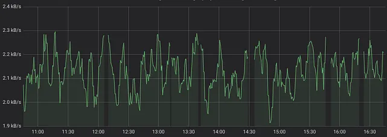
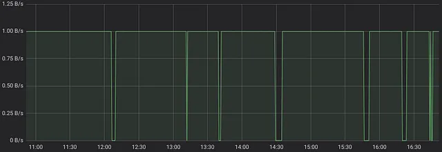

### Anatomie d'un requête PromQL

- https://promlabs.com/blog/2020/06/18/the-anatomy-of-a-promql-query/

## Opérations arithmétiques

PromQL prend en charge toutes les [opérations arithmétiques de base](https://prometheus.io/docs/prometheus/latest/querying/operators/#arithmetic-binary-operators) suivantes :

-   addition (+)
-   soustraction (-)
-   multiplication (\*)
-   division (/)
-   modulo (%)
-   puissance (\^)

Cela permet d'effectuer diverses conversions. Par exemple, la conversion d'octets/s en bits/s :

```
rate(node_network_receive_bytes_total[5m]) * 8
```

De plus, cela permet d'effectuer de
```
rate(node_network_receive_bytes_total[5m]) * 8
```

De plus, cela permet d'effectuer des calculs entre différentes séries temporelles. Par exemple cette requête pour adapté le retour d'un capteur de CO2 IoT en fonction de la temperature et de la pression :

```
co2 * (((temp_c + 273.15) * 1013.25) / (pressure * 298.15))
```

La combinaison de plusieurs séries temporelles avec des opérations arithmétiques nécessite de comprendre les [règles de correspondance](https://prometheus.io/docs/prometheus/latest/querying/operators/#vector-matching). Sinon, la requête peut échouer ou produire des résultats incorrects. Les bases des règles de correspondance sont simples :

-   Le moteur PromQL supprime les noms de métriques de toutes les séries temporelles du côté gauche et du côté droit de l'opération arithmétique sans toucher aux étiquettes.
-   Pour chaque série temporelle du côté gauche, le moteur PromQL recherche la série temporelle correspondante du côté droit avec le même ensemble d'étiquettes, applique l'opération pour chaque point de données et renvoie la série temporelle résultante avec le même ensemble d'étiquettes. Si aucune correspondance n'est trouvée, la série temporelle est supprimée du résultat.

Les règles de correspondance peuvent être enrichies avec les modificateurs [ignoring](https://prometheus.io/docs/prometheus/latest/querying/operators/#vector-matching), [on](https://prometheus.io/docs/prometheus/latest/querying/operators/#vector-matching), [group_left](https://prometheus.io/docs/prometheus/latest/querying/operators/#vector-matching), [and](https://prometheus.io/docs/prometheus/latest/querying/operators/#vector-matching), [group_right](https://prometheus.io/docs/prometheus/latest/querying/operators/#vector-matching). C'est plutôt complexe, mais dans la plupart des cas, cela n'est pas nécessaire.

## Opérations de comparaison

PromQL prend en charge les [opérateurs de comparaison suivants](https://prometheus.io/docs/prometheus/latest/querying/operators/#comparison-binary-operators) :

-   égal (==)
-   différent (!=)
-   supérieur (\>)
-   supérieur ou égal (\>=)
-   inférieur (\<)
-   inférieur ou égal (\<=)

Ces opérateurs peuvent être appliqués à n'importe quelle expression PromQL, comme avec les opérateurs arithmétiques. Le résultat de l'opération de comparaison est une série temporelle avec uniquement les points de données correspondants. Par exemple, la requête suivante renverrait uniquement la bande passante inférieure à 2300 octets/s :

```
rate(node_network_receive_bytes_total[5m]) < 2300
```

Cela donnerait le graphique suivant avec des lacunes là où la bande passante dépasse 2300 octets/s :



Le résultat de l'opérateur de comparaison peut être augmenté avec le modificateur `bool` :

```
rate(node_network_receive_bytes_total[5m]) < bool 2300
```

Dans ce cas, le résultat contiendrait 1 pour les comparaisons vraies et 0 pour les comparaisons fausses :



## Fonctions d'agrégation et de regroupement

PromQL permet d'[agré

ger et de regrouper des séries temporelles](https://prometheus.io/docs/prometheus/latest/querying/operators/#aggregation-operators). Les séries temporelles sont regroupées par l'ensemble d'étiquettes donné, puis la fonction d'agrégation donnée est appliquée à chaque groupe. Par exemple, la requête suivante renverrait le trafic entrant total par toutes les interfaces réseau groupées par instances (nœuds avec `node_exporter` installé) :

```
sum(rate(node_network_receive_bytes_total[5m])) by (instance)
```

## Travailler avec les jauges (Gauges)

Les jauges sont des séries temporelles qui peuvent augmenter et diminuer à tout moment. Par exemple, l'utilisation de la mémoire, la température ou la pression. Lorsque vous dessinez des graphiques pour des jauges, on s'attend à voir les valeurs minimales, maximales, moyennes et/ou quantiles pour chaque point du graphique. PromQL permet de le faire avec les [fonctions suivantes](https://prometheus.io/docs/prometheus/latest/querying/functions/#aggregation_over_time) :

-   `min_over_time()`
-   `max_over_time()`
-   `avg_over_time()`
-   `quantile_over_time()`

Par exemple, la requête suivante afficherait la valeur minimale de la mémoire libre pour chaque point du graphique :

```
min_over_time(node_memory_MemFree_bytes[5m])
```

## Manipulations avec les étiquettes

PromQL offre deux fonctions pour la modification, le nettoyage, la suppression ou la création d'étiquettes :

- [label_replace](https://prometheus.io/docs/prometheus/latest/querying/functions/#label_replace)
- [label_join](https://prometheus.io/docs/prometheus/latest/querying/functions/#label_join)

Bien que ces fonctions soient peu pratiques à utiliser, elles permettent des manipulations dynamiques puissantes des étiquettes sur les séries temporelles sélectionnées. Le cas d'utilisation principal des fonctions `label_` est de convertir les étiquettes à la vue souhaitée.

## Retour de plusieurs résultats à partir d'une seule requête

Il est parfois nécessaire de renvoyer plusieurs résultats à partir d'une seule requête PromQL. Cela peut être réalisé avec l'[opérateur or](https://prometheus.io/docs/prometheus/latest/querying/operators/#logical-set-binary-operators). Par exemple, la requête suivante renverrait toutes les séries temporelles avec les noms `metric1`, `metric2` et `metric3` :

```
metric1 or metric2 or metric3
```

Notez que des expressions PromQL arbitraires peuvent être utilisées à la place des noms de métriques.

Il y a un piège courant lors de la combinaison des résultats d'expressions : les résultats avec un ensemble d'étiquettes en double sont ignorés. Par exemple, la requête suivante sauterait `sum(b)`, car à la fois `sum(a)` et `sum(b)` ont le même ensemble d'étiquettes - ils n'ont aucune étiquette du tout :

```
sum(a) or sum(b)
```