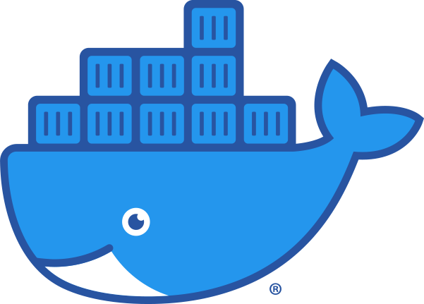

## A propos de moi / nous

- Developpeurs 
- Administrateurs Système
- Ingénieurs Devops : Ansible / Docker / Kubernetes / Gitlab CI) / Sécurité 
- Formateurs DevOps, Linux, Python, Sécurité
- Mais aussi graphistes, musiciens, philosophes de la technique, hackers :)

## A propos de vous

- Parcours ?
- Attentes ?
- Cursus DevOps :
  - Est-ce que ça vous plait ?
  - Quels modules avez vous déjà fait ?
  - Répondre aux questions préalables et éventuelles réticences (normales)
  - Anticiper les problèmes de niveaux différents au sein du groupe / faire des paires

# Infrastructure as Code

## Résumé

- on décrit en mode code un état du système. Avantages :
  - pas de dérive de la configuration et du système (immutabilité)
  - on peut connaître de façon fiable l'état des composants du système
  - on peut travailler en collaboration plus facilement (grâce à Git notamment)
  - on peut faire des tests
  - on facilite le déploiement de nouvelles instances

## Le mouvement DevOps

Le DevOps est avant tout le nom d'un mouvement de transformation professionnelle et technique de l'informatique.

Ce mouvement se structure autour des solutions **humaines** (organisation de l'entreprise et des équipes) et **techniques** (nouvelles technologies de rupture) apportées pour répondre aux défis que sont:

- L'agrandissement rapide face à la demande des services logiciels et infrastructures les supportant.
- La célérité de déploiement demandée par le développement agile (cycles journaliers de développement).
- Difficultées à organiser des équipes hétérogènes de grande taille et qui s'agrandissent très vite selon le modèle des startups.et

Il y a de nombreuses versions de ce que qui caractérise le DevOps mais pour résumer:

Du côté humain:

- Application des process de management agile aux opérations et la gestion des infrastructures (pour les synchroniser avec le développement).
- Remplacement des procédés d'opérations humaines complexes et spécifiques par des opérations automatiques et mieux standardisées.
- Réconciliation de deux cultures divergentes (Dev et Ops) rapprochant en pratique les deux métiers du développeur et de l'administrateur système.

Du côté technique:

- L'intégration et le déploiement continus des logiciels/produits.
- L'infrastructure as code: gestion sous forme de code de l'état des infrastructures d'une façon le plus possible déclarative.
- Les conteneurs (Docker surtout mais aussi Rkt et LXC/LXD): plus léger que la virtualisation = permet d'isoler chaque service dans son "OS" virtuel sans dupliquer le noyau.
- Le cloud (Infra as a service, Plateforme as a Service, Software as a service) permet de fluidifier l'informatique en alignant chaque niveau d'abstraction d'une pile logicielle avec sa structuration économique sous forme de service.

## Aller plus loin

- La DevOps roadmap: [https://github.com/kamranahmedse/developer-roadmap#devops-roadmap](https://github.com/kamranahmedse/developer-roadmap#devops-roadmap)

# L'environnement de développement

- Docker Engine pour lancer des commandes docker

- Docker Compose pour lancer des application multiconteneurs

- Portainer, un GUI Docker

- VirtualBox pour avoir une VM Linux quand on est sur Windows
