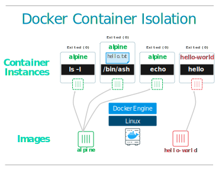

<!-- ## Objectifs Pédagogiques
  - Connaître les outils permettant d'interagir avec docker
  - Lancer un conteneur avec des passages d'arguments
  - Savoir utiliser les commandes ps, run, logs, exec -->


<!-- --- -->

<!-- # Mentalité :
 -->

Il faut prendre l'habitude de **bien lire ce que la console indique** après avoir passé vos commandes.


<!-- --- -->

**Docker est préinstallé sur vos machines par simplicité**, ce sera à vous de l'installer dans l'environnement de travail de votre choix en fonction de vos besoins et des systèmes que vous utiliserez.

On va commencer à interagir avec Docker en utilisant le terminal, aka. ligne de commande, shell, ou terminal.

Par rapport aux applications avec interface, la ligne de commande permet d'apprendre et maîtriser progressivement. 

Une interface comme Portainer est utile, mais elle expose beaucou (trop) de fonctionnalités au départ.

<!-- --- -->

### Un peu de documentation

- `docker --help`
- `man docker`
- `man docker run`

- **Commandes utiles :** [https://devhints.io/docker](https://devhints.io/docker)

- **Documentation Officielle**
  - Toute la documentaion: [https://docs.docker.com/reference/](https://docs.docker.com/reference/)
  - Ex: `docker run` : [https://docs.docker.com/engine/reference/run/](https://docs.docker.com/engine/reference/run/)


<!-- --- -->

<!-- ## Lancer un conteneur "Hello world"

```shell
docker run hello-world
```

**Décomposons cette «ligne de commande»** 

* Le prompt
```shell
"$" est le caractère indiquant qu'on va entrer une commande dans un "PROMPT" 

user@machine:~$ est un prompt plus réaliste mais plus long 
```
* La commande 
```shell
"docker" est ici l'exécutable qu'on appelle sur la machine locale
```
* L'argument
```shell
"run" est un argument qui indique à l'exécutable ce qu'on veut faire.
En l'occurence c'est une commande Docker.
```
* Le sous-argument, le paramètre de la commande
```shell"
"hello-world"" est le nom d'une image Docker sur le DockerHub 
```
cf. [https://hub.docker.com/_/hello-world/](https://hub.docker.com/_/hello-world/) -->

<!-- --- -->

### Docker Hub, chercher une image

Visitez [hub.docker.com](https://hub.docker.com).

C'est l'endroit où va chercher Docker par défaut. 

On nomme cela un registry, on y reviendra.

Par exemple cherchez l'image "debian" sur le Docker Hub.

<!-- --- -->

### Pour vérifier l'installation

Les commandes de base pour connaître l'état de Docker sont :

```shell
docker info  # affiche plein d'information sur l'engine avec lequel vous êtes en contact
docker ps    # affiche les conteneurs en train de tourner
docker ps -a # affiche  également les conteneurs arrêtés
```

Que remarquez-vous ? Quels conteneurs docker sont en train de tourner ?

<!-- --- -->

## Lancer un conteneur avec passages d'arguments

### Les bases

```shell
docker run -it debian 
```
Que se passe-t-il ? Le prompt vous indique que vous avez changé d'environnement.

Pour sortir utilisez la command `exit`

Lancez de nouveau un `docker ps -a`. Que voyez-vous ? 

**`-it` permet de lancer une commande en mode _interactif_ (un terminal comme `bash`).**

Lancez la commande sans mode interactif. Que se passe-t-il ?

<!-- --- -->

### Conteneurs jetables 

```shell
docker run -it debian bash # puis exit le conteneur est toujours là en status exited
docker run -it --rm debian bash # puis exit le conteneur a été supprimé automatiquement
```
**L'argument `--rm ` indique qu'on ne veut pas conserver le conteneur après son arrêt (lorsque le processus principal s'arrête). Il est "jetable".**

- vérifiez cela avec `docker ps` que le conteneur n'existe

### Lancer un conteneur avec une commande

```shell
docker run -it --rm debian echo "hello world"
```

Le conteneur execute la commande `echo` puis s'arrête (et est supprimé grace à `--rm`)

Maintenant lancez:

```shell
docker run -it alpine bash
```

Que se passe-t-il ? 

Il y a une erreur car, il faut que la commande demandée existe dans l'image. Or `alpine` qui est un linux plus léger que `debian` ne contient pas le shell `bash` par défaut.

Ressayons avec le shell `sh`

```shell
docker run -it --rm alpine sh
```

Cette fois nous somme bien connectés au shell


Quelles peuvent être les différences entre les images des deux linux debian et alpine ?

<details><summary>réponse:</summary>

Alpine est un linux plus léger qui contient beaucoup moins de programme et dans des versions allégées par rapport à debian. Ce qui peut être un avantage ou un inconvénient.

Alpine utilise un gestionnaire de paquet différent appelé `apk`.

Alpine a des commandes dont la syntaxe peut être différente de debian par exemple `useradd` n'a pas les même options. Il faudra y être attentif pour la création de dockerfiles.

</details>

### Conteneurs nommés persistants

```shell
docker run -d --name my-nginx nginx
```
Que se passe-t-il ? Inspectez la liste des conteneurs ? Que remarquez-vous ? 

**`-name` permet de donner un nom au conteneur**
**`-d` permet de lancer le conteneur en mode **daemon** ou **détaché** et libérer le terminal**

### Accéder à nginx en réseau pour afficher la page welcome

Pour accéder au conteneur précédent en réseau on peut aller chercher son adresse IP avec `inspect`

```shell
docker container inspect my-nginx
```

Récupérez l'adresse en `172.2` et collez la dans le navigateur. La page d'accueil d'affiche.


Pour éviter d'aller chercher l'IP manuellement du conteneur, IP de sucroit dynamique qui peut changer si on le recrée, on peut lancer le conteneur avec une exposition de port:

```shell
docker run -d nginx


### Lancer un conteneur avec une commande

```shell
docker run -d --name mycontainer -it --rm debian bash -c  'while true; do date; sleep 1; done' 
```


### La commande `logs` : voir la sortie texte d'un conteneur tournant en arrière plan

```shell
docker logs mycontainer
```
Que voyez-vous ? 

**La commande logs permet d'obtenir la sortie du conteneur (STDOUT + STDERR)**

```shell
docker logs  mycontainer -f 
docker logs  mycontainer --tail 3 
docker logs  mycontainer -n 3 -t 

```

```shell
--follow , -f         Follow log output
--tail , -n    all    Number of lines to show from the end of the logs
--timestamps , -t     Show timestamps
```

<!-- --- -->


### Exécuter une commande dans un conteneur déja démarré

**La commande `docker exec` permet d'exécuter une commande à l'intérieur du conteneur s'il est actif**.

Une utilisation typique est d'introspecter un conteneur en lançant `bash` (ou `sh`).

```
docker exec -it <conteneur> /bin/bash
```

On peut aussi exécuter une commande temporaire sans entrer en mode interactif.

```
docker exec <conteneur> su postgres /usr/local/bin/backup_postgres.sh
```

Plusieurs options disponibles :
```
man docker exec 
```

<!-- --- -->

## Récapituler : une image, plusieurs conteneurs



- Un conteneur est une instance en cours de fonctionnement ("vivante") d'une image.

- **L'ordre des arguments est important !**
- **Un nom est automatiquement généré pour le conteneur à moins de fixer le nom avec `--name`**
- On peut facilement lancer autant d'instances que nécessaire tant qu'il n'y a **pas de collision** de **nom** (notamment)

<!-- --- -->
