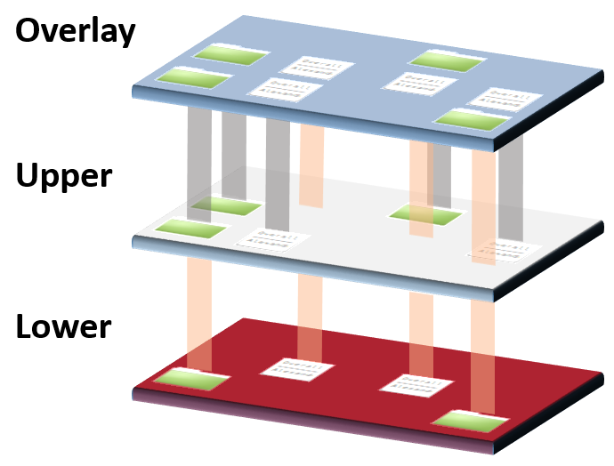

<!-- ## Objectifs pédagogiques
  - Identifier les strates qui composent une image docker
  - Comprendre comment les étapes du Dockerfile commandent les couches


--- -->

### Que se passe-t-il quand on pull une image ?

```shell
docker pull python:3.9
3.9: Pulling from library/python
1e4aec178e08: Downloading [=========================================>         ]  45.75MB/55.05MB
6c1024729fee: Download complete 
c3aa11fbc85a: Download complete 
aa54add66b3a: Downloading [================================================>  ]  53.31MB/54.59MB
9e3a60c2bce7: Downloading [==========>                                        ]  40.86MB/196.9MB
3b2123ce9d0d: Waiting 
079055eff04f: Pulling fs layer 
efbdad4af3b4: Waiting 
6052bc42f4a6: Waiting 

```
On voit que différentes couches sont récupérées individuellement.

Ces couches ont des identifiants, des hashs, et des poids, donc des contenus, différents

Observez l'historique de construction de l'image avec 

```shell
docker image history python:3.9
```

On peut également avoir des informations avancées avec 

```shell
docker image inspect python:3.9
```

<!-- --- -->

### Décortiquer une image

Une image est composée de plusieurs layers empilés entre eux par le Docker Engine et de métadonnées.

- Affichez la liste des images présentes dans votre Docker Engine.

- Inspectez la dernière image que vous venez de créez (`docker image --help` pour trouver la commande)

- Observez l'historique de construction de l'image avec `docker image history <image>`

- Visitons **en root** (`sudo su`) le dossier `/var/lib/docker/` sur l'hôte. En particulier, `image/overlay2/layerdb/sha256/` :

  - On y trouve une sorte de base de données de tous les layers d'images avec leurs ancêtres.
  - Il s'agit d'une arborescence.

- Vous pouvez aussi utiliser la commande `docker save votre_image -o image.tar`, et utiliser `tar -C image_decompressee/ -xvf image.tar` pour décompresser une image Docker puis explorer les différents layers de l'image.

- Pour explorer la hiérarchie des images vous pouvez installer `https://github.com/wagoodman/dive`

<!-- --- -->


## Les layers et la mise en cache

- **Docker construit les images comme une série de "couches" de fichiers successives.**

- On parle d'**Union Filesystem** car chaque couche (de fichiers) écrase la précédente.


 
  
 
  

**Ce système économise de la place.**

Pour simplifier, chaque instruction du Dockerfile crée une nouvelle couche.

Si une couche est déjà utilisée, elle est mise en cache et ne nécessite pas de 

Au lancement d'un container, le Docker Engine rajoute une nouvelle couche de filesystem "normal" read/write par dessus la pile des couches de l'image.

**Ce système est au coeur de l'**immutabilité** des images Docker.** 

On ne peut pas modifier une image "dans le fond", c'est toujours le niveau "de surface" qu'on peut modifier.
  

- Un désavantages : ce système complexifie la compréhension et toute opération d'introspection** : Pas facile de comprendre ce qui se passe et d'aller regarder où se trouve tel fichier.


### Les strates en pratique

La commande `inspect` affiche de nombreuses informations sur un conteneur en exécution, dont les éléments de son "layercake".

```shell
docker inspect <container_id_or_name>
...
                "LowerDir": "/var/lib/docker/overlay2/fb94ce5c9b652d1cee5e372e76dd011cb3993d45d6c91f6c5de4d59d33afb9c2-init/diff:/var/lib/docker/overlay2/ab0fd7ce9f469a3a7f6293fde706d7028a45d5ac377224ede0a65af133385149/diff:/var/lib/docker/overlay2/21f47d9ce63dba375dc372c6bd3ad7dabb0219dccb3174d4201cbe049de1234d/diff:/var/lib/docker/overlay2/51fc7c14a3d976ef7d13b9373c902f1d7ce08cdce6f96a493aa74ac98664f773/diff:/var/lib/docker/overlay2/01a6a79a4b75eddd63b52f5a93a67345caaf62313fe081a8e3ea57b2c315a598/diff:/var/lib/docker/overlay2/40070b4000942701b6a9df6537c89ee50d7bf4777615f80d17cd6b476c70ec96/diff:/var/lib/docker/overlay2/82a250b1fb6486d14b1de2c9787d2569f4204108639adfc801a82845863a314d/diff:/var/lib/docker/overlay2/48ba460a8f37e832fda1f53eee0d084dc7fd6402aa430d567be477cc49e66ffe/diff",
                "MergedDir": "/var/lib/docker/overlay2/fb94ce5c9b652d1cee5e372e76dd011cb3993d45d6c91f6c5de4d59d33afb9c2/merged",
                "UpperDir": "/var/lib/docker/overlay2/fb94ce5c9b652d1cee5e372e76dd011cb3993d45d6c91f6c5de4d59d33afb9c2/diff",
                "WorkDir": "/var/lib/docker/overlay2/fb94ce5c9b652d1cee5e372e76dd011cb3993d45d6c91f6c5de4d59d33afb9c2/work"

```
