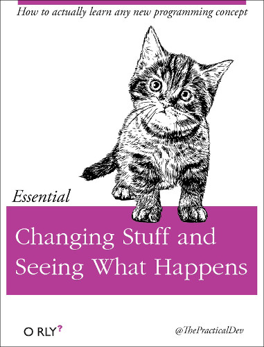

## Objectifs Pédagogiques
  - Connaître les outils permettant d'interagir avec docker
  - Lancer un conteneur avec des passages d'arguments
  - Savoir utiliser les commandes ps, run, exec

**Docker est préinstallé sur vos machines par simplicité, ce sera à vous de l'installer dans l'environnement de travail de votre choix en fonction de vos besoins et des systèmes que vous utiliserez.**

On va commencer à interagir avec Docker en utilisant le terminal, aka. ligne de commande, shell, ou terminal.

Par rapport aux applications avec interface, la ligne de commande permet d'apprendre et maîtriser progressivement. 

Une interface comme Portainer est utile, mais elle expose trop de fonctionnalités au départ.  

## Pour vérifier l'installation

- Les commandes de base pour connaître l'état de Docker sont :

```bash
docker info  # affiche plein d'information sur l'engine avec lequel vous êtes en contact
docker ps    # affiche les conteneurs en train de tourner
docker ps -a # affiche  également les conteneurs arrêtés
```

## Manipuler un conteneur

- **Commandes utiles :** <https://devhints.io/docker>
- **Documentation `docker run` :** <https://docs.docker.com/engine/reference/run/>

Mentalité :

Il faut aussi prendre l'habitude de bien lire ce que la console indique après avoir passé vos commandes.

Avec l'aide du support et de `--help`, et en notant sur une feuille ou dans un fichier texte les commandes utilisées :

- Lancez simplement un conteneur Debian. Que se passe-t-il ?

{}

```bash
docker run debian
# Il ne se passe rien car comme debian ne contient pas de processus qui continue de tourner le conteneur s'arrête
```

{}

- Lancez un conteneur Debian (`docker run` puis les arguments nécessaires, cf. l'aide `--help`)n avec l'option "mode détaché" et la commande passée au conteneur `echo "Je suis le conteneur basé sur Debian"`. Rien n'apparaît. En effet en mode détaché la sortie standard n'est pas connectée au terminal.

- Lancez `docker logs` avec le nom ou l'id du conteneur. Vous devriez voir le résultat de la commande `echo` précédente.

{}

```bash
docker logs <5b91aa9952fa> # n'oubliez pas que l'autocomplétion est activée, il suffit d'appuyer sur TAB !
=> Debian container
```

{}

<-- - Réessayez en affichant le résultat cette fois-ci avec le mode *attached* -->

- Affichez la liste des conteneurs en cours d'exécution

{}

```bash
docker ps
```

{}

- Affichez la liste des conteneurs en cours d'exécution et arrêtés.

{}

```bash
docker ps -a
```

{}

- Lancez un conteneur debian **en mode détaché** avec la commande `sleep 3600`

- Réaffichez la liste des conteneurs qui tournent

- Tentez de stopper le conteneur, que se passe-t-il ?

```
docker stop <conteneur>
```

### Créer et lancer un conteneur


- Un conteneur est une instance en cours de fonctionnement ("vivante") d'une image.

```bash
docker run [-d] [-p port_h:port_c] [-v dossier_h:dossier_c] <image> <commande>
```

> créé et lance le conteneur

- **L'ordre des arguments est important !**
- **Un nom est automatiquement généré pour le conteneur à moins de fixer le nom avec `--name`**
- On peut facilement lancer autant d'instances que nécessaire tant qu'il n'y a **pas de collision** de **nom** ou de **port**.

---

### Options docker run

- Les options facultatives indiquées ici sont très courantes.
  - `-d` permet\* de lancer le conteneur en mode **daemon** ou **détaché** et libérer le terminal
  - `-p` permet de mapper un _port réseau_ entre l'intérieur et l'extérieur du conteneur, typiquement lorsqu'on veut accéder à l'application depuis l'hôte.
  - `-v` permet de monter un _volume_ partagé entre l'hôte et le conteneur.
  - `--rm` (comme _remove_) permet de supprimer le conteneur dès qu'il s'arrête.
  - `-it` permet de lancer une commande en mode _interactif_ (un terminal comme `bash`).
  - `-a` (ou `--attach`) permet de se connecter à l'entrée-sortie du processus dans le container.

---