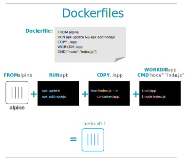

## Objectifs pédagogiques
  - Savoir ajouter des fichiers au système
  - Savoir ajouter des packages, des utilisateurs, etc.
  - Savoir utiliser les commandes RUN, ADD, COPY, WORKSPACE


## Créer une image en utilisant un Dockerfile

- Jusqu'ici nous avons utilisé des images toutes prêtes.

- Une des fonctionnalités principales de Docker est de pouvoir facilement construire des images à partir d'un simple fichier texte : **le Dockerfile**.





## Instruction `RUN`

- Permet de lancer une commande shell (installation, configuration).

## Instruction `ADD`

- Permet d'ajouter des fichier depuis le contexte de build à l'intérieur du conteneur.
- Généralement utilisé pour ajouter le code du logiciel en cours de développement et sa configuration au conteneur.

---


## Découverte d'une application web flask

- Récupérez d’abord une application Flask exemple en la clonant :

```bash
git clone https://github.com/uptime-formation/microblog/
```

- Ouvrez VSCode avec le dossier `microblog` en tapant `code microblog` ou bien en lançant VSCode avec `code` puis en cliquant sur `Open Folder`.

- Dans VSCode, vous pouvez faire `Terminal > New Terminal` pour obtenir un terminal en bas de l'écran.

<-- - Pour la tester d’abord en local (sans conteneur) nous avons besoin des outils python. Vérifions s'ils sont installés :
    `sudo apt install python-pip python-dev build-essential` -->

<-- - Créons l’environnement virtuel : `virtualenv -p python3 venv`

- Activons l’environnement : `source venv/bin/activate` -->

<-- - Installons la librairie `flask` et exportons une variable d’environnement pour déclarer l’application.
    a) `pip install flask`
    b) `export FLASK_APP=microblog.py` -->

<-- - Maintenant nous pouvons tester l’application en local avec la commande : `flask run` -->

<-- - Visitez l’application dans le navigateur à l’adresse indiquée. -->

- Observons ensemble le code dans VSCode.
<-- - Qu’est ce qu’un fichier de template ? Où se trouvent les fichiers de templates dans ce projet ? -->

<-- - Changez le prénom Miguel par le vôtre dans l’application. -->
<-- - Relancez l'app flask et testez la modification en rechargeant la page. -->

## Passons à Docker

Déployer une application Flask manuellement à chaque fois est relativement pénible. Pour que les dépendances de deux projets Python ne se perturbent pas, il faut normalement utiliser un environnement virtuel `virtualenv` pour séparer ces deux apps.
Avec Docker, les projets sont déjà isolés dans des conteneurs. Nous allons donc construire une image de conteneur pour empaqueter l’application et la manipuler plus facilement. Assurez-vous que Docker est installé.

Pour connaître la liste des instructions des Dockerfiles et leur usage, se référer au [manuel de référence sur les Dockerfiles](https://docs.docker.com/engine/reference/builder/).

- Dans le dossier du projet ajoutez un fichier nommé `Dockerfile` et sauvegardez-le

- Normalement, VSCode vous propose d'ajouter l'extension Docker. Il va nous faciliter la vie, installez-le. Une nouvelle icône apparaît dans la barre latérale de gauche, vous pouvez y voir les images téléchargées et les conteneurs existants. L'extension ajoute aussi des informations utiles aux instructions Dockerfile quand vous survolez un mot-clé avec la souris.

- Ajoutez en haut du fichier : `FROM python:3.9` Cette commande indique que notre image de base est la version 3.9 de Python. Quel OS est utilisé ? Vérifier en examinant l'image ou via le Docker Hub.
<-- prendre une autre image ? alpine ? -->

- Nous pouvons déjà contruire un conteneur à partir de ce modèle Ubuntu vide :
  `docker build -t microblog .`

- Une fois la construction terminée lancez le conteneur.
- Le conteneur s’arrête immédiatement. En effet il ne contient aucune commande bloquante et nous n'avons précisé aucune commande au lancement.

<-- Pour pouvoir observer le conteneur convenablement il fautdrait faire tourner quelque chose à l’intérieur. Ajoutez à la fin du fichier la ligne :
  `CMD ["/bin/sleep", "3600"]` -->

Cette ligne indique au conteneur d’attendre pendant 3600 secondes comme au TP précédent.

- Reconstruisez l'image et relancez un conteneur

- Affichez la liste des conteneurs en train de fonctionner

- Nous allons maintenant rentrer dans le conteneur en ligne de commande pour observer. Utilisez la commande : `docker exec -it <id_du_conteneur> /bin/bash`

- Vous êtes maintenant dans le conteneur avec une invite de commande. Utilisez quelques commandes Linux pour le visiter rapidement (`ls`, `cd`...).

- Il s’agit d’un Linux standard, mais il n’est pas conçu pour être utilisé comme un système complet, juste pour une application isolée. Il faut maintenant ajouter notre application Flask à l’intérieur.

<-- Dans le Dockerfile supprimez la ligne CMD, puis ajoutez :

```Dockerfile
RUN apt-get update -y
RUN apt-get install -y python3-pip
``` -->

  <-- - `RUN apt-get install -y python3-pip python-dev build-essential` -->

- Reconstruisez votre image. Si tout se passe bien, poursuivez.

- Pour installer les dépendances python et configurer la variable d'environnement Flask ajoutez:

```Dockerfile
COPY ./requirements.txt /requirements.txt
RUN pip3 install -r requirements.txt
ENV FLASK_APP microblog.py
```

- Reconstruisez votre image. Si tout se passe bien, poursuivez.

- Ensuite, copions le code de l’application à l’intérieur du conteneur. Pour cela ajoutez les lignes :

```Dockerfile
COPY ./ /microblog
WORKDIR /microblog
```

### Ne pas faire tourner l'app en root
- Avec l'aide du [manuel de référence sur les Dockerfiles](https://docs.docker.com/engine/reference/builder/), faire en sorte que l'app `microblog` soit exécutée par un utilisateur appelé `microblog`.

{}

```Dockerfile
# Ajoute un user et groupe appelés microblog
RUN addgroup -S microblog && adduser -S microblog -G microblog
RUN chown -R microblog:microblog ./
USER microblog
```

{}

Construire l'application avec `docker build`, la lancer et vérifier avec `docker exec`, `whoami` et `id` l'utilisateur avec lequel tourne le conteneur.

{}

- `docker build -t microblog .`
- `docker run --detach --name microblog -p 5000:5000 microblog`
- `docker exec -it microblog /bin/bash`

Une fois dans le conteneur lancez:

- `whoami` et `id`
- vérifiez aussi avec `ps aux` que le serveur est bien lancé.

{}

<-- Après avoir ajouté ces instructions, lors du build, que remarque-t-on ?

{}
La construction reprend depuis la dernière étape modifiée. Sinon, la construction utilise les layers précédents, qui avaient été mis en cache par le Docker Engine.
{} -->
