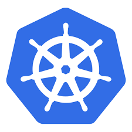

# Formation Kubernetes Débutant

## A propos de moi

---

## A propos de vous

- Parcours ?
- Attentes ?

---

## Le programme de la formation et les objectifs

### Objectifs

- **Maîtrise de l'architecture Kubernetes** : Comprendre le rôle du control plane, de l'API, de la CLI et des workers
- **Déploiement automatisé** : Savoir déployer des ressources Kubernetes en utilisant des manifestes YAML, des solutions d'Infrastructure as Code (IaC) comme Helm, et comprendre l'orchestration des ressources
- **Microservices en production** : Savoir déployer des applications microservices avec Kubernetes en utilisant des Deployments, Services et Ingress et savoir configurer les applications pour un environnement de production en utilisant des ConfigMaps, Secrets et des stratégies de sécurité
- **Scalabilité et observabilité** : Pouvoir mettre en place le scaling automatique, la collecte de logs et le suivi des métriques natives Kubernetes
- **Automatisation intégrée** : Maîtriser les automatisations intégrées de Kubernetes, telles que la gestion du réseau, le cycle de vie des conteneurs ou la boucle de réconciliation des ressources. 
- **Gestion des applications stateful**: Savoir gérer les applications statefuls et assurer la persistance des données à l'aide de StatefulSets et de PersistentVolumes

# Formation Kubernetes pour développeurs — Obtenez la certification CKAD  
Nombre de jours : 3

**Public visé :** Cette formation est destinée aux développeurs qui souhaitent renforcer leurs compétences en matière de déploiement et de gestion d'applications conteneurisées grâce à Kubernetes.

**Description courte :** Acquérez des compétences pratiques en Kubernetes en 3 jours et préparez-vous efficacement à la certification CKAD pour améliorer votre maîtrise du cloud !

### Description

Cette formation Kubernetes vous permettra d'acquérir les compétences essentielles pour déployer et gérer des applications conteneurisées avec confiance et efficacité. 

Pendant trois jours, vous apprendrez à configurer, sécuriser et maintenir vos applications, tout en assurant leur scalabilité et leur disponibilité.

Vous découvrirez : 

- les qualités de Kubernetes en tant qu'environnement de cloud natif ainsi que les implications opérationnelles et les coûts associés à son adoption,  
- comment utiliser les outils de surveillance et de journalisation pour garder le contrôle sur vos déploiements, même en environnement de production  
- comment intégrer Kubernetes dans vos flux de travail DevOps et de développement agile.

À l'issue de cette formation, vous serez prêt à passer la certification CKAD (Certified Kubernetes Application Developer) et à intégrer ces compétences directement dans vos projets.

Que vous soyez développeur débutant ou expérimenté dans l'utilisation de conteneurs, cette formation vous apportera une maîtrise solide des pratiques Kubernetes pour propulser votre carrière dans le cloud.

---

#### Vous avez un profil plutôt orienté devops ? 

Notre formation [Kubernetes pour les devops]( https://www.humancoders.com/formations/kubernetes) est faite pour vous !

### Objectifs

* **Maîtrise de l'architecture Kubernetes** : Comprendre le rôle du control plane, de l'API, de la CLI et des workers  
* **Déploiement automatisé** : Savoir déployer des ressources Kubernetes en utilisant des manifestes YAML, des solutions d'Infrastructure as Code (IaC) comme Helm, et comprendre l'orchestration des ressources  
* **Microservices en production** : Savoir déployer des applications microservices avec Kubernetes en utilisant des Deployments, Services et Ingress et savoir configurer les applications pour un environnement de production en utilisant des ConfigMaps, Secrets et des stratégies de sécurité  
* **Scalabilité et observabilité** : Pouvoir mettre en place le scaling automatique, la collecte de logs et le suivi des métriques natives Kubernetes  
* **Automatisation intégrée** : Maîtriser les automatisations intégrées de Kubernetes, telles que la gestion du réseau, le cycle de vie des conteneurs ou la boucle de réconciliation des ressources.   
* **Gestion des applications stateful**: Savoir gérer les applications statefuls et assurer la persistance des données à l'aide de StatefulSets et de PersistentVolumes

### Programme

#### Jour 1 : Les fondamentaux de Kubernetes

##### Matin 

**Théorie / Stratégie**
- Rappels sur la conteneurisation : images, instances, cycle de vie  
- Architecture de Kubernetes  
- Manifestes Kubernetes  
- Description des ressources Kubernetes  
- Utilisation du namespace  

**TP1 : Déploiement d'un Pod unique via la ligne de commande**

##### Après-midi 

**Théorie / Stratégie**

- Compréhension du Pod  
- Utilisation des Volumes  
- Gestion des Workloads  
    

**TP2 : Déploiement avec des manifestes YAML** de deployment
.

---

#### Jour 2 : Gestion des applications et sécurité

##### Matin 

**Théorie / Stratégie**
- Utilisation des ConfigMaps et Secrets  
- Utilisation des Volumes éphémères et persistants  
- Limiter les ressources (CPU, mémoire) et quotas  
- Sécurisation des applications  
  - Contextes de sécurité  
  - ServiceAccounts  

**TP3 : Ajout de Volumes, ConfigMaps, Secrets et restrictions** 

##### Après-midi 

**Théorie / Stratégie**

- Stratégies de déploiement communes   
  - Stratégies standard : Recreate, RollingUpdate  
  - Stratégies avancées : Blue/Green et Canary  
  - Pause et Rollback  
- Utilisation des services pour l’automatisation du réseau  
- Services

**TP4 : Ajout de bases de données (StatefulSets) avec des données persistantes** 

---

#### Jour 3 : Réseau et observabilité

##### Matin 

**Théorie / Stratégie**

- Contrôle du trafic avec Network Policies  
- Utilisation de l’exposition via Ingress et Gateway  
- Surveillance et journalisation  
  - Prometheus  
  - Grafana  

**TP5 : Mise en place d'un Ingress et application de Network Policies**

##### Après-midi 

**Théorie / Stratégie**

- Custom Resource Definitions (CRDs)  
  - Installer  des CRDs et des opérateurs  
- Debugging et gestion des pannes  
  - Diagnostiquer les erreurs avec kubectl (logs, exec, port-forward)  
  - Utiliser l’API debug de Kubernetes

**TP6 : Exposition des logs des Pods et des métriques natives de Kubernetes**

