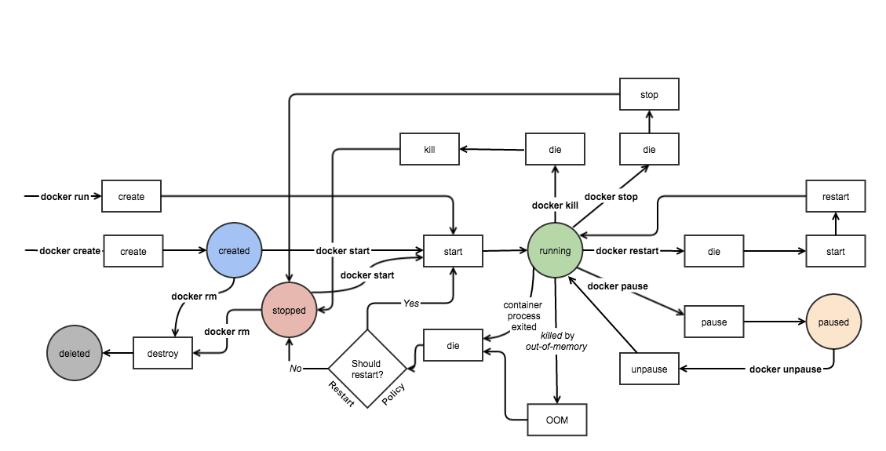
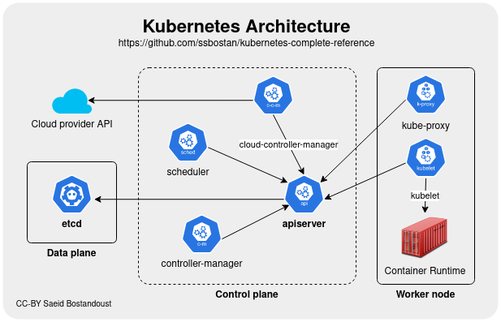
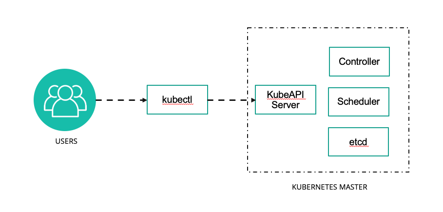

# Jour 1 - Matin

## Rappels sur la conteneurisation : images, instances, cycle de vie  


### Les images Docker


**Chaque layer correspond à une information qui peut être mise en cache**

Quel est l'intérêt ? 

Quelles sont les impacts en terme de construction de Dockerfiles ?

Savez-vous ce que fait la commande `docker commit` ? En quoi est-elle utile ? 

---

### Les instances


**Une instance est l'exécution d'un process dans un espace de conteneurisation sur la base d'un exécutable dans une image Docker.**

Quels sont les composants qui permettent ce processus ? 

---

### Le cycle de vie des instances Docker



**Docker gère les images et les instance de la création à la destruction.**

---

### Les volumes Docker


**Le montage de volumes dans Docker se base sur les processus des montages dans Linux.**

---

### Les réseaux Docker


**Les réseaux Docker sont automatisés : DNS, IP Address Management, et plus.**

---

## Architecture de Kubernetes  

**Kubernetes est devenu la solution de facto pour résoudre les problématiques de déploiements d'images Docker à l'échelle.**



#### Les noeuds Kubernetes

Les nœuds d’un cluster sont les machines (serveurs physiques, machines virtuelles, etc. généralement Linux mais plus nécessairement aujourd'hui) qui exécutent vos applications et vos workflows. Tous les noeuds d'un cluster qui ont besoin de faire tourner des taches (workloads) kubernetes utilisent trois services de base:

- Comme les workloads sont généralement conteneurisés chaque noeud doit avoir une _runtime de conteneur_ compatible avec la norme `Container Runtime Interface (CRI)` : `containerd`,`cri-o` ou `Docker` n'est pas la plus recommandée bien que la plus connue. Il peut également s'agir d'une runtime utilisant de la virtualisation.
- Le `kubelet` composant (binaire en go, le seul composant jamais conteneurisé) qui controle la création et l'état des pods/conteneur sur son noeud.
- D'autres composants et drivers pour fournir fonctionnalités réseau (`Container Network Interface - CNI` et `kube-proxy`) ainsi que fonctionnalités de stockage (`Drivers Container Storage Interface (CSI)`)

Pour utiliser Kubernetes, on définit un état souhaité en créant des ressources (pods/conteneurs, volumes, permissions etc). Cet état souhaité et son application est géré par le `control plane` composé des noeuds master.

#### Les noeuds master kubernetes forment le `Control Plane` du Cluster

Le control plane est responsable du maintien de l’état souhaité des différents éléments de votre cluster. Lorsque vous interagissez avec Kubernetes, par exemple en utilisant l’interface en ligne de commande `kubectl`, vous communiquez avec les noeuds master de votre cluster (plus précisément l'`API Server`).

Le control plane conserve un enregistrement de tous les objets Kubernetes du système. À tout moment, des `boucles de contrôle` s'efforcent de faire converger l’état réel de tous les objets du système pour correspondre à l’état souhaité que vous avez fourni. Pour gérer l’état réel de ces objets sous forme de conteneurs (toujours) avec leur configuration le control plane envoie des instructions aux différents kubelets des noeuds.

Donc concrêtement les noeuds du control plane Kubernetes font tourner, en plus de `kubelet` et `kube-proxy`, un ensemble de services de contrôle:

  - `kube-apiserver`: expose l'API (rest) kubernetes, point d'entrée central pour la communication interne (intercomposants) et externe (kubectl ou autre) au cluster.
  - `kube-controller-manager`: controlle en permanence l'état des resources et essaie de le corriger s'il n'est plus conforme.
  - `kube-scheduler`: Surveille et cartographie les resources matérielles et les contraintes de placement des pods sur les différents noeuds pour décider ou doivent être créés ou supprimés les conteneurs/pods.
  - `cloud-controller-manager`: Composant *facultatif* qui gère l'intégration avec le fournisseur de cloud comme par exemple la création automatique de loadbalancers pour exposer les applications kubernetes à l'extérieur du cluster.

L'ensemble de la configuration kubernetes est stockée de façon résiliante (consistance + haute disponilibilité) dans un gestionnaire configuration distributé qui est généralement `etcd`.

`etcd` peut être installé de façon redondante sur les noeuds du control plane ou configuré comme un système externe sur un autre ensemble de serveurs.

Lien vers la documentation pour plus de détails sur les composants : https://kubernetes.io/docs/concepts/overview/components/

---

**La solution s'appuie sur une multitude de ressources qui composent des architectures articulables.**


---

Désormais il existe de nombreuses solutions dérivées de cette architecture K8S.

### "Vanilla" K8S

La distribution originale et open-source de Kubernetes.

### MicroKube et k3s

Formules légères par rapport à k8s, qui visent à déployer sur un seul noeud.

K3S présente la capacité à opérer un cluster plus étendu si besoin.

### AWS ECS / EKS, GKE, AKS

Amazon Elastic Container Service est une solution d'orchestration conçue et opérée en service managé par AWS. Code non libre.

Face au succès grandissant de Kubernetes, Amazon Kubernetes Service est apparu, pour fournir des clusters k8s par Amazon.

Google Cloud et Azure fournissent également des solutions qui visent à réduire la dépendance technique.

Ils fournissent également les services managés (Bases de données, stockage, réseau) permettant de gérer ses services externes dans un seul lieu.


###  Openshift

Solution commerciale de RedHat pour faire du Platform As A Service sur une base Kubernetes.

Disponible on premise ou sur de nombreux clouds, OpenShift intègre différents logiciels libres  pour fournir *out of the box* des fonctionnalités avancées, y compris le build d'image automatisé.


---

### Les fondamentaux de K8S 

**Tout est un conteneur** 

L'infrastructure logicielle de Kubernetes est basé un jeu d'API, implémenté par 2 outils interactifs en ligne de commande 

* kubeadm pour les administrateurs
* kubectl pour les utilisateurs

De fait il existe des GUI permettant de piloter Kubernetes, comme Lens ou des panels web.

Les composants effectifs de Kubernetes (API, pilotage des noeuds, etc.) sont tous des conteneurs.

Ceci simplifie la mise à jour du système.

**Un control plane d'administration et des nodes d'exécution** 

Le control plane est la partie administrative et les noeuds sont destinés aux conteneurs des utilisateurs.

Les noeuds reçoivent les demandes du control plane et les appliquent.

Le control plane est chargé de recevoir les appels d'API, de gérer les AAA (Authentification Authorisation Accounting), et de traiter l'orchestration.

**Un système d'orchestration basé sur les intentions** 

Les manifestes envoyés par les utilisateurs définissent l'état idéal souhaité par l'utilisateur.

L'orchestrateur peut rejeter certaines requêtes invalides.

Les requêtes valides sont traitées de manière asynchrone selon un plan de réalisation ordonné.

**De la sécurité intégrée et intégrable**

K8S utilise du Role Based Access Control pour les utilisateurs, et des service accounts pour accéder à l'API.  

Les ressources sont cloisonnées et limitées via des namespaces de cluster.

Les règles de sécurisation des conteneurs sont définies par les utilisateurs, mais on peut imposer des minimums (ex: no root user, read only, etc.).

Des règles de sécurité réseaux sont définies pour bloquer les flux indésirables.

Et il existe tout un écosystème de solutions dédiées, comme Falco qui surveille au niveau des appels système que rien d'anormal ne se produise, et logge tous les appels.

---


### Installation de K3S


**K3S installe son propre client kubectl.** 




Pour s'assurer que c'est le bon kubectl qu'on utilise, sur Ubuntu on fait : `sudo snap remove kubectl`.

**L'installation de K3S est volontairement simplissime comme vous pouvez le voir sur https://docs.k3s.io/quick-start**


```shell

curl -sfL https://get.k3s.io | sh -

```


- Faites `kubectl version` pour afficher la version du client kubectl.

- Faites `kubectl config view` pour afficher la configuration .

---

#### Configuration de connexion `kubeconfig`

Pour se connecter, `kubectl` a besoin de l'adresse de l'API Kubernetes, d'un nom d'utilisateur et d'un certificat.

- Ces informations sont fournies sous forme d'un fichier YAML appelé `kubeconfig`
- Comme nous le verrons en TP ces informations sont généralement fournies directement par le fournisseur d'un cluster k8s (provider ou k8s de dev)

Le fichier `kubeconfig` par défaut se trouve sur Linux à l'emplacement `~/.kube/config`.

On peut aussi préciser la configuration au *runtime* comme ceci: `kubectl --kubeconfig=fichier_kubeconfig.yaml <commandes_k8s>`

Le même fichier `kubeconfig` peut stocker plusieurs configurations dans un fichier YAML :

Exemple :

```yaml
apiVersion: v1

clusters:
- cluster:
    certificate-authority: /home/jacky/.minikube/ca.crt
    server: https://172.17.0.2:8443
  name: minikube
- cluster:
    certificate-authority-data: LS0tLS1CRUdJTiBDRVJUSUZJQ0FURS0tLS0tCk1JSURKekNDQWcrZ0F3SUJBZ0lDQm5Vd0RRWUpLb1pJaHZjTkFRRUxCUUF3TXpFVk1CTUdBMVVFQ2hNTVJHbG4KYVhSaGJFOWpaV0Z1TVJvd0dBWURWUVFERXhGck9<clipped>3SCsxYmtGOHcxdWI5eHYyemdXU1F3NTdtdz09Ci0tLS0tRU5EIENFUlRJRklDQVRFLS0tLS0K
    server: https://5ba26bee-00f1-4088-ae11-22b6dd058c6e.k8s.ondigitalocean.com
  name: do-lon1-k8s-tp-cluster

contexts:
- context:
    cluster: minikube
    user: minikube
  name: minikube
- context:
    cluster: do-lon1-k8s-tp-cluster
    user: do-lon1-k8s-tp-cluster-admin
  name: do-lon1-k8s-tp-cluster
current-context: do-lon1-k8s-tp-cluster

kind: Config
preferences: {}

users:
- name: do-lon1-k8s-tp-cluster-admin
  user:
      token: 8b2d33e45b980c8642105ec827f41ad343e8185f6b4526a481e312822d634aa4
- name: minikube
  user:
    client-certificate: /home/jacky/.minikube/profiles/minikube/client.crt
    client-key: /home/jacky/.minikube/profiles/minikube/client.key
```

Ce fichier déclare 2 clusters (un local, un distant), 2 contextes et 2 users.

---

## Manifestes Kubernetes  


### L'API et les Objets Kubernetes

Utiliser Kubernetes consiste à déclarer des objets grâce à l’API Kubernetes pour décrire l’état souhaité d'un cluster : quelles applications ou autres processus exécuter, quelles images elles utilisent, le nombre de replicas, les ressources réseau et disque que vous mettez à disposition, etc.

On définit des objets généralement via l’interface en ligne de commande et `kubectl` de deux façons :

- en lançant une commande `kubectl run <conteneur> ...`, `kubectl expose ...`
- en décrivant un objet dans un fichier YAML ou JSON et en le passant au client `kubectl apply -f monpod.yaml`

Vous pouvez également écrire des programmes qui utilisent directement l’API Kubernetes pour interagir avec le cluster et définir ou modifier l’état souhaité. **Kubernetes est complètement automatisable !**

---

**Le pod est une ressource fondamentale dans Kubernetes.**

C'est celle qui définit la manière dont seront instanciés les conteneurs.

Elle nécessite les champs suivants : 
- pod.spec.containers.image : l'image Docker du conteneur 
- pod.spec.metatadata.name : le nom du pod 

---

**La commande `run` de `kubectl` permet de créer des pods.**

On retrouve les mêmes champs obligatoires, car `kubectl` est juste un client d'API qui convertit les commandes en YAML.

```yaml
kubectl run --help
kubectl run nginx-pod --image nginx:latest
```

---

### Description des ressources Kubernetes  

---

### Parenthèse : Le YAML


**Kubernetes décrit ses ressources en YAML. A quoi ça ressemble, YAML ?**

```yaml
- marché:
    lieu: Marché de la Place
    jour: jeudi
    horaire:
      unité: "heure"
      min: 12
      max: 20
    fruits:
      - nom: pomme
        couleur: "verte"
        pesticide: avec

      - nom: poires
        couleur: jaune
        pesticide: sans
    légumes:
      - courgettes
      - salade
      - potiron
```

---

### Syntaxe

- Alignement ! (**2 espaces** !!)
- des listes (tirets)
- des ditionnaires composés d'un ensemble de paires **clé: valeur** (dans n'importe quel ordre !)
- Un peu comme du JSON, avec cette grosse différence que le JSON se fiche de l'alignement et met des accolades et des points-virgules
- **les extensions Kubernetes et YAML dans VSCode vous aident à repérer des erreurs**

#### Syntaxe de base d'une description YAML Kubernetes

Les description YAML permettent de décrire de façon lisible et manipulable de nombreuses caractéristiques des ressources Kubernetes (un peu comme un *Compose file* par rapport à la CLI Docker).

##### Exemple

Création d'un service simple :

```yaml
# API VERSION : MANDATORY 
apiVersion: v1
# KIND  : MANDATORY 
kind: Service
# METADATA  : MANDATORY 
metadata:
  labels:
    k8s-app: kubernetes-dashboard
  name: kubernetes-dashboard
  namespace: kubernetes-dashboard
# SPEC : ALL WITH EXCEPTIONS  
spec:
  ports:
    - port: 443
      targetPort: 8443
  selector:
    k8s-app: kubernetes-dashboard
  type: NodePort
```

---

**Organisation de la syntaxe :**

- Les resources k8s sont des dictionnaires 
- Toutes les descriptions doivent commencer par spécifier le module d'API et sa version à partir de laquelle notre objet peut être créé et manipulé.
- Il faut ensuite préciser le type d'objet avec `kind`
- La section `metadata` est identique pour chaque type de resource et contient en particulier le nom, les étiquetes diverses, et éventuellement le namespace de la ressource. Le nom dans `metadata:\n name: value` est également obligatoire.
- La section `spec` qui précise tous les paramètres désirés spécifiques à la resource en question.  
  Les paramètres de la spec sont pour beaucoup facultatifs et prennent leur valeur par défaut s'ils ne sont pas écrit explicitement.

---

**On peut aller observer les paramètres en ligne de commande avec la commande `kubectl explain`**

```bash
kubectl explain pod
kubectl explain pod.spec.containers
kubectl explain pod --recursive
```

---

#### Description de plusieurs ressources

- On peut mettre plusieurs ressources à la suite dans un fichier k8s : cela permet de décrire une installation complexe en un seul fichier

  - par exemple le dashboard Kubernetes [https://raw.githubusercontent.com/kubernetes/dashboard/v2.7.0/aio/deploy/recommended.yaml](https://raw.githubusercontent.com/kubernetes/dashboard/v2.7.0/aio/deploy/recommended.yaml)

- L'ordre n'importe pas car les ressources sont décrites déclarativement c'est-à-dire que:

  - Les dépendances entre les ressources sont déclarées
  - Le control plane de Kubernetes se charge de planifier l'ordre correct de création en fonction des dépendances (pods avant le déploiement, rôle avec l'utilisateur lié au rôle)
  - On préfère cependant les mettre dans un ordre logique pour que les humains puissent les lire.

- On peut sauter des lignes dans le YAML et rendre plus lisible les descriptions
- On sépare les différents objets par `---`

---

## Utilisation du namespace  


### Explorons notre cluster k8s

**Notre cluster k8s est plein d'objets divers, organisés entre eux de façon dynamique pour décrire des applications, tâches de calcul, services et droits d'accès. La première étape consiste à explorer un peu le cluster :**

Listez les nodes pour récupérer le nom de l'unique node (`kubectl get nodes`) puis affichez ses caractéristiques avec `kubectl describe node/xxx`.

La commande `get` est générique et peut être utilisée pour récupérer la liste de tous les types de ressources ou d'afficher les informations d'une ressource précise.

 Pour désigner un seul objet, il faut préfixer le nom de l'objet par son type (ex : `kubectl get nodes minikube` ou `kubectl get node/minikube`) car k8s ne peut pas deviner ce que l'on cherche quand plusieurs ressources de types différents ont le même nom.


De même, la commande `describe` peut s'appliquer à tout objet k8s.
- Pour afficher tous les types de ressources à la fois que l'on utilise : `kubectl get all`

```
NAME                 TYPE        CLUSTER-IP     EXTERNAL-IP   PORT(S)   AGE
service/kubernetes   ClusterIP   10.96.0.1   <none>        443/TCP   2m34s
```

Il semble qu'il n'y a qu'une ressource dans notre cluster. Il s'agit du service d'API Kubernetes, pour que les pods/conteneurs puissent utiliser la découverte de service pour communiquer avec le cluster.

---

**En réalité il y en a généralement d'autres cachés dans les autres `namespaces`.** 

En effet les éléments internes de Kubernetes tournent eux-mêmes sous forme de services et de daemons Kubernetes. Les *namespaces* sont des groupes qui servent à isoler les ressources de façon logique et en termes de droits (avec le *Role-Based Access Control* (RBAC) de Kubernetes).

Pour vérifier cela on peut :

- Afficher les namespaces : `kubectl get namespaces`

---

**Un cluster Kubernetes a généralement un namespace appelé `default` dans lequel les commandes sont lancées et les ressources créées si on ne précise rien.** 

Il a également aussi un namespace `kube-system` dans lequel résident les processus et ressources système de k8s. Pour préciser le namespace on peut rajouter l'argument `-n` à la plupart des commandes k8s.

- Pour lister les ressources liées au `kubectl get all -n kube-system`.

- Ou encore : `kubectl get all --all-namespaces` (peut être abrégé en `kubectl get all -A`) qui permet d'afficher le contenu de tous les namespaces en même temps.

- Pour avoir des informations sur un namespace : `kubectl describe namespace/kube-system`

---

**Avec les droits suffisants, on peut créer un namespace pour obtenir une isolation au sein du cluster.**

 `kubectl create namespace [namespace]>` 
 
---

**Cette isolation permet plusieurs choses :**

- isoler les resources pour éviter les conflits de nom, par exemple quand on veut déployer plusieurs fois la même application (le meme code yaml) sans changer le nom des resources (comme ajouter un préfixe/sufixe).
- ne voir que ce qui concerne une tâche particulière (ne réfléchir que sur une seule chose lorsqu'on opère sur un cluster)
- créer des limites de ressources (CPU, RAM, etc.) pour le namespace
- définir des rôles et permissions sur le namespace qui s'appliquent à toutes les ressources à l'intérieur.

---

**Lorsqu'on lit ou créé des objets sans préciser le namespace, ces objets sont liés au namespace `default`.**

Pour utiliser un namespace autre que `default` avec `kubectl` il faut :

- le préciser avec l'option `-n` : `kubectl run -n [namespace] [name]  --image [image ex:nginx]`
- créer une nouvelle configuration dans la kubeconfig pour changer le namespace par defaut.
