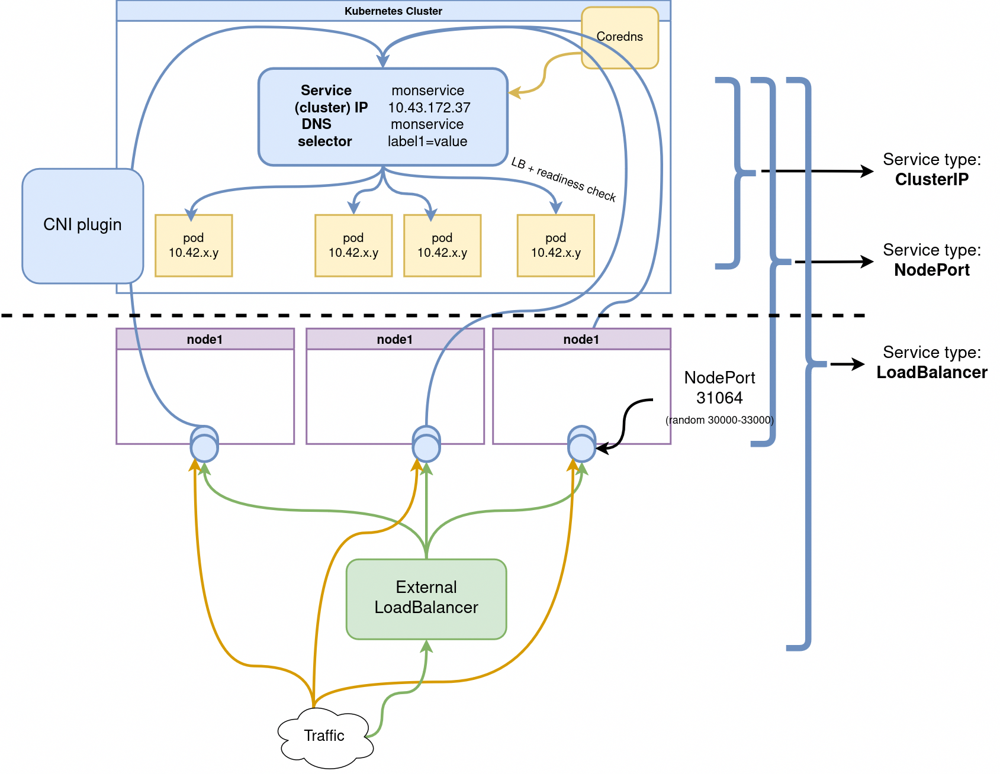

# Jour 2 - Après Midi

Voici une version complète et structurée de la section "Stratégies de déploiement" pour une formation Kubernetes.

---

## Stratégies de déploiement communes

### Introduction

Dans Kubernetes, les stratégies de déploiement sont définies dans la directive `strategy` d’un objet **Deployment**. Cette directive contrôle la manière dont les mises à jour des Pods sont gérées lors du déploiement de nouvelles versions d'une application. Il existe plusieurs types de stratégies qui permettent de gérer les interruptions de service et d'optimiser les ressources pendant les déploiements.

Les principales stratégies de déploiement sont les suivantes :

- **Recreate** : Tous les Pods sont supprimés, puis de nouveaux Pods sont créés avec la nouvelle version.
> Pendant un intervalle aucun Pod n'est disponible, suivi du démarrage des nouveaux Pods.
- **RollingUpdate** : Mise à jour progressive des Pods, en remplaçant petit à petit les anciens Pods par les nouveaux.
> Transition progressive avec des Pods des deux versions (ancienne et nouvelle) en fonctionnement pendant la mise à jour.
- **Stratégies avancées** comme **Blue/Green** et **Canary** offrent des approches plus complexes, souvent gérées en dehors des fonctionnalités de base de Kubernetes, mais supportées via des outils comme Argo Rollouts ou des configurations personnalisées.
s illustrant les différentes stratégies de déploiement dans Kubernetes :
> Blue/Green : Deux environnements distincts sont montrés, avec un basculement de Blue à Green.  
> Canary:  Une petite partie du trafic est envoyée à la nouvelle version avant une montée en charge progressive.

---

### Stratégies standard

#### Recreate

Avec cette stratégie, Kubernetes supprime tous les Pods existants avant de créer les nouveaux Pods avec la nouvelle version de l'application. Cette approche garantit qu'il n'y a pas d'ancienne version en cours d'exécution après le déploiement, mais entraîne un temps d'indisponibilité.

```yaml
apiVersion: apps/v1
kind: Deployment
metadata:
  name: my-app
spec:
  replicas: 3
  strategy:
    type: Recreate
  template:
    spec:
      containers:
      - name: my-app-container
        image: my-app:v2
```

#### RollingUpdate

La stratégie par défaut dans Kubernetes. Elle consiste à mettre à jour les Pods de manière progressive, avec des Pods de la nouvelle version remplacés petit à petit, tout en gardant certains Pods de l'ancienne version actifs jusqu'à la fin de la mise à jour.

```yaml
apiVersion: apps/v1
kind: Deployment
metadata:
  name: my-app
spec:
  replicas: 3
  strategy:
    type: RollingUpdate
    rollingUpdate:
      maxSurge: 1
      maxUnavailable: 1
  template:
    spec:
      containers:
      - name: my-app-container
        image: my-app:v2
```
---

#### Piloter le déploiement de nouvelles versions

- **MaxUnavailable vs MaxSurge** :
  - **MaxUnavailable** : Indique le nombre maximal de Pods qui peuvent être indisponibles pendant un déploiement. Par exemple, si vous définissez `maxUnavailable: 1`, au maximum un Pod peut être hors service pendant le déploiement, assurant une haute disponibilité.
  - **MaxSurge** : Indique le nombre maximal de Pods supplémentaires (surge) qui peuvent être créés au-delà du nombre de réplicas définis pendant la mise à jour. Par exemple, avec `maxSurge: 1`, Kubernetes peut créer un Pod supplémentaire pour accélérer la mise à jour sans attendre que les anciens Pods soient terminés.

- **Progress Deadline Seconds** :
  C'est le délai (en secondes) accordé à Kubernetes pour vérifier que le déploiement progresse correctement. Si, dans ce délai, Kubernetes n'a pas atteint l'avancement attendu (par exemple, la mise à jour d'un certain nombre de Pods), le déploiement est considéré comme échoué. Cela permet de détecter des problèmes rapidement.

- **Revision History Limit** :
  Ce paramètre contrôle combien d'anciennes révisions d'un déploiement sont conservées dans l'historique. Si ce nombre est dépassé, Kubernetes supprime les révisions les plus anciennes. Cela permet d'éviter une accumulation excessive de versions tout en permettant des rollbacks rapides vers des révisions récentes.


---

### Pause et Rollback

Kubernetes permet de mettre en pause un déploiement en cours pour examiner ou résoudre des problèmes avant de le reprendre.

- **Pause** un déploiement :

```bash
kubectl rollout pause deployment my-app
```

- **Reprendre** un déploiement en pause :

```bash
kubectl rollout resume deployment my-app
```

- **Rollback** à la version précédente :

```bash
kubectl rollout undo deployment my-app
```

---

## Utilisation des services pour l’automatisation du réseau  


### Réseau standard de Kubernetes

La configuration réseau standard pour Kubernetes implique l'utilisation de Flannel comme CNI plugin (solution de réseau virtuel compatible Container Network Interface) et de Kube-proxy en mode iptables (configuration par défaut de k3s par exemple mais aussi la configuration la plus simple avec kubeadm etc).

Dans cette configuration, Flannel est responsable de la mise en place d'un réseau virtuel (on parle de network fabric) qui permet aux pods de communiquer entre eux sur différents nœuds dans le cluster. Flannel assigne une adresse IP unique à chaque pod et crée un tunnel VXLAN ou UDP entre les nœuds pour permettre la communication entre les pods.

Kube-proxy, configuré en mode iptables, utilise l'outil iptables (de filtrage de paquet dans le noyaux Linux)  pour gérer le trafic réseau dans le cluster. Il crée des règles iptables pour faire suivre le trafic vers les endpoints des pods ou des services appropriés en fonction de leurs adresses IP et des ports. Kube-proxy maintient également une table NAT pour gérer le trafic entrant vers le cluster.


## CNI (container network interface) : Les implémentations du réseau Kubernetes

Beaucoup de solutions de réseau qui se concurrencent, demandant un comparatif un peu fastidieux.

  - plusieurs solutions toutes robustes
  - diffèrent sur l'implémentation : BGP, réseau overlay ou non (encapsulation VXLAN, IPinIP, autre)
  - toutes ne permettent pas d'appliquer des **NetworkPolicies** : l'isolement et la sécurité réseau
  - peuvent parfois s'hybrider entre elles (Canal = Calico + Flannel)

- Calico, Flannel, Weave ou Cilium sont très employées et souvent proposées en option par les fournisseurs de cloud
- Flannel est simple et éprouvé mais sans network policies ou observabilité avancée
- Cilium a la particularité d'utiliser la technologie eBPF de Linux qui permet une sécurité et une rapidité accrue

Comparaisons :
- <https://rancher.com/blog/2019/2019-03-21-comparing-kubernetes-cni-providers-flannel-calico-canal-and-weave/>

## Vidéos

Quelques vidéos assez complète sur le réseau :
- [Kubernetes Ingress networking](https://www.youtube.com/watch?v=40VfZ_nIFWI&list=PLoWxE_5hnZUZMWrEON3wxMBoIZvweGeiq&index=5)
- [Kubernetes Services networking](https://www.youtube.com/watch?v=NFApeJRXos4&list=PLoWxE_5hnZUZMWrEON3wxMBoIZvweGeiq&index=4)

- Vidéo sur le fonctionnement détaillé du réseau d'un pod : https://www.youtube.com/watch?v=5cNrTU6o3Fw
- Vidéo sur le fonctionnement détaillé des services (pas du réseau sous jacent comme la précédente mais des objets) : https://www.youtube.com/watch?v=T4Z7visMM4E


---


#### Les Services

**Les services sont les objets réseau de base.** 

Dans Kubernetes, un **service** est un objet qui :
- Désigne un ensemble de pods (grâce à des labels) généralement géré par un déploiement.
- Fournit un endpoint réseau pour les requêtes à destination de ces pods.
- Configure une politique permettant d’y accéder depuis l'intérieur ou l'extérieur du cluster.
- Configure un nom de domaine pointant sur le groupe de pods en backend.


--- 


**L’ensemble des pods ciblés par un service est déterminé par un `selector`.**

Par exemple, considérons un backend de traitement d’image (*stateless*, c'est-à-dire ici sans base de données) qui s’exécute avec 3 replicas.  

 Ces replicas sont interchangeables et les frontends ne se soucient pas du backend qu’ils utilisent.  

 Bien que les pods réels qui composent l’ensemble `backend` puissent changer, les clients frontends ne devraient pas avoir besoin de le savoir, pas plus qu’ils ne doivent suivre eux-mêmes l'état de l’ensemble des backends.

L’abstraction du service permet ce découplage : les clients frontend s'addressent à une seule IP avec un seul port dès qu'ils ont besoin d'avoir recours à un backend.  

 Les backends vont recevoir la requête du frontend aléatoirement.

---

**Les Services sont de trois types principaux :**

- `ClusterIP`: expose le service **sur une IP interne** au cluster.

- `NodePort`: expose le service depuis l'IP de **chacun des noeuds du cluster** en ouvrant un port directement sur le nœud, entre 30000 et 32767.  
  Cela permet d'accéder aux pods internes répliqués.  

  Comme l'IP est stable on peut faire pointer un DNS ou Loadbalancer classique dessus.

- `LoadBalancer`: expose le service en externe à l’aide d'un Loadbalancer de fournisseur de cloud.  
   Les services NodePort et ClusterIP, vers lesquels le Loadbalancer est dirigé sont automatiquement créés.
  

<!-- *Crédits à [Ahmet Alp Balkan](https://medium.com/@ahmetb) pour les schémas* -->

Deux autres types plus avancés:

- `ExternalName`: Un service `ExternalName`  est typiquement utilisé pour permettre l'accès à un service externe en le mappant à un nom DNS interne, facilitant ainsi la redirection des requêtes sans utiliser un proxy ou un load balancer. (https://stackoverflow.com/questions/54327697/kubernetes-externalname-services)

- `headless` (avec `ClusterIP: None`):  est utilisé pour permettre la découverte directe des pods via leur ip au sein d'un service.  

 Ce mode est souvent utilisé pour des applications nécessitant une connexion directe entre instances, comme les bases de données distribuées ou data broker (kafka). (https://stackoverflow.com/questions/52707840/what-is-a-headless-service-what-does-it-do-accomplish-and-what-are-some-legiti)


---

### Quelques ressources plus détaillées:

https://nigelpoulton.com/explained-kubernetes-service-ports/
https://nigelpoulton.com/demystifying-kubernetes-service-discovery/
