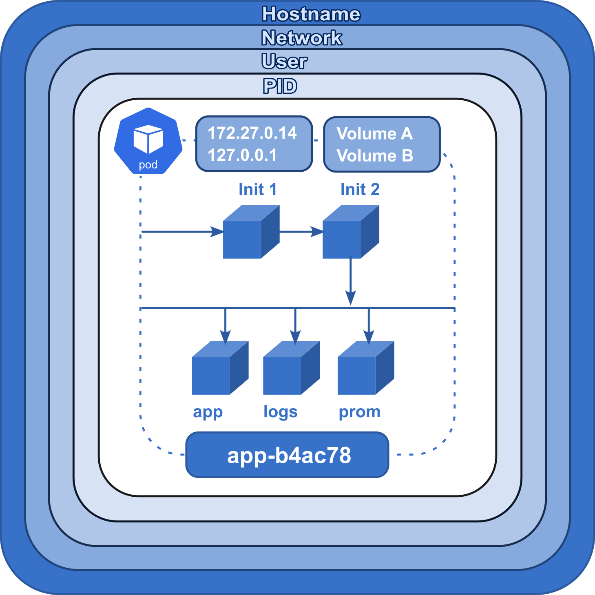

# Jour 1 - Après Midi

## Les Pods

**Un Pod est l’unité de base d’une application Kubernetes que vous déployez : un Pod est un `groupe atomique de conteneurs`, ce qui veut dire qu'il est garanti que ces conteneurs atterrirons sur le même noeud et seront toujours lancé ensembles et connectés.**





---

**Un Pod comprend en plus des conteneurs, des `ressources de stockage`, `une IP réseau unique`, et des options qui contrôlent comment le ou les conteneurs doivent s’exécuter (ex: `restart policy`). Cette collection de conteneurs tournent ainsicdans le même environnement d'exécution mais les processus sont isolés.**

Plus précisément ces conteneurs étroitement liés partagent :

- des volumes communs
- la même interface réseau : la même IP, les même noms de domaine internes
- les conteneurs peuvent se parler en IPC
- ont un nom différent et des logs différents
- ont des sondes (liveness/readiness probes) et des limites de ram et cpu différentes pour chaque conteneur

Chaque Pod est destiné à exécuter une instance unique d’un workload donné. Si vous désirez mettre à l’échelle votre workload, vous devez multiplier le nombre de Pods avec un déploiement.

Pour plus de détail sur la philosophie des pods, vous pouvez consulter [ce bon article](https://www.mirantis.com/blog/multi-container-pods-and-container-communication-in-kubernetes/).

---

Kubernetes fournit un ensemble de commande pour débugger des conteneurs :

- `kubectl logs <pod-name> -c <conteneur_name>` (le nom du conteneur est inutile si un seul)
- `kubectl exec -it <pod-name> -c <conteneur_name> -- bash`
- `kubectl attach -it <pod-name>`
- `kubectl debug <pod-name> -it --image=busybox`

Enfin, pour debugger la sortie réseau d'un programme on peut rapidement forwarder un port depuis un pods vers l'extérieur du cluster :

- `kubectl port-forward <pod-name> <port_interne>:<port_externe>`
- C'est une commande de debug seulement : pour exposer correctement des processus k8s, il faut créer un service, par exemple avec `NodePort`.

---

Pour copier un fichier dans un pod on peut utiliser: `kubectl cp <pod-name>:</path/to/remote/file> </path/to/local/file>`

Pour monitorer rapidement les ressources consommées par un ensemble de processus il existe les commande `kubectl top nodes` et `kubectl top pods`

---

#### Un manifeste de Pod

`rancher-demo-pod.yaml`

```yaml
apiVersion: v1
kind: Pod
metadata:
  name: rancher-demo-pod
  labels:
    app: rancher-demo
spec:
  containers:
    - image: monachus/rancher-demo:latest
      name: rancher-demo-container
      ports:
        - containerPort: 8080
          name: http
          protocol: TCP
    - image: redis
      name: redis-container
      ports:
        - containerPort: 6379
          name: http
          protocol: TCP
```

---


### Rappel sur quelques concepts


#### Haute disponibilité

**La Haute Disponibilité consiste à faire en sorte qu'un service ait un "uptime" élevé.**

On veut que le service soit tout le temps accessible même lorsque certaines ressources manquent :

- elles tombent en panne
- elles sont sorties du service pour mise à jour, maintenance ou modification

**Pour cela on doit avoir des ressources multiples...**

- Plusieurs serveurs
- Plusieurs versions des données
- Plusieurs accès réseau

**Il faut que les ressources disponibles prennent automatiquement le relais des ressources indisponibles.
Pour cela on utilise en particulier:**

- des "load balancers" : aiguillages réseau intelligents
- des "healthchecks" : une vérification de la santé des applications

**Nous allons voir que Kubernetes intègre automatiquement les principes de load balancing et de healthcheck dans l'orchestration de conteneurs**


---

#### Répartition de charge (load balancing)

- Un load balancer : une sorte d'**"aiguillage" de trafic réseau**, typiquement HTTP(S) ou TCP.
- Un aiguillage **intelligent** qui se renseigne sur plusieurs critères avant de choisir la direction.

Cas d'usage :

- Éviter la surcharge : les requêtes sont réparties sur différents backends pour éviter de les saturer.

L'objectif est de permettre la haute disponibilité : on veut que notre service soit toujours disponible, même en période de panne/maintenance.

- Donc on va dupliquer chaque partie de notre service et mettre les différentes instances derrière un load balancer.

- Le load balancer va vérifier pour chaque backend s'il est disponible (**healthcheck**) avant de rediriger le trafic.
- Répartition géographique : en fonction de la provenance des requêtes on va rediriger vers un datacenter adapté (+ proche).


---

#### Healthchecks

### Rôles des probes dans Kubernetes

1. **StartupProbe** :
   - **Rôle** : Vérifie si l'application dans le Pod a démarré correctement. Elle est utilisée pour les applications qui peuvent prendre du temps à démarrer. Tant que cette probe ne réussit pas, Kubernetes ne déclenche pas les autres probes (Liveness ou Readiness).
   - **Usage concret** : Empêche un Pod de redémarrer prématurément si l'application est lente à démarrer.

2. **LivenessProbe** :
   - **Rôle** : Vérifie si l'application dans le Pod est toujours en bonne santé et fonctionne. Si la probe échoue, Kubernetes redémarre le conteneur. Elle détecte les situations où une application est bloquée ou plantée.
   - **Usage concret** : Garantit que l'application est "vivante" et fonctionne correctement en continu.

3. **ReadinessProbe** :
   - **Rôle** : Vérifie si le Pod est prêt à recevoir du trafic. Si cette probe échoue, Kubernetes retire le Pod du service et arrête de lui envoyer du trafic jusqu'à ce qu'il soit de nouveau prêt.
   - **Usage concret** : Garantit que l'application est opérationnelle avant de lui envoyer du trafic.


---

#### Types de probe

**Kubernetes propose trois types de **probes** (ou sondes) pour surveiller la santé des conteneurs dans un Pod : **HTTP**, **TCP**, et **Exec**.** 

Ces probes permettent à Kubernetes de vérifier si un conteneur fonctionne correctement et s'il est prêt à recevoir du trafic.

- **HTTP Probe** : Vérifie la santé via un endpoint HTTP.
- **TCP Probe** : Vérifie la disponibilité d'un service en établissant une connexion TCP.
- **Exec Probe** : Exécute une commande dans le conteneur et vérifie le code de retour.

---

**HTTP Probe** (`httpGet`)

 **Effectue une requête HTTP GET sur une URL spécifique du conteneur. Si la réponse est un code HTTP compris entre 200 et 399, la sonde est considérée comme réussie.**

  **Exemple :**
  ```yaml
  livenessProbe:
    httpGet:
      path: /healthz
      port: 8080
    initialDelaySeconds: 5
    periodSeconds: 10
  ```

---

**TCP Probe** (`tcpSocket`)

 **Tente d'établir une connexion TCP au conteneur sur un port spécifique. Si la connexion est établie avec succès, la sonde est considérée comme réussie.**

  **Exemple :**
  ```yaml
  livenessProbe:
    tcpSocket:
      port: 3306
    initialDelaySeconds: 5
    periodSeconds: 10
  ```

---

**Exec Probe** (`exec`)

**Exécute une commande directement dans le conteneur. Si la commande retourne un code de sortie 0, la sonde est considérée comme réussie.**

  **Exemple :**
  ```yaml
  livenessProbe:
    exec:
      command:
      - cat
      - /tmp/healthy
    initialDelaySeconds: 5
    periodSeconds: 10
  ```

---

### Exemple court d'implémentation des trois probes dans un Pod

Voici un exemple de Pod avec une **StartupProbe**, **LivenessProbe**, et **ReadinessProbe** :

```yaml
apiVersion: v1
kind: Pod
metadata:
  name: my-app
spec:
  containers:
  - name: my-container
    image: my-app:latest
    ports:
    - containerPort: 8080
    # Fait une requête HTTP sur `/healthz` toutes les 10 secondes 
    # et échoue après 30 tentatives si l'application ne démarre pas correctement.
    startupProbe:
      httpGet:
        path: /healthz
        port: 8080
      failureThreshold: 30
      periodSeconds: 10
    # Après 30 secondes, la probe vérifie toutes les 10 secondes que l'application est toujours "vivante"
    #  en envoyant une requête HTTP à `/healthz`.
    livenessProbe:
      httpGet:
        path: /healthz
        port: 8080
      initialDelaySeconds: 30
      periodSeconds: 10
    # Dès 5 secondes après le démarrage du conteneur, Kubernetes vérifie toutes les 5 secondes 
    # si l'application est prête à recevoir du trafic en vérifiant `/ready`.
    readinessProbe:
      httpGet:
        path: /ready
        port: 8080
      initialDelaySeconds: 5
      periodSeconds: 5
```

---

## Gestion des Workloads  
    

### L'architecture découplée des services Kubernetes


En plus du déploiement d'un application, Il existe pleins d'autre raisons de créer un ensemble de Pods:

- Le **DaemonSet**: Faire tourner un agent ou démon sur chaque nœud, par exemple pour des besoins de monitoring, ou pour configurer le réseau sur chacun des nœuds.
- Le **Job** : Effectuer une tache unique de durée limitée et ponctuelle, par exemple de nettoyage d'un volume ou la préparation initiale d'une application, etc.
- Le **CronJob** : Effectuer une tache unique de durée limitée et récurrente, par exemple de backup ou de régénération de certificat, etc.

De plus même pour faire tourner une application, les déploiements ne sont pas toujours suffisants. En effet ils sont peu adaptés à des applications statefull comme les bases de données de toutes sortes qui ont besoin de persister des données critiques. Pour celà on utilise un **StatefulSet** que nous verrons par la suite.

Étant donné les similitudes entre les DaemonSets, les StatefulSets et les Deployments, il est important de comprendre un peu précisément quand les utiliser.

Les **Deployments** (liés à des ReplicaSets) doivent être utilisés :

  - lorsque votre application est complètement découplée du nœud
  - que vous pouvez en exécuter plusieurs copies sur un nœud donné sans considération particulière
  - que l'ordre de création des replicas et le nom des pods n'est pas important
  - lorsqu'on fait des opérations *stateless*

Les **DaemonSets** doivent être utilisés :
  - lorsqu'au moins une copie de votre application doit être exécutée sur tous les nœuds du cluster (ou sur un sous-ensemble de ces nœuds).

Les **StatefulSets** doivent être utilisés :
  - lorsque l'ordre de création des replicas et le nom des pods est important
  - lorsqu'on fait des opérations *stateful* (écrire dans une base de données)

### Jobs

Les jobs sont utiles pour les choses que vous ne voulez faire qu'une seule fois, comme les migrations de bases de données ou les travaux par lots. Si vous exécutez une migration en tant que Pod dans un deployment:

- Dès que la migration se finit le processus du pod s'arrête.
- Le **replicaset** qui détecte que l'"application" s'est arrêter va tenter de la redémarrer en recréant le pod.
- Votre tâche de migration de base de données se déroulera donc en boucle, en repeuplant continuellement la base de données.

### CronJobs

Comme des jobs, mais se lancent à un intervalle régulier, comme les `cron` sur les systèmes unix.

#### Exemple de Cronjob pour un backup avec Velero

Voici un exemple de Job Kubernetes pour effectuer un Job régulier. Par exemple un backup Velero.

```yaml
apiVersion: batch/v1beta1
kind: CronJob
metadata:
  name: daily-job
spec:
  schedule: "0 0 * * *" # Planifie la tâche tous les jours à minuit
  jobTemplate:
    spec:
      template:
        spec:
          containers:
          - name: my-container
            image: my-image:latest
            command: ["/bin/sh"]
            args: ["-c", "echo 'Hello, World!'"]
          restartPolicy: OnFailure

```


#### Les Deployments (deploy)

Les déploiements sont les objets effectivement créés manuellement lorsqu'on déploie une application. Ce sont des objets de plus haut niveau que les **pods** et **replicaset** et les pilote pour gérer un déploiement applicatif.


*Les poupées russes Kubernetes : un Deployment contient un ReplicaSet, qui contient des Pods, qui contiennent des conteneurs*

Si c'est nécessaire d'avoir ces trois types de ressources c'est parce que Kubernetes respecte un principe de découplage des responsabilités.

La responsabilité d'un déploiement est de gérer la coexistence et le **tracking de versions** multiples d'une application et d'effectuer des montées de version automatiques en haute disponibilité en suivant une **RolloutStrategy** (CF. TP optionnel).

Ainsi lors des changements de version, un seul **deployment** gère automatiquement deux **replicasets** contenant chacun **une version** de l'application : le découplage est nécessaire.

Un *deployment* implique la création d'un ensemble de Pods désignés par une étiquette `label` et regroupé dans un **Replicaset**.

Exemple :

```yaml
apiVersion: apps/v1
kind: Deployment
metadata:
  name: nginx-deployment
  labels:
    app: nginx
spec:
  replicas: 3
  strategy:
    type: Recreate
  selector:
    matchLabels:
      app: nginx
  template:
    metadata:
      labels:
        app: nginx
    spec:
      containers:
        - name: nginx
          image: nginx:1.7.9
          ports:
            - containerPort: 80
```

- Pour les afficher : `kubectl get deployments`

- La commande `kubectl run` sert à créer un *deployment* à partir d'un modèle. Il vaut mieux utilisez `apply -f`.


---

#### Les ReplicaSets (rs)

Dans notre modèle, les **ReplicaSet** servent à gérer et sont responsables pour:

- la réplication (avoir le bon nombre d'instances et le scaling)
- la santé et le redémarrage automatique des pods de l'application (Self-Healing)

- `kubectl get rs` pour afficher la liste des replicas.

En général on ne les manipule pas directement (c'est déconseillé) même s'il est possible de les modifier et de les créer avec un fichier de ressource. Pour créer des groupes de conteneurs on utilise soit un **Deployment** soit d'autres formes de workloads (**DaemonSet**, **StatefulSet**, **Job**) adaptés à d'autres cas.


---

## Stratégies de déploiement communes

### Introduction

Dans Kubernetes, les stratégies de déploiement sont définies dans la directive `strategy` d’un objet **Deployment**. Cette directive contrôle la manière dont les mises à jour des Pods sont gérées lors du déploiement de nouvelles versions d'une application. Il existe plusieurs types de stratégies qui permettent de gérer les interruptions de service et d'optimiser les ressources pendant les déploiements.

Les principales stratégies de déploiement sont les suivantes :

- **Recreate** : Tous les Pods sont supprimés, puis de nouveaux Pods sont créés avec la nouvelle version.
> Pendant un intervalle aucun Pod n'est disponible, suivi du démarrage des nouveaux Pods.
- **RollingUpdate** : Mise à jour progressive des Pods, en remplaçant petit à petit les anciens Pods par les nouveaux.
> Transition progressive avec des Pods des deux versions (ancienne et nouvelle) en fonctionnement pendant la mise à jour.
- **Stratégies avancées** comme **Blue/Green** et **Canary** offrent des approches plus complexes, souvent gérées en dehors des fonctionnalités de base de Kubernetes, mais supportées via des outils comme Argo Rollouts ou des configurations personnalisées.
s illustrant les différentes stratégies de déploiement dans Kubernetes :
> Blue/Green : Deux environnements distincts sont montrés, avec un basculement de Blue à Green.  
> Canary:  Une petite partie du trafic est envoyée à la nouvelle version avant une montée en charge progressive.

---

### Stratégies standard

#### Recreate

Avec cette stratégie, Kubernetes supprime tous les Pods existants avant de créer les nouveaux Pods avec la nouvelle version de l'application. Cette approche garantit qu'il n'y a pas d'ancienne version en cours d'exécution après le déploiement, mais entraîne un temps d'indisponibilité.

```yaml
apiVersion: apps/v1
kind: Deployment
metadata:
  name: my-app
spec:
  replicas: 3
  strategy:
    type: Recreate
  template:
    spec:
      containers:
      - name: my-app-container
        image: my-app:v2
```

#### RollingUpdate

La stratégie par défaut dans Kubernetes. Elle consiste à mettre à jour les Pods de manière progressive, avec des Pods de la nouvelle version remplacés petit à petit, tout en gardant certains Pods de l'ancienne version actifs jusqu'à la fin de la mise à jour.

```yaml
apiVersion: apps/v1
kind: Deployment
metadata:
  name: my-app
spec:
  replicas: 3
  strategy:
    type: RollingUpdate
    rollingUpdate:
      maxSurge: 1
      maxUnavailable: 1
  template:
    spec:
      containers:
      - name: my-app-container
        image: my-app:v2
```
---

#### Piloter le déploiement de nouvelles versions

- **MaxUnavailable vs MaxSurge** :
  - **MaxUnavailable** : Indique le nombre maximal de Pods qui peuvent être indisponibles pendant un déploiement. Par exemple, si vous définissez `maxUnavailable: 1`, au maximum un Pod peut être hors service pendant le déploiement, assurant une haute disponibilité.
  - **MaxSurge** : Indique le nombre maximal de Pods supplémentaires (surge) qui peuvent être créés au-delà du nombre de réplicas définis pendant la mise à jour. Par exemple, avec `maxSurge: 1`, Kubernetes peut créer un Pod supplémentaire pour accélérer la mise à jour sans attendre que les anciens Pods soient terminés.

- **Progress Deadline Seconds** :
  C'est le délai (en secondes) accordé à Kubernetes pour vérifier que le déploiement progresse correctement. Si, dans ce délai, Kubernetes n'a pas atteint l'avancement attendu (par exemple, la mise à jour d'un certain nombre de Pods), le déploiement est considéré comme échoué. Cela permet de détecter des problèmes rapidement.

- **Revision History Limit** :
  Ce paramètre contrôle combien d'anciennes révisions d'un déploiement sont conservées dans l'historique. Si ce nombre est dépassé, Kubernetes supprime les révisions les plus anciennes. Cela permet d'éviter une accumulation excessive de versions tout en permettant des rollbacks rapides vers des révisions récentes.


---

### Contrôler un déploiement

**Kubernetes permet de suivre un déploiement en cours, voire de le mettre en pause pour l'examiner ou résoudre des problèmes avant de le reprendre.**

- **Observer** un déploiement :

```bash
kubectl rollout status deployment my-app
```

- **Pauser** un déploiement :

```bash
kubectl rollout pause deployment my-app
```

- **Reprendre** un déploiement en pause :

```bash
kubectl rollout resume deployment my-app
```

- **Rollback** à la version précédente :

```bash
kubectl rollout undo deployment my-app
```

---


### Des déploiements plus stables et précautionneux : les StatefulSets

L'objet `StatefulSet` est relativement récent dans Kubernetes.

On utilise les `Statefulsets` pour répliquer un ensemble de pods dont l'état est important : par exemple, des pods dont le rôle est d'être une base de données, manipulant des données sur un disque.

Un objet `StatefulSet` représente un ensemble de pods dotés d'identités uniques et de noms d'hôtes stables. Quand on supprime un StatefulSet, par défaut les volumes liés ne sont pas supprimés.

Les StatefulSets utilisent un nom en commun suivi de numéros qui se suivent. Par exemple, un StatefulSet nommé `web` comporte des pods nommés `web-0`, `web-1` et` web-2`. Par défaut, les pods StatefulSet sont déployés dans l'ordre et arrêtés dans l'ordre inverse (`web-2`, `web-1` puis `web-0`).

En général, on utilise des StatefulSets quand on veut :
- des identifiants réseau stables et uniques
- du stockage stable et persistant
- des déploiements et du scaling contrôlés et dans un ordre défini
- des rolling updates dans un ordre défini et automatisées

Article récapitulatif des fonctionnalités de base pour applications stateful: https://medium.com/capital-one-tech/conquering-statefulness-on-kubernetes-26336d5f4f17

Exemple très minimal avec Cassandra: 

```yaml
apiVersion: apps/v1
kind: StatefulSet
metadata:
  name: cassandra
spec:
  selector:
    matchLabels:
      app: cassandra
  serviceName: cassandra
  replicas: 3
  template:
    metadata:
      labels:
        app: cassandra
    spec:
      containers:
      - name: cassandra
        image: cassandra:3.11.10
        env:
        - name: CASSANDRA_SEEDS
          value: "cassandra-0.cassandra.default.svc.cluster.local,cassandra-1.cassandra.default.svc.cluster.local,cassandra-2.cassandra.default.svc.cluster.local"
        - name: CASSANDRA_CLUSTER_NAME
          value: "my-cassandra-cluster"
        - name: CASSANDRA_DC
          value: "dc1"
        - name: CASSANDRA_RACK
          value: "rack1"
        ports:
        - containerPort: 9042
          name: cql
        volumeMounts:
        - name: data
          mountPath: /var/lib/cassandra/data
  volumeClaimTemplates:
  - metadata:
      name: data
    spec:
      accessModes: [ "ReadWriteOnce" ]
      resources:
        requests:
          storage: 10Gi
```

---