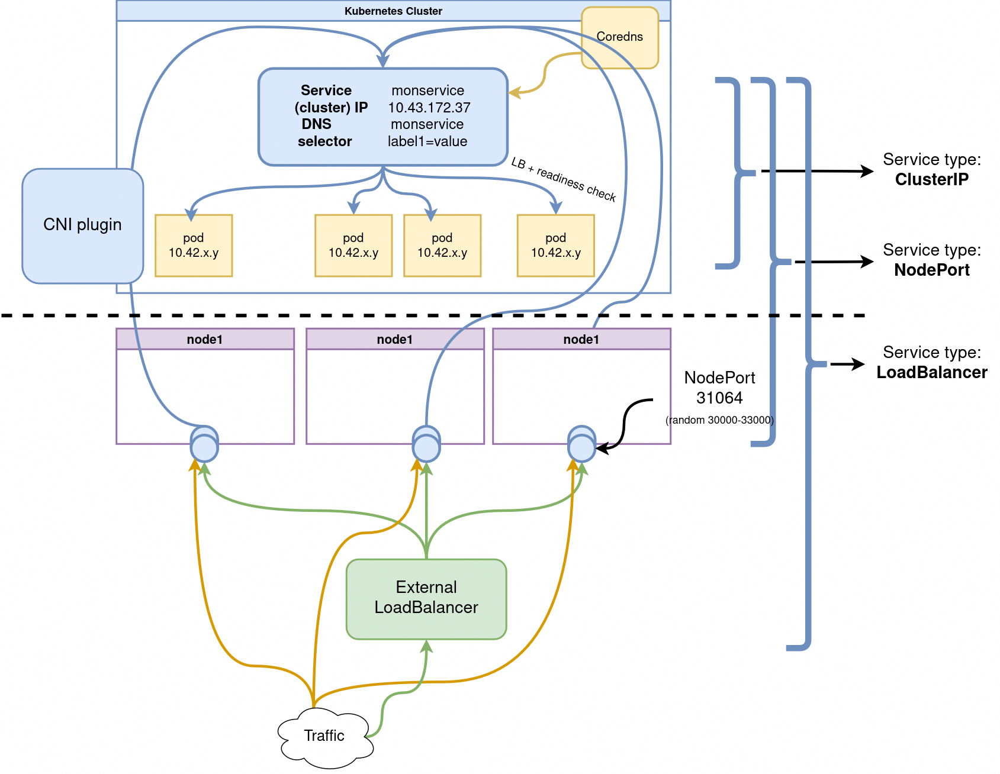

# Jour 2 - Après Midi

---

## Les plugins réseaux de Kubernetes


**La spécification CNI (Container Network Interface) vise à standardiser la configuration des réseaux de conteneurs.**

En définissant ces composants principaux, la spécification CNI garantit que différents environnements d'exécution de conteneurs et plugins réseau peuvent interagir de manière cohérente, permettant l'automatisation et la standardisation de la configuration réseau.

Pour la convention complète c'est ici : https://www.cni.dev/docs/spec/

Il y a [plusieurs solutions d'orchestration qui s'appuient sur CNI]( https://www.cni.dev/docs/#container-runtimes), pas seulement Kubernetes.

---

# Utilisation des services pour l’automatisation du réseau  


**Les services sont les objets réseau de base.** 

Dans Kubernetes, un **service** est un objet qui :
- Désigne un ensemble de pods (grâce à des labels) généralement géré par un déploiement.
- Fournit un endpoint réseau pour les requêtes à destination de ces pods.
- Configure une politique permettant d’y accéder depuis l'intérieur ou l'extérieur du cluster.
- Configure un nom de domaine pointant sur le groupe de pods en backend.


--- 


**L’ensemble des pods ciblés par un service est déterminé par un `selector`.**

Par exemple, considérons un backend de traitement d’image (*stateless*, c'est-à-dire ici sans base de données) qui s’exécute avec 3 replicas.  

 Ces replicas sont interchangeables et les frontends ne se soucient pas du backend qu’ils utilisent.  

 Bien que les pods réels qui composent l’ensemble `backend` puissent changer, les clients frontends ne devraient pas avoir besoin de le savoir, pas plus qu’ils ne doivent suivre eux-mêmes l'état de l’ensemble des backends.

**L’abstraction du service permet ce découplage : les clients frontend s'addressent à une seule IP avec un seul port dès qu'ils ont besoin d'avoir recours à un backend.**  

 Les backends vont recevoir la requête du frontend aléatoirement.

---

**Les Services sont de trois types principaux :**

- `ClusterIP`: expose le service **sur une IP interne** au cluster.

- `NodePort`: expose le service depuis l'IP de **chacun des noeuds du cluster** en ouvrant un port directement sur le nœud, entre 30000 et 32767.  
  Cela permet d'accéder aux pods internes répliqués.  

  Comme l'IP est stable on peut faire pointer un DNS ou Loadbalancer classique dessus.

- `LoadBalancer`: expose le service en externe à l’aide d'un Loadbalancer de fournisseur de cloud.  
   Les services NodePort et ClusterIP, vers lesquels le Loadbalancer est dirigé sont automatiquement créés.
  

<!-- *Crédits à [Ahmet Alp Balkan](https://medium.com/@ahmetb) pour les schémas* -->

Deux autres types plus avancés:

- `ExternalName`: Un service `ExternalName`  est typiquement utilisé pour permettre l'accès à un service externe en le mappant à un nom DNS interne, facilitant ainsi la redirection des requêtes sans utiliser un proxy ou un load balancer. (https://stackoverflow.com/questions/54327697/kubernetes-externalname-services)

- `headless` (avec `ClusterIP: None`):  est utilisé pour permettre la découverte directe des pods via leur ip au sein d'un service.  

 Ce mode est souvent utilisé pour des applications nécessitant une connexion directe entre instances, comme les bases de données distribuées ou data broker (kafka). (https://stackoverflow.com/questions/52707840/what-is-a-headless-service-what-does-it-do-accomplish-and-what-are-some-legiti)

---


**Lorsqu'on souhaite exposer un service Kubernetes, plusieurs méthodes sont possibles, dont l'utilisation de **kubectl** pour exposer un Pod ou un ensemble de Pods.** 

La commande `kubectl expose` permet de créer rapidement un Service pour un Pod, un Deployment, ou un autre type de ressource, sans avoir à écrire un fichier manifeste YAML.

Par exemple, pour exposer un déploiement avec un type de service **ClusterIP** (le type par défaut qui expose uniquement le service au sein du cluster), la commande est : 

```bash
kubectl expose deployment my-app --type=ClusterIP --port=80 --target-port=8080
```

---

**Voici un exemple de fichier YAML pour exposer un Pod via un Service de type **ClusterIP** (le service par défaut, qui n'est accessible qu'au sein du cluster).**


```yaml
apiVersion: v1
kind: Pod
metadata:
  name: my-app
  labels:
    app: my-app
spec:
  containers:
  - name: my-app-container
    image: nginx
    ports:
    - containerPort: 80
      
---

apiVersion: v1
kind: Service
metadata:
  name: my-app-service
spec:
  selector:
    app: my-app  # Relie le service au Pod via ce label
  ports:
    - protocol: TCP
      port: 80           # Port sur lequel le service écoute
      targetPort: 80      # Port sur lequel le conteneur écoute
  type: ClusterIP         # Type de service (par défaut)
```

---

## Utilisation de l’exposition via Ingress et Gateway  

### Les objets Ingresses


*Crédits [Ahmet Alp Balkan](https://medium.com/@ahmetb)*

**Un Ingress est un objet pour gérer dynamiquement le **reverse proxy** HTTP/HTTPS dans Kubernetes. Documentation: https://kubernetes.io/docs/concepts/services-networking/ingress/#what-is-ingress**

Exemple de syntaxe d'un ingress:

```yaml
apiVersion: networking.k8s.io/v1
kind: Ingress
metadata:
  name: ingress-wildcard-host
spec:
  rules:
  - host: "domain1.bar.com"
    http:
      paths:
      - pathType: Prefix
        path: "/bar"
        backend:
          service:
            name: service1
            port:
              number: 80
      - pathType: Prefix
        path: "/foo"
        backend:
          service:
            name: service2
            port:
              number: 80
  - host: "domain2.foo.com"
    http:
      paths:
      - pathType: Prefix
        path: "/"
        backend:
          service:
            name: service3
            port:
              number: 80
```

---

**Pour pouvoir créer des objets ingress il est d'abord nécessaire d'installer un **ingress controller** dans le cluster:**

- Il s'agit d'un déploiement conteneurisé d'un logiciel de reverse proxy (comme nginx) et intégré avec l'API de kubernetes
- Le controlleur agit donc au niveau du protocole HTTP et doit lui-même être exposé (port 80 et 443) à l'extérieur, généralement via un service de type LoadBalancer.
- Le controlleur redirige ensuite vers différents services (généralement configurés en ClusterIP) qui à leur tour redirigent vers différents ports sur les pods selon l'URL del a requête.

---

**Il existe plusieurs variantes d'**ingress controller**:**

- Un ingress basé sur Nginx plus ou moins officiel à Kubernetes et très utilisé: https://kubernetes.github.io/ingress-nginx/
- Un ingress Traefik optimisé pour k8s.
- il en existe d'autres : celui de payant l'entreprise Nginx, Contour, HAProxy...

Chaque provider de cloud et flavour de kubernetes est légèrement différent au niveau de la configuration du controlleur ce qui peut être déroutant au départ:

- minikube permet d'activer l'ingress nginx simplement (voir TP)
- autre example: k3s est fourni avec traefik configuré par défaut
- On peut installer plusieurs `ingress controllers` correspondant à plusieurs `IngressClasses`

Comparaison des controlleurs: <https://medium.com/flant-com/comparing-ingress-controllers-for-kubernetes-9b397483b46b>

---

### La nouvelle API Gateway

#### Ingress vs. Gateway API :


- **Ingress** : Le modèle Ingress, traditionnellement utilisé dans Kubernetes, permet de définir des règles pour diriger le trafic HTTP/S entrant vers les services. Bien qu'il soit largement utilisé, il présente des limitations en termes de flexibilité et de contrôle fin du trafic.


- **Gateway API** : Le nouveau modèle Gateway API offre une approche plus flexible et extensible pour la gestion du trafic. Il permet de définir des routes HTTP/S, TCP, et autres, avec un contrôle granulaire sur les politiques de trafic, la sécurité et l'observabilité.

---

#### Rôle de l'API Gateway dans Kubernetes :

- **Fonctions Clés** : La Gateway API peut gérer des tâches comme l'authentification, l'autorisation, le contrôle de taux (rate limiting), et la gestion des certificats TLS. Elle offre une flexibilité accrue par rapport à l'Ingress, permettant des configurations plus avancées et spécifiques aux besoins de l'application.
- **Remplacement de l'Ingress** : Avec la montée en puissance de la Gateway API, l'Ingress est progressivement remplacé pour les cas d'utilisation avancés. La Gateway API fournit une abstraction plus puissante et unifiée pour gérer le trafic entrant dans Kubernetes.

---

#### État Actuel :

- **Adoption** : La Gateway API est en cours d'adoption et devient de plus en plus standardisée dans les déploiements Kubernetes modernes. 
  Elle offre une solution plus robuste et flexible pour la gestion du trafic entrant, complémentant et parfois chevauchant les fonctionnalités des services mesh.
- **Évolution** : Les services mesh continuent d'évoluer pour tirer parti des nouvelles capacités offertes par la Gateway API. 
  Cela inclut l'intégration étroite avec les API de Gateway pour offrir une solution unifiée et cohérente pour la gestion du trafic, la sécurité et l'observabilité dans Kubernetes.


--- 


### Gestion dynamique des certificats à l'aide de `certmanager`

**`Certmanager` est une application kubernetes (un `operator`) capable de générer automatiquement des certificats TLS/HTTPS pour nos ingresses.**

- Documentation d'installation: https://cert-manager.io/docs/installation/kubernetes/
- Tutorial pas à pas pour générer un certificat automatiquement avec un ingress et letsencrypt: https://cert-manager.io/docs/tutorials/acme/ingress/

Exemple de syntaxe d'un ingress utilisant `certmanager`:

```yaml
apiVersion: networking.k8s.io/v1 
kind: Ingress
metadata:
  name: kuard
  annotations:
    kubernetes.io/ingress.class: "nginx"    
    cert-manager.io/issuer: "letsencrypt-prod"
spec:
  tls:
  - hosts:
    - example.example.com
    secretName: quickstart-example-tls
  rules:
  - host: example.example.com
    http:
      paths:
      - path: /
        pathType: Exact
        backend:
          service:
            name: kuard
            port:
              number: 80
```
