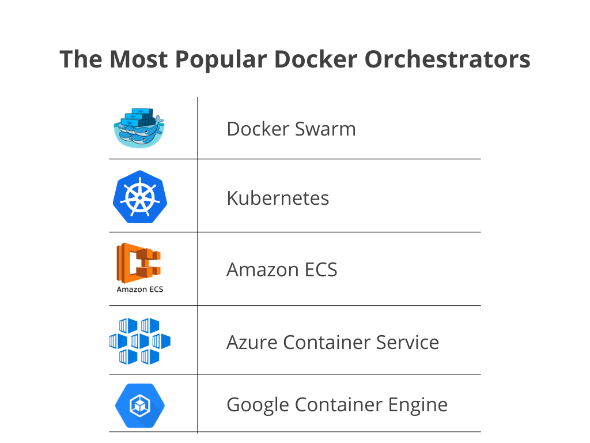

---

## L'API Docker

**Le Docker daemon utilise une API au standard Open API REST, ce qui le rend interexploitable.**

cf. https://docs.docker.com/reference/api/engine/version/v1.47/

On peut faire des appels via curl :

```shell
curl --silent --unix-socket /var/run/docker.sock http://v1.47/containers/json
curl --silent --unix-socket /var/run/docker.sock http://v1.47/version
```

---

**On peut exposer le daemon depuis l'extérieur, avec du chiffrement en production.**

```shell

sudo systemctl edit docker.service

# Ajouter les lignes  
[Service]
ExecStart=
ExecStart=/usr/bin/dockerd -H fd:// -H tcp://127.0.0.1:2375

# Redémarrer docker 
sudo systemctl daemon-reload
sudo systemctl restart docker.service

# Vérifier l'ouverture
sudo lsof -i :23375

# Protéger le port avec une règle firewall avec ufw
...

```
