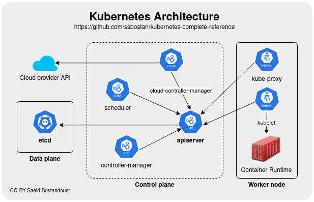
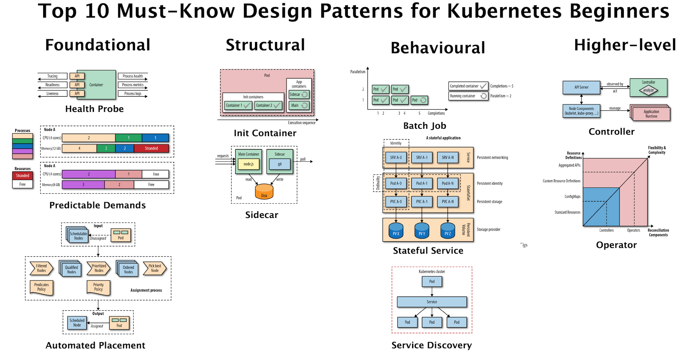
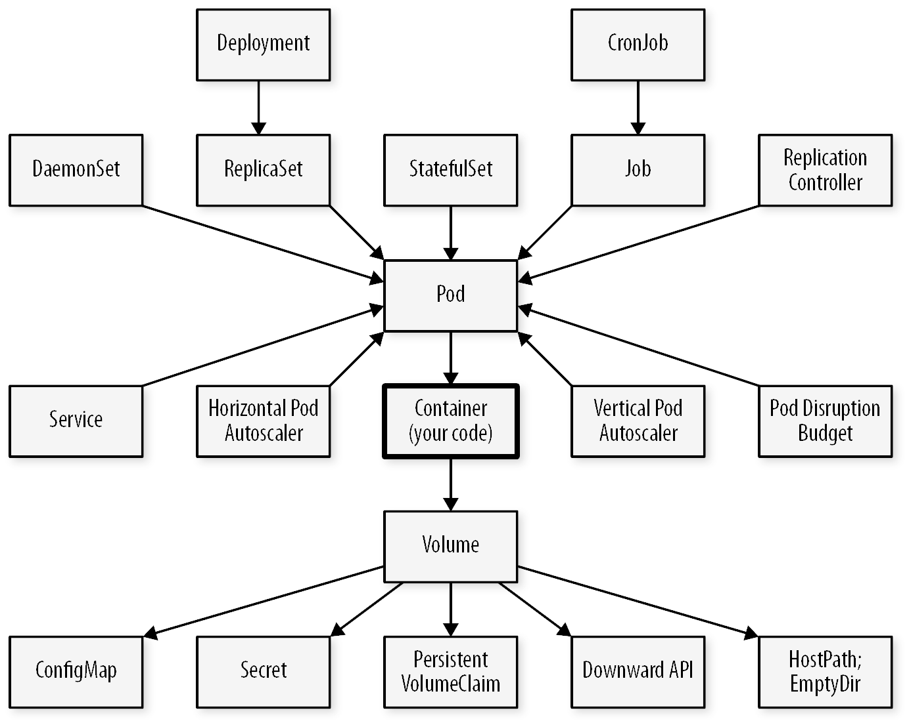
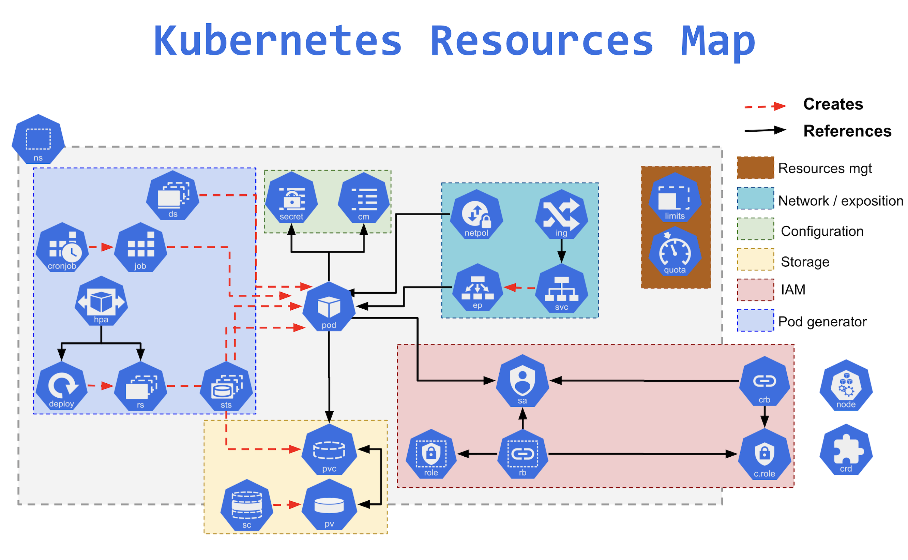
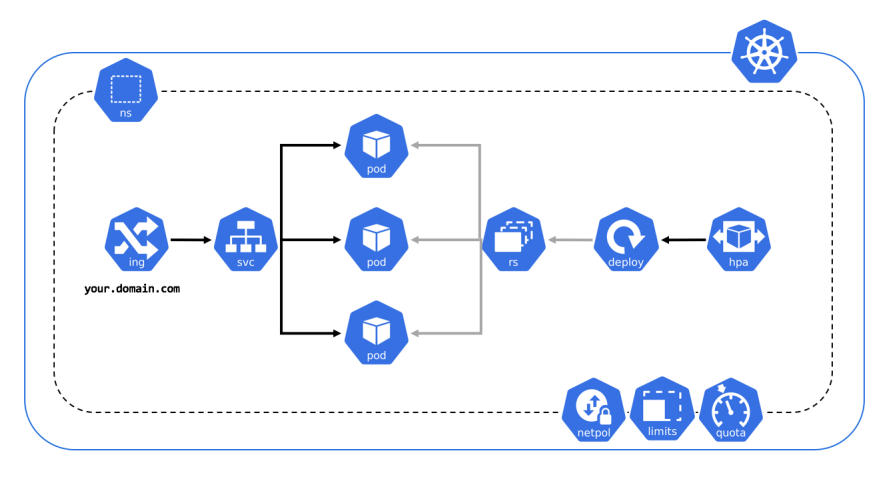
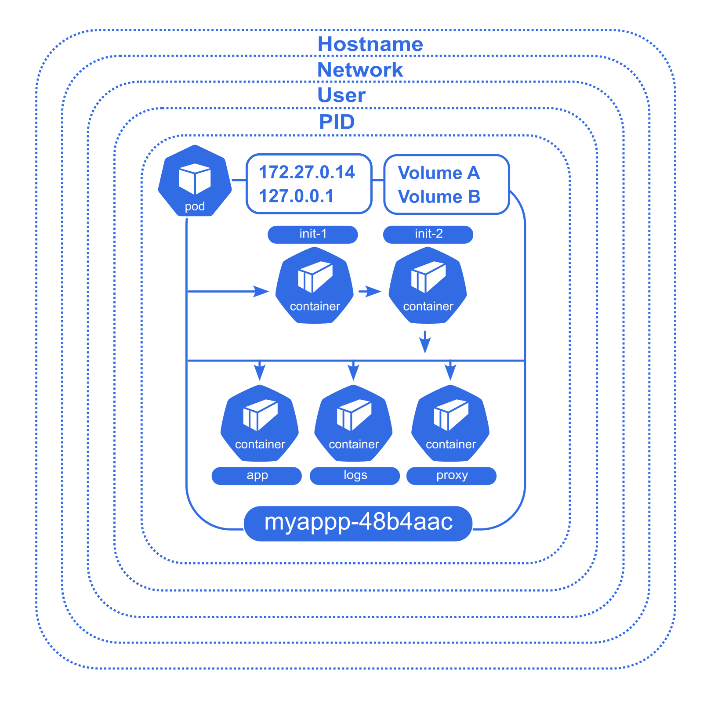
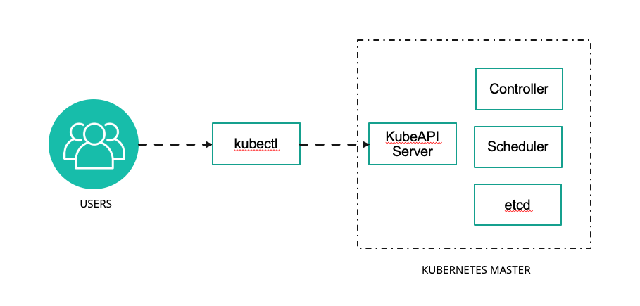
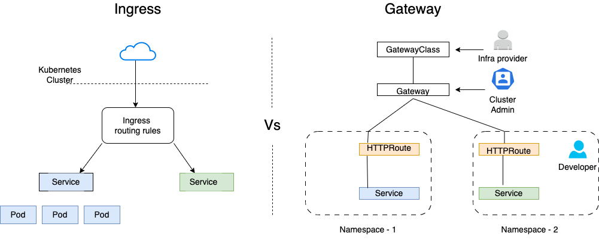

## Kubernetes

**Kubernetes est devenu la solution de facto pour résoudre les problématiques de déploiements d'images Docker à l'échelle.**

La solution s'appuie sur une multitude de ressources qui composent des architectures articulables.









Désormais il existe de nombreuses solutions dérivées de cette architecture K8S.

### MicroKube et k3s

Formules légères par rapport à k8s, qui visent à déployer sur un seul noeud.

K3S présente la capacité à opérer un cluster plus étendu si besoin.

### AWS ECS / EKS, GKE, AKS

Amazon Elastic Container Service est une solution d'orchestration conçue et opérée en service managé par AWS. Code non libre.

Face au succès grandissant de Kubernetes, Amazon Kubernetes Service est apparu, pour fournir des clusters k8s par Amazon.

Google Cloud et Azure fournissent également des solutions qui visent à réduire la dépendance technique.

Ils fournissent également les services managés (Bases de données, stockage, réseau) permettant de gérer ses services externes dans un seul lieu.


###  Openshift

Solution commerciale de RedHat pour faire du Platform As A Service sur une base Kubernetes.

Disponible on premise ou sur de nombreux clouds, OpenShift intègre différents logiciels libres  pour fournir *out of the box* des fonctionnalités avancées, y compris le build d'image automatisé.
- Ceph pour les volumes 
- Prometheus pour le monitoring
- Istio pour le service mesh


---

### Les fondamentaux de K8S 

**Tout est un conteneur** 

L'infrastructure logicielle de Kubernetes est basé un jeu d'API, implémenté par 2 outils interactifs en ligne de commande 

* kubeadm pour les administrateurs
* kubectl pour les utilisateurs

De fait il existe des GUI permettant de piloter Kubernetes, comme Lens ou des panels web.

Les composants effectifs de Kubernetes (API, pilotage des noeuds, etc.) sont tous des conteneurs.

Ceci simplifie la mise à jour du système.

**Un control plane d'administration et des nodes d'exécution** 

Le control plane est la partie administrative et les noeuds sont destinés aux conteneurs des utilisateurs.

Les noeuds reçoivent les demandes du control plane et les appliquent.

Le control plane est chargé de recevoir les appels d'API, de gérer les AAA (Authentification Authorisation Accounting), et de traiter l'orchestration.

**Un système d'orchestration basé sur les intentions** 

Les manifestes envoyés par les utilisateurs définissent l'état idéal souhaité par l'utilisateur.

L'orchestrateur peut rejeter certaines requêtes invalides.

Les requêtes valides sont traitées de manière asynchrone selon un plan de réalisation ordonné.

**De la sécurité intégrée et intégrable**

K8S utilise du Role Based Access Control pour les utilisateurs, et des service accounts pour accéder à l'API.  

Les ressources sont cloisonnées et limitées via des namespaces de cluster.

Les règles de sécurisation des conteneurs sont définies par les utilisateurs, mais on peut imposer des minimums (ex: no root user, read only, etc.).

Des règles de sécurité réseaux sont définies pour bloquer les flux indésirables.

Et il existe tout un écosystème de solutions dédiées, comme Falco qui surveille au niveau des appels système que rien d'anormal ne se produise, et logge tous les appels.


---


### Installation de K3S


**K3S installe son propre client kubectl.** 




Pour s'assurer que c'est le bon kubectl qu'on utilise, sur Ubuntu on fait : `sudo snap remove kubectl`.

**L'installation de K3S est volontairement simplissime comme vous pouvez le voir sur https://docs.k3s.io/quick-start**


```shell

curl -sfL https://get.k3s.io | sh -

```


- Faites `kubectl version` pour afficher la version du client kubectl.

---

##### Bash completion et racourcis

Pour permettre à `kubectl` de compléter le nom des commandes et ressources avec `<Tab>` il est utile d'installer l'autocomplétion pour Bash :

```bash
sudo apt install bash-completion

source <(kubectl completion bash)

echo "source <(kubectl completion bash)" >> ${HOME}/.bashrc
```

**Vous pouvez désormais appuyer sur `<Tab>` pour compléter vos commandes `kubectl`, c'est très utile !**

- Notez également que pour gagner du temps en ligne de commande, la plupart des mots-clés de type Kubernetes peuvent être abrégés :
  - `services` devient `svc`
  - `deployments` devient `deploy`
  - etc.

La liste complète : <https://blog.heptio.com/kubectl-resource-short-names-heptioprotip-c8eff9fb7202>

--- 

### Explorons notre cluster k8s

**Notre cluster k8s est plein d'objets divers, organisés entre eux de façon dynamique pour décrire des applications, tâches de calcul, services et droits d'accès. La première étape consiste à explorer un peu le cluster :**

- Listez les nodes pour récupérer le nom de l'unique node (`kubectl get nodes`) puis affichez ses caractéristiques avec `kubectl describe node`.

La commande `get` est générique et peut être utilisée pour récupérer la liste de tous les types de ressources ou d'afficher les informations d'un resource précise.

 Pour désigner un seul objet, il faut préfixer le nom de l'objet par son type (ex : `kubectl get nodes XXX` ou `kubectl get node/XXX`) car k8s ne peut pas deviner ce que l'on cherche quand plusieurs ressources de types différents ont le même nom.

--- 

**De même, la commande `describe` peut s'appliquer à tout objet k8s.**

Pour afficher tous les types de ressources à la fois que l'on utilise : `kubectl get all`

```
NAME                 TYPE        CLUSTER-IP     EXTERNAL-IP   PORT(S)   AGE
service/kubernetes   ClusterIP   10.96.0.1   <none>        443/TCP   2m34s
```

Il semble qu'il n'y a qu'une ressource dans notre cluster. Il s'agit du service d'API Kubernetes, pour que les pods/conteneurs puissent utiliser la découverte de service pour communiquer avec le cluster.

---

**En réalité il y en a généralement d'autres cachés dans les autres `namespaces`. En effet les éléments internes de Kubernetes tournent eux-mêmes sous forme de services et de daemons Kubernetes. Les *namespaces* sont des groupes qui servent à isoler les ressources de façon logique et en termes de droits (avec le *Role-Based Access Control* (RBAC) de Kubernetes).**

Pour vérifier cela on peut :

- Afficher les namespaces : `kubectl get namespaces`

Un cluster Kubernetes a généralement un namespace appelé `default` dans lequel les commandes sont lancées et les ressources créées si on ne précise rien. Il a également aussi un namespace `kube-system` dans lequel résident les processus et ressources système de k8s. Pour préciser le namespace on peut rajouter l'argument `-n` à la plupart des commandes k8s.

- Pour lister les ressources liées au cluster:  `kubectl get all -n kube-system`.

- Ou encore : `kubectl get all --all-namespaces` (peut être abrégé en `kubectl get all -A`) qui permet d'afficher le contenu de tous les namespaces en même temps.

- Pour avoir des informations sur un namespace : `kubectl describe namespace/kube-system`

--- 

### Déployer une application en CLI

**Nous allons maintenant déployer une première application conteneurisée. Le déploiement est un peu plus complexe qu'avec Docker, en particulier car il est séparé en plusieurs objets et plus configurable.**

- Pour créer un déploiement en ligne de commande (par opposition au mode déclaratif que nous verrons plus loin), on peut lancer par exemple: 

```
kubectl create deployment demonstration --image=monachus/rancher-demo
```

Cette commande crée un objet de type `deployment`. Nous pouvons étudier ce deployment avec la commande `kubectl describe deployment/demonstration`.

- Notez la liste des événements sur ce déploiement en bas de la description.
- De la même façon que dans la partie précédente, listez les `pods` avec `kubectl`. Combien y en a-t-il ?

---

**Agrandissons ce déploiement avec `kubectl scale deployment demonstration --replicas=5`**

- `kubectl describe deployment/demonstration` permet de constater que le service est bien passé à 5 replicas.
  - Observez à nouveau la liste des évènements, le scaling y est enregistré...
  - Listez les pods pour constater

---

**A ce stade impossible d'afficher l'application : le déploiement n'est pas encore accessible de l'extérieur du cluster.** 

Pour régler cela nous devons l'exposer grace à un service :

- `kubectl expose deployment demonstration --type=NodePort --port=8080 --name=demonstration-service`

- Affichons la liste des services pour voir le résultat: `kubectl get services`

--- 

**Un service permet de créer un point d'accès unique exposant notre déploiement.** 


Ici nous utilisons le type Nodeport car nous voulons que le service soit accessible de l'extérieur par l'intermédiaire d'un forwarding de port.

Une méthode pour accéder à un service (quel que soit sont type) en mode développement est de forwarder le traffic par l'intermédiaire de kubectl (et des composants kube-proxy installés sur chaque noeuds du cluster).

- Pour cela on peut par exemple lancer: `kubectl port-forward svc/demonstration-service 8080:8080 --address 127.0.0.1`
- Vous pouvez désormais accéder à votre app via via kubectl sur: `http://localhost:8080`. Quelle différence avec l'exposition précédente via minikube ?

=> Un seul conteneur s'affiche. En effet `kubectl port-forward` sert à créer une connexion de developpement/debug qui pointe toujours vers le même pod en arrière plan.

Pour exposer cette application en production sur un véritable cluster, nous devrions plutôt avoir recours à service de type un LoadBalancer. Mais minikube ne propose pas par défaut de loadbalancer. Nous y reviendrons dans le cours sur les objets kubernetes.

---

**Le routage HTTP via Ingress / Gateway API**



---

**Désinstaller k3s**

Pour éviter des effets de bord, lancer le script de désinstallation : 

```shell 

/usr/local/bin/k3s-uninstall.sh

```


---

### CheatSheet pour kubectl et formattage de la sortie

https://kubernetes.io/docs/reference/kubectl/cheatsheet/

Vous noterez dans cette page qu'il est possible de traiter la sortie des commandes kubectl de multiple façon (yaml, json, gotemplate, jsonpath, etc)

Le mode de sortie le plus utilisé pour filtrer une information parmis l'ensemble des caractéristiques d'une resource est `jsonpath` qui s'utilise comme ceci:

```bash
kubectl get pod <tab>
kubectl get pod demonstration-7645747fc6-f5z55 -o yaml # pour afficher la spécification
kubectl get pod demonstration-7645747fc6-f5z55 -o jsonpath='{.spec.containers[0].image}' # affiche le nom de l'image
```

Essayez de la même façon d'afficher le nombre de répliques de notre déploiement.

---

### Des outils  supplémentaires

`kubectl` est puissant et flexible mais il est peu confortable certaines actions courantes. Il est intéressant d'ajouter d'autres outils pour le complémenter :

- pour visualiser en temps réel les resources du cluster et leur évolution on installera `watch` ou plus confortable `viddy`
- pour ajouter des plugins à kubectl on peut utiliser `krew`: https://krew.sigs.k8s.io/docs/user-guide/setup/install/
- pour changer de cluster et de namespace efficacement on peut utiliser `kubectx` et `kubens`: `kubectl krew install ctx`, `kubectl krew install ns`
- pour visualiser les logs d'un déploiement/service on peut utiliser `stern`: `kubectl krew install stern`

---

### Kubernetes dashboard 

**Un dashboard opérationnel est fourni par Kubernetes.**

On peut suivre le tuto à jour ici : https://kubernetes.io/docs/tasks/access-application-cluster/web-ui-dashboard/

```shell
helm repo add kubernetes-dashboard https://kubernetes.github.io/dashboard/
helm upgrade --install kubernetes-dashboard kubernetes-dashboard/kubernetes-dashboard --create-namespace --namespace kubernetes-dashboard
kubectl -n kubernetes-dashboard port-forward svc/kubernetes-dashboard-kong-proxy 8443:443

```

Puis créer un user selon les instructions ici : https://github.com/kubernetes/dashboard/blob/master/docs/user/access-control/creating-sample-user.md