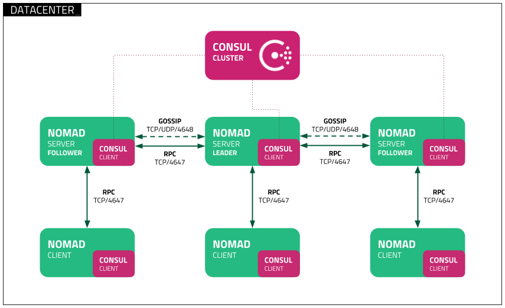

# Hashicorp Nomad  

---

Site officiel : [nomadproject.io](https://www.nomadproject.io/)  

**Nomad est un orchestrateur de conteneurs et d’applications (Docker, binaries, VM, etc.) open-source, conçu pour être simple, léger et multi-cloud. Il permet de déployer, scaler et surveiller des workloads hétérogènes sans la complexité de Kubernetes.**  

**Points forts** :  
- Supporte des applications conteneurisées **et non conteneurisées**.  
- Intégration native avec **Consul** (réseau) et **Vault** (secrets).  

---

## Comparaison avec d’Autres Orchestrateurs
| **Fonctionnalité**         | **Nomad**         | **Kubernetes**      | **Docker Swarm**     |  
|----------------------------|-------------------|---------------------|----------------------|  
| **Complexité**             | Faible            | Élevée              | Moyenne              |  
| **Workloads Supportés**    | Multiples (Docker, Java, binaries, etc.) | Conteneurs uniquement | Conteneurs uniquement |  
| **Installation**           | Rapide (<5 min)   | Longue              | Rapide               |  
| **Intégration Ecosysteme** | Consul, Vault, Terraform | Helm, Prometheus, Istio | Docker Compose       |  
| **Scaling Automatique**    | Oui               | Oui (via HPA)       | Limité               |  
| **Cas d’Usage Typique**    | Multi-cloud, workloads hétérogènes | Microservices complexes | Petits clusters Docker |  

---

## Architecture

  

#### Composants Clés :  
1. **Serveurs Nomad** :  
   - Gèrent les jobs, le scheduling et l’état du cluster.  
   - Mode HA (High Availability) possible avec un cluster de 3 à 5 serveurs.  

2. **Clients Nomad** :  
   - Exécutent les tâches sur les nœuds worker.  
   - Communiquent avec les serveurs pour rapporter l’état des tâches.  

3. **Intégrations** :  
   - **Consul** : Découverte de services et santé des applications.  
   - **Vault** : Gestion des secrets et chiffrement.  

---

## Déploiement 

Suivre la [documentation d'installation rapide](https://developer.hashicorp.com/nomad/tutorials/get-started/gs-start-a-cluster) et celle de [déploiement d'un cluster local](https://developer.hashicorp.com/nomad/tutorials/get-started/gs-start-a-cluster) sur le site de Nomad.

```shell
# Installation

wget https://releases.hashicorp.com/nomad/1.9.5/nomad_1.9.5_linux_amd64.zip
unzip nomad_1.9.5_linux_amd64.zip
sudo chown root:root nomad
sudo mv nomad /usr/local/bin/
nomad 

nomad --version

nomad -autocomplete-install

# Récupération du projet de démo  
git clone https://github.com/hashicorp-education/learn-nomad-getting-started
cd learn-nomad-getting-started
git checkout -b nomad-getting-started v1.1

# Lancement d'un noeud unique local 
sudo nomad agent -dev \
  -bind 0.0.0.0 \
  -network-interface='{{ GetDefaultInterfaces | attr "name" }}'
export NOMAD_ADDR=http://localhost:4646

# Depuis un autre terminal vérifier avec  
nomad node status

# Visiter la page sur pour l'interface
curl http://<nom.DNS.du.virtual.lab>:4646/ui/jobs
 

# Lancer un premier job
cd jobs 
export NOMAD_ADDR=http://localhost:4646
cat pytechco-redis.nomad.hcl
nomad job run pytechco-redis.nomad.hcl

# Aller vérifier dans l'interface de nomad et 
docker ps 

# Démarrer l'appli web  
cat pytechco-web.nomad.hcl
nomad job run pytechco-web.nomad.hcl
docker ps 
curl http://<nom.DNS.du.virtual.lab>:5000

# Démarrer le job de type batch et lancer sa première exécution 
cat pytechco-setup.nomad.hcl
nomad job run pytechco-setup.nomad.hcl
nomad job dispatch -meta budget="200" pytechco-setup
nomad job status pytechco-setup

# Visiter l'interface de Nomad

# Démarrer le batch pour de type CRON
cat  pytechco-employee.nomad.hcl
nomad job run pytechco-employee.nomad.hcl

# Visiter l'interface de Nomad 

# Visiter l'interface de l'application

# Arrêter le CRON et relancer le batch manuel
nomad job stop -purge pytechco-employee
nomad job dispatch -meta budget="500" pytechco-setup

# Editer le job CRON pour lancer le job chaque seconde avec uniquement des employés de types "sals_engineer"
vim pytechco-employee.nomad.hcl
nomad job run pytechco-employee.nomad.hcl

# Enfin supprimer les jobs 
nomad job stop -purge pytechco-employee
nomad job stop -purge pytechco-web
nomad job stop -purge pytechco-redis
nomad job stop -purge pytechco-setup

# Arrêter le serveur nomad 

```

<!--
## TP

### Créer un cluster 


 export ARCH_CNI=$( [ $(uname -m) = aarch64 ] && echo arm64 || echo amd64)

**Démarrer un serveur nomad**

```shell

mkdir /etc/nomad.d

```

```shell

# /etc/nomad.d/nomad.hcl 
datacenter = "dc1"
data_dir = "/opt/nomad"
```


```shell
# /etc/nomad/server.hcl
server {
  enabled          = true
  bootstrap_expect = 1
}

```

```shell
# /etc/nomad/client.hcl
client {
  enabled = true
}

```

```


# /etc/nomad/server.hcl

data_dir  = "/var/lib/nomad"

bind_addr = "0.0.0.0" # the default

advertise {
}

server {
  enabled          = true
  bootstrap_expect = 3
}

client {
  enabled       = true
}

plugin "raw_exec" {
  config {
    enabled = true
  }
}

consul {
}
```

# Rejoindre le cluster 
nomad server join <IP.AUTRE.SERVEUR.LAB>
 

```

#### **Déploiement d’un Conteneur Docker**  
**Objectif** : Déployer une application web Nginx avec Nomad.  
```hcl
# Fichier : nginx.nomad
job "nginx" {  
  group "web" {  
    network {
      port "web" {
        static = 80
      }
    }

    task "nginx" {  
      driver = "docker"  
      config {  
        image = "nginx:latest"  
      }  
    }  
  }  
}  
```  
**Commandes** :  
```bash
nomad job run nginx.nomad.hcl  # Déploiement  
nomad job status nginx     # Vérification  
```

---

#### **TP 2 : Scaling Horizontal**  
**Objectif** : Passer de 1 à 3 instances de Nginx.  
```hcl
# Modifier le fichier nginx.nomad  
group "web" {  
  count = 3  
  ...  
}  
```  
```bash
nomad job plan nginx.hcl  # Voir les changements  
nomad job run nginx.nomad   # Appliquer  
```

---


#### **TP 4 : Intégration avec Vault**  
**Objectif** : Injecter un secret dans une application.  
1. Stocker un secret dans Vault :  
```bash
vault kv put secret/app db_password="s3cr3t"  
```  
2. Modifier le job Nomad :  
```hcl
task "app" {  
  template {  
    data = <<EOF  
DB_PASSWORD={{ with secret "secret/app" }}{{ .Data.db_password }}{{ end }}  
EOF  
  }  
}  
```
-->