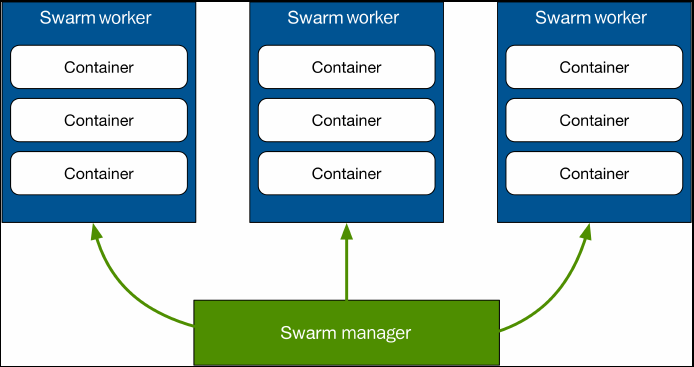
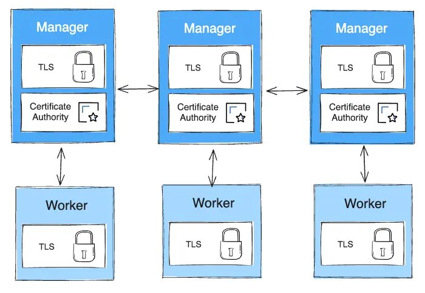
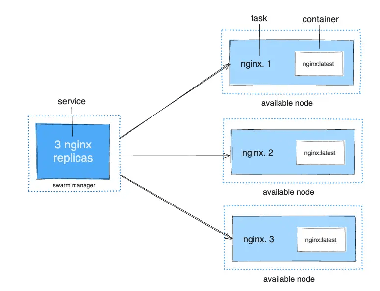

## Docker Swarm

**Docker swarm est la solution de Docker pour exécuter Docker sur plusieurs hôtes.**

La solution n'a jamais résolu les problèmes complexes et d'échelle de la production.

Aujourd'hui le produit est toujours disponible mais n'a plus de visibilité pour l'avenir.

---


---


### Introduction à Swarm

**L'architecture de Swarm est composée d'un control plane et de worker nodes.**

Tout est géré via docker qui fournit l'interconnexion réseau, l'élection du service principal dans le control plane, la répartition des conteneurs sur les worker nodes.

Un noeud peut faire partie des deux groupes : être à la fois membre du control plane et héberger des services.

--- 

**Swarm est un composant natif de Docker via swarmkit.**

```shell

$ docker swarm --help 

Usage:  docker swarm COMMAND

Manage Swarm

Commands:
  ca          Display and rotate the root CA
  init        Initialize a swarm
  join        Join a swarm as a node and/or manager
  join-token  Manage join tokens
  leave       Leave the swarm
  unlock      Unlock swarm
  unlock-key  Manage the unlock key
  update      Update the swarm

```


--- 


**La sécurisation de la communication est assurée par une chaine de certificats x509.** 

Par défaut le premier serveur sur lequel le control plane a été initié va générer une Autorité de Certification racine, mais il est possible d'utiliser une autorité de certification externe. 

Pour rejoindre le cluster dans un rôle ou un autre, il faut fournir 

--- 

### Les services 

**Les services sont la partie opérationnelle de Swarm : ils permettent de répartir des réplicas de conteneurs sur les worker nodes.**


```shell

$ docker services --help 

Usage:  docker service COMMAND

Manage services

Commands:
  create      Create a new service
  inspect     Display detailed information on one or more services
  logs        Fetch the logs of a service or task
  ls          List services
  ps          List the tasks of one or more services
  rm          Remove one or more services
  rollback    Revert changes to a service's configuration
  scale       Scale one or multiple replicated services
  update      Update a service

```

---




---

**Le moyen le plus pratique de gérer les services est d'utiliser des fichiers de type docker compose.**

Certaines parties de la specification Compose sont uniquement destinés aux services

La référence complète de tout ce qu'il est possible de définir est sur : 

> https://github.com/compose-spec/compose-spec/blob/main/05-services.md


---

### Mise en oeuvre

- Se grouper par 2 ou 3 pour créer un cluster à partir de vos VM respectives (il faut utiliser une commande Swarm pour récupérer les instructions nécessaires : `docker swarm init` devrait vous orienter).

- Si grouper plusieurs des VM n'est pas possible, vous pouvez faire un cluster à un seul noeud, ou bien créer un cluster multi-nodes très simplement avec l'interface du site [Play With Docker](https://labs.play-with-docker.com/), il faut s'y connecter avec vos identifiants Docker Hub. Vous pouvez vous connecter à ces VM en SSH.

- Vous pouvez faire `docker swarm --help` pour obtenir des infos manquantes, ou faire `docker swarm leave --force` pour réinitialiser votre configuration Docker Swarm si besoin.

- N'hésitez pas à regarder dans les logs avec `systemctl status docker` comment se passe l'élection du nœud *leader*, à partir du moment où vous avez plus d'un manager.


---

### Créer un service

Afin de visualiser votre installation Swarm, l'application Portainer est très pratique. 

On peut aussi utiliser Docker swarm vizualizer : <https://github.com/dockersamples/docker-swarm-visualizer>

`docker run -d -p 8080:8080 -v /var/run/docker.sock:/var/run/docker.sock dockersamples/visualizer`

---

#### En ligne de commande

En ligne de commande :
`docker service create --name whoami --replicas 5 -p 9999:80 traefik/whoami`

---

#### Avec la clé `deploy:`

A l'aide de la propriété `deploy:` de docker compose, créer un service en 5 exemplaires (`replicas`) à partir de l'image `traefik/whoami` accessible sur le port `9999` et connecté au port `80` des 5 replicas.

<details><summary>Correction</summary>

```yml
services:
  whoami:
    image: traefik/whoami
    ports:
      - 9999:80
    deploy:
      replicas: 5
```

</details>

Accédez à votre service depuis un node et actualisez plusieurs fois la page (Ctrl+Maj+R sinon le cache du navigateur vous embêtera). Les informations affichées changent. Pourquoi ?

- Lancez une commande `service scale` pour changer le nombre de *replicas* de votre service et observez le changement avec `docker service ps hello`

---

### La stack `example-voting-app`

- Cloner l'application `example-voting-app` ici : [https://github.com/dockersamples/example-voting-app](https://github.com/dockersamples/example-voting-app)

- Lire le schéma d'architecture de l'app `example-voting-app` sur Github.

- Lire attentivement le fichier `docker-stack.yml`. Ce sont des fichiers Docker Compose classiques avec différentes options liées à un déploiement via Swarm. Quelles options semblent spécifiques à Docker Swarm ? Ces options permettent de configurer des fonctionnalités d'**orchestration**.

<!-- - En suivant le [guide Docker de découverte de Swarm à partir de la partie 4](https://docs.docker.com/get-started/part4/), créez un fichier docker-compose qui package l'application exemple avec un container `redis` joignable via le hostname `redis` et le port 6379. -->

- Avec `docker swarm init`, transformer son installation Docker en une installation Docker compatible avec Swarm. Lisez attentivement le message qui vous est renvoyé.

- Déployer la stack du fichier `docker-stack.yml` : `docker stack deploy --compose-file docker-stack.yml vote`

- `docker stack ls` indique 6 services pour la stack `vote`. Observer également l'output de `docker stack ps vote` et de `docker stack services vote`. Qu'est-ce qu'un service dans la terminologie de Swarm ?

- Accéder aux différents front-ends de la stack grâce aux informations contenues dans les commandes précédentes. Sur le front-end lié au vote, actualiser plusieurs fois la page. Que signifie la ligne `Processed by container ID […]` ? Pourquoi varie-t-elle ?

- Scaler la stack en ajoutant des _replicas_ du front-end lié au vote avec l'aide de `docker service --help`. Accédez à ce front-end et vérifier que cela a bien fonctionné en actualisant plusieurs fois.

<!-- - Comment ne pas exposer les ports de tous nos hôtes à tout l'internet ? -->

<!-- --publish mode=host,target=80,published=8080 -->

- puis spécifier quelques options d'orchestration exclusives à Docker Swarm : que fait `mode: global` ?  N'oubliez pas de redéployer votre Compose file.

- Avec Portainer ou avec [docker-swarm-visualizer](https://github.com/dockersamples/docker-swarm-visualizer), explorer le cluster ainsi créé.

---

#### Opérer sur le cluster

- Trouver la commande pour déchoir et promouvoir l'un de vos nœuds de `manager` à `worker` et vice-versa.

- Puis sortir un nœud du cluster (`drain`) : `docker node update --availability drain <node-name>`

---

### Installons Portainer

Portainer est une interface web de base pour gérer un cluster docker.

```bash
docker service create \
      --name portainer \
      --publish 9000:9000 \
      --constraint 'node.role == manager' \
      --mount type=bind,src=/var/run/docker.sock,dst=/var/run/docker.sock \
      portainer/portainer \
      -H unix:///var/run/docker.sock
```

- Listez les services
- Inspectez le service portainer avec l'option --pretty
- Ouvrez la page avec `firefox http://$(docker-machine ip <machine_manager>):9000` -->

---

### _Facultatif_ : déployer une nouvelle image pour un service de `example-voting-app`

Tenter :

- de _rebuild_ les différentes images à partir de leur Dockerfile,
- puis d'éditer votre fichier Docker Compose (`docker-stack.yml`) pour qu'il se base sur l'image que vous venez de reconstruire.
- et de déployer ces images, potentiellement en faisant varier les options de `update_config:`. Un message de warning devrait apparaître, pourquoi ?

---


### Facultatif : Gérer les données sensibles dans Swarm avec les secrets Docker

- créer un secret avec : `echo "This is a secret" | docker secret create my_secret_data`

- permettre l'accès au secret via : `docker service create --name monservice --secret my_secret_data redis:alpine`

- lire le contenu secret dans : `/var/run/my_secret_data`


---

### Facultatif : cluster Postgres haute dispo et Swarm 

Objectif : Déployer un cluster postgres répliqué avec Swarm 

Indice : https://www.crunchydata.com/blog/an-easy-recipe-for-creating-a-postgresql-cluster-with-docker-swarm 


---

## Conclusion

**Docker swarm est une solution "out of the box" pour monter un cluster Docker.**

C'est simple et facile à mettre en place. 

Mais cet outil est mal adaptée pour une plateforme mutualisée sur le long terme. 

Elle ne permet pas d'obtenir immédiatement une compartimentation logique, des gestions d'utilisateurs, des comportements avancés tels que les permettent Kubernetes.
