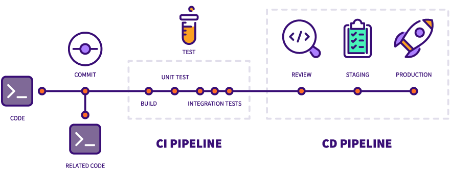
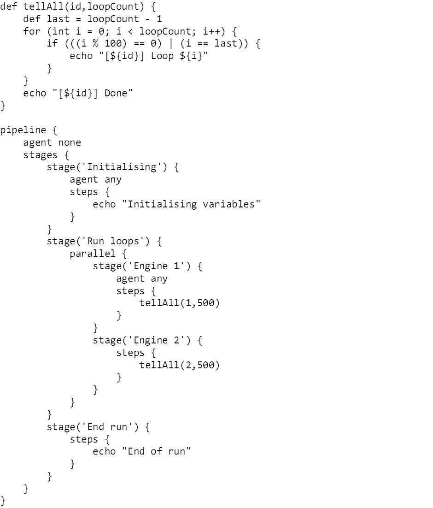
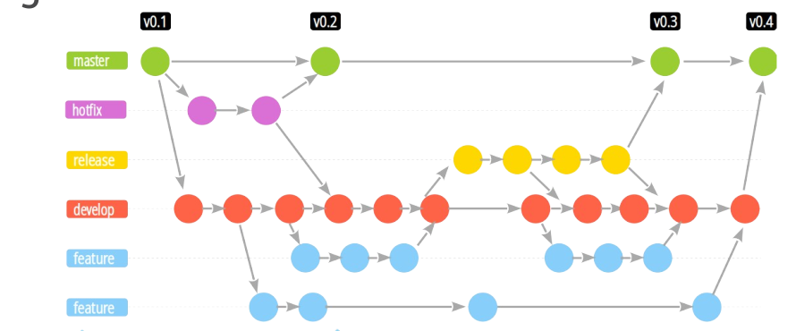
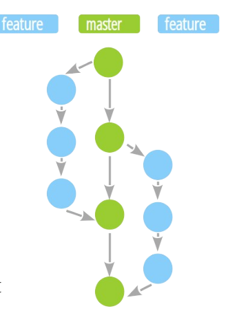
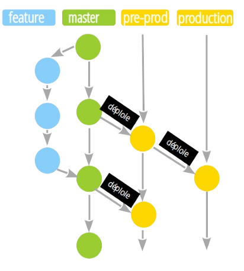
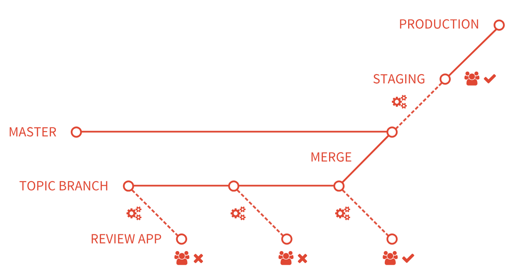

# Jour 1 - Matin

--- 

## Gitlab CI et l’intégration d’un cycle complet de CI/CD



---

## Pourquoi la CI/CD ? 

**Elle est associée à l'émergence des pratiques DevOps et aux méthodes Agile**

Une des idées du développement Agile est de permettre des cycles de production plus rapides.

Une des idées du DevOps est de rendre les Développeurs plus autonomes sur leurs applications. 

La CI/CD répond à ces deux besoins avec des intégrations et des déploiements du code au fil des ajouts quotidiens au code source. 

**Quand du nouveau code est ajouté au dépôt central partagé, un processus automatisé teste et valide les modifications, permettant aux développeurs d’identifier rapidement les problèmes et de recevoir des retours immédiats pour effectuer les ajustements nécessaires.**


---


**La mise en œuvre des pratiques CI/CD offre de nombreux avantages :**

- **Des publications plus rapides et plus robustes**   
  Grâce à l’automatisation des tests et du build, les développeurs peuvent se concentrer sur l’écriture de code et l’amélioration de la qualité de l’application.


- **Une documentation des processus via le code**  
  Les pipelines de CI/CD sont une forme d'IAC qui définit la manière dont un logiciel est fourni et livré de bout en bout.


- **Une détection précoce et standardisée des bugs**  
  Les développeurs peuvent éviter certaines erreurs et améliorer la qualité de leurs tests quand une erreur survient.


- **Une visibilité accrue**  
  La CI/CD permet d’analyser les bugs de build et de s'assurer de la performance de leurs process (ex: métriques DORA). 


- **Des boucles de rétroaction plus rapides**  
  Le CI/CD crée une boucle de retour constante que les développeurs peuvent utiliser à leur avantage pour expérimenter des fonctionnalités et améliorer l’expérience de l’application.


- **Des clients plus satisfaits**  
  Des versions plus fiables et des délais plus rapides pour les mises à jour, les corrections de bugs et l’ajout de nouvelles fonctionnalités vous distinguent de la concurrence pour les clients.
 
---

**Les étapes de l'Intégration Continue**

1. **Le build**  
  Cette étape est nécessaire pour les langages compilés ou nécessitant une forme du code exécutable.   
  Ex: make 
2. **Les tests du code**  
   Il peut s'agir de tests d'intégration, de tests unitaires ou autres comme des tests d'accessibilité.   
  Ex: pytest  
3. **L'analyse du code**  
   Il s'agit de faire passer le code à la loupe d'une analyse statique qui permet d'en améliorer la qualité ou de trouver des failles.   
  Ex: SonarQube, Spectral  
4. **Le packaging**  
   On peut alors construire les livrables du code, comme une image Docker.   
  Ex: Packer, Docker  
5. **La livraison**  
   On envoie les packages vers le registry correspondant à l'environnement spécifique (si disponible).   
  Ex: Jfrog, Docker Registry   


---

**Les étpaes du Déploiement Continu**

6. **Le provisioning**  
   On réserve les ressources nécessaires au déploiement.   
  Ex: Terraform  
7. **Le déploiement**  
   Les charges utiles sont mises à jour dans l'environnement voulu.   
  Ex: K8S, cloud  
8. **Les tests d'acceptance**  
   Ces derniers tests sont exécutés sur un environnement réel.   
  Ex: Bruno, Postman  

---

## Les forges GIT et les pipelines CI/CD

**Historiquement l'apport de solutions en provenance du monde Java comme Jenkins ou Maven a été un progrès pour l'automatisation.**

Dans Maven, il existe plusieurs idées comme  :

- Les buts
    - compile
    - test
    - package
    - install
    - deploy
- Les repositories pour les artefacts

---

**Historiquement, des outils comme Jenkins supportent plusieurs types de Systèmes de Contrôle de Version.**  

Jenkins intégre des pipelines complexes via des scripts Java et des plugins, au prix d'une certaine lourdeur et complexité.



---

**Ils sont capables de détecter les changements pour lancer des pipelines de CI.**

Mais avec l'émergence de Git, et surtout des forges Git comme Github ou Gitlab, la CI/CD va être intégrée à la forge. 

Ainsi le code passe en première position et on supprime un outil. 

Pour contrôler les pipelines, ces forges utilisent des fichiers statiques, à l'inverse de solutions comme Jenkins qui utilisent par exemple des scripts Groovy.

--- 

### Les flows GIT

**Les flows décrivent différentes architectures de branches GIT qui conditionnent le travail des équipes et les cycles de CI/CD.**


#### Gitflow



#### Github flow



#### Gitlab flow



---

## La CI Gitlab

**Le cas de Gitlab est intéressant : c'est une plateforme de CI/CD qui fournit de nombreux outils.** 

- Un DSL complet pour contrôler les pipelines : le fichier [`.gitlab-ci.yml`](https://docs.gitlab.com/ee/ci/yaml/index.html)
- La capacité à utiliser ses propres "runners", qui sont les serveurs utilisés lors des pipelines.
- Un catalogue complet de solutions "sur étagère" / marketplace pour le CI/CD.
- Une intégration des secrets via des variables disponibles au moment de l'exécution, offrant une granularité assez fine - y compris par branche.
- Une intégration avec Kubernetes.


--- 


## Présentation du .gitlab-ci.yml  
**Le fichier `.gitlab-ci.yml` définit les jobs et leur enchaînement.**  

**Nous allons analyser des templates de Gitlab CI :**

- Le template par défaut : https://gitlab.com/gitlab-org/gitlab/-/blob/master/lib/gitlab/ci/templates/Getting-Started.gitlab-ci.yml

- Le template pour Docker : https://gitlab.com/gitlab-org/gitlab/-/blob/master/lib/gitlab/ci/templates/Docker.gitlab-ci.yml

--- 

### Structure minimale du fichier YAML 

```yaml
stages:
  - build
  - test

build_job:
  stage: build
  script:
    - echo "Building..."

test_job:
  stage: test
  script:
    - echo "Testing..."
```

--- 

#### Bonnes pratiques

- Respecter l’indentation et la syntaxe YAML pour éviter les erreurs.
- Utiliser des anchors YAML pour éviter les répétitions 
```yaml

.job_template: &job_configuration  # Hidden yaml configuration that defines an anchor named 'job_configuration'
  image: ruby:2.6
  services:
    - postgres
    - redis

test1:
  <<: *job_configuration           # Add the contents of the 'job_configuration' alias
  script:
    - test1 project

test2:
  <<: *job_configuration           # Add the contents of the 'job_configuration' alias
  script:
    - test2 project
```


---

### Gestion basique des variables  

**Les variables se définissent dans `Settings > CI/CD > Variables`** 

On peut aussi les déclarer directement dans `.gitlab-ci.yml`.  

Exemple :  
```yaml
variables:
  NODE_ENV: production
  API_KEY: $CI_API_KEY
```

Elles sont essentielles pour passer des informations comme des versions, des URLs, des secrets ou autres.  

Elle seront injectées par Gitlab afin d'être disponible dans le runner au moment de l'exécution du job.

Elles sont définies au niveau

---

**Gitlab fournit aussi un grand nombre de variables préféfinies.**

Documentation : https://docs.gitlab.com/ee/ci/variables/predefined_variables.html

Par exemple 

```shell


CI_COMMIT_REF_SLUG ex: "feature-awesome-feature"
CI_COMMIT_SHORT_SHA ex: "9b1e6e9"

CI_REGISTRY_IMAGE : 
CI_REGISTRY_PASSWORD	
CI_REGISTRY_USER

```

---

### Aperçu des stages (ex. build, test, deploy)

**Les stages déterminent l'ordre d’exécution.**

Les trois stages suivants sont défins par défaut :

```
build -> test -> deploy 
```   
On peut aussi en créer d’autres, comme `lint`. 

```yaml
stages:
  - lint
  - build
  - test
  - deploy
```

Les stages sont toujours exécutés séquentiellement. 

Par défault l'échec d'un stage provoque l'annulation des stages suivants, sauf si la directive `allow_failure` du `job` est définie à `true` par exemple.

---


### Aperçu des jobs 

**Les jobs peuvent être exécutés en parallèle ou en série : ils constituent le moteur de la CI/CD dans Gitlab.**

De nos jours la plupart des jobs sont exécutés via des conteneurs exécutés sur le runner.

La documentation de Gitlab sur les jobs démontre la richesse des réglages :

> https://docs.gitlab.com/ci/yaml/#job-keywords


---

**Le parallélisme des jobs permet notamment de répartir la tâche dans le cadre des tests.**

Un des objectifs de la CI est de faire le maximum en un minimum de temps.

En parallélisant différents jobs indépendants les uns des autres on peut réduire la durée totale du pipeline.

**D'un autre côté, le risque existe d'avoir des pipelines qui deviennent trop complexes : c'est un équilibre à trouver.**

---

**Les jobs peuvent être filtrés avec des conditions dans `rules`**

Documentation : 

>> https://docs.gitlab.com/ci/jobs/job_rules/


On peut ainsi déclencher certains jobs uniquement pour certaines situations, comme des merges requests.

```yaml

merge request:
  script: echo "Merge Request!"
  rules:
    - if: $CI_PIPELINE_SOURCE == "merge_request_event"

main:
  script: echo "Hello Main!"
  rules:
    - if: $CI_COMMIT_BRANCH == "main"

```

---

## Construction et packaging Docker  

**Création et configuration du job de build Docker dans GitLab CI**  

```yaml
build_docker_image:
  stage: build
  image: docker:cli
  services:
    - docker:dind
  script:
    - docker build -t my-app:x.y.z .
```

Le build est le job Gitlab fondamental pour une application qui utilise Docker. 

Les `services` permettent d’utiliser `docker:dind` pour construire l’image depuis une autre instance docker 

> `dind = Docker in Docker`  

L'exécution des jobs à l'intérieur d'un conteneur Docker requiert un worker de type "`docker Executor`" cf. 

> https://docs.gitlab.com/runner/executors/docker/

---

**La directive `script` spécifie la commande à exécuter.**

Elle est requise pour qu'un `job` lance une action, que ce soit dans un exécuteur Docker ou autre.

---

### Stratégies de versionnement (tags sémantiques, latest, release-candidate)**  

**Il est essentiel de tagger les images pour bien identifier la version.**  

L'utilsation de tags sémantiques rend le format `x.y.z` logique 

|position|nom|rôle|
|---|---|---|
| x | majeur | changement d'API | 
| y | mineur | ajout de fonctionnalités | 
| z | patch | correctiifs |

--- 

**La norme Semver définit les bonnes pratiques de définition des tags**

> https://semver.org/


--- 

### Envoi des images vers un registry  

**Cette étape rend disponible l'image docker dans le GitLab Container Registry ou sur Docker Hub.**  

```yaml
build_and_push:
  stage: build
  script:
    - docker login -u $REGISTRY_USER -p $REGISTRY_PASSWORD registry.company.com
    - docker build -t registry.company.com/group/project/my-app:$CI_COMMIT_SHA .
    - docker push registry.company.com/group/project/my-app:$CI_COMMIT_SHA
```

---

**Il est nécessaire d'utiliser un login ou des tokens d’accès sécurisés pour l’authentification.**  

Ces informations sont stockées dans les variables Gitlab du projet ou du groupe.

---

## Mise en place des tests et pipelines avancés  

**L'intégration de tâches de linting ou de tests unitaires permet de s'assurer de la qualité du code.**  

On peut par exemple : 
- Ajouter un job “lint” pour vérifier la qualité du code.  
- Ajouter un job “test” pour lancer les tests unitaires.  
```yaml
lint_job:
  stage: test
  script:
    - npm run lint

test_job:
  stage: test
  script:
    - npm run test
```

--- 

**La remontée des erreurs est bloquante par défaut.**  

Le fait de rendre les erreurs bloquantes est un arbitrage au sein des équipes.

Certaines équipes considèrent que le lint est bloquant car il implique du travail de maintenance pour les autres a posteriori. D'autres n'en font pas.

Il convient toujours de réfléchir à l'utilité des tests : faire des tests qui ne servent à rien ralentit la CI.

---


## Aperçu des pipelines conditionnels (only, except, rules)  
Exécuter un job seulement sur une branche spécifique :  
```yaml
deploy_staging:
  stage: deploy
  script:
    - echo "Deploying to staging..."
  only:
    - develop
```
Ou définir des règles avancées :  
```yaml
rules:
  - if: '$CI_COMMIT_TAG'
    when: always
  - if: '$CI_COMMIT_BRANCH == "main"'
    when: manual
```

Permet de contrôler le déclenchement et l’automatisation.  

---

## Gestion élémentaire du cache et des artefacts

**Ces éléments permettent d'accélérer la production ou d'améliorer le débug d'une tâche.**

Le cache (ex. dépendances Node.js ou Maven) accélère les builds.  
Les artefacts (ex. rapports de tests) sont conservés pour analyse.  
```yaml
test_job:
  stage: test
  cache:
    paths:
      - node_modules/
  artifacts:
    paths:
      - coverage/
    expire_in: 1 week
```
Réduit le temps d’exécution et facilite le debugging.


--- 

## Quid des tests d’intégration

**Les tests d'intégration sont complexes car ils impliquent la mise à disposition d'un environnement d'exécution avant un déploiement.**

Autrement dit, il faut déployer une application sur un environnement éphémère pour la tester.

Gitlab résoud ce problème via les Review Apps qui visent à déployer un nouvel environnement pour chaque branche nommée.  

Documentation : https://docs.gitlab.com/ci/review_apps/



Cette fonctionnalité nécessite un cluster Kubernetes.

--- 

**On observe une bascule entre une vision traditionnelle et une vision "conteneurs"** 

La vision traditionnelle est celle des environnements de travail stables :

- dev / hors-prod
- user acceptance / pre-prod  
- production

La vision conteneurisée permet de fournir des environnements "jetables" pour tout ce qui est développement.

Dans ce cadre là, il devient essentiel d'intégrer la recette du déploiement continu au code de l'application.

- intégré : l'IAC de la CD fait partie du code de l'application
- lié : l'IAC de CD est référencée sous forme de vairable dans les pipelines par exemple


---

## Multi-registries et promotion des images 

**Il est fréquent d'utiliser des dépôts différents dans une même organisation pour différents environnements.**

Il n'est pas nécessaire d'avoir des registries physiquement différents : des compartimentations par environnement suffisent.

```
  dev   registry.company.tld/group/application/dev/image:x.y.z
  uat   registry.company.tld/group/application/uat/image:x.y.z
  prod  registry.company.tld/group/application/prod/image:x.y.z
```

---

**La bonne pratique consiste alors à ne pas build une image plus d'une fois.**

Il suffit de pousser la même image sur les différents registries en bénéficiant ainsi de la mutualisation des layers Docker.

```
scripts:

# Login with DEV auth
- docker login <DEV AUTH TOKENS> registry.company.tld

# Pull docker image from DEV
- docker pull registry.company.tld/group/application/dev/image:x.y.z

# Tag with UAT registry
- docker tag registry.company.tld/group/application/dev/image:x.y.z registry.company.tld/group/application/uat/image:x.y.z

# Login with UAT auth
- docker login <UAT AUTH TOKENS> registry.company.tld

# Push docker image to UAT
- docker push registry.company.tld/group/application/uat/image:x.y.z
```

---

## Docker et gestion fine des releases 

**Dans certains cas, une gestion manuelle des releases est nécessaire.**

C'est la situation dans laquelle se trouve par exemple une application développée en simultané par 50 développeurs en 8 équipes.

Dans ce cas le release manager va faire des `git cherry-pick` des features à intégrer dans la release pour construire les images "officielles" qui vont être déployées.

---

**Dans ce cadre les images qui seront promues dans les différents environnements ne seront jamais celles produites par les devs.**

Mais pour autant tout le travail effecuté sur les tests permet de bénéficier à la stabilité des releases.

Chaque nouvelle feature, chaque correction de bug devient un potentiel d'amélioration de l'application.