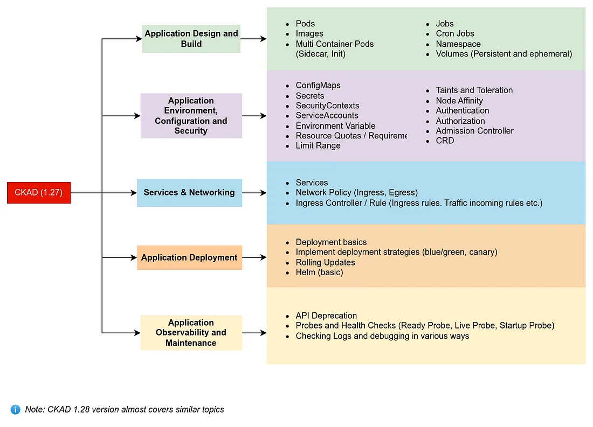

# Formation Kubernetes Débutant

## A propos de moi

---

## A propos de vous

- Parcours ?
- Attentes ?

---

## Le programme de la formation et les objectifs

---

### Objectifs

* **Maîtriser la conteneurisation** : Comprendre l'intérêt et le fonctionnement des orchestrateurs de conteneurs   
* **Maîtrise de l'architecture Kubernetes** : Comprendre le rôle du control plane, de l'API, de la CLI et des workers  
* **Déploiement automatisé** : Savoir déployer des ressources Kubernetes en utilisant des manifestes YAML, des solutions d'Infrastructure as Code (IaC) comme Helm, et comprendre l'orchestration des ressources  
* **Microservices en production** : Savoir déployer des applications microservices avec Kubernetes en utilisant des Deployments, Services et Ingress et savoir configurer les applications pour un environnement de production en utilisant des ConfigMaps, Secrets et des stratégies de sécurité  
* **Automatisation intégrée** : Maîtriser les automatisations intégrées de Kubernetes, telles que la gestion du réseau, le cycle de vie des conteneurs ou la boucle de réconciliation des ressources.   
* **Gestion des applications stateful**: Savoir gérer les applications statefuls et assurer la persistance des données à l'aide de StatefulSets et de PersistentVolumes
* **Dépanner et optimiser les applications sur Kubernetes** : Savoir comment identifier des root causes avec les outils adaptés 

## Programme

