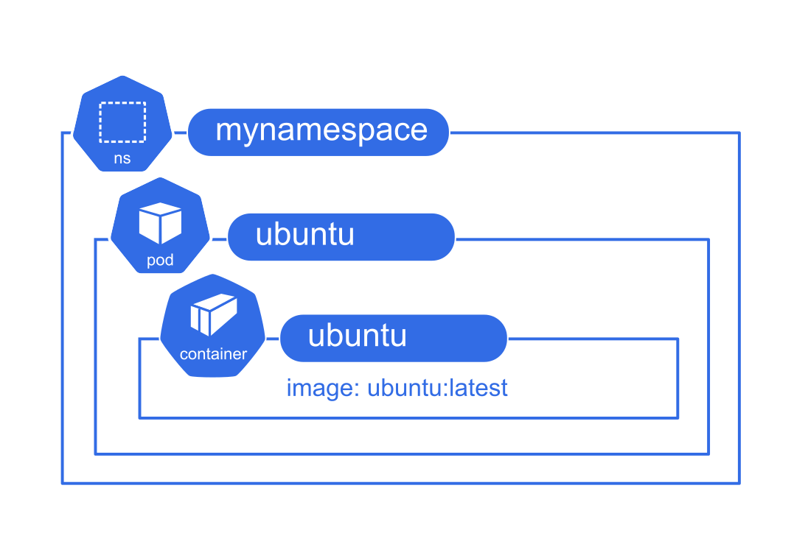

### Tips 

**Utiliser les alias et variables du shell**


```shell

# File: .bash_aliases

alias k='kubectl'

# Afficher les contextes 
alias kcon='kubectl config get-contexts'

# Changer de contexte
alias kx='kubectl config use-context'

# Changer le namespace courant
alias kn='kubectl config set-context --current --namespace'

# Lister les ressources  
alias kg='kubectl get'

# Lister les ressources  
alias kdesc='kubectl describe'

# Appliquer un manifeste
alias ka='kubectl apply -f'

# Créer les ressources 
alias kc='kubectl create'

# Supprimer les ressources 
alias kdel='kubectl delete'

# Générer en sortie YAML
export yaml='--dry-run=client -o yaml'

# Expliquer une ressource
alias kexp='kubectl explain — recursive'

# Forcer une terminaison immédiate
export now='--grace-period 0 --force'

# Obtenir les événements
alias kev='kubectl get events --sort-by .lastTimestamp'

# Appliquer un manifeste
alias kl='kubectl logs'

```


Puis 

```shell

source .bash_aliases
```
---

# TP 1 

**Déployer un Pod Kubernetes avec une image  Ubuntu**

Ce TP a pour objectif de créer, déployer et vérifier un Pod dans un cluster Kubernetes tout en utilisant des commandes **kubectl**.



---


### Étapes 

- **Action** : Installer K3S si ce n'est pas encore fait via la ligne de commande sur k3s.io   
  **Observation** : K3S doit s'installer sur votre lab virtuel.

<details><summary>Indice</summary>

Utiliser la commande `curl [URL installateur k3s] | sh -` pour lancer l'installation.

</details>

- **Action** : Afficher son kubeconfig.  
  **Observation** : Le kubeconfig doit indiquer les paramètres du cluster en cours.  

<details><summary>Indice</summary>

Utiliser la commande `kubectl config ???` pour afficher la configuration.

</details>

- **Action** : Créer son namespace    
  **Observation** : Le namespace apparaît dans la liste.  
  **Contraintes** : 
    - nom du namespace : `mynamespace`

<details><summary>Indice</summary>

Utiliser la commande `kubectl create namespace ???` pour créer le namespace.

</details>

- **Action** : Lancer l'image Ubuntu `ubuntu:latest` pour un pod `ubuntu`.  
  **Observation** : Le pod sera créé dynamiquement.  
  **Contraintes** : 
    - namespace `mynamespace`
    - image : `ubuntu:latest`
    - nom du pod : `ubuntu`
    - nom du conteneur : sera hérité du nom du pod par défaut
    - commande : `tail -f /dev/null`

<details><summary>Indice</summary>

Utiliser la commande `kubectl run ???` pour lancer l'image Docker.

</details>

- **Action** : Utiliser `get` et `describe` pour inspecter le Pod.  
  **Observation** : `get` fournit un résumé du Pod, tandis que `describe` donne des détails complets. Est-ce que le pod est resté actif ? Pourquoi ?  

<details><summary>Indice</summary>

Utiliser les commandes `kubectl get ???` et `kubectl describe ???`.

</details>

- **Action** : Afficher le manifeste du Pod.  
  **Observation** : Le fichier YAML généré représente l'état actuel du Pod dans Kubernetes.  

<details><summary>Indice</summary>

Utiliser la commande `kubectl get ??? -o yaml` pour afficher le manifeste en format YAML.

</details>

- **Action** : Supprimer le Pod et attendre la finalisation de la suppression.  
  **Observation** : Le Pod sera supprimé, et la commande attendra que l'opération soit terminée.  

<details><summary>Indice</summary>

Utiliser la commande `kubectl delete ???`.

</details>

---

### Avancé 

- Exécuter la commande `kubectl get all` pour lister toutes les ressources dans le namespace actuel.
- Exécuter la commande `kubectl get events --sort-by .lastTimestamp` pour lister toutes les ressources dans le namespace actuel.
- Relancer tourner le pod sans `tail -f /dev/null`. Qu'est-ce que ça fait ?
- Utiliser la commande `kubectl get pods -o json` pour afficher la sortie en format JSON.
- Utiliser `kubectl get pod ubuntu -o jsonpath='{.status.phase}'` pour filtrer des informations spécifiques en JSON.
- Utiliser `kubectl top pod ubuntu` pour afficher les statistiques d'utilisation CPU/mémoire du Pod.

---

### Solution 

<details><summary>Afficher</summary>

- **Afficher son kubeconfig** : `kubectl config view`
- **Créer son namespace** : `kubectl create namespace mynamespace`
- **Lancer l'image Ubuntu** : `kubectl run ubuntu --image=ubuntu --namespace mynamespace -- tail -f /dev/null`
- **Utiliser get et describe** : 
  - `kubectl get pod ubuntu --namespace mynamespace`
  - `kubectl describe pod ubuntu --namespace mynamespace`
- **Afficher le manifeste en YAML** : `kubectl get pod ubuntu -o yaml --namespace mynamespace`
- **Supprimer et attendre la suppression du Pod** : 
  - `kubectl delete pod ubuntu --namespace mynamespace` 

</details>
