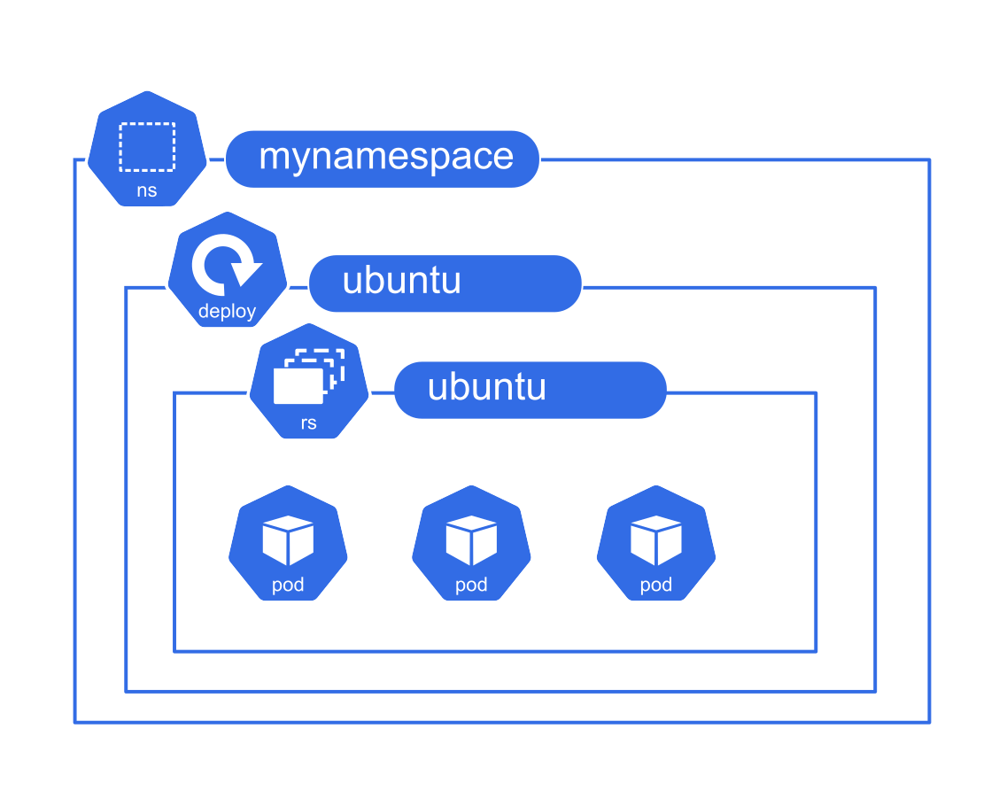

# TP 2

**Déployer un Deployment Kubernetes pour une application scalable et capable de gérer des mises à jour**

Dans ce TP, vous allez convertir un Pod en Deployment, ajouter des fonctionnalités de scalabilité et d’observabilité, et gérer les versions de l’application.



--- 

### Tips

Pour suivre les opérations sur le namespace

- `kubectl -n mynamespace get events --sort-by .lastTimestamp `
- `kubectl -n mynamespace get events -w&`


---

### Étapes 

- **Action** : Convertir le Pod du TP précédent en Deployment et appliquer le manifeste YAML.  
  **Observation** : Le Deployment doit être visible dans la liste des ressources de ce type.  
  **Contraintes** : 

    - namespace `mynamespace`
    - nom du déploiement : `ubuntu`
    - selector/label : `app: ubuntu`
    - image : `ubuntu:latest`
    - commande : `tail -f /dev/null`

<details><summary>Indice</summary>
<ul>
<li>Utiliser la commande <code>kubectl get ??? -o yaml</code> pour obtenir le template du pod dans le TP précédent.</li>
<li>Utiliser la commande <code>kubectl apply ???</code> pour appliquer un fichier YAML au cluster. </li>
<li>Utiliser les commande <code>get</code> et <code>describe</code> pour afficher l'état. </li>
</ul>
</details>

- **Action** : Ajouter 2 replicas (3 au total) au Deployment, et appliquer les modifications.  
  **Observation** : Le Deployment doit intégrer plusieurs replicas.  
<details><summary>Indice</summary>
Vérifier les sections replicas dans le manifeste YAML.
</details>

- **Action** : Ajouter des StartupProbe, LivenessCheck et ReadinessCheck, puis appliquer le manifeste YAML.  
    **Observation** : Quand on édite le deployment il met du temps à être prêt.  
  **Contraintes** : 

    - Commande pour la sonde Startup : `date >> /tmp/startupprobe.txt `
    - Commande pour la sonde Readiness : `date >> /tmp/readinessprobe.txt `
    - Commande pour la sonde Liveness : `date >> /tmp/livenessprobe.txt`  


<details><summary>Indice</summary>

Utiliser des probes dans le YAML pour les checks de liveness et readiness.

</details>

- **Action** : Observer les replicasets déployées par un Deployment.  
  **Observation** : Les ReplicaSets et les Pods doivent avoir le même préfixe que le déployment.  
<details><summary>Indice</summary>
Inspecter les ressources avec <code>kubectl get ???</code>.
</details>

- **Action** : Effectuer un rollout de version en utilisant la version 22.04 de ubuntu  
  **Observation** : Le Deployment doit être capable de gérer plusieurs versions d'une application.namespace `mynamespace`
    - image : `ubuntu:22.04`
  
<details><summary>Indice</summary>
Mettre à jour et gérer les versions à l’aide des commandes liées aux déploiements.
</details>

---

### Avancé 

- Utiliser la commande `kubectl rollout status` pour observer l’état du déploiement pendant une mise à jour.
- Inspecter l’historique des rollouts avec `kubectl rollout history` pour voir les versions précédentes.
- Utiliser la commande `kubectl scale` pour ajuster dynamiquement le nombre de réplicas sans modifier le manifeste YAML.
- Utiliser `kubectl rollout history --revision=3 ???` pour voir les détails concernant une version du déploiement.

---

### Solution 

<details><summary>Afficher</summary>

- **Convertir le Pod en Deployment et appliquer le manifeste** : `kubectl apply -f <nom_du_fichier>.yaml`  

```yaml
apiVersion: apps/v1
kind: Deployment
metadata:
  name: ubuntu
  namespace: mynamespace
spec:
  replicas: 1
  selector:
    matchLabels:
      app: ubuntu
  template:
    metadata:
      labels:
        app: ubuntu
    spec:
      containers:
      - name: ubuntu
        image: ubuntu:latest
        command: ["/bin/bash", "-c", "tail -f /dev/null"]

```
- **Ajouter des replicas et labels au Deployment** : Modifier le YAML avec la section replicas et labels, puis appliquer.  

```yaml
apiVersion: apps/v1
kind: Deployment
metadata:
  name: ubuntu
  namespace: mynamespace
spec:
  replicas: 3
  selector:
    matchLabels:
      app: ubuntu
  template:
    metadata:
      labels:
        app: ubuntu
    spec:
      containers:
      - name: ubuntu
        image: ubuntu:latest
        command: ["/bin/bash", "-c", "tail -f /dev/null"]
```

- **Ajouter des health checks** : Utiliser les probes dans le YAML, puis appliquer avec `kubectl apply`.  

```yaml

apiVersion: apps/v1
kind: Deployment
metadata:
  name: ubuntu
  namespace: mynamespace
  labels:
    app: ubuntu
spec:
  replicas: 3
  selector:
    matchLabels:
      app: ubuntu
  template:
    metadata:
      labels:
        app: ubuntu
    spec:
      containers:
      - name: ubuntu
        image: ubuntu:latest
        command: ["/bin/sh", "-c", "tail -f /dev/null"]
        readinessProbe:
          exec:
            command:
            - /bin/sh
            - -c
            - "date >> /tmp/readinessprobe.txt"
          initialDelaySeconds: 5
          periodSeconds: 10
        livenessProbe:
          exec:
            command:
            - /bin/sh
            - -c
            - "date >> /tmp/livenessprobe.txt"
          initialDelaySeconds: 15
          periodSeconds: 10
        startupProbe:
          exec:
            command:
            - /bin/sh
            - -c
            - "date >> /tmp/startupprobe.txt"
          failureThreshold: 30
          periodSeconds: 10

```

- **Observer les ressources déployées** : Utiliser `kubectl get all` pour voir toutes les ressources.
- **Effectuer un rollout de version** : Mettre à jour le fichier YAML en remplaçant `image: ubuntu:22.04` et appliquer le fichier.
- **Surveiller le rollout de version** : `kubectl rollout status deployment/ubuntu` et `kubectl rollout history deployment/ubuntu`
- **Effectuer un rollback de version** : `kubectl rollout undo deployment/ubuntu` et `kubectl rollout status deployment/ubuntu` 

```bash

```

</details>
