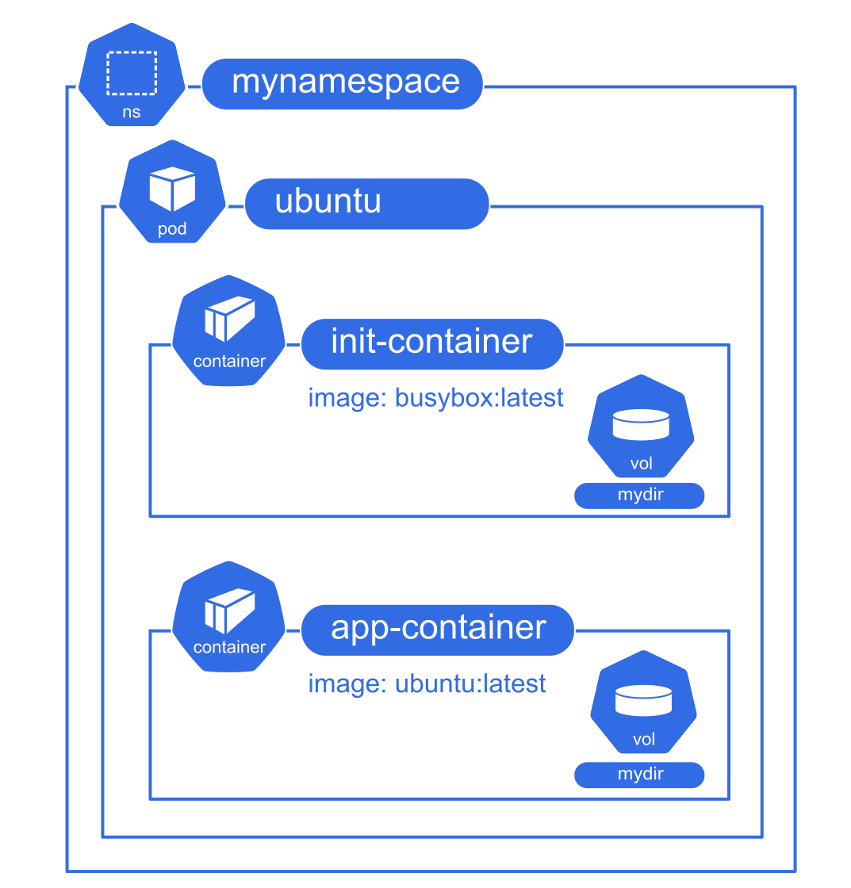
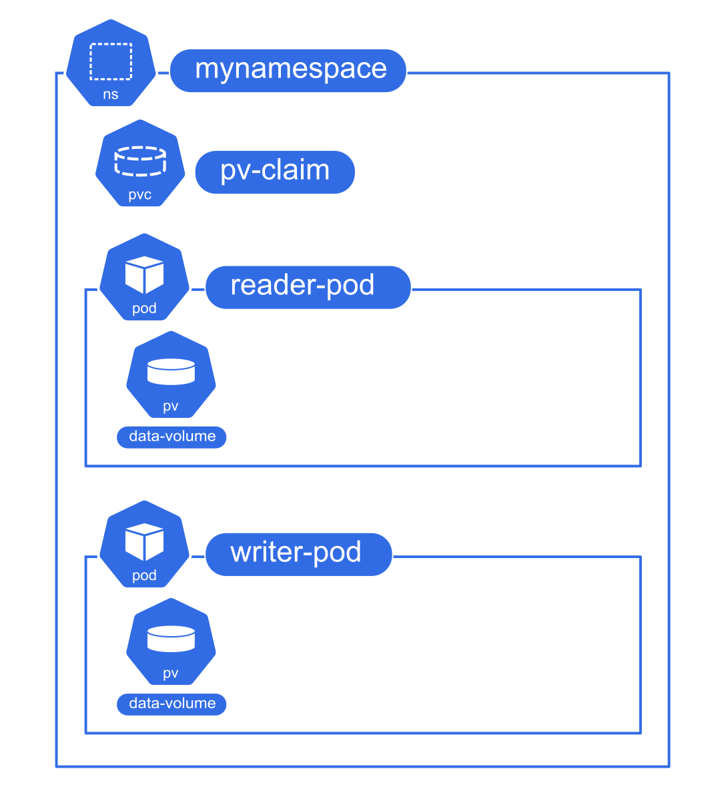

# TP 3

**Gérer des volumes, ConfigMaps, Secrets et appliquer des restrictions dans Kubernetes**

Ce TP est une suite de courts objectifs qui vise à expérimenter l'utilisation des volumes, ConfigMaps, Secrets ainsi qu'à ajouter des restrictions de sécurité et de ressources aux Pods dans Kubernetes.

---

### 0. Utiliser Exec
- **Action** : Utiliser `kubectl exec` pour exécuter des commandes dans un Pod.  
  **Observation** : Vous devez être capable d'accéder au shell du Pod pour exécuter des commandes internes.  
  **Contraintes**
   - Nom du namespace : `mynamespace`
   - Nom du pod : `ubuntu`
   - Image du conteneur : `ubuntu:latest`
   - Commande du pod : `tail -f /dev/null`
   - Commande à exécuter : `cat /etc/password`

<details><summary>Indice</summary>
Utiliser la commande `kubectl exec -it [nom du pod] -- /bin/sh` .
</details>

#### Solution

<details><summary>Afficher</summary>

- **Lancer le pod** :   
  `kubectl run --namespace mynamespace ubuntu --image ubuntu:latest -- tail -f /dev/null`

- **Utiliser `kubectl exec` pour accéder au shell du Pod** :   
  `kubectl exec --namespace mynamespace -it ubuntu -- cat /etc/passwd`

</details>

---

### 1. Un volume non persistant 



- **Action** : Monter un volume de type `emptyDir` dans un Pod et observer la suppression des données après la suppression du Pod.    
  Votre volume doit être déclaré dans la section `volumes` et le pod doit utiliser ce volume dans la section `volumeMounts` de son YAML.  
  **Observation** : Les données créées dans le volume ne doivent pas être conservées après la suppression du Pod.   
  **Contraintes**
   - Nom du namespace : `mynamespace`
   - Nom du pod : `app-container`
   - Image du conteneur : `ubuntu:latest`
   - Commande du conteneur : `tail -f /dev/null`
   - Nom du volume : `myDir`
   - Point de montage du volume sur le conteneur : `/data`     
<details><summary>Indice</summary>
Un exemple est disponible dans <a target="_blank"href="https://kubernetes.io/docs/concepts/storage/volumes/#emptydir-configuration-example">la documentation kubernetes</a>.<br/>    
Vérifiez la disparition du contenu du volume avec `kubectl delete ...`  et `kubectl apply ...` ..
</details>

- **Action** : Ajouter un `initContainer` qui écrit un timestamp dans le volume `emptyDir`, puis lire ce timestamp via un exec sur le conteneur principal.  
  **Observation** : Le Pod principal doit afficher le timestamp écrit par l'`initContainer`.  
  **Contraintes**
   - Nom du init container : `init-container`
   - Image du init container : `busybox:latest`
   - Point de montage du volume sur le init container : `/data`     
   - Commande du init container  : `date > /data/timestamp.txt`
   - Commande en exec sur le pod principal  : `cat /data/timestamp.txt`
<details><summary>Indice</summary>
. Utilisez `kubectl exec`  pour lire le fichier.
</details>


#### Solution

<details><summary>Afficher</summary>

- **Monter un volume de type `emptyDir` avec un `initContainer` pour écrire un timestamp** :
```yaml
apiVersion: v1
kind: Pod
metadata:
  name: ubuntu
  namespace: mynamespace

spec:
  initContainers:
  - name: init-container
    image: busybox:latest
    command: ["sh", "-c", "date > /data/timestamp.txt"]
    volumeMounts:
    - name: mydir
      mountPath: /data
  containers:
  - name: app-container
    image: ubuntu:latest
    command: ["/bin/bash", "-c", "tail -f /dev/null"]
    volumeMounts:
    - name: mydir
      mountPath: /data
  volumes:
  - name: mydir
    emptyDir: {}
```

- **Afficher le timestamp** : 
  `kubectl exec -n mynamespace ubuntu -c app-container -- cat /data/timestamp.txt` 

</details>

---

### 2. Un volume persistant entre deux pods 

 

- **Prérequis** : Au préalable il faut installer un stockage de volumes persistants : Longhorn

  - `sudo apt update && sudo apt install nfs-common -y`
  - `kubectl apply -f https://raw.githubusercontent.com/longhorn/longhorn/v1.6.0/deploy/longhorn.yaml`


- **Action** : Lancer un Pod avec un volume de type `PersistentVolume` pour écrire des données dans un fichier.  
  Il faut que vous fassiez un fichier qui contienne un `PersistentVolumeClaim` et le `Pod` qui fait référence à ce Claim.  
  **Observation** : Vous devez voir un timestamp ajouté toutes les 5 secondes à la suite du fichier `/data/timestamp.txt`.  
  **Contraintes**
   - Nom du namespace : `mynamespace`
   - Nom du PersistentVolume : `pv-claim`.
   - Nom de la `storageClassName` du PVC : `longhorn`  
   - `AccessMode` du `PersistentVolume` : `ReadWriteMany`.  
   - Nom du pod : `writer-pod`
   - Image du conteneur : `ubuntu:latest`
   - Commande du conteneur : `while true; do echo $(date) >> /data/timestamp.txt; sleep 5; done`
   - Nom du volume dans le pod : `data-volume`.
   - Point de montage du volume sur le conteneur : `/data`     
       

<details><summary>Indice</summary>
Un exemple est disponible dans <a target="_blank"href="https://kubernetes.io/docs/tasks/configure-pod-container/configure-persistent-volume-storage/#create-a-persistentvolume">la documentation officielle</a>.<br/>
Utiliser `kubectl exec`  et la commande shell `while true; do echo "$(date)" >> /data/timestamp.txt; sleep 5; done`.

</details>

- **Action** : Lancer un second Pod avec le même volume de type `PersistentVolume` pour lire les données créées par le premier Pod.  
  **Observation** : Vous devriez voir le contenu du fichier créé dans le `writer` avec les nouvelles lignes ajoutées toutes les 5 secondes.  
  **Contraintes**
   - Nom du namespace : `mynamespace`
   - Nom du pod : `reader-pod`
   - Image du conteneur : `ubuntu:latest`
   - Commande du conteneur : `["/bin/sh", "-c", "tail -f /data/timestamp.txt"]`
   - Nom du volume dans le pod : `data-volume`.
   - Point de montage du volume sur le conteneur : `/data`     
   - `AccessMode` du `PersistentVolume` : `ReadWriteMany`.  

<details><summary>Indice</summary>
Utiliser `kubectl logs ...` pour voir les logs du pod.

</details>

#### Solution

<details><summary>Afficher</summary>

- **Écrire des données dans un volume `PersistentVolume`** :

```yaml

apiVersion: v1
kind: PersistentVolumeClaim
metadata:
  name: pv-claim
  namespace: mynamespace
spec:
  storageClassName: longhorn
  accessModes:
    - ReadWriteMany
  resources:
    requests:
      storage: 1Gi

---

apiVersion: v1
kind: Pod
metadata:
  name: writer-pod
  namespace: mynamespace
spec:
  containers:
  - name: writer
    image: ubuntu:latest
    command: ["/bin/sh", "-c", "while true; do echo $(date) >> /data/timestamp.txt; sleep 5; done"]
    volumeMounts:
    - name: data-volume
      mountPath: /data
  volumes:
  - name: data-volume
    persistentVolumeClaim:
      claimName: pv-claim
```

- **Lire les données dans un second Pod** : 
   
```yaml
apiVersion: v1
kind: Pod
metadata:
  name: reader-pod
  namespace: mynamespace
spec:
  containers:
  - name: reader
    image: ubuntu:latest
    command: ["/bin/sh", "-c", "tail -f /data/timestamp.txt"]
    volumeMounts:
    - name: data-volume
      mountPath: /data
  volumes:
  - name: data-volume
    persistentVolumeClaim:
      claimName: pv-claim
```


- **Afficher le contenu depuis le second Pod** : Utiliser `kubectl logs reader-pod --namespace mynamespace`  

</details>

---

### 3. Un volume de type ConfigMap

**Redis est une base de données clef-valeur très rapide qu'on peut configurer avec un fichier.**


- **Action** : Créer un ConfigMap pour la configuration du service Redis en utilisant le fichier d'exemple fourni.
  
  **Observation** : Le ConfigMap doit contenir les paramètres de configuration nécessaires au service Redis.  
  **Contraintes**
   - Nom du namespace : `mynamespace`
   - Nom de la ConfigMap : `redis-config`.
   - Données de la ConfigMap :      

```
# file: /etc/redis.conf
maxmemory 2mb
maxmemory-policy allkeys-lru
```   


<details><summary>Indice</summary>

- Suivre la [documentation  officielle](https://kubernetes.io/docs/tutorials/configuration/configure-redis-using-configmap/)  
- ou utiliser `kubectl create configmap --from-file `  pour créer et stocker la configuration.

</details>

- **Action** : Appliquer et afficher le ConfigMap, puis l’utiliser dans un Pod Redis.  
  **Observation** : Le Pod Redis doit démarrer avec la configuration fournie par le ConfigMap.
  **Contraintes**
   - Nom du namespace : `mynamespace`
   - Nom du pod : `redis-pod`
   - Image du conteneur : `redis:latest`
   - Commande du conteneur : `["redis-server", "/redis-master/redis.conf"]`
   - Nom du volume dans le pod : `config-volume`.
   - Point de montage du volume sur le conteneur : `/redis-master`     


<details><summary>Indice</summary>
Un exemple complet est fourni dans <a target="_blank"href="https://kubernetes.io/docs/tutorials/configuration/configure-redis-using-configmap/">la documentation officielle</a>.
</details>


#### Solution

<details><summary>Afficher</summary>

- **Créer et utiliser un ConfigMap pour Redis** : 
  - `kubectl -n mynamespace create --dry-run configmap redis-config --from-file=redis.conf -o yaml` 
  - `kubectl apply -f <configmap.yaml>`

```yaml
apiVersion: v1
kind: ConfigMap
metadata:
  name: redis-config
  namespace: mynamespace
data:
  redis.conf: |
    maxmemory 2mb
    maxmemory-policy allkeys-lru

---

apiVersion: v1
kind: Pod
metadata:
  name: redis-pod
  namespace: mynamespace
spec:
  containers:
  - name: redis
    image: redis
    command: ["redis-server", "/redis-master/redis.conf"]
    volumeMounts:
    - name: config-volume
      mountPath: /redis-master
  volumes:
  - name: config-volume
    configMap:
      name: redis-config

```

- **Afficher la configuration de redis**: `kubectl exec -it redis-pod -- redis-cli  config get maxmemory`

</details>

---

### 4. Un volume de type secrets consommé via les variables d'environnement

- **Action** : Créer un Secret en ligne de commande un secret pour les identifiants de connexion à une base de données Postgres.  
  Le Secret nommé `` doit contenir les deux variables suivantes :  
  **Observation** : Le secret apparaît dans la liste des secrets.
  **Contraintes**
   - Nom du namespace : `mynamespace`
   - Nom du secret : `postgres-secret`.
   - Données du secret :      
       `POSTGRES_USER` => `user`    
       `POSTGRES_PASSWORD` => `password`   

   
<details><summary>Indice</summary>
Un exemple est disponible dans <a target="_blank" href="https://kubernetes.io/docs/tasks/configmap-secret/managing-secret-using-kubectl/"> la documentation officielle</a>.<br/>   
Utiliser `kubectl create secret ...`  pour créer le Secret, puis vérifier son contenu avec `kubectl describe secret ...` .
</details>

- **Action** : Utiliser le Secret dans un Pod sous forme de variables d'environnement.  
  **Observation** : Le Pod doit lire les identifiants depuis le Secret et démarrer correctement.
  **Contraintes**
   - Nom du namespace : `mynamespace`
   - Nom du pod : `postgres-pod`
   - Image du conteneur : `postgres:latest`
   - Commande du conteneur : par défaut
   - Nom des variables d'environnement 
     - POSTGRES_USER
     - POSTGRES_PASSWORD

<details><summary>Indice</summary>
Utiliser `valueFrom` et `secretKeyRef`
Utiliser `kubectl describe secret`  pour afficher le Secret et l'associer au Pod Postgres.

</details>


#### Solution

<details><summary>Afficher</summary>

- **Créer un secret en ligne de commande** : `kubectl create secret generic postgres-secret --from-literal=POSTGRES_USER=user --from-literal=POSTGRES_PASSWORD=password`
- **Utiliser un Secret pour Postgres consommé en variables d'environnement** :

```yaml
apiVersion: v1
kind: Secret
metadata:
  name: postgres-secret
  namespace: mynamespace
type: Opaque
data:
  POSTGRES_USER: dXNlcg==   # "user" en base64
  POSTGRES_PASSWORD: cGFzc3dvcmQ=   # "password" en base64

---

apiVersion: v1
kind: Pod
metadata:
  name: postgres-pod
  namespace: mynamespace
spec:
  containers:
  - name: postgres
    image: postgres:latest
    env:
    - name: POSTGRES_USER
      valueFrom:
        secretKeyRef:
          name: postgres-secret
          key: POSTGRES_USER
    - name: POSTGRES_PASSWORD
      valueFrom:
        secretKeyRef:
          name: postgres-secret
          key: POSTGRES_PASSWORD
```

</details>

---

### 5. Configurer les ressources et les bases de sécurité des pods 

- **Action** : Ajouter des restrictions de sécurité à un Pod .  
  Le pod est nommé ``, il utilise l'image `` avec la ligne de commande    
  Le conteneur du Pod doit être exécuté sous l'utilisateur `999` et le groupe    
  **Observation** :   Le contexte de sécurité doit être appliqué quand on se `exec` dans le pod et qu'on utilise la commande `whoami`.
  **Contraintes**
   - Nom du namespace : `mynamespace`
   - Nom du pod : `stress-pod`
   - Image du conteneur : `bretfisher/stress:latest`
   - Commande du conteneur : `["/bin/sh", "-c", "tail -f /dev/null"]`
   - Contraintes de sécurité : 
     - User / UID  `999`
     - Group / GID `999`
     - Système de fichiers en lecture seule (`readOnlyRootFilesystem`)

<details><summary>Indice</summary>

Voir la <a target="_blank" href="https://kubernetes.io/docs/tasks/configure-pod-container/security-context/">>documentation officielle sur la sécurité des Pods</a>.
Utiliser les sections `securityContext`, `runAsUser`, `runAsGroup`, et `readOnlyRootFilesystem` dans le fichier YAML. 

</details>

- **Action** : Ajouter des restrictions de ressources (CPU, mémoire) au Pod.  
  **Observation** : Les ressources doivent apparaître dans la description du pod et on peut faire crasher avec la commande   
  `kubectl exec ... stress  --vm 1 --vm-bytes 200m`  
  **Contraintes**
   - Nom du namespace : `mynamespace`
   - Nom du pod : `stress-pod`
   - Image du conteneur : `bretfisher/stress:latest`
   - Commande du conteneur : `["/bin/sh", "-c", "tail -f /dev/null"]`
   - Contraintes de ressources : 
     - Requête CPU  `500m`
     - Limite CPU  `500m`
     - Requête RAM `100Mi`
     - Limite RAM `100Mi`

<details><summary>Indice</summary>

Voir la [documentation officielle sur les ressources et les limites](https://kubernetes.io/docs/concepts/configuration/manage-resources-containers/).  
Utiliser les sections `resources.limits` et `resources.requests` dans le fichier YAML. 

</details>

#### Solution

<details><summary>Afficher</summary>

- **Ajouter des restrictions de sécurité et de ressources (CPU, mémoire) au Pod** :

```yaml
apiVersion: v1
kind: Pod
metadata:
  name: stress-pod
  namespace: mynamespace
spec:
  containers:
  - name: stress-container
    image: bretfisher/stress:latest
    command: ["/bin/sh", "-c", "tail -f /dev/null"]
    resources:
      limits:
        cpu: "500m"
        memory: "100Mi"
      requests:
        cpu: "500m"
        memory: "100Mi"
    securityContext:
      runAsUser: 999
      runAsGroup: 999
      readOnlyRootFilesystem: true
```

</details>

---

### Avancé 

- Configurer les quotas de ressources au niveau du namespace et observer leur impact sur les Pods déployés.

---
