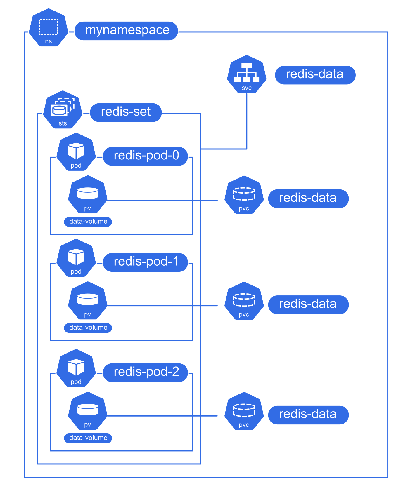

# TP 4

**Exposer un service Redis avec des StatefulSets et des volumes persistants dans Kubernetes**

Ce TP vise à expérimenter l'utilisation des StatefulSets pour garantir la persistance des données dans les bases de données Redis, ainsi qu'à créer et utiliser des PersistentVolumeClaims (PVC) et des services pour exposer les bases de données.


---

---
### Phase 1 : Création d'un Volume Persistant

- **Action** : Créer un PersistentVolumeClaim (PVC) et vérifier son enregistrement.  
  **Observation** : Le PVC doit être créé et associé à un volume disponible.  
  **Contraintes**:
    - Nom du namespace : `mynamespace`
    - Nom du PVC : `redis-pvc`
    - Taille du PVC : `100Mi`
    - AccessMode du PVC : `ReadWriteOnce`

<details><summary>Indice</summary>

Voir la <a href="https://kubernetes.io/docs/tasks/configure-pod-container/configure-persistent-volume-storage/#create-a-persistentvolume" target="_blank">documentation officielle</a>.  <br />
Utiliser `kubectl apply -f <pvc.yaml>` pour créer le PVC et `kubectl get pvc` pour vérifier sa création.

</details>

- **Action** : Utiliser le PVC dans un pod redis .  
  **Observation** : Le PVC doit être persisté même quand le pod est détruit et redéployé.  
  **Contraintes**:
    - Nom du namespace : `mynamespace`
    - Nom du pod : `redis-pod`"
    - Image du pod : `redis:latest`
    - Nom du volume dans le pod : `redis-storage`
    - Point de montage du PVC : `/data`

<details><summary>Indice</summary>

Utiliser un `volume` de type `persistentVolumeClaim` et montez le avec un`volumeMount`.
Utilisez `redis-cli SET KEY VALUE` et `redis-cli GET KEY` dans un exec pour vérifier la persistance.

</details>

- **Action** : Lister les volumes attachés au pod et identifier leurs types.  
  **Observation** : Vous devez voir que le PVC est correctement attaché au volume ainsi que d'autres volumes automatiques.  

<details><summary>Indice</summary>

Utiliser `kubectl describe ...` pour lister les volumes du pod .

</details>


#### Solution 


<details><summary>Afficher</summary>


- **Créer un PersistentVolumeClaim (PVC) et vérifier son enregistrement** : `kubectl apply -f <pvc.yaml>`, vérifier avec `kubectl get pvc`.

```yaml 
apiVersion: v1
kind: PersistentVolumeClaim
metadata:
  name: redis-pvc
  namespace: mynamespace
spec:
  accessModes:
    - ReadWriteOnce
  resources:
    requests:
      storage: 100Mi
```

- **Utiliser le PVC dans un pod** : 

```yaml
apiVersion: v1
kind: Pod
metadata:
  name: redis-pod
  namespace: mynamespace
spec:
  containers:
  - name: redis
    image: redis:latest
    volumeMounts:
    - name: redis-storage
      mountPath: /data
  volumes:
  - name: redis-storage
    persistentVolumeClaim:
      claimName: redis-pvc
```

</details>

---

### Phase 2 : Déploiement de Redis avec StatefulSet

- **Action** : Créer un StatefulSet pour Redis avec un VolumeClaimTemplate.  
  **Observation** : Chaque Pod du StatefulSet doit avoir un volume persistant unique, basé sur un `VolumeClaimTemplate`.  
  **Contraintes**:
  - Spécifications du StatefulSet : 
    - Nom du Stateful Set `redis-set`
    - Nombre de replicas : `2`
    - Labels : `app: redis`
    - Nom du pod : redis-pod
    - Image du pod : `redis:latest`
  - Spécifications du Volume : `name: redis-data`, `taille du volume: 100Mi`, `accessModes: [ "ReadWriteOnce" ]`

<details><summary>Indice</summary>

Voir <a href="https://kubernetes.io/docs/concepts/workloads/controllers/statefulset/#components" target="_blank">la documentation officielle.</a><br/> 
Configurer le `VolumeClaimTemplate` dans le fichier YAML du StatefulSet. Utiliser `kubectl apply -f <statefulset.yaml>` et `kubectl get pvc` pour observer les PVC créés.

</details>

- **Action** : Observer l'obtention des PVC et des Pods dans le StatefulSet.  
  **Observation** : Vous devez observer que les Pods et les PVC sont nommés avec un index incrémental (par ex., `redis-data-0`, `redis-data-1`).  


#### Solution 


<details><summary>Afficher</summary>


- **Créer un StatefulSet pour Redis avec un VolumeClaimTemplate** :

```yaml
apiVersion: apps/v1
kind: StatefulSet
metadata:
  name: redis-set
  namespace: mynamespace
spec:
  serviceName: "redis"
  replicas: 3
  selector:
    matchLabels:
      app: redis
  template:
    metadata:
      labels:
        app: redis
    spec:
      containers:
      - name: redis-pod
        image: redis
        volumeMounts:
        - name: redis-data
          mountPath: /data
  volumeClaimTemplates:
  - metadata:
      name: redis-data
    spec:
      accessModes: [ "ReadWriteOnce" ]
      resources:
        requests:
          storage: 100Mi
```

</details>


---

### Phase 3 : Exposition des services

- **Action** : Créer un service pour Redis et exposez-le au sein du cluster.  
  **Observation** : Le service doit permettre d'accéder à Redis depuis d'autres services du cluster.  
  **Contraintes**:
  - Nom du namespace : `mynamespace` 
  - Nom du service : `redis-service` 
  - Type de service : `ClusterIP` (par défaut en ligne de commande) 
  - Selector : `app: redis`


<details><summary>Indice</summary>

Utiliser `kubectl expose statefulset <statefulset_name> ... --port=<port>` pour exposer Redis.

</details>

- **Action** : Générer le fichier YAML du service exposé et changer le label pour cibler un seul pod  
  **Observation** : Le fichier YAML doit refléter la configuration actuelle du service exposé.  
  **Contraintes**:
  - Image du pod : `redis:latest`
  - Selector : `statefulset.kubernetes.io/pod-name: redis-set-0`
    

<details><summary>Indice</summary>

Utiliser `kubectl get svc <service_name> -o yaml` pour afficher la configuration en YAML.

</details>


#### Solution 


<details><summary>Afficher</summary>


- **Exposer Redis avec un service** :

```yaml
apiVersion: v1
kind: Service
metadata:
  name: redis-service
  namespace: mynamespace
spec:
  selector:
    statefulset.kubernetes.io/pod-name: redis-set-0
  ports:
  - protocol: TCP
    port: 6379
    targetPort: 6379
  type: ClusterIP
```

</details>

---

### Avancé 

- Explorer les différents types de services Kubernetes (ClusterIP, NodePort, LoadBalancer) pour exposer Redis de manière différente.

---
  