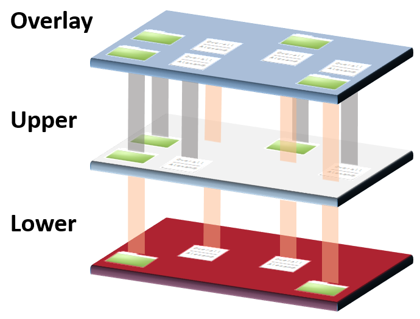

## Les images et les couches

## Objectifs pédagogiques
  - Connaître l'histoire qui mène à ce système de couche
  - Comprendre les avantages et inconvénients de ce système
  
---


## Les layers et la mise en cache

- **Docker construit les images comme une série de "couches" de fichiers successives.**

- On parle d'**Union Filesystem** car chaque couche (de fichiers) écrase la précédente.


 
  
---

# Les avantages et les inconvénients 

 
  
---

## Avantages 

**Ce système économise de la place.**

Pour simplifier, chaque instruction du Dockerfile crée une nouvelle couche.

Si une couche est déjà utilisée, elle est mise en cache et ne nécessite pas qu'on la regénère à chaque fois.

Au lancement d'un container, le Docker Engine rajoute une nouvelle couche de filesystem "normal" read/write par dessus la pile des couches de l'image.

**Ce système est au coeur de l'**immutabilité** des images Docker.** 

On ne peut pas modifier une image "dans le fond", c'est toujours le niveau "de surface" qu'on peut modifier.
  
---

## Désavantages

**Ce système complexifie la compréhension et toute opération d'introspection**

Pas facile de comprendre ce qui se passe et d'aller regarder où se trouve tel fichier.

**Les implémentations de système de fichiers précédentes étaient défaillantes.**

Il n'était pas rare que le FS dérape et que le conteneur crash pour cette raison.

---

# Les strates en pratique : lancement de conteneurs 

La commande `inspect` affiche de nombreuses informations sur un conteneur en exécution, dont les éléments de son "layercake".

```shell
$ docker inspect <container_id_or_name>
...
                "LowerDir": "/var/lib/docker/overlay2/fb94ce5c9b652d1cee5e372e76dd011cb3993d45d6c91f6c5de4d59d33afb9c2-init/diff:/var/lib/docker/overlay2/ab0fd7ce9f469a3a7f6293fde706d7028a45d5ac377224ede0a65af133385149/diff:/var/lib/docker/overlay2/21f47d9ce63dba375dc372c6bd3ad7dabb0219dccb3174d4201cbe049de1234d/diff:/var/lib/docker/overlay2/51fc7c14a3d976ef7d13b9373c902f1d7ce08cdce6f96a493aa74ac98664f773/diff:/var/lib/docker/overlay2/01a6a79a4b75eddd63b52f5a93a67345caaf62313fe081a8e3ea57b2c315a598/diff:/var/lib/docker/overlay2/40070b4000942701b6a9df6537c89ee50d7bf4777615f80d17cd6b476c70ec96/diff:/var/lib/docker/overlay2/82a250b1fb6486d14b1de2c9787d2569f4204108639adfc801a82845863a314d/diff:/var/lib/docker/overlay2/48ba460a8f37e832fda1f53eee0d084dc7fd6402aa430d567be477cc49e66ffe/diff",
                "MergedDir": "/var/lib/docker/overlay2/fb94ce5c9b652d1cee5e372e76dd011cb3993d45d6c91f6c5de4d59d33afb9c2/merged",
                "UpperDir": "/var/lib/docker/overlay2/fb94ce5c9b652d1cee5e372e76dd011cb3993d45d6c91f6c5de4d59d33afb9c2/diff",
                "WorkDir": "/var/lib/docker/overlay2/fb94ce5c9b652d1cee5e372e76dd011cb3993d45d6c91f6c5de4d59d33afb9c2/work"

```


