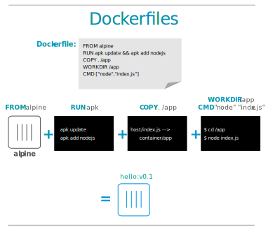

## Dockerfile : modifier le système de base


## Objectifs pédagogiques
  - Savoir ajouter des fichiers au système
  - Savoir ajouter des packages, des utilisateurs, etc.
  - Savoir utiliser les commandes ADD, COPY, USER, RUN, WORKDIR 




## Un dockerfile de test

Éxécuter les commandes suivantes.
```shell
$ mkdir ~/test_dockerfile && cd ~/test_dockerfile 
$ echo "<h1>Hello</h1>" > ~/test_dockerfile/index.html
$ vim ~/test_dockerfile/Dockerfile
```
Utilisons un Dockerfile minimal.

```dockerfile
# our base image
FROM ubuntu

# run the application
CMD ["sh", "-c", "echo Hello World"]
```

---

### Instruction `WORKDIR`

```dockerfile
WORKDIR /path/to/workdir
```
**L'instruction WORKDIR définit le répertoire de travail pour toutes les instructions RUN, CMD, ENTRYPOINT, COPY et ADD qui le suivent dans le Dockerfile.**

Si le WORKDIR n'existe pas, il sera créé même s'il n'est utilisé dans aucune instruction Dockerfile ultérieure.

L'instruction WORKDIR peut être utilisée plusieurs fois dans un Dockerfile. Si un chemin relatif est fourni, il sera relatif au chemin de l'instruction WORKDIR précédente. Par exemple:

---

### Dockerfile in progress 1/5

```Dockerfile
# notre image de base
FROM ubuntu

WORKDIR /srv

# La commande par défaut lancée dans le conteneur
CMD ["sh", "-c", "ls /srv"]
```

---


### Instruction `RUN`


```dockerfile
RUN <command> (shell form, the command is run in a shell, which by default is /bin/sh -c on Linux or cmd /S /C on Windows)
RUN ["executable", "param1", "param2"] (exec form)
```
**Exécute toutes les commandes dans un nouveau calque au-dessus de l'image actuelle et valide les résultats.**
 
L'image validée résultante sera utilisée pour l'étape suivante dans le Dockerfile.

---


### Dockerfile in progress 2/5

```Dockerfile
# our base image
FROM ubuntu

WORKDIR /srv

RUN apt update && apt install -y python3  

# La commande par défaut lancée dans le conteneur
CMD ["sh", "-c", "ls /srv"]
```

---


### Instruction `COPY`

```dockerfile
COPY [--chown=<user>:<group>] <src>... <dest>
COPY [--chown=<user>:<group>] ["<src>",... "<dest>"]
```

**Copie les nouveaux fichiers ou répertoires depuis src et les ajoute au système de fichiers du conteneur au chemin dest.**

---


### Dockerfile in progress 3/5

```Dockerfile
# our base image
FROM ubuntu

WORKDIR /srv

RUN apt update && apt install -y python3  

# Cette commande copie index.html depuis le contexte de build dans /srv dans le conteneur
# index.html doit exister dans votre dossier de projet
COPY index.html /srv

# La commande par défaut lancée dans le conteneur
CMD ["sh", "-c", "ls /srv"]
```
**Après avoir ajouté ces instructions, lors du build, que remarque-t-on ?**

La construction reprend depuis la dernière étape modifiée. Sinon, la construction utilise les layers précédents, qui avaient été mis en cache par le Docker Engine.

---


### Instruction `ADD`

```dockerfile
ADD [--chown=<user>:<group>] [--checksum=<checksum>] <src>... <dest>
```
**Copie les nouveaux fichiers, répertoires ou URL de fichiers distants depuis src et les ajoute au système de fichiers de l'image au chemin dest.**

Généralement utilisé pour ajouter le code du logiciel en cours de développement et sa configuration au conteneur.

---


### Dockerfile in progress 4/5

```Dockerfile
# our base image
FROM ubuntu

WORKDIR /srv

RUN apt update && apt install -y python3  

COPY index.html /srv

ADD https://www.gnu.org/licenses/gpl-3.0.txt /srv/licence.txt

# La commande par défaut lancée dans le conteneur
CMD ["sh", "-c", "ls /srv"]
```
---

### Instruction `USER`

```dockerfile
USER <user>[:<group>]
USER <UID>[:<GID>]
```
**L'instruction USER définit le nom d'utilisateur (ou UID) et éventuellement le groupe d'utilisateurs (ou GID) à utiliser comme utilisateur et groupe par défaut pour le reste de l'étape en cours.**

L'utilisateur spécifié est utilisé pour les instructions RUN et, lors de l'exécution, exécute les commandes ENTRYPOINT et CMD appropriées.

---


### Dockerfile in progress 5/5

```Dockerfile
# our base image
FROM ubuntu

WORKDIR /srv

RUN apt update && apt install -y python3  

# Cette commande copie index.html depuis le contexte de build dans /srv dans le conteneur
# index.html doit exister dans votre dossier de projet
COPY index.html /srv

ADD https://www.gnu.org/licenses/gpl-3.0.txt /srv/licence.txt

# creation de l'utilisateur car USER ne le cree pas pour nous
RUN useradd -d /srv -ms /bin/bash app

# changement d'utilisateur pour la suite des instructions Dockerfile (en particulier la CMD)
USER app

# Mettons à jour la commande pour servir notre page index.html avec python httpserver
CMD ["python3", "-m", "http.server", "8000"]
```

## Avancé : Utilisation optimale du cache de build

La documentation officielle est super claire à ce sujet:

https://docs.docker.com/build/cache/

