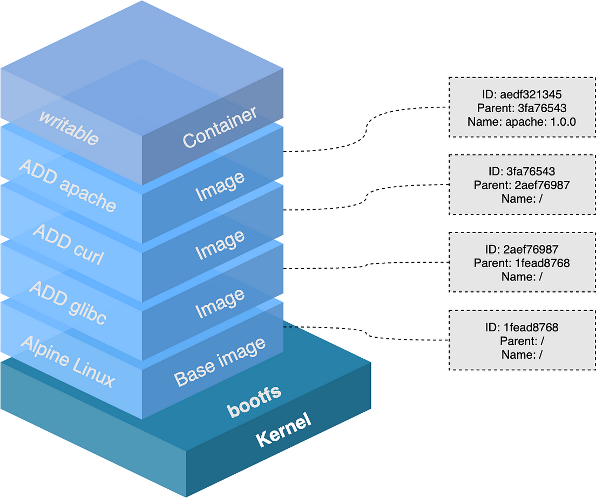
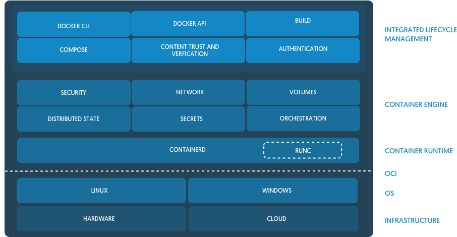
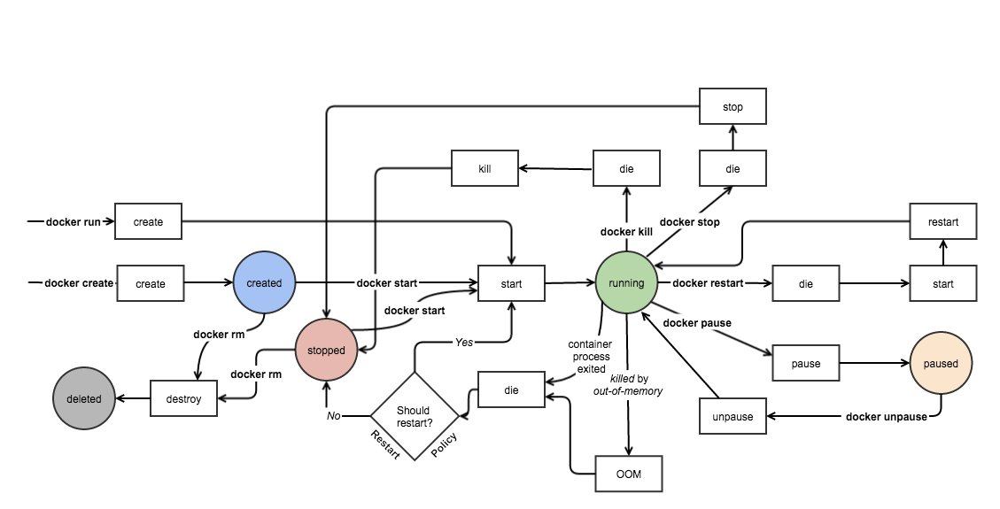
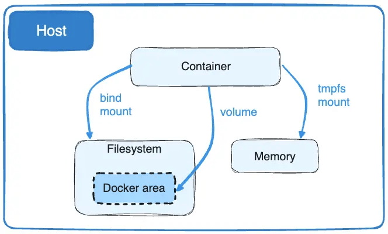
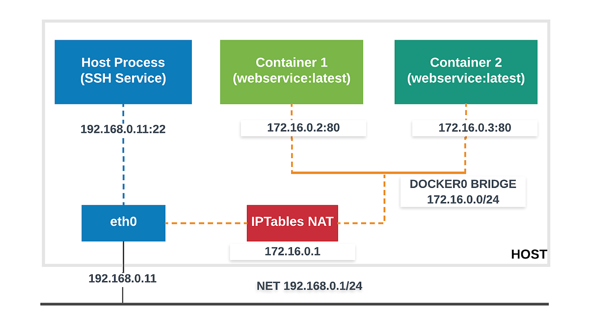

## La problématique d'exécution universelle des applications

**On va voir les problèmes de déploiement qui ont amené aux solutions Docker via l'évolution de la question éternelle.**

```
(Dev) - Comment je déploie mon code sur le serveur de prod ?
(Ops) - Comme tu veux, mais pas le vendredi.
```

Les applications ont des contraintes à gérer :
- versions du code : *J'ai codé une nouvelle fonctionnalité, comment j'intègre ça en prod ?*
- différents environnements (dev, prod) : *J'ai testé sur la dev, on le passe en prod ?*
- fichiers de configuration par environnement : *Qui connaît le mot de passe de la DB de prod ?*
- dépendances internes (librairies, modules) : *Comment j'intègre en prod la librairie qui lit des fichiers Excel ?*
- dépendances externes (bases de données) : *J'ai ajouté un redis pour stocker du cache, comment on déploie ça en prod ?*
- options de lancement du process : *Tu savais pas que l'appli crash sans l'option `-XX:+UseZGC` ?*
- processus de mise à jour : *La nouvelle version de la DB marche pas avec l'ancienne version du code, on fait quoi ?*

---

### Une petite histoire des pratiques DevOps

* **FTP (avant 2000)** — mise à jour fichier par fichier, aucune traçabilité
* **SSH + Git (2009)** — versionnement du code, retour en arrière possible
* **Provisioning & IaC (2010)** — reproductibilité des environnements d'exécution
* **Capistrano (2012)** — automatisation des déploiements avec backups et versions
* **12-factor app / Heroku (2015)** — bonnes pratiques : code, dépendances, configuration
* **Docker (2016)** — uniformisation du code dans tous les environnements, portabilité
* **Kubernetes (2018)** — le déploiement devient un objet en soi, au cœur d'un système complexe

---

### L'Infrastructure As Code

**Progressivement, on essaie de formaliser l'applicatif pour maximiser :**
- la capacité de développer et de tester
- la sécurité de l'application
- la capacité d'évolution et de changement

Aujourd'hui avec Docker et Kubernetes :
- Les différents environnements utilisent les mêmes images
- Chaque image correspond à un état du code dans git
- Les options de configuration par environnement sont dans l'image
- Les dépendances internes sont dans l'image
- La mise à jour est gérée par un orchestrateur
- Les backups sont automatisés par l'orchestrateur

---

## Rappels sur la conteneurisation : images, instances, cycle de vie  

### Les images Docker




**Chaque layer correspond à une information qui peut être mise en cache**

Quel est l'intérêt ? 

Quelles sont les impacts en terme de construction de Dockerfiles ?

Savez-vous ce que fait la commande `docker commit` ? En quoi est-elle utile ? 

---

### Les instances



**Une instance est l'exécution d'un process dans un espace de conteneurisation sur la base d'un exécutable dans une image Docker.**

Quels sont les composants qui permettent ce processus ? 

---

### Le cycle de vie des instances Docker



**Docker gère les images et les instance de la création à la destruction.**

---

### Les volumes Docker



**Le montage de volumes dans Docker se base sur les processus des montages dans Linux.**

---

### Les réseaux Docker




**Les réseaux Docker sont automatisés : DNS, IP Address Management, et plus.**

## Docker : un gestionnaire de process

**Un conteneur Docker est un process isolé** — il tourne dans son propre espace de noms (namespace Linux), avec ses propres ressources.

Un `process` est un programme en cours d'exécution. Pour chaque process, le système :
- lui attribue un numéro unique (PID)
- lui associe un utilisateur
- lui alloue de la mémoire et du temps de calcul
- maintient des statistiques le concernant

```
USER         PID %CPU %MEM    VSZ   RSS TTY   STAT  COMMAND
root      293758  0.0  0.0  ...                      /usr/bin/containerd-shim-runc-v2 ...
root      293777  0.0  0.1  ...                       \_ /portainer
```

**Chaque image Docker est spécialisée pour lancer un seul process.** Docker surveille l'état des conteneurs, les relance en cas de problème, les arrête.

---

## Les images Docker : couches et immutabilité

**Docker construit les images comme une série de "couches" de fichiers successives** — c'est l'**Union Filesystem**.

Chaque instruction du Dockerfile crée une nouvelle couche. Les couches déjà existantes sont mises en cache et réutilisées.


**Avantages :**
- Économie de place : les couches communes entre images sont partagées
- Mise en cache : seules les couches modifiées sont reconstruites
- **Immutabilité** : on ne modifie jamais une image "dans le fond" — au lancement d'un conteneur, Docker ajoute une couche read/write par dessus la pile

**Ce qu'on voit lors d'un `docker pull` :**
```shell
$ docker pull python:3.9
3.9: Pulling from library/python
1e4aec178e08: Downloading [=====>  ]  45MB/55MB
6c1024729fee: Download complete
aa54add66b3a: Downloading [=====>  ]  53MB/54MB
...
```
Chaque ligne est une couche distincte — elle a un hash unique, un poids, un contenu propre.

---

## Le Dockerfile : l'IaC de Docker

**Le Dockerfile est ce qui rapproche Docker des outils d'Infrastructure as Code.**

C'est un fichier qui définit toutes les conditions nécessaires pour que le process de l'application se lance correctement :

```dockerfile
FROM node:18-alpine
WORKDIR /app
COPY . .
RUN yarn install --production
RUN adduser -D nodejs
USER nodejs
CMD ["node", "src/index.js"]
EXPOSE 3000
```

Ça inclut : les packages, les utilisateurs, les fichiers de configuration, le code applicatif, le lancement du process, les ports réseau.

**L'image Docker est «prête à consommer»** — avantage : simple à lancer. Inconvénient : opaque si on ne connaît pas son contenu.

À comparer avec les autres outils d'IaC :
- **Terraform** : déploie des ressources cloud
- **Ansible** : configure des serveurs
- **Dockerfile** : construit une image reproductible contenant une application

---

## Les registries : distribuer les images

**Un registry est un dépôt d'images Docker.** Les entreprises utilisent des registries privés pour ne pas exposer leurs images.

Registries publics/SaaS courants :
- **Docker Hub** — le registry public par défaut
- **ghcr.io** (GitHub), **gcr.io** (Google), **quay.io** (RedHat — scan sécurité inclus)
- **Gitlab / GitHub** — intégrés dans le workflow DevOps

On-premise :
- **Harbor** — solution CNCF open-source, puissante
- **Docker Registry** — pour les besoins simples

```shell
docker pull nginx:1.25          # récupère depuis Docker Hub
docker push monregistry/monapp  # pousse vers un registry privé
docker login monregistry        # s'authentifier
```

---

## Les variables d'environnement

**Les variables d'environnement sont le mécanisme standard pour configurer un conteneur** sans modifier son image — c'est la base de la séparation config/code (12-factor app).

```yaml
# Dans un manifeste Kubernetes
env:
  - name: MA_VARIABLE
    value: "ma-valeur"
```

```shell
# En ligne de commande Docker
docker run --env VAR=VALUE ubuntu env
```

Tous les langages savent les lire :
```python
import os
maVar = os.environ.get('MA_VAR')
```

---

## L'évolution de l'écosystème des orchestrateurs

Quand on a beaucoup de conteneurs sur plusieurs machines, il faut les orchestrer :
- Qui tourne sur quel serveur ?
- Comment remplacer un conteneur qui plante ?
- Comment mettre à jour sans interruption ?

**Kubernetes représente plus de 50% des conteneurs déployés en production.** Docker Swarm n'a jamais décollé. Nomad, Mesos, CoreOS ont perdu de la traction. AWS ECS/EKS, GKE, AKS suivent tous les API Kubernetes.

---

## Histoire de Kubernetes

- **2003-2004** : Google crée le système **Borg** — gestion interne de centaines de milliers de jobs sur des dizaines de milliers de machines
- **2013** : Evolution vers **Omega**, planificateur flexible et évolutif
- **2014** : Google open-source Kubernetes, Microsoft, RedHat, IBM et Docker rejoignent immédiatement
- **2015** : Kubernetes v1.0, création de la **CNCF** (Cloud Native Computing Foundation)
- **2016** : Helm, Minikube, première adoption massive (Pokémon Go!)
- **2017** : GitHub migre sur Kubernetes, lancement d'Istio (Google + IBM)
- **Depuis 2018** : leader incontesté, EKS/GKE/AKS en services managés, écosystème CNCF en explosion

---

## Objectifs et architecture de Kubernetes

**Kubernetes est :**
- Une plateforme d'orchestration **résiliente** : elle recrée automatiquement les ressources manquantes
- Une plateforme **sans vendor lock-in** : fonctionne sur cloud privé et cloud public
- Une plateforme de **déploiement** : gère les multi-instances et les rotations de version en zero-downtime
- Une plateforme **mutualisable** : séparation par namespace, RBAC, quotas
- Une plateforme **customisable** : framework extensible via CRD et opérateurs

**Architecture :**

- **Control Plane** : cerveau du cluster
  - `kube-apiserver` : point d'entrée central (REST)
  - `kube-controller-manager` : surveille et corrige l'état des ressources
  - `kube-scheduler` : décide sur quel node placer chaque pod
  - `etcd` : base de données distribuée stockant toute la configuration

- **Nodes** : machines qui font tourner les conteneurs
  - `kubelet` : contrôle la création et l'état des pods sur le node
  - `kube-proxy` : gestion réseau
  - Runtime de conteneur : `containerd` ou `cri-o`

**Tout passe par l'API** — kubectl, les outils CI/CD, les opérateurs... tout est une API.

---

## Les différents types de clusters

### Développement / apprentissage

| Solution | Caractéristiques |
|---|---|
| **k3s** | Léger, rapide, compatible 100% API K8s — **utilisé dans ce cours** |
| minikube | Solution officielle, tourne dans Docker ou une VM |
| kind | Kubernetes dans Docker, pratique pour CI |

### Cloud managé (production)

| Provider | Service |
|---|---|
| Google Cloud | **GKE** — implémentation de référence |
| AWS | **EKS** — intégré à l'écosystème AWS |
| Azure | **AKS** — intégré Azure AD, DevOps |
| OVH, Scaleway | Fournisseurs français |

### On-premise (production)

- **kubeadm** : outil officiel d'installation et de maintenance
- **Kubespray** : kubeadm + Ansible, approche IaC recommandée
- **Rancher** : écosystème complet open-source (monitoring Prometheus, Istio, Longhorn)
- **OpenShift** : distribution Red Hat, intègre build, registry, monitoring

> Opérer un cluster de production Kubernetes "à la main" est complexe : mises à jour régulières (support 2 ans par version), choix réseau, stockage distribué (ex: Ceph). Ne pas sous-estimer.

---

## kubectl — le client universel

`kubectl` est le point d'entrée universel pour contrôler tout type de cluster Kubernetes. C'est un client en ligne de commande qui communique en REST avec l'API du cluster.

### Commandes de base

```bash
kubectl get <resource>            # lister des ressources
kubectl get <resource> <nom>      # afficher une ressource précise
kubectl describe <resource> <nom> # détail complet + événements
kubectl create <resource>         # créer une ressource de façon impérative
kubectl run <nom> --image=<image> # créer un pod de façon impérative
kubectl apply -f <fichier.yaml>   # créer ou mettre à jour (déclaratif)
kubectl delete <resource> <nom>   # supprimer une ressource
kubectl logs <pod>                # afficher les logs d'un conteneur
kubectl exec -it <pod> -- /bin/sh # ouvrir un shell interactif dans un conteneur
kubectl scale deployment <nom> --replicas=N  # changer le nombre de réplicas
kubectl expose deployment <nom> --type=NodePort --port=<port>  # créer un Service
```

### Flags courants

```bash
-n <namespace>        # cibler un namespace spécifique
--namespace <ns>      # équivalent de -n
-A / --all-namespaces # toutes les ressources de tous les namespaces
-o yaml               # afficher la ressource en YAML complet
-o jsonpath='...'     # extraire une valeur précise en jsonpath
```

### Filtrer avec jsonpath

`jsonpath` permet d'extraire une information précise de la sortie kubectl :

```bash
kubectl get pod <nom> -o jsonpath='{.spec.containers[0].image}'  # image du premier conteneur
kubectl get pod <nom> -o jsonpath='{.status.phase}'              # état du pod
```

---

## Le kubeconfig

Pour se connecter à un cluster, `kubectl` a besoin de trois informations :
- l'**adresse de l'API** Kubernetes
- un **nom d'utilisateur**
- un **certificat** client

Ces informations sont stockées dans un fichier YAML appelé **kubeconfig**, par défaut à `~/.kube/config`.

```bash
kubectl config view              # afficher le kubeconfig
kubectl config get-contexts      # lister les contextes disponibles
kubectl config use-context <nom> # basculer vers un autre contexte/cluster
```

Un kubeconfig peut contenir **plusieurs clusters** (contextes). Chaque contexte associe un cluster, un utilisateur, et un namespace par défaut. C'est le mécanisme de base pour le multi-cluster.

---

## Les namespaces en pratique

Les namespaces sont des espaces de travail isolés. En pratique :

```bash
kubectl get namespaces                      # lister les namespaces
kubectl create namespace <nom>              # créer un namespace
kubectl get pods -n <namespace>             # resources d'un namespace
kubectl get all -A                          # tout le cluster
kubectl config set-context --current --namespace <nom>  # changer le namespace par défaut
```

---

## Les Services : exposer une application

Un **Service** crée un point d'accès stable vers un ensemble de pods sélectionnés par leurs labels.

Type **NodePort** : expose le service sur un port du node (accessible depuis l'extérieur du cluster) :

```bash
kubectl expose deployment <nom> --type=NodePort --port=8080 --name=<service-nom>
kubectl get services   # affiche le port 3xxxx assigné
```

Type **port-forward** (debug uniquement) : tunnel temporaire vers un pod ou service :

```bash
kubectl port-forward svc/<service> 8080:8080
# Attention : pointe toujours vers le même pod — pas de load balancing
```

---

## Outils complémentaires

`kubectl` est puissant mais peut être complété par :

| Outil | Usage |
|---|---|
| `krew` | Gestionnaire de plugins kubectl — `https://krew.sigs.k8s.io` |
| `kubectx` | Changer de cluster rapidement — `kubectl krew install ctx` |
| `kubens` | Changer de namespace par défaut — `kubectl krew install ns` |
| `viddy` / `watch` | Observer l'évolution des ressources en temps réel |
| `stern` | Agréger les logs de plusieurs pods — `kubectl krew install stern` |
