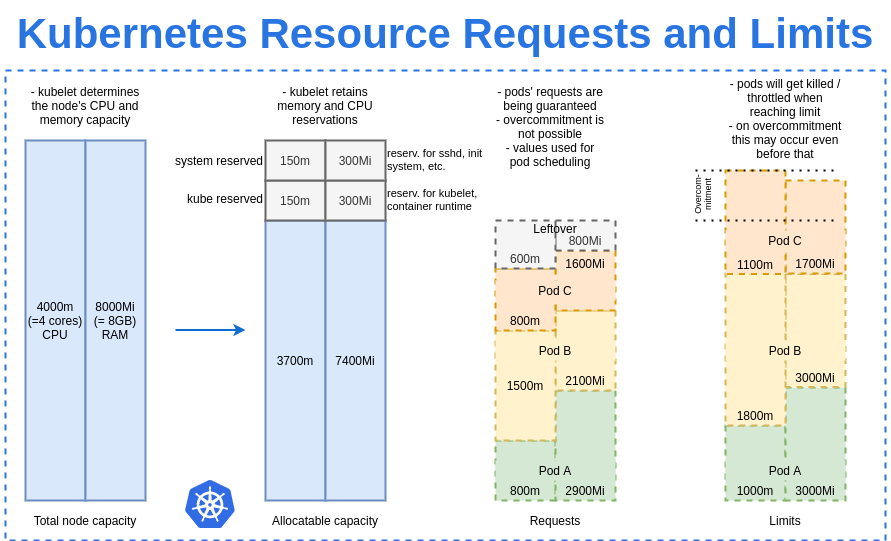
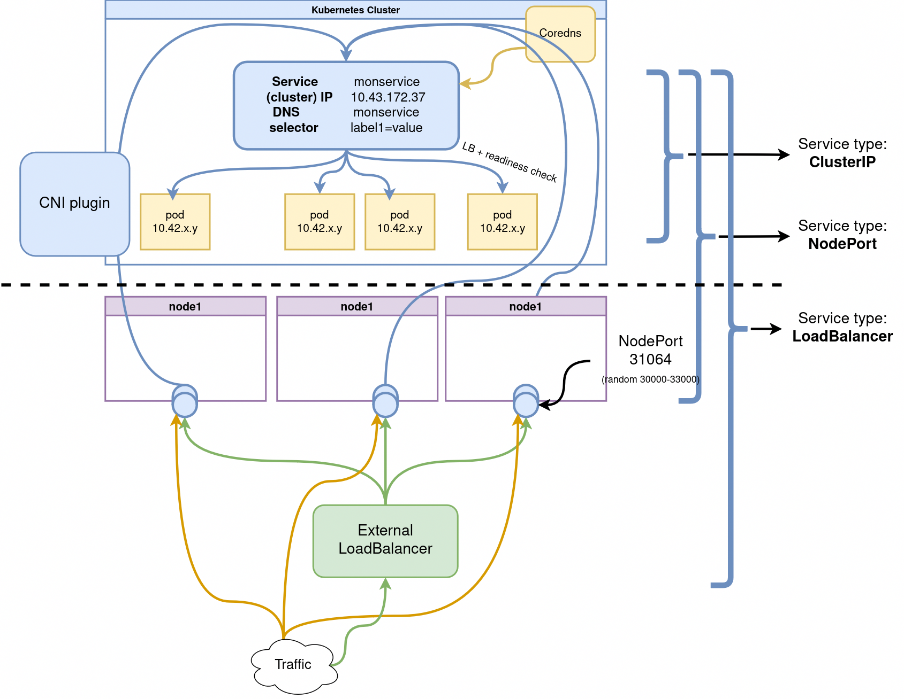

# Après-midi

## L'API et les objets Kubernetes

**Utiliser Kubernetes consiste à déclarer des objets grâce à l'API pour décrire l'état souhaité du cluster** : quelles applications exécuter, quelles images elles utilisent, le nombre de replicas, les ressources réseau et disque disponibles, etc.

On définit des objets de deux façons :

- **Impératif** : `kubectl run <conteneur>`, `kubectl expose`, `kubectl create`

- **Déclaratif** : décrire un objet dans un fichier YAML et le passer à `kubectl apply -f monobjet.yaml`

**Kubernetes est complètement automatisable** — vous pouvez aussi écrire des programmes qui utilisent directement l'API.

---

## Infrastructure as Code : la commande `apply`

Kubernetes encourage le principe de l'**Infrastructure as Code** : décrire l'état souhaité dans des fichiers YAML versionnés dans Git, plutôt que lancer des commandes manuelles.

```bash
kubectl apply -f object.yaml    # crée ou met à jour
kubectl delete -f object.yaml   # supprime
```

C'est la méthode recommandée en production — les fichiers YAML sont la source de vérité.

---

### La boucle de réconciliation : ce qui se passe après `kubectl apply`

**`kubectl apply` est asynchrone.** La commande n'exécute rien elle-même — elle envoie à l'API Kubernetes l'état souhaité, puis rend la main immédiatement. Le travail réel (créer les pods, démarrer les conteneurs, mettre à jour un déploiement) se passe **après**, en arrière-plan.

Ce travail est fait par des **controllers** : des processus qui tournent en permanence dans le cluster (le control plane), chacun responsable d'un type d'objet (Deployment, Job, Service...). Chaque controller applique la même boucle, en continu :

```
  ┌──────────────┐        ┌──────────────┐        ┌──────────────┐
  │  1. Observer │──────► │  2. Comparer │──────► │   3. Agir    │
  │              │        │              │        │              │
  └──────────────┘        └──────────────┘        └──────────────┘
  État actuel du          État souhaité            Créer, supprimer,
  cluster                 (déclaré via              modifier des
                           kubectl apply)            ressources

  ▲                                                              │
  │                        boucle sans fin                       │
  └──────────────────────────────────────────────────────────────┘
```

**Le controller ne s'arrête jamais** : il réessaie indéfiniment tant que l'état réel ne correspond pas à l'état souhaité. Un pod crashe ? Le controller du Deployment le détecte à la prochaine itération et en recrée un. Un nœud tombe ? Les pods qu'il hébergeait sont recréés ailleurs, sans intervention humaine.

C'est ce mécanisme — pas une exécution ponctuelle de la commande — qui explique le **self-healing** de Kubernetes : ce n'est pas `kubectl apply` qui "répare" le cluster, c'est la boucle de réconciliation qui tourne en continu et corrige tout écart, y compris ceux survenus bien après l'`apply` initial.

> `kubectl apply -f object.yaml` répond quasi instantanément, mais ça ne veut pas dire que l'état souhaité est atteint — seulement que l'intention a été enregistrée. `kubectl get pods -w` ou `kubectl rollout status` permettent d'observer la convergence réelle.

📖 [Documentation officielle — Controllers](https://kubernetes.io/docs/concepts/architecture/controller/)

---

### Structure de base d'un objet Kubernetes

```yaml
apiVersion: apps/v1       # version de l'API (obligatoire)
kind: Deployment          # type d'objet (obligatoire)
metadata:                 # (obligatoire)
  name: mon-app           # nom de la ressource (obligatoire)
  namespace: default      # namespace (optionnel, défaut: default)
  labels:
    app: mon-app          # étiquettes clé/valeur libres
spec:                     # état souhaité (obligatoire, spécifique à chaque kind)
  replicas: 1
  ...
```

Pour explorer les paramètres disponibles : `kubectl explain pod`, `kubectl explain deploy --recursive`

On peut décrire **plusieurs ressources dans un seul fichier**, séparées par `---`. L'ordre n'importe pas — Kubernetes planifie la création dans le bon ordre selon les dépendances.

---

## Les Pods


**Le Pod est l'unité de base d'une application Kubernetes** — un groupe atomique de conteneurs garantis de tourner sur le même node, toujours ensemble.

Les conteneurs d'un pod partagent :

- des volumes communs
- la même interface réseau (même IP, mêmes noms de domaine internes)
- peuvent se parler en IPC

```yaml
apiVersion: v1
kind: Pod
metadata:
  name: rancher-demo-pod
  labels:
    app: rancher-demo
spec:
  containers:
    - image: monachus/rancher-demo:latest
      name: rancher-demo-container
      ports:
        - containerPort: 8080
    - image: redis
      name: redis-container
      ports:
        - containerPort: 6379
```

> Un pod seul n'est **pas recommandé** en production — il n'a pas de self-healing ni de gestion de version. Utilisez un Deployment.

**Un pod est largement immutable** : on ne peut pas changer le nom d'un conteneur ou sa commande après création. Pour modifier ces propriétés, il faut supprimer et recréer le pod. C'est précisément pour ça qu'on utilise un Deployment — il gère ce cycle automatiquement.

---

### Requests et limits : dimensionner un conteneur

Chaque conteneur peut déclarer deux valeurs de ressources, pour le CPU et la mémoire :

- **`requests`** : ce que le conteneur est garanti d'obtenir — c'est aussi ce que le scheduler utilise pour décider sur quel nœud placer le pod (il ne place un pod que si le nœud a assez de ressources **non déjà réservées** par d'autres requests)
- **`limits`** : le plafond que le conteneur ne doit pas dépasser

```yaml
apiVersion: v1
kind: Pod
metadata:
  name: rancher-demo-pod
spec:
  containers:
    - image: monachus/rancher-demo:latest
      name: rancher-demo-container
      resources:
        requests:
          cpu: "250m"        # 0.25 cœur CPU
          memory: "128Mi"    # 128 mébioctets
        limits:
          cpu: "500m"
          memory: "256Mi"
```

---

**Notation :**
- **CPU** : en cœurs, ou en millicores avec le suffixe `m` — `500m` = 0,5 cœur, `1` = 1 cœur entier
- **Mémoire** : en octets, avec suffixes binaires `Mi`/`Gi` (mébioctets/gibioctets, base 1024) ou décimaux `M`/`G` (base 1000) — `Mi` est la convention la plus courante dans les manifestes Kubernetes

---



Le schéma montre le chemin complet : la capacité totale d'un nœud n'est pas toute allouable (le système et kubelet en réservent une part), puis les **requests** de chaque pod sont garanties sans jamais pouvoir être overcommitées, alors que les **limits** peuvent dépasser la capacité réelle du nœud (overcommitment) — au prix d'un risque de throttling ou de kill si tous les pods consomment leur limite en même temps.

---

**Le dépassement d'une limite ne se comporte pas pareil selon la ressource :**
- **CPU** : limite **souple**, appliquée par throttling — le kernel ralentit le conteneur, mais ne le tue jamais pour ça
- **Mémoire** : limite **dure**, appliquée par le kernel via OOM killer — un conteneur qui dépasse sa limite mémoire est **`OOMKilled`** (tué, pas ralenti)

---

**Impact sur le dimensionnement du cluster :** des requests mal calibrées ont un coût direct. Trop basses, et le nœud accepte plus de pods qu'il ne peut réellement en nourrir en cas de pic — risque d'OOM. Trop hautes "pour être tranquille", et les ressources réservées mais jamais utilisées bloquent le scheduling d'autres pods, forçant l'ajout de nœuds inutiles. Un cas réel typique : 14% d'utilisation CPU réelle sur le cluster, mais 81% réservé par des requests trop généreuses.

---

**QoS (Quality of Service) — trois classes automatiques :**

| Classe | Condition | Comportement à l'éviction |
|---|---|---|
| **Guaranteed** | `requests` = `limits` pour CPU **et** mémoire, sur tous les conteneurs | Évincé en dernier |
| **Burstable** | Au moins une request ou limit définie, sans satisfaire Guaranteed | Évincé après les BestEffort |
| **BestEffort** | Aucune request ni limit définie | Évincé en premier |

Kubernetes assigne cette classe automatiquement — il n'y a rien à déclarer explicitement. Elle détermine l'ordre d'éviction quand un nœud manque de ressources : les pods `BestEffort` sont sacrifiés en premier, les `Guaranteed` en dernier.

> Un pod sans aucune request ni limit (`BestEffort`) peut atterrir n'importe où, y compris sur un nœud déjà saturé — et sera le premier évincé en cas de pression sur les ressources.

📖 [Documentation officielle — Resource Management for Pods and Containers](https://kubernetes.io/docs/concepts/configuration/manage-resources-containers/) · [Pod Quality of Service Classes](https://kubernetes.io/docs/concepts/workloads/pods/pod-qos/)

---

### SecurityContext : durcir l'exécution d'un conteneur

Par défaut, un conteneur peut tourner en `root` et écrire n'importe où sur son propre système de fichiers. Le `securityContext` restreint ça :

```yaml
apiVersion: v1
kind: Pod
metadata:
  name: rancher-demo-pod
  labels:
    app: rancher-demo
spec:
  containers:
    - image: monachus/rancher-demo:latest
      name: rancher-demo-container
      ports:
        - containerPort: 8080
      securityContext:
        runAsNonRoot: true
        runAsUser: 999
        readOnlyRootFilesystem: true
        allowPrivilegeEscalation: false
```

- **`runAsNonRoot` / `runAsUser`** : interdit l'exécution en `root`, impose un UID explicite
- **`readOnlyRootFilesystem`** : système de fichiers du conteneur en lecture seule — toute écriture doit passer par un volume monté explicitement
- **`allowPrivilegeEscalation: false`** : empêche le processus d'obtenir plus de privilèges que son parent (bloque par exemple les binaires `setuid`)

Le `securityContext` peut se déclarer au niveau du Pod (s'applique à tous les conteneurs) ou au niveau d'un conteneur précis, comme ci-dessus — la version au niveau conteneur est prioritaire en cas de conflit.

---

**Un pod peut contenir trois types de conteneurs aux rôles distincts :**

**Init containers** : s'exécutent séquentiellement avant les conteneurs principaux, jusqu'à complétion. Utilisés pour des tâches de préparation (attendre une base de données, pré-charger des fichiers). 

Leurs ressources sont comptées séparément — le scheduler retient le maximum entre les requests des init containers et celles des conteneurs standards.

**Conteneurs standards** : les conteneurs applicatifs qui tournent en parallèle  pendant toute la vie du pod. Ce sont eux qui définissent l'essentiel du budget de
 ressources du pod.

**Ephemeral containers** : ajoutés temporairement à un pod déjà en cours d'exécution pour le débogage (kubectl debug). 

Ils ne peuvent pas être définis dans le manifeste initial, ne redémarrent pas, et s'exécutent dans le cgroup du pod existant — leurs ressources sont contraintes par ce qui a déjà été alloué au pod, et ne modifient pas sa classe QoS.

---

### Le pattern Sidecar

Sur le schéma du Pod, les trois conteneurs standards sont étiquetés `app`, `logs` et `proxy`. Ce n'est pas un hasard : c'est l'illustration du **pattern sidecar**.

**Un sidecar est un conteneur secondaire qui tourne aux côtés du conteneur applicatif principal pour lui ajouter une responsabilité transverse**, sans modifier son code.

Parce qu'ils partagent le même réseau, les mêmes volumes et le même cycle de vie, les conteneurs d'un pod peuvent se diviser le travail proprement :

| Rôle | Ce qu'il fait | Exemples |
|---|---|---|
| **app** | Logique métier uniquement | Votre service Python, Go, Java |
| **logs** | Collecte et relaie les logs vers un agrégateur | Fluent Bit, Filebeat |
| **proxy** | Intercepte le trafic réseau entrant et sortant | Envoy, Nginx, Linkerd proxy |

```yaml
spec:
  containers:
  - name: app
    image: mon-api:1.2.0
    volumeMounts:
    - name: logs
      mountPath: /var/log/app
  - name: log-shipper          # sidecar : collecte les logs écrits par app
    image: fluent/fluent-bit:3
    volumeMounts:
    - name: logs
      mountPath: /var/log/app
  volumes:
  - name: logs
    emptyDir: {}
```

Le conteneur `app` écrit ses logs dans un volume partagé. Le sidecar `log-shipper` les lit et les envoie vers le système de centralisation — sans que l'application ait besoin de connaître Fluent Bit.

**Avantages du pattern sidecar :**
- Séparation des responsabilités : l'équipe applicative gère `app`, l'équipe infra gère les sidecars
- Réutilisable sur n'importe quel pod, quelle que soit la technologie de l'application
- Pas de modification du code applicatif

---

### Sidecar natif : initContainers avec restartPolicy (K8s ≥ 1.29)

Le problème historique du sidecar classique : tous les conteneurs d'un pod démarrent en parallèle. Rien ne garantit que le proxy réseau ou l'agent de logs est prêt avant que l'application commence à traiter du trafic.

**Depuis Kubernetes 1.29**, un init container peut être déclaré comme sidecar natif en lui ajoutant `restartPolicy: Always`. Il bénéficie alors d'un cycle de vie hybride :

- **Il démarre avant les conteneurs principaux** (comme un init container classique)
- **Il reste actif toute la vie du pod** (comme un conteneur standard)
- **Il reçoit SIGTERM après les conteneurs principaux** lors de l'arrêt du pod

```yaml
spec:
  initContainers:
  - name: proxy                # sidecar natif : démarre avant app, reste actif
    image: envoy:v1.29
    restartPolicy: Always      # c'est ce champ qui le transforme en sidecar natif
  containers:
  - name: app
    image: mon-api:1.2.0
```

| | Sidecar classique | Sidecar natif (init + restartPolicy) |
|---|---|---|
| **Ordre de démarrage** | Parallèle avec app | Avant app (garanti) |
| **Arrêt** | En même temps que app | Après app |
| **Cas d'usage** | Logs, métriques simples | Proxy réseau, agent secrets, tout ce qui doit être prêt avant app |

C'est la solution retenue par les service meshes comme Istio et Linkerd pour injecter leur proxy sans dépendre d'une injection automatique externe.

---

## Les Deployments


**Le Deployment est l'objet à créer en pratique** pour déployer une application. C'est un objet de plus haut niveau qui pilote des ReplicaSets et des Pods.

Architecture en poupées russes : **Deployment → ReplicaSet → Pods → Conteneurs**

**Responsabilités du Deployment :**

- **Tracking de versions** : gère la coexistence de plusieurs versions lors des mises à jour
- **RolloutStrategy** : montée de version automatique en haute disponibilité (zero-downtime)

- **Self-healing** via le ReplicaSet : recrée automatiquement les pods qui tombent

```yaml
apiVersion: apps/v1
kind: Deployment
metadata:
  name: demonstration
  labels:
    app: demonstration
spec:
  replicas: 3
  selector:
    matchLabels:
      app: demonstration
  template:
    metadata:
      labels:
        app: demonstration
    spec:
      containers:
        - name: rancher-demo
          image: monachus/rancher-demo:latest
          ports:
            - containerPort: 8080
```

```bash
kubectl get deployments
kubectl get rs          # ReplicaSets — ne pas manipuler directement
kubectl get pods
kubectl get all -n <namespace>   # toutes les ressources d'un namespace
```

### Ne jamais utiliser le tag `latest` en production

Quand plusieurs replicas d'un Deployment utilisent `image: monapp:latest`, chaque pod peut finir par avoir une version différente selon le moment où il a été schedulé. Si `latest` pointe vers une nouvelle image avec un breaking change, certains pods tournent l'ancienne version, d'autres la nouvelle — l'application est incohérente.

**La règle** : utiliser un tag de version explicite (`monapp:1.4.2`) ou le hash de commit (`monapp:abc1234`). Ainsi tous les replicas tournent exactement la même image.

```yaml
# À éviter
image: monapp:latest

# Recommandé
image: monapp:1.4.2

# ou avec le hash de commit
image: registry.example.com/monapp:abc1234f
```

--- 

### Stratégie de déploiement

Le champ `strategy.type` contrôle comment Kubernetes remplace les pods lors d'une mise à jour :

- **`Recreate`** : supprime tous les anciens pods, puis crée les nouveaux (interruption courte)
- **`RollingUpdate`** (défaut) : remplace progressivement, pod par pod (zero-downtime)

```yaml
spec:
  strategy:
    type: RollingUpdate
```

--- 

### Rollout : gérer les mises à jour

Chaque `kubectl apply` qui change les conteneurs crée une nouvelle **révision** du Deployment. Kubernetes gère deux ReplicaSets en parallèle pendant la transition.

```bash
kubectl rollout status deployment/<nom>         # suivre la progression
kubectl rollout history deployment/<nom>        # voir les révisions
kubectl rollout history deployment/<nom> --revision=2  # détail d'une révision
kubectl rollout undo deployment/<nom>           # revenir à la révision précédente
```

---

## Labels et sélecteurs

**Les labels sont des étiquettes clé/valeur** attachées librement aux objets Kubernetes. Les sélecteurs permettent de filtrer et de **relier des objets entre eux**.

Exemple : un Service pointe vers des Pods via leurs labels. Si le label ne correspond plus, le trafic est coupé.

```yaml
# Sur le Deployment
labels:
  app: demonstration

# Sur le Service (selector)
selector:
  app: demonstration
```

> Évitez d'utiliser le même label pour des parties différentes de l'application.

---

## Les Services

Un **Service** crée un point d'accès stable vers un ensemble de pods — il sélectionne les pods via leurs **labels** et répartit le trafic entre eux (load balancing).


Les **endpoints** sont la liste des IPs des pods actuellement sélectionnés par un Service. Si le selector ne correspond à aucun pod, les endpoints sont vides et le trafic ne passe plus.

```yaml
apiVersion: v1
kind: Service
metadata:
  name: demo-service
spec:
  type: NodePort
  ports:
    - port: 8080
  selector:
    app: demonstration   # doit correspondre aux labels des pods
```

```bash
kubectl get services
kubectl describe service <nom>   # voir les endpoints
```

### ClusterIP

**`ClusterIP` est le type de Service par défaut** — il crée une IP stable, accessible uniquement **depuis l'intérieur du cluster**. C'est le type le plus utilisé en pratique : la grande majorité des communications entre applications se font en interne, sans jamais sortir du cluster.

Un même Deployment peut être exposé par **plusieurs Services en même temps** — par exemple le `demo-service` NodePort vu ci-dessus pour l'accès externe, et un second Service `ClusterIP` pour l'accès interne, tous deux ciblant les mêmes pods via le même label :

```yaml
apiVersion: v1
kind: Service
metadata:
  name: demo-internal
spec:
  type: ClusterIP
  ports:
    - port: 8080
  selector:
    app: demonstration   # même label que demo-service : mêmes pods, deux points d'accès
```

```bash
kubectl apply -f demo-internal-service.yaml
kubectl get service demo-internal   # une CLUSTER-IP, pas d'EXTERNAL-IP
```

---

**Comment le Service retrouve les pods dynamiquement :** le `selector` ne pointe pas vers des IPs fixes — à chaque changement (pod créé, supprimé, ou qui échoue sa readiness probe), Kubernetes met à jour la liste des IPs derrière le Service. Cet objet qui liste les IPs s'appelle un **EndpointSlice** ; il est **entièrement automatique** dès qu'un Service a un `selector` — on ne l'écrit jamais à la main, seulement l'observer :

```bash
kubectl get endpointslices -l kubernetes.io/service-name=demo-internal
kubectl describe endpointslice <nom>   # liste des IPs de pods actuellement prêtes
```

> **Erreur fréquente : un Service tout neuf qui ne répond pas, c'est presque toujours un problème de label.** Si `selector` ne correspond à aucun pod (faute de frappe, mauvaise valeur), l'EndpointSlice reste vide et le trafic n'a nulle part où aller. Pour vérifier rapidement quels pods portent réellement un label donné :
> ```bash
> kubectl get pods -l app=demonstration   # liste les pods qui ont EXACTEMENT ce label
> ```
> Si cette commande ne retourne rien, le `selector` du Service ne trouvera rien non plus.

---



> Le schéma montre les trois types de Service partageant le même mécanisme : une IP stable + un `selector` qui route vers des IPs de pods qui changent en permanence. Seul ce qui se passe **en dehors du cluster** (colonne du bas) diffère entre `ClusterIP`, `NodePort` et `LoadBalancer`.

---

### Différents types de service 

Ils créent un point d'accès stable vers un ensemble de pods, indépendamment de leur durée de vie  .  

Rappel des types :

| Type | Usage |
|---|---|
| `ClusterIP` | Accès interne au cluster uniquement — par défaut |
| `NodePort` | Expose sur un port du nœud — dev/test uniquement |
| `LoadBalancer` | Provisionne un loadbalancer externe (cloud) |

DNS interne : chaque Service est accessible via `<service>.<namespace>.svc.cluster.local`.

**Le type `LoadBalancer` est limité** : il crée un loadbalancer externe par service, ce qui devient coûteux et ingérable à l'échelle — sur un cloud, chaque `LoadBalancer` facture une adresse IP dédiée  .  

On l'utilise encore pour des services non-HTTP (bases de données, MQTT…), mais il ne gère ni le routage par chemin, ni le TLS mutualisé, ni le virtual hosting.

---

## Les health checks (Probes)

Kubernetes dispose de trois types de sondes pour surveiller l'état des conteneurs :

- **`startupProbe`** : vérifie que l'application a bien démarré. Tant qu'elle n'est pas validée, les autres probes ne s'exécutent pas. Utile pour les applications lentes au démarrage.

- **`readinessProbe`** : vérifie que le conteneur est **prêt à recevoir du trafic**. Tant qu'elle échoue, le pod est retiré des endpoints du Service.
- **`livenessProbe`** : vérifie que le conteneur est **vivant**. Si elle échoue, Kubernetes redémarre le conteneur.

**Retenez-les par leur conséquence, pas juste leur condition** — c'est ce qui les distingue vraiment :

- **`startupProbe`** : une **barrière d'activation**. Bloque le déclenchement des autres probes tant qu'elle n'est pas validée — aucun impact direct sur le trafic ou le cycle de vie.
- **`readinessProbe`** : au service du **Service**. Un échec ne redémarre jamais le conteneur — il retire seulement le pod des endpoints, donc du trafic entrant. Le pod continue de tourner.
- **`livenessProbe`** : au service du **cycle de vie**. Un échec redémarre le conteneur — c'est la seule des trois probes qui déclenche un restart.

> Erreur fréquente : confondre `readinessProbe` et `livenessProbe`. Un `readinessProbe` qui échoue ne redémarre **jamais** le conteneur. Voir la [documentation officielle](https://kubernetes.io/docs/concepts/configuration/liveness-readiness-startup-probes/) pour le détail exact du comportement de chaque probe.

Paramètres courants :

- `initialDelaySeconds` : délai avant le premier check (évite les faux positifs au démarrage)
- `periodSeconds` : fréquence des checks

- `failureThreshold` : nombre d'échecs avant action

```yaml
containers:
  - name: mon-app
    startupProbe:
      exec:
        command: ["/bin/sh", "-c", "test -f /tmp/started"]
      failureThreshold: 30
      periodSeconds: 10
    readinessProbe:
      httpGet:
        path: /ready
        port: 8080
      initialDelaySeconds: 5
      periodSeconds: 10
    livenessProbe:
      httpGet:
        path: /healthy
        port: 8080
      initialDelaySeconds: 15
      periodSeconds: 10
```

---

## Observer les événements

`kubectl get events` affiche l'historique des événements du cluster — créations, erreurs, scheduling, probes :

```bash
kubectl get events --sort-by .lastTimestamp -n <namespace>
kubectl get events -w -n <namespace>   # mode watch — suit les événements en temps réel
```

---

## Débugger avec Kuberentes

**Le debug de vos pods est parfois compliqué. Revue des outils.**

```bash
kubectl logs <pod-name>                          # logs du conteneur
kubectl logs <pod-name> -c <conteneur-name>      # si plusieurs conteneurs dans le pod
kubectl exec -it <pod-name> -- /bin/sh           # shell interactif
kubectl exec -it <pod-name> -c <nom> -- /bin/sh  # sur un conteneur spécifique
kubectl describe pod <pod-name>                  # événements et état détaillé
kubectl describe deployment <nom>                # état et événements du deployment
kubectl port-forward <pod-name> 8080:8080        # forward de port (debug seulement)
kubectl cp <pod-name>:/chemin/fichier ./local    # copier un fichier depuis un pod
kubectl top pods                                 # ressources CPU/RAM consommées

# Conteneur éphémère dans un pod existant (sans le redémarrer)
kubectl debug <pod-name> -it --image=busybox

# Copie du pod avec une image de debug
kubectl debug <pod-name> -it --copy-to=pod-debug --image=busybox

# Debug d'un nœud (monte le filesystem du nœud dans /host)
kubectl debug node/<node-name> -it --image=busybox
```

---

## Les 10 erreurs les plus courantes

### Méthode générale

Avant tout diagnostic, trois commandes à enchaîner :

```bash
kubectl describe pod <pod-name>   # état, événements, erreurs de scheduling
kubectl logs <pod-name>           # sortie de l'application
kubectl get events --sort-by='.lastTimestamp'  # historique du cluster
```

Valider un fichier YAML sans l'appliquer : `kubectl apply --dry-run=client -f fichier.yaml`

---

### 1. CrashLoopBackOff

Le pod démarre, crashe, redémarre en boucle. Kubernetes augmente progressivement le délai entre les tentatives.

**Causes** : l'application plante au démarrage — mauvaise commande, variable d'environnement manquante, dépendance inaccessible. Le code de sortie du conteneur oriente le diagnostic : **Code 1** est une erreur générique de l'application (à chercher dans ses logs) ; **Code 125** signifie que la commande du conteneur a échoué avant même que l'application démarre (mauvais entrypoint, binaire absent).

```bash
kubectl logs <pod-name>             # voir pourquoi l'app crashe
kubectl logs <pod-name> --previous  # logs du crash précédent
kubectl describe pod <pod-name>     # champ "Last State" indique le code de sortie
```

---

### 2. ImagePullBackOff / ErrImagePull

Kubernetes ne peut pas télécharger l'image.

**Causes** : nom ou tag incorrect, registry privé sans secret, image inexistante.

```bash
kubectl describe pod <pod-name>   # message d'erreur précis
# Si registry privé : créer un imagePullSecret et le référencer dans le pod
```

---

### 3. OOMKilled

Le conteneur a dépassé sa `limit` mémoire et a été tué par le kernel.

**Causes** : limit mémoire trop basse, fuite mémoire dans l'application.

```bash
kubectl describe pod <pod-name>   # champ "Last State: OOMKilled"
kubectl top pod <pod-name>        # consommation réelle
```

---

### 4. CreateContainerConfigError

La configuration demandée par le conteneur ne peut pas être créée.

**Causes** : Secret, ConfigMap ou volume référencé dans le YAML qui n'existe pas (ou mauvaise clé).

```bash
kubectl describe pod <pod-name>          # indique quel objet est introuvable
kubectl get secret,configmap -n <namespace>
```

---

### 5. Service qui ne répond pas : mauvais label

**L'erreur la plus fréquente une fois l'application déployée** : un Service tout neuf qui ne renvoie rien, ou une erreur de connexion. Ce n'est presque jamais un problème réseau — c'est le `selector` du Service qui ne correspond à aucun pod (faute de frappe, label oublié sur le Deployment).

**Causes** : label du pod différent de celui attendu par le `selector` du Service, ou pod pas encore `Ready` (voir readiness probe ci-dessous).

```bash
kubectl describe service <nom>              # section "Endpoints" — vide = aucun pod trouvé
kubectl get pods -l app=<label-du-selector> # vérifie quels pods portent réellement ce label
```

---

### 6. Pod en Pending

Le pod n'est pas schedulé — il attend sur la liste d'attente du scheduler, faute d'avoir trouvé un nœud compatible.

**Causes** : ressources (`requests`) insuffisantes sur les nœuds disponibles, PVC non lié, `nodeSelector` ou taint trop restrictif.

```bash
kubectl describe pod <pod-name>   # section "Events" : "0/3 nodes are available: insufficient cpu..."
kubectl top nodes                 # ressources disponibles par nœud
```

---

### 7. Pod qui ne devient jamais "Ready"

Le pod est `Running`, mais reste `0/1 Ready` indéfiniment — il ne reçoit jamais de trafic (et un `Deployment` en rolling update reste bloqué en attendant).

**Causes** : `readinessProbe` mal configurée — mauvais port ou chemin HTTP, endpoint qui ne répond jamais 200, `initialDelaySeconds` trop court pour une application lente au démarrage.

```bash
kubectl describe pod <pod-name>   # section "Events" : échecs successifs de la readiness probe
kubectl get pod <pod-name> -o jsonpath='{.status.containerStatuses[0].ready}'
```

---

### 8. ContainerCannotRun

Le conteneur ne démarre pas du tout — avant même que l'application s'exécute.

**Causes** : entrypoint incorrect, permissions manquantes, fichier requis absent.

```bash
kubectl describe pod <pod-name>
kubectl logs <pod-name>
# Tester localement : docker run --rm <image> <commande>
```

---

### 9. Init container qui crashe ou qui reste bloqué

Le pod reste en `Init:0/1` (ou `Init:X/Y`) indéfiniment, sans jamais démarrer ses conteneurs applicatifs. Deux symptômes très différents, à ne pas confondre :

- **Il crashe** : le kubelet le **redémarre indéfiniment** (comme un `CrashLoopBackOff`), le `RESTARTS` augmente à chaque tentative — sauf si `restartPolicy: Never`, où le pod entier passe directement en échec sans retry.
- **Il reste bloqué** (attend un service jamais disponible, volume non monté, boucle infinie) : rien ne le détecte. Les init containers ne supportent **aucune probe** (`livenessProbe`, `readinessProbe`) — un init container qui n'échoue jamais mais ne se termine jamais non plus bloque le pod indéfiniment, sans redémarrage ni alerte automatique.

```bash
kubectl describe pod <pod-name>              # RESTARTS élevé = crash en boucle ; 0 = bloqué sans erreur
kubectl logs <pod-name> -c <init-container-name>          # logs de la tentative en cours
kubectl logs <pod-name> -c <init-container-name> --previous  # logs de la tentative précédente (si crash)
```

---

### 10. PVC bloqué en Pending

Le pod reste en `Pending` (voir #6), mais la vraie cause est en amont : la **PersistentVolumeClaim** elle-même ne trouve pas de volume. Le diagnostic se fait sur le PVC, pas sur le pod.

**Causes** : `storageClassName` qui n'existe pas ou mal orthographié, aucune StorageClass par défaut sur le cluster, aucun provisioner disponible pour créer le volume, ou `accessModes` demandé (ex: `ReadWriteMany`) non supporté par le storage disponible.

```bash
kubectl get pvc                    # colonne STATUS : Pending = non résolu
kubectl describe pvc <nom>         # section "Events" : raison précise du blocage
kubectl get storageclass           # vérifie qu'une StorageClass existe et laquelle est "(default)"
```
