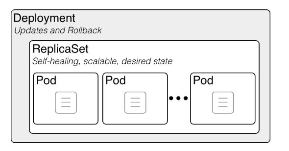

# Après-midi

## L'API et les objets Kubernetes

**Utiliser Kubernetes consiste à déclarer des objets grâce à l'API pour décrire l'état souhaité du cluster** : quelles applications exécuter, quelles images elles utilisent, le nombre de replicas, les ressources réseau et disque disponibles, etc.

On définit des objets de deux façons :

- **Impératif** : `kubectl run <conteneur>`, `kubectl expose`, `kubectl create`

- **Déclaratif** : décrire un objet dans un fichier YAML et le passer à `kubectl apply -f monobjet.yaml`

**Kubernetes est complètement automatisable** — vous pouvez aussi écrire des programmes qui utilisent directement l'API.

---

## Infrastructure as Code : la commande `apply`

Kubernetes encourage le principe de l'**Infrastructure as Code** : décrire l'état souhaité dans des fichiers YAML versionnés dans Git, plutôt que lancer des commandes manuelles.

```bash
kubectl apply -f object.yaml    # crée ou met à jour
kubectl delete -f object.yaml   # supprime
```

C'est la méthode recommandée en production — les fichiers YAML sont la source de vérité.

---

### Structure de base d'un objet Kubernetes

```yaml
apiVersion: apps/v1       # version de l'API (obligatoire)
kind: Deployment          # type d'objet (obligatoire)
metadata:                 # (obligatoire)
  name: mon-app           # nom de la ressource (obligatoire)
  namespace: default      # namespace (optionnel, défaut: default)
  labels:
    app: mon-app          # étiquettes clé/valeur libres
spec:                     # état souhaité (obligatoire, spécifique à chaque kind)
  replicas: 1
  ...
```

Pour explorer les paramètres disponibles : `kubectl explain pod`, `kubectl explain deploy --recursive`

On peut décrire **plusieurs ressources dans un seul fichier**, séparées par `---`. L'ordre n'importe pas — Kubernetes planifie la création dans le bon ordre selon les dépendances.

---

## Les Pods


**Le Pod est l'unité de base d'une application Kubernetes** — un groupe atomique de conteneurs garantis de tourner sur le même node, toujours ensemble.

Les conteneurs d'un pod partagent :

- des volumes communs
- la même interface réseau (même IP, mêmes noms de domaine internes)
- peuvent se parler en IPC

```yaml
apiVersion: v1
kind: Pod
metadata:
  name: rancher-demo-pod
  labels:
    app: rancher-demo
spec:
  containers:
    - image: monachus/rancher-demo:latest
      name: rancher-demo-container
      ports:
        - containerPort: 8080
    - image: redis
      name: redis-container
      ports:
        - containerPort: 6379
```

> Un pod seul n'est **pas recommandé** en production — il n'a pas de self-healing ni de gestion de version. Utilisez un Deployment.

**Un pod est largement immutable** : on ne peut pas changer le nom d'un conteneur ou sa commande après création. Pour modifier ces propriétés, il faut supprimer et recréer le pod. C'est précisément pour ça qu'on utilise un Deployment — il gère ce cycle automatiquement.

---

**Un pod peut contenir trois types de conteneurs aux rôles distincts :**

**Init containers** : s'exécutent séquentiellement avant les conteneurs principaux, jusqu'à complétion. Utilisés pour des tâches de préparation (attendre une base de données, pré-charger des fichiers). 

Leurs ressources sont comptées séparément — le scheduler retient le maximum entre les requests des init containers et celles des conteneurs standards.

**Conteneurs standards** : les conteneurs applicatifs qui tournent en parallèle  pendant toute la vie du pod. Ce sont eux qui définissent l'essentiel du budget de
 ressources du pod.

**Ephemeral containers** : ajoutés temporairement à un pod déjà en cours d'exécution pour le débogage (kubectl debug). 

Ils ne peuvent pas être définis dans le manifeste initial, ne redémarrent pas, et s'exécutent dans le cgroup du pod existant — leurs ressources sont contraintes par ce qui a déjà été alloué au pod, et ne modifient pas sa classe QoS.

---

### Le pattern Sidecar

Sur le schéma, les trois conteneurs standards sont étiquetés `app`, `logs` et `proxy`. Ce n'est pas un hasard : c'est l'illustration du **pattern sidecar**.

**Un sidecar est un conteneur secondaire qui tourne aux côtés du conteneur applicatif principal pour lui ajouter une responsabilité transverse**, sans modifier son code.

Parce qu'ils partagent le même réseau, les mêmes volumes et le même cycle de vie, les conteneurs d'un pod peuvent se diviser le travail proprement :

| Rôle | Ce qu'il fait | Exemples |
|---|---|---|
| **app** | Logique métier uniquement | Votre service Python, Go, Java |
| **logs** | Collecte et relaie les logs vers un agrégateur | Fluent Bit, Filebeat |
| **proxy** | Intercepte le trafic réseau entrant et sortant | Envoy, Nginx, Linkerd proxy |

```yaml
spec:
  containers:
  - name: app
    image: mon-api:1.2.0
    volumeMounts:
    - name: logs
      mountPath: /var/log/app
  - name: log-shipper          # sidecar : collecte les logs écrits par app
    image: fluent/fluent-bit:3
    volumeMounts:
    - name: logs
      mountPath: /var/log/app
  volumes:
  - name: logs
    emptyDir: {}
```

Le conteneur `app` écrit ses logs dans un volume partagé. Le sidecar `log-shipper` les lit et les envoie vers le système de centralisation — sans que l'application ait besoin de connaître Fluent Bit.

**Avantages du pattern sidecar :**
- Séparation des responsabilités : l'équipe applicative gère `app`, l'équipe infra gère les sidecars
- Réutilisable sur n'importe quel pod, quelle que soit la technologie de l'application
- Pas de modification du code applicatif

---

### Sidecar natif : initContainers avec restartPolicy (K8s ≥ 1.29)

Le problème historique du sidecar classique : tous les conteneurs d'un pod démarrent en parallèle. Rien ne garantit que le proxy réseau ou l'agent de logs est prêt avant que l'application commence à traiter du trafic.

**Depuis Kubernetes 1.29**, un init container peut être déclaré comme sidecar natif en lui ajoutant `restartPolicy: Always`. Il bénéficie alors d'un cycle de vie hybride :

- **Il démarre avant les conteneurs principaux** (comme un init container classique)
- **Il reste actif toute la vie du pod** (comme un conteneur standard)
- **Il reçoit SIGTERM après les conteneurs principaux** lors de l'arrêt du pod

```yaml
spec:
  initContainers:
  - name: proxy                # sidecar natif : démarre avant app, reste actif
    image: envoy:v1.29
    restartPolicy: Always      # c'est ce champ qui le transforme en sidecar natif
  containers:
  - name: app
    image: mon-api:1.2.0
```

| | Sidecar classique | Sidecar natif (init + restartPolicy) |
|---|---|---|
| **Ordre de démarrage** | Parallèle avec app | Avant app (garanti) |
| **Arrêt** | En même temps que app | Après app |
| **Cas d'usage** | Logs, métriques simples | Proxy réseau, agent secrets, tout ce qui doit être prêt avant app |

C'est la solution retenue par les service meshes comme Istio et Linkerd pour injecter leur proxy sans dépendre d'une injection automatique externe.

---

## Les Deployments



**Le Deployment est l'objet à créer en pratique** pour déployer une application. C'est un objet de plus haut niveau qui pilote des ReplicaSets et des Pods.

Architecture en poupées russes : **Deployment → ReplicaSet → Pods → Conteneurs**

**Responsabilités du Deployment :**

- **Tracking de versions** : gère la coexistence de plusieurs versions lors des mises à jour
- **RolloutStrategy** : montée de version automatique en haute disponibilité (zero-downtime)

- **Self-healing** via le ReplicaSet : recrée automatiquement les pods qui tombent

```yaml
apiVersion: apps/v1
kind: Deployment
metadata:
  name: demonstration
  labels:
    app: demonstration
spec:
  replicas: 3
  selector:
    matchLabels:
      app: demonstration
  template:
    metadata:
      labels:
        app: demonstration
    spec:
      containers:
        - name: rancher-demo
          image: monachus/rancher-demo:latest
          ports:
            - containerPort: 8080
```

```bash
kubectl get deployments
kubectl get rs          # ReplicaSets — ne pas manipuler directement
kubectl get pods
kubectl get all -n <namespace>   # toutes les ressources d'un namespace
```

### Ne jamais utiliser le tag `latest` en production

Quand plusieurs replicas d'un Deployment utilisent `image: monapp:latest`, chaque pod peut finir par avoir une version différente selon le moment où il a été schedulé. Si `latest` pointe vers une nouvelle image avec un breaking change, certains pods tournent l'ancienne version, d'autres la nouvelle — l'application est incohérente.

**La règle** : utiliser un tag de version explicite (`monapp:1.4.2`) ou le hash de commit (`monapp:abc1234`). Ainsi tous les replicas tournent exactement la même image.

```yaml
# À éviter
image: monapp:latest

# Recommandé
image: monapp:1.4.2

# ou avec le hash de commit
image: registry.example.com/monapp:abc1234f
```

--- 

### Stratégie de déploiement

Le champ `strategy.type` contrôle comment Kubernetes remplace les pods lors d'une mise à jour :

- **`Recreate`** : supprime tous les anciens pods, puis crée les nouveaux (interruption courte)
- **`RollingUpdate`** (défaut) : remplace progressivement, pod par pod (zero-downtime)

```yaml
spec:
  strategy:
    type: RollingUpdate
```

--- 

### Rollout : gérer les mises à jour

Chaque `kubectl apply` qui change les conteneurs crée une nouvelle **révision** du Deployment. Kubernetes gère deux ReplicaSets en parallèle pendant la transition.

```bash
kubectl rollout status deployment/<nom>         # suivre la progression
kubectl rollout history deployment/<nom>        # voir les révisions
kubectl rollout history deployment/<nom> --revision=2  # détail d'une révision
kubectl rollout undo deployment/<nom>           # revenir à la révision précédente
```

---

## Labels et sélecteurs

**Les labels sont des étiquettes clé/valeur** attachées librement aux objets Kubernetes. Les sélecteurs permettent de filtrer et de **relier des objets entre eux**.

Exemple : un Service pointe vers des Pods via leurs labels. Si le label ne correspond plus, le trafic est coupé.

```yaml
# Sur le Deployment
labels:
  app: demonstration

# Sur le Service (selector)
selector:
  app: demonstration
```

> Évitez d'utiliser le même label pour des parties différentes de l'application.

---

## Les Services

Un **Service** crée un point d'accès stable vers un ensemble de pods — il sélectionne les pods via leurs **labels** et répartit le trafic entre eux (load balancing).


Les **endpoints** sont la liste des IPs des pods actuellement sélectionnés par un Service. Si le selector ne correspond à aucun pod, les endpoints sont vides et le trafic ne passe plus.

```yaml
apiVersion: v1
kind: Service
metadata:
  name: demo-service
spec:
  type: NodePort
  ports:
    - port: 8080
  selector:
    app: demonstration   # doit correspondre aux labels des pods
```

```bash
kubectl get services
kubectl describe service <nom>   # voir les endpoints
```

---

## Les health checks (Probes)

Kubernetes dispose de trois types de sondes pour surveiller l'état des conteneurs :

- **`startupProbe`** : vérifie que l'application a bien démarré. Tant qu'elle n'est pas validée, les autres probes ne s'exécutent pas. Utile pour les applications lentes au démarrage.

- **`readinessProbe`** : vérifie que le conteneur est **prêt à recevoir du trafic**. Tant qu'elle échoue, le pod est retiré des endpoints du Service.
- **`livenessProbe`** : vérifie que le conteneur est **vivant**. Si elle échoue, Kubernetes redémarre le conteneur.

Paramètres courants :

- `initialDelaySeconds` : délai avant le premier check (évite les faux positifs au démarrage)
- `periodSeconds` : fréquence des checks

- `failureThreshold` : nombre d'échecs avant action

```yaml
containers:
  - name: mon-app
    startupProbe:
      exec:
        command: ["/bin/sh", "-c", "test -f /tmp/started"]
      failureThreshold: 30
      periodSeconds: 10
    readinessProbe:
      httpGet:
        path: /ready
        port: 8080
      initialDelaySeconds: 5
      periodSeconds: 10
    livenessProbe:
      httpGet:
        path: /healthy
        port: 8080
      initialDelaySeconds: 15
      periodSeconds: 10
```

---

## Observer les événements

`kubectl get events` affiche l'historique des événements du cluster — créations, erreurs, scheduling, probes :

```bash
kubectl get events --sort-by .lastTimestamp -n <namespace>
kubectl get events -w -n <namespace>   # mode watch — suit les événements en temps réel
```

---

## Débugger avec Kuberentes

**Le debug de vos pods est parfois compliqué. Revue des outils.**

```bash
kubectl logs <pod-name>                          # logs du conteneur
kubectl logs <pod-name> -c <conteneur-name>      # si plusieurs conteneurs dans le pod
kubectl exec -it <pod-name> -- /bin/sh           # shell interactif
kubectl exec -it <pod-name> -c <nom> -- /bin/sh  # sur un conteneur spécifique
kubectl describe pod <pod-name>                  # événements et état détaillé
kubectl describe deployment <nom>                # état et événements du deployment
kubectl port-forward <pod-name> 8080:8080        # forward de port (debug seulement)
kubectl cp <pod-name>:/chemin/fichier ./local    # copier un fichier depuis un pod
kubectl top pods                                 # ressources CPU/RAM consommées

# Conteneur éphémère dans un pod existant (sans le redémarrer)
kubectl debug <pod-name> -it --image=busybox

# Copie du pod avec une image de debug
kubectl debug <pod-name> -it --copy-to=pod-debug --image=busybox

# Debug d'un nœud (monte le filesystem du nœud dans /host)
kubectl debug node/<node-name> -it --image=busybox
```

---

## Les 10 erreurs les plus courantes

### Méthode générale

Avant tout diagnostic, trois commandes à enchaîner :

```bash
kubectl describe pod <pod-name>   # état, événements, erreurs de scheduling
kubectl logs <pod-name>           # sortie de l'application
kubectl get events --sort-by='.lastTimestamp'  # historique du cluster
```

Valider un fichier YAML sans l'appliquer : `kubectl apply --dry-run=client -f fichier.yaml`

---

### 1. CrashLoopBackOff

Le pod démarre, crashe, redémarre en boucle. Kubernetes augmente progressivement le délai entre les tentatives.

**Causes** : l'application plante au démarrage — mauvaise commande, variable d'environnement manquante, dépendance inaccessible.

```bash
kubectl logs <pod-name>             # voir pourquoi l'app crashe
kubectl logs <pod-name> --previous  # logs du crash précédent
```

---

### 2. ImagePullBackOff / ErrImagePull

Kubernetes ne peut pas télécharger l'image.

**Causes** : nom ou tag incorrect, registry privé sans secret, image inexistante.

```bash
kubectl describe pod <pod-name>   # message d'erreur précis
# Si registry privé : créer un imagePullSecret et le référencer dans le pod
```

---

### 3. OOMKilled

Le conteneur a dépassé sa `limit` mémoire et a été tué par le kernel.

**Causes** : limit mémoire trop basse, fuite mémoire dans l'application.

```bash
kubectl describe pod <pod-name>   # champ "Last State: OOMKilled"
kubectl top pod <pod-name>        # consommation réelle
```

---

### 4. CreateContainerConfigError

La configuration demandée par le conteneur ne peut pas être créée.

**Causes** : Secret, ConfigMap ou volume référencé dans le YAML qui n'existe pas (ou mauvaise clé).

```bash
kubectl describe pod <pod-name>          # indique quel objet est introuvable
kubectl get secret,configmap -n <namespace>
```

---

### 5. NodeNotReady

Un nœud est indisponible — les pods qui y tournent passent en `Unknown` ou sont évincés.

```bash
kubectl get nodes
kubectl describe node <node-name>  # conditions : MemoryPressure, DiskPressure, NetworkUnavailable
```

---

### 6. Pod en Pending

Le pod n'est pas schedulé — il attend sur la liste d'attente du scheduler.

**Causes** : ressources insuffisantes sur les nœuds, PVC non lié, `nodeSelector` ou taint bloquant.

```bash
kubectl describe pod <pod-name>   # section "Events" indique pourquoi le scheduling échoue
kubectl top nodes                 # ressources disponibles par nœud
```

---

### 7. FailedScheduling

Le scheduler a cherché un nœud et n'en a trouvé aucun compatible.

**Causes** : requests trop élevées, taints sans toleration, nodeSelector trop restrictif.

```bash
kubectl describe pod <pod-name>   # "0/3 nodes are available: insufficient cpu..."
```

---

### 8. ContainerCannotRun

Le conteneur ne démarre pas du tout — avant même que l'application s'exécute.

**Causes** : entrypoint incorrect, permissions manquantes, fichier requis absent.

```bash
kubectl describe pod <pod-name>
kubectl logs <pod-name>
# Tester localement : docker run --rm <image> <commande>
```

---

### 9. Exit Code 1 / 125

**Code 1** : erreur générique de l'application. **Code 125** : la commande du conteneur a échoué avant même que l'app démarre.

```bash
kubectl logs <pod-name>
# Tester localement : docker run --rm <image> pour reproduire
```

---

### 10. Pod bloqué en Init / Waiting

Les init containers ne se terminent pas — le pod reste en `Init:0/1` indéfiniment.

**Causes** : init container qui attend un service jamais disponible, image incorrecte, volume non monté.

```bash
kubectl describe pod <pod-name>   # état de chaque init container
kubectl logs <pod-name> -c <init-container-name>
```
