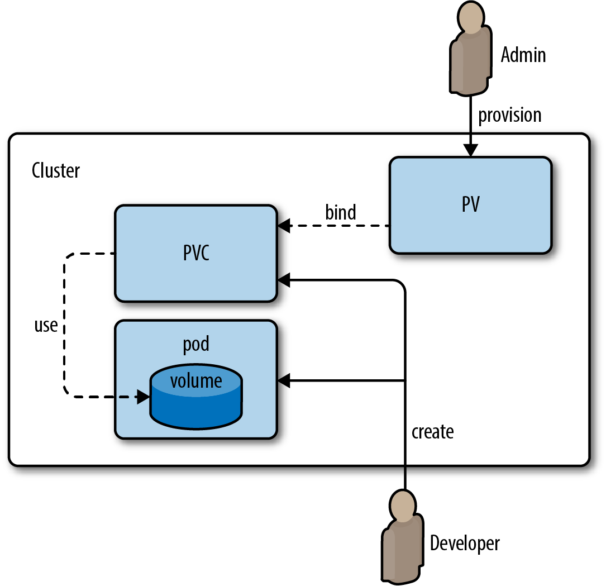

# Kubernetes pour développeurs


## Les objets de configuration : ConfigMaps et Secrets

D'après les recommandations [12factor](https://12factor.net), la configuration de nos programmes doit venir de l'environnement — séparée du code.

### ConfigMaps

Les objets ConfigMaps permettent d'injecter dans des pods des ensembles clé/valeur de configuration, soit comme variables d'environnement, soit comme fichiers montés en volume.

Cela permet de centraliser et découpler la configuration du déploiement des pods. Plusieurs microservices peuvent partager la même ConfigMap pour une valeur commune (ex : nom de domaine d'une base de données).

#### Exemple : ConfigMap et variable d'environnement

```yaml
apiVersion: v1
kind: ConfigMap
metadata:
  name: mysql-config
data:
  MYSQL_DATABASE: mydatabase
```

```yaml
apiVersion: apps/v1
kind: Deployment
metadata:
  name: mysql-deployment
spec:
  replicas: 1
  selector:
    matchLabels:
      app: mysql
  template:
    metadata:
      labels:
        app: mysql
    spec:
      containers:
      - name: mysql
        image: mysql:5.7
        env:
        - name: MYSQL_DATABASE
          valueFrom:
            configMapKeyRef:
              name: mysql-config
              key: MYSQL_DATABASE
```

#### Monter une ConfigMap comme fichier

```yaml
volumes:
- name: config-volume
  configMap:
    name: redis-config
containers:
- name: redis
  volumeMounts:
  - name: config-volume
    mountPath: /redis-master
```

```bash
kubectl get configmap <nom> -o yaml
```

### Secrets

Les Secrets se manipulent comme des ConfigMaps, mais ils sont encodés en base64 et destinés aux données sensibles : mots de passe, clés privées, certificats, tokens.

Il y a deux façons d'utiliser un Secret :
- **Comme variable d'environnement** (via `secretKeyRef`)
- **Comme fichier monté en volume** (via un volume de type `secret`) — peut utiliser `tmpfs` pour ne jamais écrire sur disque

Pour définir qui a accès à quels secrets, on utilise le RBAC Kubernetes.

#### Créer un secret en ligne de commande

```bash
# Depuis un fichier
kubectl create secret generic my-cert --from-file=mycert.pem

# Depuis des valeurs littérales
kubectl create secret generic postgres-secret \
  --from-literal=POSTGRES_USER=user \
  --from-literal=POSTGRES_PASSWORD=password
```

Les données d'un secret sont encodées en base64 (pas chiffrées — stocker dans etcd chiffré est une configuration séparée).

#### Utiliser un Secret comme variable d'environnement

```yaml
env:
- name: POSTGRES_USER
  valueFrom:
    secretKeyRef:
      name: postgres-secret
      key: POSTGRES_USER
- name: POSTGRES_PASSWORD
  valueFrom:
    secretKeyRef:
      name: postgres-secret
      key: POSTGRES_PASSWORD
```

#### Monter un Secret comme fichier

```yaml
containers:
- name: mycontainer
  volumeMounts:
  - name: my-cert
    mountPath: /etc/mycert.pem
    readOnly: true
volumes:
- name: my-cert
  secret:
    secretName: my-cert
```

```bash
kubectl get secret <nom>           # valeurs en base64
kubectl describe secret <nom>      # affiche les clés (pas les valeurs)
```

Pour vérifier qu'un secret est bien exposé dans un pod :

```bash
kubectl exec -it <pod> -- env | grep POSTGRES
```

---

## Contrôleurs alternatifs : Jobs, CronJobs, StatefulSets

### Quand utiliser quel contrôleur ?


| Contrôleur | Cas d'usage |
|---|---|
| **Deployment** | Application stateless, pods interchangeables, ordre de création non important |
| **StatefulSet** | Application stateful (base de données), identité réseau stable, stockage persistant |
| **DaemonSet** | Un agent par nœud (monitoring, réseau) |
| **Job** | Tâche unique ponctuelle (migration de base de données, batch) |
| **CronJob** | Tâche récurrente planifiée (backup, nettoyage) |

### Jobs

Les Jobs sont utiles pour des tâches à exécuter une seule fois. Si vous exécutez une migration de base de données dans un Deployment, dès que la migration se termine, le ReplicaSet va tenter de redémarrer le pod — votre migration tourne en boucle.

Un Job garantit que la tâche s'exécute jusqu'à complétion un nombre défini de fois.

### CronJob : tâches périodiques

Comme un Job, mais planifié sur un intervalle régulier, avec la syntaxe cron unix.


```yaml
apiVersion: batch/v1
kind: CronJob
metadata:
  name: daily-backup
spec:
  schedule: "0 0 * * *"   # tous les jours à minuit
  jobTemplate:
    spec:
      template:
        spec:
          containers:
          - name: backup
            image: my-backup-image:1.2
            command: ["/bin/sh", "-c", "backup.sh"]
          restartPolicy: OnFailure
```

Commandes utiles :
```bash
kubectl get jobs                          # Jobs créés par le CronJob
kubectl logs job/<nom-du-job>             # Logs d'un Job spécifique
kubectl get cronjob                       # État du CronJob

```
### StatefulSets

L'objet `StatefulSet` est fait pour répliquer des pods dont l'état est important — typiquement des bases de données.

Un StatefulSet fournit :
- **Identités stables** : les pods sont nommés `web-0`, `web-1`, `web-2` — le nom ne change pas même si le pod est recréé
- **Stockage stable et persistant** : les volumes liés ne sont pas supprimés quand on supprime le StatefulSet
- **Déploiement et scaling ordonnés** : déploiement dans l'ordre (`web-0` avant `web-1`), suppression dans l'ordre inverse
- **Rolling updates ordonnées**

On utilise les StatefulSets quand :
- L'ordre de création des replicas et le nom des pods est important
- L'application écrit dans une base de données (opérations stateful)

#### Exemple minimal : StatefulSet Redis

```yaml
apiVersion: apps/v1
kind: StatefulSet
metadata:
  name: redis-set
  namespace: mynamespace
spec:
  serviceName: "redis"
  replicas: 2
  selector:
    matchLabels:
      app: redis
  template:
    metadata:
      labels:
        app: redis
    spec:
      containers:
      - name: redis
        image: redis:latest
        ports:
        - containerPort: 6379
        volumeMounts:
        - name: redis-data
          mountPath: /data
  volumeClaimTemplates:
  - metadata:
      name: redis-data
    spec:
      accessModes: [ "ReadWriteOnce" ]
      resources:
        requests:
          storage: 100Mi
```

Le `volumeClaimTemplates` crée automatiquement un PVC par pod : `redis-data-redis-set-0`, `redis-data-redis-set-1`, etc.

Le label automatique `statefulset.kubernetes.io/pod-name: <pod-name>` est ajouté par Kubernetes sur chaque pod d'un StatefulSet. On peut l'utiliser dans un Service selector pour cibler un pod précis.

```bash
kubectl exec -it <pod> -- /bin/sh
```

---

## Stockage et Volumes

### Principe

Les conteneurs sont immutables : Kubernetes peut les supprimer et recréer automatiquement. Tout fichier créé pendant l'exécution est perdu. La persistance des données passe par des **volumes**, montés à un emplacement du système de fichiers du conteneur.

### Types de volumes

- **`emptyDir`** : volume temporaire partagé entre les conteneurs d'un même pod — détruit avec le pod
- **`configMap` / `secret`** : monte la configuration ou les secrets comme fichiers
- **`hostPath`** : monte un dossier du nœud — **à éviter** (lie le pod à un nœud spécifique, problèmes de sécurité)
- **`persistentVolumeClaim`** : volume persistant via le système PVC/StorageClass

### PersistentVolumeClaim (PVC)



Pour du stockage persistant, le flux est :


1. Un pod crée une **PersistentVolumeClaim** (demande de volume)
2. La **StorageClass** répond en créant un **PersistentVolume**
3. Le PVC et le PV sont liés — le pod peut accéder au volume

```yaml
apiVersion: v1
kind: PersistentVolumeClaim
metadata:
  name: redis-pvc
  namespace: mynamespace
spec:
  storageClassName: longhorn
  accessModes:
    - ReadWriteOnce
  resources:
    requests:
      storage: 100Mi
```

Modes d'accès :
- `ReadWriteOnce` (RWO) : un seul nœud peut écrire
- `ReadWriteMany` (RWX) : plusieurs nœuds peuvent écrire (nécessite un stockage compatible : NFS, Longhorn, Ceph...)

```yaml
volumes:
- name: redis-storage
  persistentVolumeClaim:
    claimName: redis-pvc
```

```bash
kubectl get storageclass           # classes de stockage disponibles
kubectl get pvc                    # PersistentVolumeClaims
kubectl get pv                     # PersistentVolumes
```

### Longhorn : stockage persistant pour clusters on-premise

**Longhorn** est un opérateur de stockage distribué open-source pour Kubernetes (projet CNCF). Il fournit une StorageClass `longhorn` qui permet le provisionning dynamique de volumes persistants, y compris en mode `ReadWriteMany`.

Installation :
```bash
sudo apt install nfs-common -y
kubectl apply -f https://raw.githubusercontent.com/longhorn/longhorn/v1.6.0/deploy/longhorn.yaml
```

Après installation, la StorageClass `longhorn` est disponible : `kubectl get storageclass`.

---

## Topologie des workloads : Où sont déployés les pods ?

**Kubernetes décide seul sur quel nœud placer chaque pod** — c'est le rôle du scheduler  .  

Par défaut, il cherche un nœud avec suffisamment de ressources disponibles et le place de façon opportuniste  .  

En pratique, cela peut mener à des déséquilibres : tous les pods d'un même Deployment sur le même nœud, ou sur la même zone de disponibilité.

---

### 1. Contraintes de ressources — le filtre de base

**Le scheduler élimine d'abord les nœuds qui ne peuvent pas accueillir le pod  .**  

Définir des `requests` et `limits` pour chaque conteneur est indispensable pour partager un cluster correctement :

- **Requests** : ressources réservées — utilisées par le scheduler pour décider sur quel nœud placer le pod
- **Limits** : plafond — le conteneur ne peut pas dépasser cette valeur

```yaml
resources:
  requests:
    memory: "64Mi"
    cpu: "250m"
  limits:
    memory: "128Mi"
    cpu: "500m"
```

Un pod sans request peut se faire déplacer en priorité (basse priorité QoS).

La règle de placement est simple : un pod n'est schedulé sur un nœud que si ce nœud a suffisamment de ressources **réservées disponibles** (requests non encore allouées) pour couvrir les requests du pod.

Sans `requests` définies, le pod peut atterrir n'importe où — y compris sur un nœud déjà saturé  .  

Définir des requests est donc aussi un outil de placement.

**Problème courant** : ratio CPU réservé/CPU utilisé trop élevé. Exemple :
- Utilisation CPU globale du cluster : 14%
- Réservation CPU globale : 81%
- Résultat : impossible de scheduler un nouveau pod — le cloud autoscaler ajoute un nœud inutilement

---

### 2. Node Pools et Taints / Tolerations

**En production, les clusters sont souvent segmentés en **node pools** — des groupes de nœuds homogènes avec des caractéristiques différentes : nœuds GPU, nœuds mémoire-optimisés, nœuds réservés à certaines équipes.**

Les **Taints** permettent de marquer un nœud pour repousser tous les pods par défaut  .  

Seuls les pods qui déclarent la **Toleration** correspondante peuvent y être schedulés.


---

Trois effets de taint existent, avec des conséquences très différentes sur les pods **déjà en cours d'exécution** sur le nœud :

| Effet | Nouveaux pods | Pods déjà en place |
|---|---|---|
| `NoSchedule` | Bloqués (sauf toleration) | **Non affectés** — continuent de tourner |
| `PreferNoSchedule` | Évités si possible, pas garanti | Non affectés |
| `NoExecute` | Bloqués (sauf toleration) | **Évincés** — immédiatement, ou après `tolerationSeconds` si spécifié |

L'exemple ci-dessous utilise `NoSchedule` : il réserve `gpu-node-1` pour les futurs pods GPU, **sans rien casser** pour ce qui tourne déjà dessus — c'est le comportement voulu pour une réservation de node pool (on ne veut pas évincer un pod existant juste parce qu'on vient de réserver le nœud). Pour forcer aussi le départ des pods déjà présents, il faudrait `NoExecute` à la place.

```
Nœud GPU, AVANT le taint :          APRÈS kubectl taint ...:NoSchedule
┌─────────────────┐                 ┌─────────────────┐
│ pod-web (déjà là)│                 │ pod-web (reste!) │  <- non affecté
└─────────────────┘                 └─────────────────┘
                                     nouveaux pods sans toleration
                                     → refusés ici, placés ailleurs
```

📖 [Documentation officielle — Taints and Tolerations](https://kubernetes.io/docs/concepts/scheduling-eviction/taint-and-toleration/)

```bash
# Réserver un nœud pour les workloads GPU
kubectl taint nodes gpu-node-1 workload=gpu:NoSchedule
```

```yaml
# Pod qui peut être placé sur ce nœud
spec:
  tolerations:
  - key: "workload"
    operator: "Equal"
    value: "gpu"
    effect: "NoSchedule"
```

Pour aller plus loin dans le ciblage, la **Node Affinity** permet d'exprimer des préférences ou contraintes basées sur les labels des nœuds (`required` ou `preferred`).

---

### 3. Topology Spread Constraints — distribuer les pods intelligemment

**Le problème de la haute disponibilité : si tous les réplicas d'un Deployment se retrouvent sur le même nœud ou dans la même zone, une panne emporte tout  .**  

Les **Topology Spread Constraints** permettent de contraindre la distribution des pods sur des domaines topologiques (nœuds, zones, régions).

Les champs clés :

| Champ | Rôle |
|---|---|
| `topologyKey` | La clé de label de nœud qui définit le domaine (`kubernetes.io/hostname`, `topology.kubernetes.io/zone`…) |
| `maxSkew` | Déséquilibre maximal autorisé entre domaines (ex: `1` = au plus 1 pod d'écart) |
| `whenUnsatisfiable` | `DoNotSchedule` (bloque) ou `ScheduleAnyway` (place quand même en minimisant le déséquilibre) |
| `labelSelector` | Sélectionne les pods à compter pour le calcul du déséquilibre |

```yaml
# Distribuer les réplicas sur les nœuds et les zones
spec:
  topologySpreadConstraints:
  - maxSkew: 1
    topologyKey: topology.kubernetes.io/zone
    whenUnsatisfiable: DoNotSchedule
    labelSelector:
      matchLabels:
        app: mon-app
  - maxSkew: 1
    topologyKey: kubernetes.io/hostname
    whenUnsatisfiable: ScheduleAnyway
    labelSelector:
      matchLabels:
        app: mon-app
```

Avec cette configuration, sur un cluster à 3 zones et 6 réplicas : Kubernetes garantit au plus 1 pod d'écart entre les zones (2-2-2), et tente de ne pas mettre plusieurs réplicas sur le même nœud.

> Depuis Kubernetes v1.30, des contraintes par défaut au niveau cluster peuvent être configurées par l'admin — les workloads en héritent automatiquement sans avoir à les déclarer dans chaque Deployment.

---

### 4. Pod Anti-Affinity — éviter la cohabitation

Les **Topology Spread Constraints** équilibrent la distribution globale. La **Pod Anti-Affinity** exprime une règle plus ciblée : "ne pas placer ce pod sur un nœud où tourne déjà un pod avec tel label."

---

Avec `requiredDuringSchedulingIgnoredDuringExecution`, le scheduler refuse de placer le pod si la contrainte ne peut pas être respectée — le pod reste en `Pending` plutôt que de violer la règle.

Avec `preferredDuringSchedulingIgnoredDuringExecution`, la contrainte est une préférence : le scheduler essaie de la respecter, mais place quand même le pod si aucun nœud ne convient.


---

Cas d'usage typique : un Deployment avec 3 réplicas d'un service critique. On veut garantir qu'aucun nœud n'héberge deux réplicas — une panne nœud ne doit emporter qu'un seul réplica.

```yaml
spec:
  affinity:
    podAntiAffinity:
      requiredDuringSchedulingIgnoredDuringExecution:   # contrainte dure
      - labelSelector:
          matchLabels:
            app: mon-app       # ne pas co-localiser avec un pod qui a ce label
        topologyKey: kubernetes.io/hostname              # un nœud = un domaine
```

---

Contrairement à `requiredDuringScheduling` (tout ou rien), la version `preferred` accepte **plusieurs règles pondérées** : le scheduler note chaque nœud candidat en additionnant le `weight` (1 à 100) de chaque règle satisfaite, puis choisit le nœud avec le meilleur score — sans jamais exclure un nœud comme le ferait `required`.

```
3 nœuds candidats, 2 règles preferred :
  - weight: 80  → éviter les pods "app: mon-app"     (anti-colocation)
  - weight: 20  → préférer la zone "eu-west-1a"

Nœud A : pas de pod "app: mon-app", zone eu-west-1a   → score = 80 + 20 = 100  ✅ choisi
Nœud B : pas de pod "app: mon-app", zone eu-west-1b   → score = 80 + 0  = 80
Nœud C : contient déjà "app: mon-app", zone eu-west-1a → score = 0  + 20 = 20
```

Avec une seule règle `preferred` (comme dans l'exemple ci-dessous), le `weight` n'a pas d'effet observable — il ne devient utile qu'en présence de **plusieurs règles à arbitrer entre elles**. C'est pour ça qu'un seul `weight: 100` isolé peut sembler arbitraire : sa valeur ne compte que relativement aux autres poids déclarés.

**Les opérateurs logiques disponibles dans `matchExpressions` :**

| Opérateur | Effet |
|---|---|
| `In` | la valeur du label est dans la liste fournie |
| `NotIn` | la valeur du label n'est pas dans la liste fournie |
| `Exists` | un label avec cette clé existe (peu importe sa valeur) |
| `DoesNotExist` | aucun label avec cette clé n'existe |
| `Gt` / `Lt` | *(node affinity uniquement)* valeur numérique supérieure/inférieure |

`NotIn` et `DoesNotExist` permettent d'exprimer une forme d'anti-affinité directement dans une règle `nodeAffinity`/`podAffinity`, sans passer par `podAntiAffinity`.

📖 [Documentation officielle — Assigning Pods to Nodes](https://kubernetes.io/docs/concepts/scheduling-eviction/assign-pod-node/)

```yaml
spec:
  affinity:
    podAntiAffinity:
      preferredDuringSchedulingIgnoredDuringExecution:  # contrainte souple
      - weight: 100
        podAffinityTerm:
          labelSelector:
            matchLabels:
              app: mon-app
          topologyKey: kubernetes.io/hostname
```

> `IgnoredDuringExecution` signifie que si un nœud acquiert un nouveau pod après le scheduling, les pods existants ne sont pas expulsés — la contrainte s'applique uniquement au moment du placement.

---

### Tip avancé : rendre la répartition optimale automatique avec Kyverno

Déclarer une `podAntiAffinity` dans chaque Deployment est fastidieux et oubliable. Une approche plus robuste : **laisser un outil de gestion de politiques l'injecter automatiquement**.

**Kyverno** est un admission controller Kubernetes qui peut muter les ressources à la volée — il intercepte chaque `Deployment` soumis à l'API et lui ajoute une règle d'anti-affinité si elle n'est pas déjà présente.

La policy officielle [insert-pod-antiaffinity](https://kyverno.io/policies/other/create-pod-antiaffinity/create-pod-antiaffinity/) fait exactement ça :

```yaml
apiVersion: kyverno.io/v1
kind: ClusterPolicy
metadata:
  name: insert-pod-antiaffinity
spec:
  rules:
  - name: insert-pod-antiaffinity
    match:
      any:
      - resources:
          kinds:
          - Deployment
    preconditions:
      all:
      - key: "{{request.object.spec.template.metadata.labels.app || ''}}"
        operator: NotEquals
        value: ""
    mutate:
      patchStrategicMerge:
        spec:
          template:
            spec:
              +(affinity):
                +(podAntiAffinity):
                  +(preferredDuringSchedulingIgnoredDuringExecution):
                  - weight: 1
                    podAffinityTerm:
                      topologyKey: kubernetes.io/hostname
                      labelSelector:
                        matchExpressions:
                        - key: app
                          operator: In
                          values:
                          - "{{request.object.spec.template.metadata.labels.app}}"
```

Points clés de cette policy :
- Elle s'applique à tout `Deployment` qui a un label `app` (précondition)
- Le préfixe `+()` signifie "ajoute seulement si absent" — elle ne remplace jamais une affinity déjà déclarée
- Elle injecte une contrainte `preferred` (souple) sur `kubernetes.io/hostname` — les pods préfèrent des nœuds différents, sans bloquer le scheduling si c'est impossible

Le résultat : **tous les nouveaux Deployments du cluster bénéficient d'une répartition optimale par défaut**, sans aucune modification des manifestes applicatifs.

---

### Récapitulatif — les outils de placement

| Besoin | Outil |
|---|---|
| Le pod a besoin de X CPU / Y RAM | `requests` |
| Réserver des nœuds à certains workloads | Taints + Tolerations |
| Cibler des nœuds selon leurs caractéristiques | Node Affinity |
| Éviter de concentrer les réplicas sur un nœud ou une zone | Topology Spread Constraints |
| Éviter que deux pods du même service cohabitent | Pod Anti-Affinity |

---

## Packaging et templating : Kustomize et Helm

### Pourquoi on ne peut pas se contenter de YAML brut

Dès qu'on déploie la même application dans plusieurs environnements (dev, staging, prod), les manifestes YAML divergent légèrement : nombre de replicas, image tag, URLs  .  

Copier-coller et modifier à la main est une source d'erreurs.

Deux outils standards :

### Kustomize

Intégré directement dans `kubectl`, Kustomize permet de paramétrer et faire varier la configuration Kubernetes de façon déclarative, sans templating.

La syntaxe de patch utilise des opérations JSON Patch standard :
- `op: replace` — remplace une valeur
- `path` — chemin JSON vers la valeur à modifier (ex: `/spec/replicas`, `/spec/template/spec/containers/0/image`)

Exemple de patch pour modifier le nombre de replicas :
```yaml
patches:
- target:
    kind: Deployment
    name: my-app
  patch: |-
    - op: replace
      path: /spec/replicas
      value: 3
    - op: replace
      path: /spec/template/spec/containers/0/image
      value: nginx:1.25
```

On écrit une version de base des manifestes communes à tous les environnements, puis on applique des **patches** pour les variations.

```
base/
  deployment.yaml
  service.yaml
  kustomization.yaml
overlays/
  dev/
    kustomization.yaml   # patch: 1 replica, image tag dev
  prod/
    kustomization.yaml   # patch: 3 replicas, image tag v1.2
```

Commandes principales :

```bash
# Voir le résultat du patching sans appliquer
kubectl kustomize ./overlays/dev

# Appliquer
kubectl apply -k ./overlays/dev
```

Kustomize est adapté pour une variabilité limitée : entreprise qui déploie en interne dans quelques environnements  .  

Il garde le code de base lisible.

### Helm

Helm est le **package manager** de Kubernetes  .  

Il génère dynamiquement des manifestes à partir de templates avec des variables.

- Un package Helm s'appelle un **Chart**
- Une installation particulière d'un chart s'appelle une **Release**
- Les charts sont distribués sur https://artifacthub.io

Helm permet aussi :
- La gestion des dépendances (installer d'autres charts liés)
- Des hooks avant/après installation
- Des upgrades précautionneux et des rollbacks

```bash
# Ajouter un dépôt de charts
helm repo add bitnami https://charts.bitnami.com/bitnami

# Rechercher un chart
helm search repo bitnami/wordpress

# Installer avec des valeurs personnalisées
helm install mon-wordpress bitnami/wordpress \
  --values=myvalues.yaml \
  --namespace mynamespace

# Voir les releases installées
helm list

# Supprimer une release
helm delete mon-wordpress
```

### Helm vs Kustomize — quand utiliser quoi ?

| | Kustomize | Helm |
|---|---|---|
| **Syntaxe** | YAML natif + patches | Templates Go |
| **Complexité** | Faible | Plus élevée |
| **Usage** | Variations internes limitées | Distribution publique, variations importantes |
| **Dépendances** | Non | Oui |
| **Intégré kubectl** | Oui | Non (CLI séparée) |
