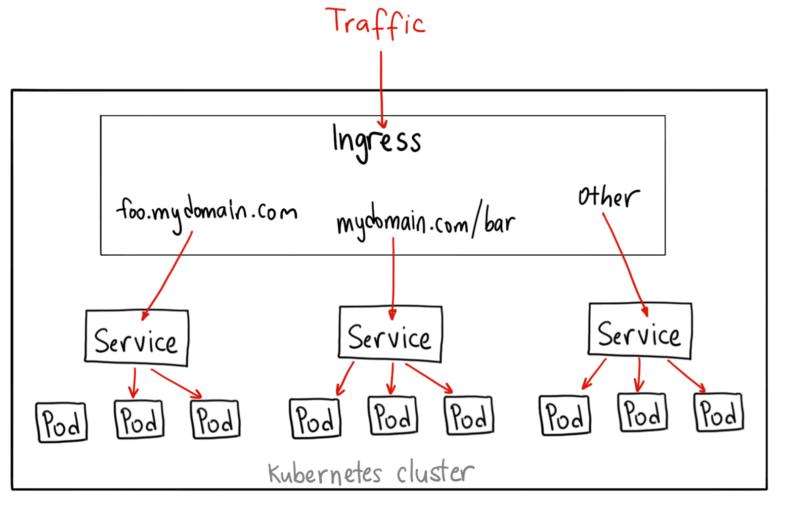

## Le réseau Kubernetes : Services et exposition externe

### Services — l'adressage interne

Les Services sont les objets réseau de base (vus en Bases)  .  

Ils créent un point d'accès stable vers un ensemble de pods, indépendamment de leur durée de vie  .  

Rappel des types :

| Type | Usage |
|---|---|
| `ClusterIP` | Accès interne au cluster uniquement — par défaut |
| `NodePort` | Expose sur un port du nœud — dev/test uniquement |
| `LoadBalancer` | Provisionne un loadbalancer externe (cloud) |

DNS interne : chaque Service est accessible via `<service>.<namespace>.svc.cluster.local`.

**Le type `LoadBalancer` est limité** : il crée un loadbalancer externe par service, ce qui devient coûteux et ingérable à l'échelle — sur un cloud, chaque `LoadBalancer` facture une adresse IP dédiée  .  

On l'utilise encore pour des services non-HTTP (bases de données, MQTT…), mais il ne gère ni le routage par chemin, ni le TLS mutualisé, ni le virtual hosting.

---

### Ingress — le reverse proxy HTTP mutualisé

Un **Ingress** est un objet pour gérer dynamiquement le reverse proxy HTTP/HTTPS dans Kubernetes  .  

Un seul Ingress Controller reçoit tout le trafic entrant et route vers les bons Services selon des règles :

- Virtual hosting (`api.monapp.com` → service A, `app.monapp.com` → service B)
- Routage par chemin (`/api` → service A, `/static` → service B)
- Terminaison TLS mutualisée (un seul certificat, plusieurs apps)



Pour utiliser des Ingresses, il faut d'abord installer un **Ingress Controller** :
- Un déploiement conteneurisé d'un reverse proxy (nginx, Traefik, etc.) intégré avec l'API Kubernetes
- Il doit lui-même être exposé (ports 80 et 443), généralement via un Service LoadBalancer
- k3s est livré avec Traefik configuré par défaut

```yaml
apiVersion: networking.k8s.io/v1
kind: Ingress
metadata:
  name: my-app-ingress
  namespace: mynamespace
  annotations:
    nginx.ingress.kubernetes.io/rewrite-target: /
spec:
  ingressClassName: traefik
  rules:
  - host: mon-app.example.com
    http:
      paths:
      - path: /
        pathType: Prefix
        backend:
          service:
            name: my-app-service
            port:
              number: 80
```

**La limite de l'Ingress** : ses fonctionnalités avancées (canary, auth, rate limiting) passent par des annotations spécifiques à chaque controller  .  

Un manifeste nginx ne fonctionne pas tel quel sur Traefik  .  

Ce couplage est la raison pour laquelle la communauté a conçu la Gateway API.

---

### Ingress avec TLS (cert-manager)

`cert-manager` est un opérateur Kubernetes capable de générer automatiquement des certificats TLS/HTTPS pour vos Ingresses (Let's Encrypt).

```yaml
apiVersion: networking.k8s.io/v1
kind: Ingress
metadata:
  name: mon-app
  annotations:
    kubernetes.io/ingress.class: "nginx"
    cert-manager.io/issuer: "letsencrypt-prod"
spec:
  tls:
  - hosts:
    - mon-app.example.com
    secretName: mon-app-tls
  rules:
  - host: mon-app.example.com
    http:
      paths:
      - path: /
        pathType: Prefix
        backend:
          service:
            name: mon-app-service
            port:
              number: 80
```

---

### Gateway API — le successeur standardisé

La **Gateway API** est la nouvelle norme CNCF qui remplace progressivement l'Ingress  .  

Elle sépare les responsabilités en trois objets distincts :

| Objet | Rôle | Qui le gère |
|---|---|---|
| `GatewayClass` | Définit le type de gateway (nginx, Traefik, Cilium…) | Admin cluster |
| `Gateway` | Instance du point d'entrée, ports, TLS | Admin réseau |
| `HTTPRoute` | Règles de routage vers les Services | Développeur |

Cette séparation permet à une équipe dev de modifier ses règles de routage sans toucher à la configuration réseau du cluster, et vice-versa  .  

Les fonctionnalités avancées (canary, header matching, mirroring) sont standardisées — un manifeste `HTTPRoute` fonctionne sur n'importe quel controller compatible.

---

### Au-delà de l'exposition : les API Managers

Exposer un Service vers l'extérieur ne résout pas tout  .  

En production, on a souvent besoin de fonctionnalités que ni l'Ingress ni la Gateway API ne couvrent nativement :

- **Authentification et autorisation** (OAuth2, API keys, JWT)
- **Rate limiting** par client ou par plan tarifaire
- **Observabilité** : métriques par endpoint, par consommateur
- **Versionnement d'API** et gestion du cycle de vie
- **Transformation** de requêtes/réponses

C'est le rôle des **API Managers** (ou API Gateways applicatifs) : Kong, Gravitee, Apigee, AWS API Gateway  .  

Ils s'intercalent entre le point d'entrée réseau et les services, et ajoutent une couche de gouvernance.

```
Internet → Gateway API / Ingress → API Manager → Services Kubernetes
                                        │
                             auth, rate limit, métriques, versioning
```

> Pour ce cours, on travaille avec l'Ingress (supporté nativement par k3s/Traefik)  .  

La Gateway API et les API Managers sont des étapes naturelles dès qu'on expose des APIs à des tiers ou qu'on a plusieurs équipes consommatrices.

---

## CronJob : tâches périodiques

Un **CronJob** crée des Jobs selon un planning cron  .  

Exemple classique : tester périodiquement l'accessibilité d'un service.

```yaml
apiVersion: batch/v1
kind: CronJob
metadata:
  name: test-cronjob
  namespace: mynamespace
spec:
  schedule: "*/1 * * * *"    # toutes les minutes
  jobTemplate:
    spec:
      template:
        metadata:
          labels:
            app: tester
        spec:
          containers:
          - name: busybox
            image: busybox
            command: ["wget", "-qO-", "http://web-service"]
          restartPolicy: Never   # Never ou OnFailure pour les Jobs
```

Commandes utiles :
```bash
kubectl get jobs                          # Jobs créés par le CronJob
kubectl logs job/<nom-du-job>             # Logs d'un Job spécifique
kubectl get cronjob                       # État du CronJob
```

L'image `busybox` est une image légère contenant des outils basiques Unix dont `wget` et `sh`.

---

## NetworkPolicy : firewalls dans le cluster

**Par défaut, tous les pods peuvent communiquer entre eux** — il n'y a aucune isolation réseau.

Les **NetworkPolicies** permettent de restreindre les communications entre pods, comme des règles de firewall.

Points clés :
- Un pod non ciblé par une NetworkPolicy accepte tout le trafic
- Dès qu'une NetworkPolicy cible un pod, ce pod rejette tout trafic non explicitement autorisé
- Nécessite un CNI qui supporte les NetworkPolicies (Calico, Cilium, Weave — pas Flannel seul)

#### Exemple : bloquer tout trafic entrant sauf depuis les pods avec `role=allowed`

```yaml
apiVersion: networking.k8s.io/v1
kind: NetworkPolicy
metadata:
  name: deny-all-except-allowed
  namespace: mynamespace
spec:
  podSelector:
    matchLabels:
      app: web
  policyTypes:
  - Ingress
  ingress:
  - from:
    - podSelector:
        matchLabels:
          role: allowed
```

---

## Packaging et templating : Kustomize et Helm

### Pourquoi on ne peut pas se contenter de YAML brut

Dès qu'on déploie la même application dans plusieurs environnements (dev, staging, prod), les manifestes YAML divergent légèrement : nombre de replicas, image tag, URLs  .  

Copier-coller et modifier à la main est une source d'erreurs.

Deux outils standards :

### Kustomize

Intégré directement dans `kubectl`, Kustomize permet de paramétrer et faire varier la configuration Kubernetes de façon déclarative, sans templating.

La syntaxe de patch utilise des opérations JSON Patch standard :
- `op: replace` — remplace une valeur
- `path` — chemin JSON vers la valeur à modifier (ex: `/spec/replicas`, `/spec/template/spec/containers/0/image`)

Exemple de patch pour modifier le nombre de replicas :
```yaml
patches:
- target:
    kind: Deployment
    name: my-app
  patch: |-
    - op: replace
      path: /spec/replicas
      value: 3
    - op: replace
      path: /spec/template/spec/containers/0/image
      value: nginx:1.25
```

On écrit une version de base des manifestes communes à tous les environnements, puis on applique des **patches** pour les variations.

```
base/
  deployment.yaml
  service.yaml
  kustomization.yaml
overlays/
  dev/
    kustomization.yaml   # patch: 1 replica, image tag dev
  prod/
    kustomization.yaml   # patch: 3 replicas, image tag v1.2
```

Commandes principales :

```bash
# Voir le résultat du patching sans appliquer
kubectl kustomize ./overlays/dev

# Appliquer
kubectl apply -k ./overlays/dev
```

Kustomize est adapté pour une variabilité limitée : entreprise qui déploie en interne dans quelques environnements  .  

Il garde le code de base lisible.

### Helm

Helm est le **package manager** de Kubernetes  .  

Il génère dynamiquement des manifestes à partir de templates avec des variables.

- Un package Helm s'appelle un **Chart**
- Une installation particulière d'un chart s'appelle une **Release**
- Les charts sont distribués sur https://artifacthub.io

Helm permet aussi :
- La gestion des dépendances (installer d'autres charts liés)
- Des hooks avant/après installation
- Des upgrades précautionneux et des rollbacks

```bash
# Ajouter un dépôt de charts
helm repo add bitnami https://charts.bitnami.com/bitnami

# Rechercher un chart
helm search repo bitnami/wordpress

# Installer avec des valeurs personnalisées
helm install mon-wordpress bitnami/wordpress \
  --values=myvalues.yaml \
  --namespace mynamespace

# Voir les releases installées
helm list

# Supprimer une release
helm delete mon-wordpress
```

### Helm vs Kustomize — quand utiliser quoi ?

| | Kustomize | Helm |
|---|---|---|
| **Syntaxe** | YAML natif + patches | Templates Go |
| **Complexité** | Faible | Plus élevée |
| **Usage** | Variations internes limitées | Distribution publique, variations importantes |
| **Dépendances** | Non | Oui |
| **Intégré kubectl** | Oui | Non (CLI séparée) |

---

## GitOps avec ArgoCD

### Infrastructure as Code et YAML comme source de vérité

**Pourquoi ne pas appliquer les manifestes YAML à la main ?**
- Impossible de savoir quelle version a été appliquée en dernier — ni par qui, ni pourquoi
- Aucun moyen simple de revenir en arrière sur un changement en production
- L'état réel du cluster diverge progressivement des fichiers dans le repo

L'approche **Infrastructure as Code** répond à ça : tout ce qui tourne dans le cluster est décrit dans des fichiers YAML versionnés dans Git — pas de commande impérative, pas de modification manuelle en prod. L'historique Git *est* l'historique du cluster.

**Le GitOps** va un cran plus loin : Git n'est pas seulement un endroit où stocker des fichiers, c'est la **seule source de vérité**. L'état déclaré dans Git *est* l'état réel du cluster. Tout changement passe par un commit — auditable, réversible, soumis à review via une Pull Request.

```
Dev         → commit YAML dans Git
Git         → source de vérité unique
ArgoCD      → surveille Git, réconcilie le cluster en continu
Cluster     → reflète exactement ce qui est dans Git
```

### Kustomize et Helm dans un workflow GitOps

ArgoCD supporte nativement Kustomize et Helm — il sait les appliquer sans étape intermédiaire.

**Avec Kustomize** : le repo Git contient les bases et les overlays. ArgoCD pointe vers l'overlay de l'environnement cible.

```yaml
source:
  repoURL: https://github.com/monorg/mon-repo.git
  targetRevision: main
  path: overlays/prod          # ArgoCD applique kubectl kustomize overlays/prod
```

**Avec Helm** : ArgoCD peut référencer un chart depuis un repo Helm ou depuis le dépôt Git directement, avec les valeurs de l'environnement.

```yaml
source:
  repoURL: https://github.com/monorg/mon-repo.git
  targetRevision: main
  path: charts/mon-app
  helm:
    valueFiles:
    - values-prod.yaml         # valeurs spécifiques à la prod
```

Dans les deux cas, la promotion entre environnements (dev → staging → prod) se fait en mettant à jour le fichier de valeurs ou l'overlay correspondant dans Git — pas en exécutant une commande.

### ArgoCD : l'opérateur de réconciliation

**ArgoCD** surveille un dépôt Git et rapproche en continu l'état du cluster avec ce qui y est déclaré. Il ajoute un type d'objet `Application` :

```yaml
apiVersion: argoproj.io/v1alpha1
kind: Application
metadata:
  name: mon-app
  namespace: argocd
spec:
  destination:
    namespace: mon-app
    server: https://kubernetes.default.svc
  project: default
  source:
    repoURL: https://github.com/monorg/mon-repo.git
    targetRevision: main
    path: k8s/
```

Si un opérateur modifie manuellement une ressource dans le cluster, ArgoCD détecte la dérive et la signale (ou la corrige automatiquement selon la configuration).

### Drift : quand le cluster diverge de Git

Le **drift** est l'écart entre l'état déclaré dans Git et l'état réel du cluster. Il arrive quand quelqu'un applique un manifeste à la main, modifie une ressource avec `kubectl edit`, ou qu'un contrôleur tiers mute une ressource sans passer par Git.

ArgoCD expose un statut de synchronisation sur chaque `Application` : `Synced` (cluster = Git) ou `OutOfSync` (dérive détectée). Par défaut il signale sans corriger — c'est le comportement recommandé pour commencer, car une correction automatique agressive peut surprendre une équipe qui n'a pas encore le réflexe GitOps.

Pour activer la correction automatique, on configure `syncPolicy.automated` avec `selfHeal: true` :

```yaml
spec:
  syncPolicy:
    automated:
      selfHeal: true    # ArgoCD écrase toute modification manuelle
      prune: true       # supprime aussi les ressources absentes de Git
```

La bonne pratique : activer `selfHeal` en prod une fois que l'équipe est disciplinée sur les workflows Git, et garder un mode `manual` en dev pour permettre l'expérimentation. Dans tous les cas, bannir `kubectl edit` sur des ressources gérées par ArgoCD — toute modification manuelle sera soit écrasée, soit source de confusion.

---

### Avancé : GitOps sans accès direct à Git (OCI Artifacts)

Dans un workflow GitOps classique, ArgoCD doit pouvoir accéder au dépôt Git en temps réel — ce qui pose deux problèmes en production :

- **Sécurité** : le cluster a besoin d'un accès réseau et d'un token vers le dépôt Git (souvent hébergé sur GitHub, GitLab…)
- **Performance** : sur un grand cluster avec de nombreuses `Application`, ArgoCD poll Git fréquemment — potentiellement soumis au rate limiting

Une approche alternative, parfois appelée **"Gitless GitOps"**, consiste à publier la configuration rendue (les manifestes finaux, après Kustomize ou Helm) comme un **artefact OCI** dans un registry de conteneurs, et à faire pointer ArgoCD sur ce registry plutôt que sur Git directement.

```
CI pipeline   → kustomize build overlays/prod | argocd-image-updater push
              → pousse l'artefact OCI dans registry.example.com/config/mon-app:v1.2.3

ArgoCD        → source: oci://registry.example.com/config/mon-app:v1.2.3
              → plus besoin d'accès à Git depuis le cluster
```

```yaml
source:
  repoURL: oci://registry.example.com/config/mon-app
  targetRevision: v1.2.3       # tag OCI = version de la config
  path: .
```

**Avantages** :
- Le cluster n'a accès qu'au registry (déjà nécessaire pour les images) — pas à Git
- Les manifestes publiés sont immuables et reproductibles (tag de version explicite)
- Flux plus simple à sécuriser en réseau isolé ou air-gapped

**Inconvénient** : la CI doit publier l'artefact à chaque changement — une étape supplémentaire dans le pipeline.

> Flux CD (l'alternative à ArgoCD maintenue par la CNCF) supporte nativement les sources OCI depuis la v0.32.

---

## Autoscaling : HorizontalPodAutoscaler (HPA)

Le **HPA** permet d'ajuster automatiquement le nombre de replicas d'un Deployment en fonction de métriques (CPU, RAM, métriques custom).

Il s'appuie sur le **Metrics Server** qui collecte en temps réel l'utilisation CPU/RAM des pods.

```yaml
apiVersion: autoscaling/v2
kind: HorizontalPodAutoscaler
metadata:
  name: mon-app-hpa
spec:
  scaleTargetRef:
    apiVersion: apps/v1
    kind: Deployment
    name: mon-app
  minReplicas: 2
  maxReplicas: 10
  metrics:
  - type: Resource
    resource:
      name: cpu
      target:
        type: Utilization
        averageUtilization: 70
```

Si l'utilisation CPU moyenne dépasse 70%, le HPA augmente le nombre de replicas jusqu'à 10.

**Prérequis** : les pods doivent avoir des `requests` CPU définies pour que le HPA puisse calculer le ratio.

---

## Topologie des workloads : Où sont déployés les pods ?

**Kubernetes décide seul sur quel nœud placer chaque pod** — c'est le rôle du scheduler  .  

Par défaut, il cherche un nœud avec suffisamment de ressources disponibles et le place de façon opportuniste  .  

En pratique, cela peut mener à des déséquilibres : tous les pods d'un même Deployment sur le même nœud, ou sur la même zone de disponibilité.

---

### 1. Contraintes de ressources — le filtre de base

**Le scheduler élimine d'abord les nœuds qui ne peuvent pas accueillir le pod  .**  

La règle est simple : un pod n'est schedulé sur un nœud que si ce nœud a suffisamment de ressources **réservées disponibles** (requests non encore allouées) pour couvrir les requests du pod.

Sans `requests` définies, le pod peut atterrir n'importe où — y compris sur un nœud déjà saturé  .  

Définir des requests est donc aussi un outil de placement.

---

### 2. Node Pools et Taints / Tolerations

**En production, les clusters sont souvent segmentés en **node pools** — des groupes de nœuds homogènes avec des caractéristiques différentes : nœuds GPU, nœuds mémoire-optimisés, nœuds réservés à certaines équipes.**

Les **Taints** permettent de marquer un nœud pour repousser tous les pods par défaut  .  

Seuls les pods qui déclarent la **Toleration** correspondante peuvent y être schedulés.

```bash
# Réserver un nœud pour les workloads GPU
kubectl taint nodes gpu-node-1 workload=gpu:NoSchedule
```

```yaml
# Pod qui peut être placé sur ce nœud
spec:
  tolerations:
  - key: "workload"
    operator: "Equal"
    value: "gpu"
    effect: "NoSchedule"
```

Pour aller plus loin dans le ciblage, la **Node Affinity** permet d'exprimer des préférences ou contraintes basées sur les labels des nœuds (`required` ou `preferred`).

---

### 3. Topology Spread Constraints — distribuer les pods intelligemment

**Le problème de la haute disponibilité : si tous les réplicas d'un Deployment se retrouvent sur le même nœud ou dans la même zone, une panne emporte tout  .**  

Les **Topology Spread Constraints** permettent de contraindre la distribution des pods sur des domaines topologiques (nœuds, zones, régions).

Les champs clés :

| Champ | Rôle |
|---|---|
| `topologyKey` | La clé de label de nœud qui définit le domaine (`kubernetes.io/hostname`, `topology.kubernetes.io/zone`…) |
| `maxSkew` | Déséquilibre maximal autorisé entre domaines (ex: `1` = au plus 1 pod d'écart) |
| `whenUnsatisfiable` | `DoNotSchedule` (bloque) ou `ScheduleAnyway` (place quand même en minimisant le déséquilibre) |
| `labelSelector` | Sélectionne les pods à compter pour le calcul du déséquilibre |

```yaml
# Distribuer les réplicas sur les nœuds et les zones
spec:
  topologySpreadConstraints:
  - maxSkew: 1
    topologyKey: topology.kubernetes.io/zone
    whenUnsatisfiable: DoNotSchedule
    labelSelector:
      matchLabels:
        app: mon-app
  - maxSkew: 1
    topologyKey: kubernetes.io/hostname
    whenUnsatisfiable: ScheduleAnyway
    labelSelector:
      matchLabels:
        app: mon-app
```

Avec cette configuration, sur un cluster à 3 zones et 6 réplicas : Kubernetes garantit au plus 1 pod d'écart entre les zones (2-2-2), et tente de ne pas mettre plusieurs réplicas sur le même nœud.

> Depuis Kubernetes v1.30, des contraintes par défaut au niveau cluster peuvent être configurées par l'admin — les workloads en héritent automatiquement sans avoir à les déclarer dans chaque Deployment.

---

### 4. Pod Anti-Affinity — éviter la cohabitation

Les **Topology Spread Constraints** équilibrent la distribution globale. La **Pod Anti-Affinity** exprime une règle plus ciblée : "ne pas placer ce pod sur un nœud où tourne déjà un pod avec tel label."

Cas d'usage typique : un Deployment avec 3 réplicas d'un service critique. On veut garantir qu'aucun nœud n'héberge deux réplicas — une panne nœud ne doit emporter qu'un seul réplica.

```yaml
spec:
  affinity:
    podAntiAffinity:
      requiredDuringSchedulingIgnoredDuringExecution:   # contrainte dure
      - labelSelector:
          matchLabels:
            app: mon-app       # ne pas co-localiser avec un pod qui a ce label
        topologyKey: kubernetes.io/hostname              # un nœud = un domaine
```

Avec `requiredDuringSchedulingIgnoredDuringExecution`, le scheduler refuse de placer le pod si la contrainte ne peut pas être respectée — le pod reste en `Pending` plutôt que de violer la règle.

Avec `preferredDuringSchedulingIgnoredDuringExecution`, la contrainte est une préférence : le scheduler essaie de la respecter, mais place quand même le pod si aucun nœud ne convient.

```yaml
spec:
  affinity:
    podAntiAffinity:
      preferredDuringSchedulingIgnoredDuringExecution:  # contrainte souple
      - weight: 100
        podAffinityTerm:
          labelSelector:
            matchLabels:
              app: mon-app
          topologyKey: kubernetes.io/hostname
```

> `IgnoredDuringExecution` signifie que si un nœud acquiert un nouveau pod après le scheduling, les pods existants ne sont pas expulsés — la contrainte s'applique uniquement au moment du placement.

---

### Tip avancé : rendre la répartition optimale automatique avec Kyverno

Déclarer une `podAntiAffinity` dans chaque Deployment est fastidieux et oubliable. Une approche plus robuste : **laisser un outil de gestion de politiques l'injecter automatiquement**.

**Kyverno** est un admission controller Kubernetes qui peut muter les ressources à la volée — il intercepte chaque `Deployment` soumis à l'API et lui ajoute une règle d'anti-affinité si elle n'est pas déjà présente.

La policy officielle [insert-pod-antiaffinity](https://kyverno.io/policies/other/create-pod-antiaffinity/create-pod-antiaffinity/) fait exactement ça :

```yaml
apiVersion: kyverno.io/v1
kind: ClusterPolicy
metadata:
  name: insert-pod-antiaffinity
spec:
  rules:
  - name: insert-pod-antiaffinity
    match:
      any:
      - resources:
          kinds:
          - Deployment
    preconditions:
      all:
      - key: "{{request.object.spec.template.metadata.labels.app || ''}}"
        operator: NotEquals
        value: ""
    mutate:
      patchStrategicMerge:
        spec:
          template:
            spec:
              +(affinity):
                +(podAntiAffinity):
                  +(preferredDuringSchedulingIgnoredDuringExecution):
                  - weight: 1
                    podAffinityTerm:
                      topologyKey: kubernetes.io/hostname
                      labelSelector:
                        matchExpressions:
                        - key: app
                          operator: In
                          values:
                          - "{{request.object.spec.template.metadata.labels.app}}"
```

Points clés de cette policy :
- Elle s'applique à tout `Deployment` qui a un label `app` (précondition)
- Le préfixe `+()` signifie "ajoute seulement si absent" — elle ne remplace jamais une affinity déjà déclarée
- Elle injecte une contrainte `preferred` (souple) sur `kubernetes.io/hostname` — les pods préfèrent des nœuds différents, sans bloquer le scheduling si c'est impossible

Le résultat : **tous les nouveaux Deployments du cluster bénéficient d'une répartition optimale par défaut**, sans aucune modification des manifestes applicatifs.

---

### Récapitulatif — les outils de placement

| Besoin | Outil |
|---|---|
| Le pod a besoin de X CPU / Y RAM | `requests` |
| Réserver des nœuds à certains workloads | Taints + Tolerations |
| Cibler des nœuds selon leurs caractéristiques | Node Affinity |
| Éviter de concentrer les réplicas sur un nœud ou une zone | Topology Spread Constraints |
| Éviter que deux pods du même service cohabitent | Pod Anti-Affinity |

---

### Commandes kubectl pour le réseau et le packaging

```bash
# Inspecter les objets réseau
kubectl get ingress                       # liste les Ingresses
kubectl get ingress -o yaml              # détails complets
kubectl get nodes -o wide                # IPs des nœuds (utile pour tester)

# Vérifier les NetworkPolicies
kubectl describe networkpolicy <nom>

# Namespaces
kubectl create namespace <nom>
kubectl apply -k ./overlays/dev -n mon-namespace

# Tester l'accès réseau depuis l'extérieur
# Ajouter une entrée dans /etc/hosts : <IP-cluster>  mon-app.example.com
# Puis : curl http://mon-app.example.com
```

### Debugging : logs, events, troubleshooting

Commandes essentielles pour débugger :

```bash
# Logs d'un pod (tous les conteneurs)
kubectl logs <pod> --all-containers

# Logs en temps réel
kubectl logs <pod> -f

# Events du namespace (très utiles pour diagnostiquer les échecs)
kubectl get events --sort-by='.lastTimestamp'

# Description détaillée (events inclus)
kubectl describe pod <pod>

# Exécuter une commande dans un pod
kubectl exec -it <pod> -- /bin/sh

# Port-forward pour accéder localement à un service
kubectl port-forward svc/<service> 8080:80
```

Problèmes courants :

| Symptôme | Cause probable |
|---|---|
| Pod en `Pending` | Pas de nœud avec suffisamment de ressources, ou PVC non bound |
| Pod en `CrashLoopBackOff` | L'application plante au démarrage — vérifier les logs |
| Pod en `ImagePullBackOff` | Image introuvable ou credentials registry manquants |
| Service sans endpoints | Selector du Service ne correspond pas aux labels des pods |

---

### Multi-cluster : paramétrer par environnement

Avec Kustomize ou Helm, on peut maintenir des paramètres différents par environnement sans dupliquer le code :
- image tag : `dev` vs `v1.2.3`
- replicas : 1 en dev, 3 en prod
- ressources : requests/limits plus basses en dev
- URLs et configuration : différentes par environnement

L'approche GitOps étend cela : chaque branche ou dossier correspond à un environnement, ArgoCD déploie automatiquement.

---

### Sécurité : scanning d'images

Avant de déployer une image, il faut s'assurer qu'elle ne contient pas de vulnérabilités connues (CVEs).

**Trivy** est un outil open-source de scanning d'images :

```bash
trivy image nginx:latest
```

Les bonnes pratiques :
- Toujours utiliser des tags explicites (`nginx:1.25.3`), jamais `latest`
- Reconstruire régulièrement vos images pour patcher les CVEs sur l'image de base
- Intégrer le scanning dans la CI/CD — bloquer si trop de failles critiques
- 6 mois est déjà vieux pour une image de conteneur
